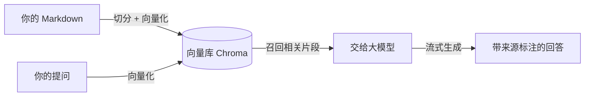

# 快速上手：搭一个你自己的本地知识库

> 这是一个「知识库 + AI 问答」的**基座**：把一堆 Markdown 笔记，变成一个可浏览、可搜索、**可对话**的网站。
>
> **默认全部在你自己电脑上跑**（本地模型 + 本地向量库）：不花钱、不联网、数据不出本机。
> 需要时也可以切到**远程大模型 / 远程向量库**，只改配置、不用改代码。

## 它能做什么

| 能力 | 说明 |
|------|------|
| **文档站点** | 把 Markdown 丢进目录，自动生成带导航、搜索、侧边栏的网站 |
| **AI 问答** | 右下角助手，基于**你自己的笔记**回答，并在句末标注可点击的来源 |
| **防幻觉** | 检索不到就说"没找到"，不会硬编；引用编号不会指向不存在的来源 |
| **质量评估** | 一套回归测试 + 阈值门禁，量化"检索准不准、回答有没有编" |
| **一键生成** | 一条命令生成属于你自己的实例（只带骨架，不含别人的内容） |
| **本地 / 远程皆可** | 模型与向量库默认本地，也可指向 OpenAI 兼容的远程服务 |

它解决的核心问题是：**你的笔记越写越多，却越来越找不到、用不起来。** 这个基座把它变成"能问的"。

## 它是怎么工作的



一句话：**文档切块存进向量库；提问时先检索最相关的片段，再让大模型"看着资料"回答。**

---

## 一、上手前：你要装什么

| 依赖 | 作用 | 怎么装 |
|------|------|--------|
| **Node.js ≥ 20.6** + **pnpm ≥ 9** | 跑前后端与 CLI | 官网下载 Node；`npm i -g pnpm` |
| **Docker** | 跑 Chroma 向量库 | 装 Docker Desktop，保持运行 |
| **Ollama** | 跑本地大模型 | 官网下载，装完确保服务在运行 |

> 只装一次。模型首次需要下载（约 6.5GB），之后就一直本地可用了。
> 如果你打算用**远程大模型**，可以跳过 Ollama 与模型下载。

## 二、五步跑起来

在项目根目录依次执行：

```bash
# 1. 安装依赖
pnpm install

# 2. 下载本地模型（首次，约 6.5GB，耐心等；用远程模型可跳过）
pnpm ollama:pull-chat     # 聊天模型 qwen3:8b
pnpm ollama:pull-embed    # 向量模型 bge-m3

# 3. 启动向量库（需 Docker 正在运行）
pnpm chroma:start

# 4. 建立向量索引（把文档切块入库；首次较慢，之后增量很快）
pnpm kb index

# 5. 启动开发服务
pnpm dev
```

打开 `http://localhost:5173` 就能看到站点；右下角的助手可以直接提问。

> 文档有更新时，重新跑一次 `pnpm kb index` 即可（增量，只处理改动过的文件）。
> 上面这些命令都是基座 CLI **`kb`** 的封装，也可以直接用 `kb index` / `kb eval` / `kb dev`。

## 三、换成你自己的内容

**内容放在哪、模型用哪个、向量库连哪**——全部集中在根目录的一个文件里：`knowledge.config.mjs`。

```js
export default {
  name: 'my-knowledge',
  contentRoot: './docs',      // ← 你的内容目录（支持绝对路径，可放仓库外）
  collectionName: 'my_kb',    // 向量集合名（一个实例一个库）
  models: {
    baseUrl: 'http://localhost:11434/v1',  // 默认本地 Ollama
    apiKeyEnv: 'OPENAI_API_KEY',           // 远程时 Key 从这个环境变量读
    chat: 'qwen3:8b',
    embedding: 'bge-m3',
  },
  chroma: { host: 'localhost', port: 8000 },
  // ...
}
```

几个要点：

- **目录即分类**：`contentRoot` 下每建一个目录，站点的导航/侧边栏就多一块，不用手写。
- **导航可定制**：在 `site.nav` 里写菜单；**给某项加 `onlyLocal`**，它就会线上隐藏，并从编译、侧边栏中一并排除（只维护这一份配置）：

  ```js
  site: {
    nav: [
      { text: '前端', items: [{ text: 'React', link: '/react/concept' }] },
      { text: '私人笔记', link: '/private/x', onlyLocal: 'private' }, // 整个目录仅本地
    ],
  }
  ```

- **内容可以放在仓库外**：`contentRoot` 支持绝对路径，笔记可以独立成一个目录甚至独立仓库。

### 想换成远程大模型 / 远程向量库？

默认走本地，**只改这几行**即可切到远程（密钥只从环境变量读，不写进配置）：

```js
models: {
  chat:      { baseUrl: 'https://api.deepseek.com/v1',   model: 'deepseek-chat',        apiKeyEnv: 'DEEPSEEK_API_KEY' },
  embedding: { baseUrl: 'https://api.siliconflow.cn/v1', model: 'BAAI/bge-m3',          apiKeyEnv: 'SILICONFLOW_API_KEY' },
},
chroma: {
  url: 'https://xxx.chromadb.cloud',   // 远程用 url（http/https）+ token
  tokenEnv: 'CHROMA_TOKEN',
  tenant: '…', database: '…',
},
```

- 聊天模型支持**任意 OpenAI 兼容接口**（DeepSeek / 硅基流动 / OpenAI…），向量模型同理
- 本地 Ollama 会自动走原生接口（可用 `think:false` 提速）；远程则走标准接口
- 配好后**重新 `pnpm kb index`**（换了向量模型必须重建索引，向量空间不同）

## 四、从零生成一个新实例（脚手架）

不想改现有仓库？直接生成一个干净的：

```bash
pnpm create:kb my-kb        # 交互式问答，一路回车即可
cd my-kb
pnpm install
pnpm chroma:start
pnpm kb index
pnpm dev
```

脚手架**只生成实例骨架**：`knowledge.config.mjs` + `docs/`（含快速上手与示例文档）+ `eval/` 示例评估集 +
`package.json`（依赖基座包 `@kb/core`、`@kb/site`）。它**不复制别人的内容、也不做剥离**——你把自己的 Markdown 丢进内容目录就行。

> 升级基座能力只需要更新 `@kb/core`、`@kb/site`，你的内容不受影响。

## 五、常用命令速查

| 命令 | 作用 |
|------|------|
| `pnpm dev` | 启动前后端（文档 5173 / API 3000） |
| `pnpm kb index` | 增量更新向量索引（改完文档跑这个） |
| `pnpm kb index --full` | 全量重建索引（换向量模型后必须） |
| `pnpm chroma:start` / `pnpm chroma:stop` | 启动 / 停止向量库 |
| `pnpm test:rag` | 检索质量回归 + 阈值门禁（约 30 秒） |
| `pnpm build` | 构建静态站点（生产） |
| `pnpm create:kb <目录>` | 生成一个新的知识库实例 |

## 六、遇到问题

| 现象 | 原因 / 解决 |
|------|------------|
| 启动后提问报错、搜不到东西 | 向量库没起：`docker ps` 看 chroma 是否在跑，否则 `pnpm chroma:start` |
| `pnpm kb index` 连不上 | 同上；Docker 关闭后需重新启动容器 |
| 回答很慢 / 卡住 | 本地模型首轮加载较慢，属正常；`ollama ps` 看模型是否已加载 |
| 改了文档但问答没变 | 忘了重新索引：再跑一次 `pnpm kb index` |
| 端口被占用 | 改 `knowledge.config.mjs` 的 `port`，或关掉占用 5173/3000 的程序 |
| 远程模型报 401 / 鉴权失败 | 检查配置里的 `apiKeyEnv` 对应的环境变量是否已在 `.env` 中设置 |
| 换过向量模型后检索变差 | 向量空间变了，需要 `pnpm kb index --full` 重建索引 |

## 七、下一步

- **想让回答更准**：跑 `pnpm test:rag` 看当前检索成绩，再按需优化（索引范围、切分、Prompt）。
- **想发布出去**：`pnpm build` 产出静态站点；个人内容可通过 `onlyLocal` 控制在本地。
- **想看基座实现**：`@kb/core`（RAG / Agent / 评估 / CLI）与 `@kb/site`（主题与站点派生）——装好后在 `node_modules/@kb/` 下。

---

**回到**：[首页](/) ｜ 项目源码：[github.com/jun2333/knowledge](https://github.com/jun2333/knowledge)
