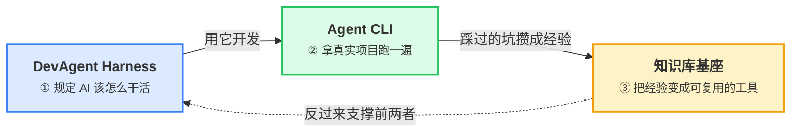
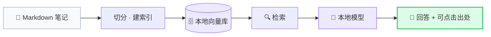
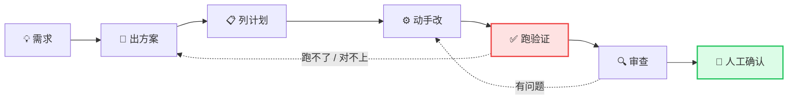
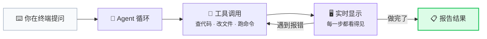

## 支撑这个站点的三件自研作品

做这个站点的过程中，把「AI 该怎么帮我干活」拆成了三件作品。**它们不是三个独立项目，而是一条链路**：先定下 AI 该怎么被约束，再拿它去干真实活，最后把踩过的坑攒成这个知识库。

### 知识库基座 · 你现在用的这个

**你看到的这个站点本身。**

一个能跑起来的个人知识库：把 Markdown 笔记变成可浏览、可搜索、可对话的站点，AI 回答时给出可点击的原文出处。全部在本地跑 —— 模型和向量库都在你机器上，**不联网、不花钱、数据不出本机**。

写它的时候最费劲的不是搭页面，而是**怎么证明它真的变准了**。所以它自带一套评估体系：把笔记变成考题、跑检索、看指标、用数据决定改不改。这个「先量、再改」的习惯，也直接催生了下面第二件作品。

→ [源码](https://github.com/jun2333/kb-base) · 已发布至 npm

### DevAgent Harness · 让 AI 按规矩干活

**一个管 AI 开发流程的工具箱。**

用 AI 写代码，最糟的不是它写不出来，而是它**看起来写完了，其实没验证** —— 改了一堆文件，说「完成了」，其实功能根本没跑通。

DevAgent Harness 把流程和验收标准先定死，每一步都有明确产出物，AI 不能跳步：

两处是它跟别的东西不一样的地方：

- **验证不许 AI 自己说了算** —— 只能跑项目自己声明的命令，跑完对账。AI 说「我测过了」不算数
- **代码写完要过人确认** —— 防止 AI 自己把状态改成「已批准」然后声称完成

这套装在 [Agent CLI](https://github.com/jun2333/agent-cli) 上开发了三个月，沉淀下 20 多条实战经验 —— 每一条都是 AI 真踩过的坑。

→ [源码](https://github.com/jun2333/dev-agent-harness)

### Agent CLI · 终端里的编程助手

**一个跑在终端里的 AI 程序员。**

在终端里跟它对话，它会自己查代码、改文件、跑命令、看报错、继续改 —— 整个过程你都能看见。

和常见的 AI 编程工具不同，它**不用任何界面框架**，从零写了整套终端渲染，界面在窄终端、宽终端、中文输出、各种异常返回下都不会错乱。因为界面逻辑和数据是分开的，所以能被自动化测试逐帧断言 —— 团队给它写了比产品代码还多的测试。

它的架构从一开始就奔着「能接更强的模型」去设计，换模型不用改代码。

→ [源码](https://github.com/jun2333/agent-cli)
