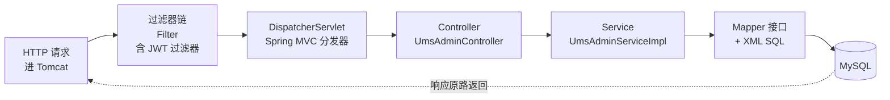

# 阶段 1：请求全链路（外到内地图）

> **目标**：像看 Koa 中间件一样，先建立"请求从外到内经过什么"的完整地图，知道**每个环节该打开哪个文件**，再逐个读。
>
> **前置**：mall 已启动，`http://localhost:8080/swagger-ui/index.html` 可访问。

## 一、先建地图：Spring 的"洋葱"

你熟 Koa 的请求流是洋葱模型：**请求从外到内**穿过一层层中间件，到达 controller/service，响应再**从内到外**原路返回。

Spring Boot 的请求流是一样的结构，只是名字不同：



| Koa | Spring Boot | 你熟悉的操作 |
|-----|-------------|-------------|
| 中间件（app.use） | **Filter**（过滤器） | 请求进来第一道关卡 |
| 路由守卫 / Guard | 过滤器里的鉴权 | 有没有 token、白名单 |
| 路由（@Controller） | Controller | 收参数、分发给 service |
| Service | Service | 业务逻辑（查库、校验、生成 token） |
| Repository/DAO | **Mapper + XML** | 真正执行的 SQL |

**核心心智**：读 Spring 代码的顺序 = **从外到内**：Filter → Controller → Service → Mapper → DB。和你看 Koa 先看中间件一个道理。

## 二、全链路地图：7 个环节，每个环节看哪个文件

以下按**外到内**排列，这就是你读代码的路线图：

| # | 环节 | 打开这个文件 | 重点看什么 |
|---|------|-------------|-----------|
| 1 | 过滤器链（最外） | `mall-security/.../component/JwtAuthenticationTokenFilter.java` | 从请求头取 token、解析、塞用户 |
| 2 | 安全配置 | `mall-security/.../config/SecurityConfig.java` + `application.yml` 的 `secure.ignored.urls` | 过滤器怎么挂进链、哪些路径免鉴权 |
| 3 | 分发器 | 框架内置（DispatcherServlet），**不用看** | 只需知道：它把请求路由到 Controller |
| 4 | Controller | `mall-admin/.../controller/UmsAdminController.java` | 路由注解、参数绑定、返回包装 |
| 5 | Service | `mall-admin/.../service/impl/UmsAdminServiceImpl.java` | `login()`：查用户→验密→生成 token→写日志 |
| 6 | Mapper | `mall-mbg/.../mapper/UmsAdminMapper.java` + `UmsAdminMapper.xml` | 接口方法 ↔ XML 里的 SQL |
| 7 | 数据库 | MySQL 的 `ums_admin` 表（DBeaver 看） | 数据长什么样（密码是 BCrypt 密文） |

**对照你的 Koa 习惯**：环节 1-2 = 中间件（先看这俩，就知道请求前后有些啥）；环节 4-5 = 路由 + 业务；环节 6-7 = 数据访问。

## 三、每个环节读什么（详细）

### 环节 1：过滤器链（最外，对应 Koa 中间件）

打开 `JwtAuthenticationTokenFilter.java`，方法 `doFilterInternal`：

```java
String authHeader = request.getHeader("Authorization");  // ① 从请求头取 token
// ② 去掉 "Bearer " 前缀 → ③ 解析 token 拿用户名 → ④ 查用户权限
// ⑤ 塞进 SecurityContextHolder（当前用户存这）
filterChain.doFilter(request, response);   // ⑥ 放行，交给下一层
```

**问题**：这个过滤器怎么挂进链的？→ 去环节 2 看 `SecurityConfig.java` 的 `addFilterBefore(...)`。

### 环节 2：安全配置 + 白名单

打开 `SecurityConfig.java`（`mall-security`）：
- `addFilterBefore(jwtAuthenticationTokenFilter, ...)` —— 把自定义过滤器插进链
- 白名单：`application.yml` 里 `secure.ignored.urls`，命中就 `permitAll()` 跳过鉴权（`/admin/login`、`/swagger-ui/`）

**对应 Koa**：`app.use(jwtMiddleware)` + 一个 `if (whitelist.includes(path)) return next()`。

### 环节 4：Controller

打开 `UmsAdminController.java` 的 `login` 方法：
- `@RequestMapping("/admin")` + 方法上的 `/login` → 路由
- `@RequestBody` → 请求体 JSON 反序列化成对象
- 方法体：**调 service，包 CommonResult 返回**（Controller 不做业务）

### 环节 5：Service（重点）

打开 `UmsAdminServiceImpl.java` 的 `login()`（第 99 行）：
- `loadUserByUsername()` 查用户（含密码密文）
- `passwordEncoder.matches()` 比对密码
- `jwtTokenUtil.generateToken()` 生成 token
- `insertLoginLog()` 写登录日志

### 环节 6：Mapper + XML

- `UmsAdminMapper.java`：接口方法 `selectByExample(...)`（无实现类，MyBatis 动态代理）
- `UmsAdminMapper.xml`：搜 `selectByExample`，看真正的 SQL

### 环节 7：数据库

DBeaver 打开 `ums_admin` 表，看 `admin` 行的密码是 `$2a$10$...`（BCrypt 密文）——呼应环节 5 的 `passwordEncoder.matches()`。

## 四、用调试器"亲眼走一遍"洋葱（核心练习）

读十遍不如走一遍。按地图从外到内打 4 个断点：

| 断点位置 | 对应环节 |
|---------|---------|
| `JwtAuthenticationTokenFilter.doFilterInternal` 第 40 行 | 环节 1 |
| `UmsAdminController.login` 第 60 行 | 环节 4 |
| `UmsAdminServiceImpl.login` 第 99 行 | 环节 5 |
| `loadUserByUsername` 第 265 行 | 环节 5（查库前） |

步骤：
1. IDEA 以 **Debug** 启动 `MallAdminApplication`
2. 打上上述 4 个断点
3. Swagger 调 `POST /admin/login`
4. 观察 IDEA 断点**按环节 1 → 4 → 5 → 5 的顺序依次停住**——这就是洋葱从外到内
5. 每层停住时看 Variables 窗口：token 怎么来的、用户名怎么传下来的

> 这个练习做完，"请求怎么走完"就有了**肌肉记忆**，比看任何文章都管用。

## 五、验收标准（做完自检）

- [ ] 能画出 7 环节洋葱图（Filter → Controller → Service → Mapper → DB）
- [ ] 能说出：登录请求在哪个环节被放行（白名单）、在哪个环节生成 token
- [ ] 能说出 `userDetails.getPassword()` 拿到的是明文还是密文
- [ ] 调试时 4 个断点按从外到内顺序依次停住

## 六、动手任务

1. 按第四节把 4 个断点走一遍，记录每个断点停住时 Variables 里关键变量的值
2. 用 Mermaid 画出"登录请求"的外到内链路图（放进你的笔记）
3. 想挑战：给 `UmsAdminServiceImpl.login()` 里 `insertLoginLog` 打个断点，看响应怎么从内到外返回

## 七、常见问题

**Q：为什么 Swagger 调登录时 `JwtAuthenticationTokenFilter` 没停？**
A：停了的，只是登录接口在白名单里，过滤器看到没带 token（或 token 无效）就直接放行了。断点如果打在 token 解析那几行会经过，打在白名单判断后可能跳过。

**Q：DispatcherServlet 要不要看？**
A：不用，那是框架核心（Spring MVC 的心脏），不是业务代码。知道"它把 URL 路由到 Controller"即可，以后有兴趣再深挖。

**Q：Koa 里响应也是洋葱逆序返回，Spring 也是吗？**
A：是的。响应从 MySQL → Mapper → Service → Controller → Filter 原路返回。调试时观察 `insertLoginLog` 之后继续 F8，能看到返程。

## 八、关联理论

- [Spring Boot 入门与实战](/service/spring-boot) — Filter 过滤器链、Lombok、MyBatis 基础概念
- [Spring 核心原理](/service/spring-principles) — IoC、AOP、Spring MVC 分发
- [认证与授权](/service/auth) — JWT 原理
