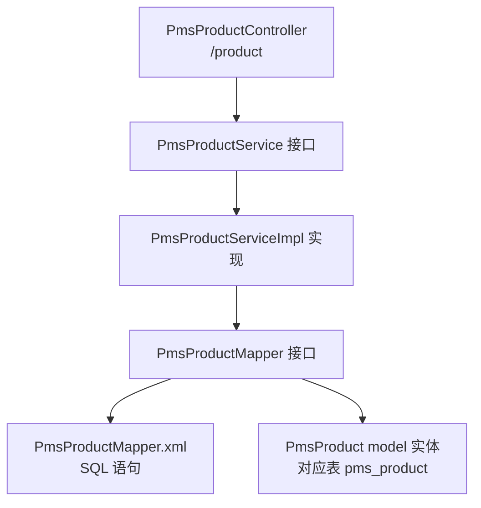

# 阶段 2：CRUD 模块实战（商品模块）

> **目标**：读透一个真实 CRUD 模块的三层架构写法，掌握分页、状态变更、批量操作的标准套路。
>
> **前置**：阶段 1 完成，已理解请求链路。

## 一、验收标准（做完自检）

- [ ] 能说出商品模块的**三层结构**（Controller / Service / Mapper）各自职责
- [ ] 能在纸上写出标准分页查询接口的代码骨架
- [ ] 能解释 `CommonPage` 分页是怎么封装的
- [ ] 能解释 `update/publishStatus`（上下架）这类批量状态操作和普通 update 的区别

## 二、模块结构总览



**三个模块的职责分工**（mall 的分层方式）：
- `mall-admin`：Controller + Service（业务逻辑，你主要看的模块）
- `mall-mbg`：Mapper + model（MyBatis Generator 自动生成的，**基本不用手写**）
- `mall-security` / `mall-common`：安全 + 通用工具（被各模块引用）

> 注意：mall 把 Mapper 和实体放独立模块 `mall-mbg`，因为生成器生成的代码不参与业务，单独放避免污染。这是企业里常见的做法。

## 三、操作步骤

### Step 1：在 Swagger 里完整操作一遍商品

用 `POST /admin/login` 拿 token → Authorize 填入 → 依次调：

1. `GET /product/list` 加参数 `pageNum=1&pageSize=5` → 看分页返回结构（`data.list` + `data.total`）
2. `POST /product/create` → 创建一个测试商品（请求体大，Swagger 的 model 示例可参考）
3. `POST /product/update/publishStatus` → 传刚创建的 id + `publishStatus=1`（上架）
4. `POST /product/update/{id}` → 改商品名/价格
5. 再看 `GET /product/list`，用 `keyword` 参数搜你创建的商品

### Step 2：读分页查询链路（重点）

打开 `PmsProductController.java` 第 62 行 `getList()`：

```java
public CommonResult<CommonPage<PmsProduct>> getList(PmsProductQueryParam productQueryParam,
                                                    @RequestParam(value = "pageSize", defaultValue = "5") Integer pageSize,
                                                    @RequestParam(value = "pageNum", defaultValue = "1") Integer pageNum)
```

往下跳：`productService.list(productQueryParam, pageSize, pageNum)` → `PmsProductServiceImpl.list()`。

**在 impl 里观察两个关键点：**

1. **分页**：找到 `PageHelper.startPage(pageNum, pageSize)` —— 这行**后面的第一条查询自动被分页**（PageHelper 是 MyBatis 分页插件，原理是拦截 SQL 自动拼 `LIMIT`）
2. **查询条件**：方法里构建 `PmsProductExample`（MyBatis Generator 生成的条件构造器），`createCriteria()` 里 `.andNameLike()`、`.andPublishStatusEqualTo()` 这些就是 where 条件

最后打开 `PmsProductMapper.xml`，搜 `selectByExample`，能看到实际执行的 SQL 带 `where` 和 `limit`。

### Step 3：读状态变更操作（批量）

打开 `update/publishStatus` 对应方法，看它的特点：
- 参数是 `@RequestParam("ids") List<Long> ids`（批量）
- 实现里先查这批商品，再逐个 set 状态，再 `updateByPrimaryKey` 更新

对比：单个更新的 `update/{id}` 走 `updateByPrimaryKeySelective`（只更新非 null 字段），批量状态走循环更新。

### Step 4：理解统一返回和分页封装

- `CommonResult`：所有接口返回值，`{code, message, data}`
- `CommonPage<T>`（`mall-common/.../api/CommonPage.java`）：把 `list`、`total`、`pageNum`、`pageSize` 组装成分页结构

```java
// CommonPage 的静态方法，controller 里常见这种写法
CommonPage.restPage(list)
```

## 四、动手任务

1. 在笔记里画出商品模块的三层调用图（Mermaid）
2. 不看代码，默写一个分页查询接口的骨架：
   ```
   Controller: @GetMapping("/list") → 接收 pageNum/pageSize → 调 service
   Service: PageHelper.startPage(...) → mapper.selectByExample(example) → CommonPage.restPage(...)
   ```
3. 在 MySQL 里手动执行一次 `PmsProductMapper.xml` 里 selectByExample 的 SQL，观察结果和接口返回是否一致

## 五、常见问题

**Q：为什么 Mapper 接口没有实现类也能调用？**
A：MyBatis 用**动态代理**生成 Mapper 接口的实现类，接口方法名和 XML 里的 `<select id="...">` 对应。这是阶段 3 的重点。

**Q：pageNum/pageSize 不传会怎样？**
A：看 `defaultValue`，有默认值（list 默认 5 条/页）。

**Q：创建商品请求体太复杂？**
A：先在 Swagger 里看 `PmsProductParam` 的 model 结构，核心字段 `name`、`price`、`productCategoryId` 等，其他可以先空着。

## 六、关联理论

- [MyBatis-Plus 入门](/service/mybatis-plus) — 对比看 MyBatis 和 MyBatis-Plus 的差异
- [Spring 核心原理](/service/spring-principles) — AOP（事务、日志切面在请求里怎么生效）
- [RESTful API 设计](/service/restful-api) — `/product/create` 这种风格的设计规范
