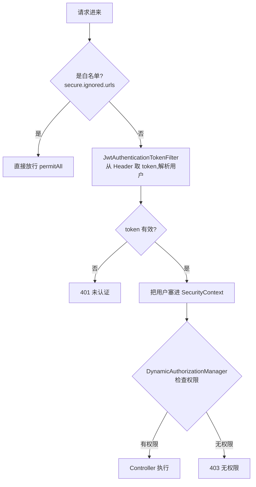

# 阶段 5：安全与权限

> **目标**：搞懂 JWT 无状态鉴权 + Spring Security 过滤器链 + RBAC 动态权限，理解"带 token 的请求"和"不带 token 的请求"分别怎么被处理。
>
> **前置**：阶段 1 完成（已经历过 401）。这是 mall 最值得读的安全部分。

## 一、验收标准（做完自检）

- [ ] 能画出"带 token 请求"经过哪些过滤器，token 在哪个环节被解析、用户信息在哪被塞进上下文
- [ ] 能解释白名单（`secure.ignored.urls`）为什么能绕过鉴权
- [ ] 能解释 RBAC（用户-角色-资源）在 mall 里怎么实现动态权限
- [ ] 完成动手任务（改白名单观察 401/403 变化）

## 二、先建立整体认知

mall 的鉴权方案：**JWT + Spring Security + RBAC**。



## 三、操作步骤

### Step 1：读 JWT 工具类

打开 `mall-security/.../util/JwtTokenUtil.java`，重点看三个方法：

- `generateToken()`：把 **用户名 + 权限** 和 **过期时间** 编码进 token（三段式：header.payload.signature）
- `getUserNameFromToken()`：从 token 里解析出用户名（登录时怎么加密，这里就怎么解密）
- `validateToken()`：校验签名 + 过期时间

> 用 [jwt.io](https://jwt.io) 把 mall 返回的 token 粘进去解码，亲眼看 payload 里有什么。

### Step 2：读过滤器——token 在哪被解析

打开 `mall-security/.../component/JwtAuthenticationTokenFilter.java`（`doFilterInternal` 方法）：

```java
// 1. 从 Header 拿 token（默认 Header 名叫 Authorization）
String authHeader = request.getHeader(this.tokenHeader);   // "Bearer xxx.xxx.xxx"
// 2. 去掉 "Bearer " 前缀
String authToken = authHeader.substring(this.tokenHead.length());
// 3. 解析 token 拿用户名，查用户和权限
// 4. 构造 UsernamePasswordAuthenticationToken 塞进 SecurityContextHolder
// 5. 之后 Controller 里 @AuthenticationPrincipal 或 SecurityContextHolder.getContext() 就能拿到当前用户
```

**关键理解**：这个过滤器**只做解析**，不做拦截。它把用户身份放好，后续"要不要放行"交给安全配置和权限管理器。

### Step 3：读安全配置——白名单怎么生效

打开 `mall-security/.../config/SecurityConfig.java`：

- `ignoredUrlsConfig.getUrls()` 读的是 `application.yml` 里 `secure.ignored.urls`（就是 `/admin/login`、`/swagger-ui/` 那些）
- 白名单路径 `requestMatchers(url).permitAll()` 直接放行
- 其余请求：先过 `JwtAuthenticationTokenFilter`，再被动态权限管理器检查

> 还记得阶段 1 那个 401 吗？`/swagger-ui.html` 不在白名单（白名单写的是 `/swagger-ui/`），所以被拦。去 `application.yml` 的 `secure.ignored.urls` 里加一行 `/swagger-ui.html` 就通了——你现在已经能自己修这个问题了。

### Step 4：读动态权限——RBAC 怎么落地

打开 `mall-security/.../component/DynamicAuthorizationManager.java`（`check` 方法）：

- 根据当前请求的 **URL + 请求方法** 找到对应的资源 ID（查 `ums_resource` 表）
- 看当前登录用户的**角色**（用户 → 角色 → 资源，三张表关联）是否有该资源的权限
- 有 → 放行；没有 → 403

```sql
-- RBAC 三张核心表（可去数据库里查数据）
ums_admin          -- 用户
ums_role           -- 角色
ums_resource       -- 资源（对应接口 URL）
ums_admin_role_relation     -- 用户-角色
ums_role_resource_relation  -- 角色-资源
```

**动手**：去 MySQL 里查 `ums_resource` 表，看看接口 URL 是怎么登记为资源的；再查 admin 用户的角色，验证它有全部资源权限。

## 四、动手任务

1. **改白名单**：在 `application.yml` 的 `secure.ignored.urls` 里加 `/admin/info`，重启后不登录调 `GET /admin/info` → 变成 200（白名单生效了）。测试完删掉这行
2. **体验 403**：在 `ums_admin_role_relation` 里把 admin 的超级管理员角色换成一个普通角色，重启后用普通角色登录，调一个没有权限的接口 → 观察 403
3. 在笔记里画出两种请求（带/不带 token）的完整处理流程图

## 五、实战调试心得（踩坑实录）

> 以下坑都是真实踩过的，调试安全相关断点直接对照，能省大量时间。

### 1. JWT 过滤器只在"请求带 token"时才干活

`JwtAuthenticationTokenFilter` 第 41 行：

```java
if (authHeader != null && authHeader.startsWith("Bearer ")) {  // 不带 token 这层直接跳过
    ...解析 token 的逻辑...
}
```

**坑**：调登录接口（不带 token）时，在 if 内部打断点永远不停——因为条件不成立，解析代码根本不执行。

**解法**：想触发 filter 的解析逻辑，必须调**带 token** 的受保护接口（先登录拿 token → Authorize 填入 → 再调接口）。

### 2. Swagger 会"偷偷"带 token

**坑**：你以为 Swagger 里 Authorize 没值、请求没带 token，但请求实际进了 Controller（WebLogAspect 日志能看出来）——因为 Authorize 里存的旧 token 会自动附加到每个请求头。

**解法**：判断请求到底带没带 token，在 `JwtAuthenticationTokenFilter` 第 40 行（`request.getHeader`）打断点看 `authHeader` 的值，或者用浏览器/curl 发一个绝对干净的请求。

### 3. 白名单接口绕过动态权限

**坑**：调 `/admin/info`（它在 `secure.ignored.urls` 白名单里），在 `DynamicAuthorizationManager.check()` 打断点永远不停——白名单在**匹配阶段**（`requestMatchers().permitAll()`）就放行了，请求根本走不到授权阶段。

**解法**：调试动态权限必须用**非白名单**接口（如 `GET /admin/list`、`GET /product/list`）。

### 4. 浏览器缓存会"吃掉"你的请求

**现象**：普通刷新断点不进，`Cmd+Shift+R` 强刷就进，F12 打开就每次进。

**原因**：浏览器缓存了 GET 响应，普通刷新不重新发请求。

**解法**（三选一）：
- 调试时保持 **F12 DevTools** 打开（Network 面板打开时 Chrome 默认禁用缓存）
- 请求 URL 加随机参数：`/admin/list?t=1700000000000`
- 用 **curl**（默认不缓存）：`curl -H "Authorization: Bearer xxx" http://localhost:8080/admin/list`

> 面试关联：`Cache-Control: no-cache`（允许缓存但每次回源验证）vs `no-store`（彻底不缓存）。

### 5. 配置期 vs 运行期：配置代码的断点只在启动时停

**坑**：在 `SecurityConfig.java` 第 43 行（`requestMatchers(url).permitAll()`）打断点，请求时不停。

**原因**：那是**启动时构建过滤器链**的配置代码，只执行一次；请求时的白名单判断由框架内部完成，不执行这段 Java 代码。

**同样**：`addFilterBefore` 是**声明式**的（"把我的过滤器插在 X 之前"），运行期由框架按规则重排过滤器链——**代码书写顺序 ≠ 运行期执行顺序**。JWT 过滤器虽然写在后，实际一定在授权检查（AuthorizationFilter）之前执行。

### 6. DynamicAuthorizationManager 里的白名单是"死代码"

`check()` 第 44-53 行（白名单判断 + OPTIONS 放行）和 SecurityConfig 里的白名单配置**逻辑重复**，且正常流程**执行不到**（白名单请求在匹配阶段就放行了）。

作者写它是**防御性冗余**（防止这个 Manager 被复用到别的过滤器链）。判断死代码的方法见第 7 条。

### 7. 核心调试方法：对比实验法

**不确定某段代码走不走，就发两个不同条件的请求对比断点触发情况。**

| 想验证什么 | 实验 | 结论 |
|-----------|------|------|
| check() 是否处理白名单 | 调 `/admin/login`（白名单）vs `/admin/list`（非白名单） | 前者断点不停 = 白名单在更外层放行 |
| filter 是否处理无 token 请求 | 不带 token vs 带 token 调同一接口 | 前者 if 不成立 = 解析逻辑只在带 token 时跑 |
| 401 vs 403 分流 | 无 token vs 低权限账号带 token 调同一接口 | 前者进 EntryPoint，后者进 AccessDeniedHandler |

### 8. token 有效性对照表（调试时直接对）

| 请求带的情况 | filter 行为 | 最终结果 |
|------------|------------|---------|
| 无 token | if 不成立，不解析 | 授权拒绝 → **401 EntryPoint** |
| token 过期 | `validateToken` 失败，不设身份 | 授权拒绝 → **401 EntryPoint** |
| token 无效 | `getUserNameFromToken` 返回 null，不设身份 | 授权拒绝 → **401 EntryPoint** |
| token 有效 | 设置身份到 SecurityContextHolder | 授权通过 → **Controller** |

> **一句话**：EntryPoint 的触发条件是"请求最终没有有效认证"，与 token 有没有/过没过期无关，只看最后有没有身份。

## 六、常见问题

**Q：JWT 和 Session 的区别？**
A：Session 存在服务端（有状态），JWT 存在客户端（无状态，服务端不存）。mall 用 JWT，所以"登录"就是发你一个 token，之后每次都带。

**Q：token 过期了怎么办？**
A：mall 提供 `/admin/refreshToken`（看 `UmsAdminController`），前端定期刷新。token 本身设计为短期有效。

**Q：白名单是不是不安全？**
A：白名单只放行**不需要登录就能访问**的接口（登录、注册、Swagger 文档），业务接口一律不放行。

## 七、关联理论

- [认证与授权](/service/auth) — JWT/Session/OAuth 概念
- [权限设计](/service/permission-design) — RBAC 模型
- [Spring 核心原理](/service/spring-principles) — Spring Security 过滤器链、AOP
