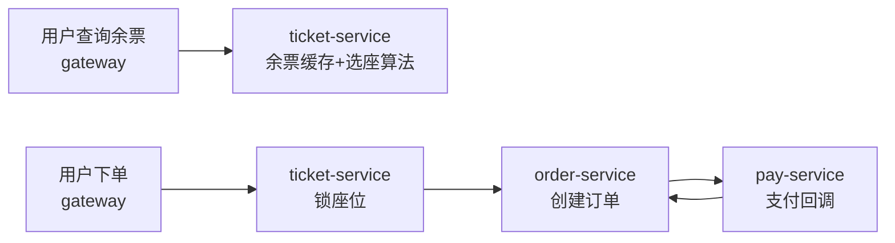

# 阶段 7：12306 微服务进阶（可选）

> **目标**：从单体到微服务——理解服务拆分、网关、注册中心、分布式锁，看懂企业级高并发项目长什么样。**可选阶段**，建议在阶段 6 完成后再进入。
>
> **前置**：阶段 1-6 完成（单体已能独立开发）。项目在 `~/Documents/Jun/code/12306`。

## 一、验收标准（做完自检）

- [ ] 能说出 12306 拆成了哪些服务、每个服务干什么
- [ ] 能对比 mall（单体）和 12306（微服务）在架构上的 3 个关键差异
- [ ] 能说出"买票"这条业务跨了哪几个服务、数据怎么流转
- [ ] 理解网关、注册中心、分布式锁各自解决什么问题

## 二、12306 项目结构

```
12306/
├── services/                  # 微服务（按业务拆分）
│   ├── gateway-service        # 网关：所有请求的统一入口
│   ├── user-service           # 用户/乘车人（注册、登录、证件管理）
│   ├── ticket-service         # 购票（余票查询、选座、下单）
│   ├── order-service          # 订单
│   ├── pay-service            # 支付
│   └── aggregation-service    # 聚合服务（BFF，组装多服务数据）
├── frameworks/                # 基础框架（公共能力，被各服务引用）
│   ├── cache/                 # 缓存封装（Redis）
│   ├── distributedid/         # 分布式 ID 生成（分库分表/订单号）
│   ├── idempotent/            # 幂等（防重复下单）
│   ├── database/              # 数据访问（含分库分表）
│   ├── log/ designpattern/ web/ ...
└── console-vue                # 管理后台前端
```

技术栈：JDK 17 + SpringBoot 3 + SpringCloud（Alibaba 体系：Nacos 注册中心、Sentinel 限流）+ Redis + RocketMQ + 分库分表。

## 三、和 mall 的对比（先建立坐标系）

| 维度 | mall（单体） | 12306（微服务） |
|------|-------------|----------------|
| 部署 | 一个应用打成一个 jar | 每个服务独立部署、独立扩缩容 |
| 服务间调用 | 进程内直接调方法 | HTTP/RPC 跨进程调用（Feign 等） |
| 找服务 | 不需要 | 注册中心（Nacos），服务名寻址 |
| 流量入口 | 直接访问 | 网关统一入口（鉴权、限流、路由） |
| 事务 | 本地事务 @Transactional | 分布式事务（更复杂，常靠"最终一致性"） |
| 数据 | 一个数据库 | 每个服务独立库（分库分表） |

## 四、操作步骤

### Step 1：读官方文档建立全局认知

12306 项目有完整文档站：**https://nageoffer.com/12306**

优先读这几篇：
- 技术架构选型
- 项目依赖中间件环境搭建（想跑起来必读）
- 分库分表方案（user-service 为什么分表）

### Step 2：读"买票"这条业务链路（核心）

打开 `ticket-service` 和 `order-service`，跟着业务走一遍：



重点读这几个"高并发关键设计"：
- **余票查询**：为什么查余票走 Redis 缓存而不是直接查库？（对比 mall 阶段 4）
- **选座/锁座**：两个乘车人买票，座位怎么分配、怎么防止超卖（对比秒杀场景）
- **幂等**：`frameworks/idempotent`，为什么重复点击下单不会创建两个订单
- **分布式 ID**：`frameworks/distributedid`，订单号为什么要全局唯一且有序

### Step 3：读一个服务的最小闭环

挑 `user-service`，模仿 mall 阶段 1 的方法：
1. 找到 Controller（`UserController` 之类）
2. 跟到 Service 层
3. 注意它和 mall 不同的地方：**不直接查库这么简单**，有分库分表、缓存、分布式锁

### Step 4（选做）：尝试本地启动

按文档站"中间件环境搭建"装 Nacos、Redis 等，然后启动 `user-service` 或 `gateway-service`。**这一步比较耗时**，如果只想学架构可以跳过，只看代码。

## 五、动手任务

1. 画出"查余票"和"下单"两条业务链路图（服务间调用关系）
2. 读完 `frameworks/idempotent`，用 3 句话解释它怎么防重复下单（对比 mall 阶段 3 的事务思路）
3. 对比总结：同是"下单"，mall 的下单和 12306 的下单在实现上有哪些不同

## 六、面试价值

12306 是面试加分项目。把下面三个点讲清楚，比背八股有用得多：
1. **怎么防超卖/锁座位**（分布式锁 + Redis）
2. **怎么防重复下单**（幂等设计）
3. **分库分表怎么分**（选什么字段做分片键、读扩散怎么解决）

## 七、关联理论

- [Spring Cloud 微服务](/service/spring-cloud) — 注册中心、网关、Feign
- [分布式基础](/service/distributed-basics) — CAP、分布式事务、分布式锁
- [消息队列](/service/mq-intro) — 异步、削峰填谷在购票场景的落地
