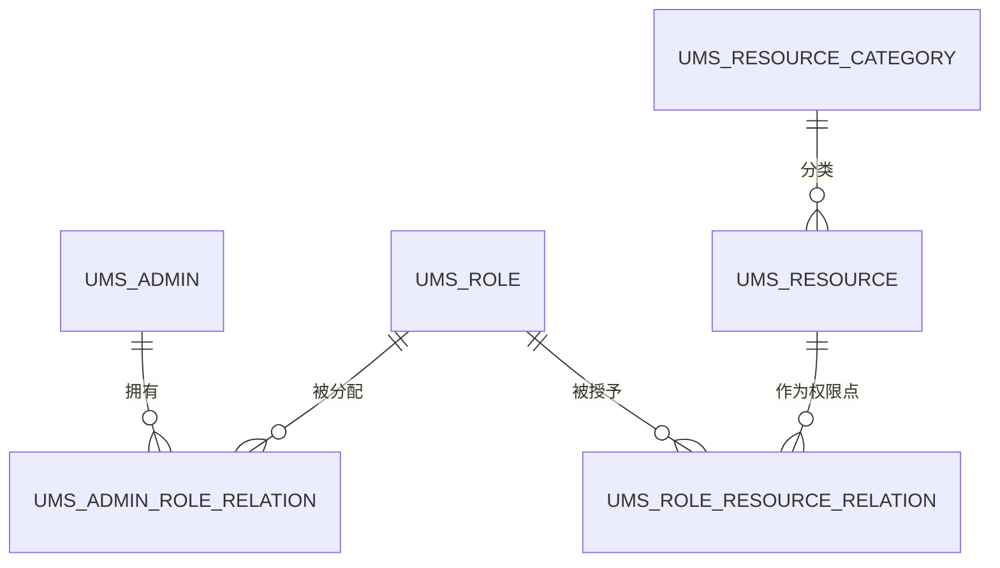
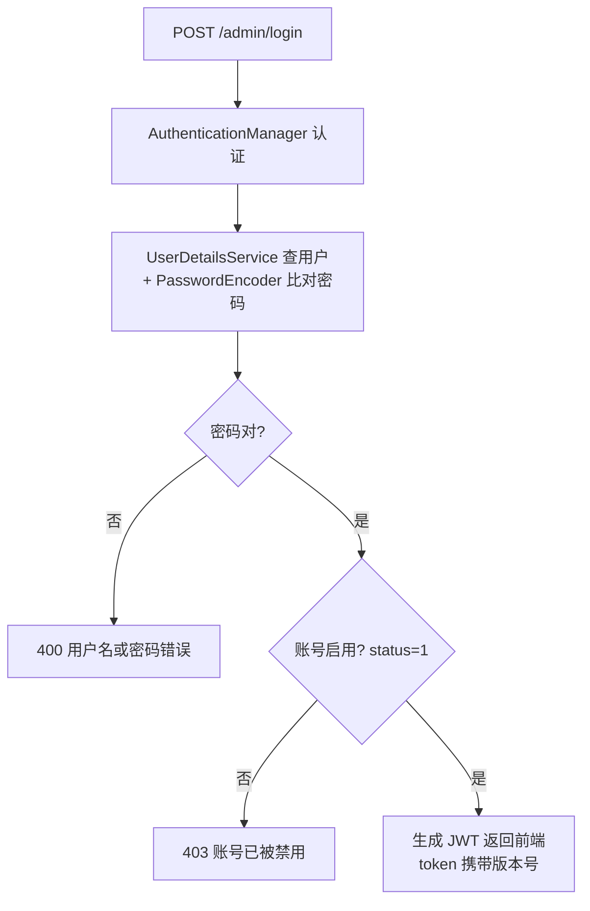
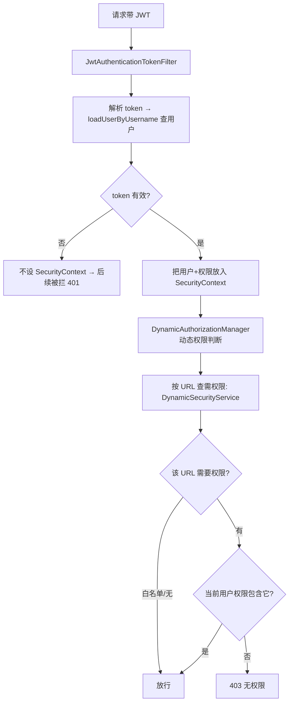

# mall 权限设计（RBAC + 动态权限）

> 设计记录第一篇。mall 的权限体系 = **经典 RBAC 变体**：用户（admin）↔ 角色 ↔ 资源（URL），资源存数据库、运行时动态判断——这是"权限可配置、不硬编码"的关键。

## 一、整体模型（RBAC：谁 通过什么角色 能访问哪些资源）

```
用户（ums_admin）
  └─ 拥有若干角色（ums_role）           ← 通过 ums_admin_role_relation
       └─ 角色被授予若干资源（ums_resource）← 通过 ums_role_resource_relation
            └─ 资源 = 权限点（每个 URL 一条，如 /admin/product/create）
```

**两个核心设计**：
1. **用户不直接绑权限，通过"角色"间接获得**——方便批量授权（给角色加权限 = 所有该角色用户生效）
2. **权限点 = 资源（URL），存数据库**——改权限改库即生效，不用改代码重部署（这就是"动态权限"）

## 二、数据表设计（Mermaid ER 图）



| 表 | 角色 | 说明 |
|----|------|------|
| `ums_admin` | 用户 | 后台账号（含 status：0 禁用/1 启用） |
| `ums_role` | 角色 | 如"超级管理员/运营/商品管理员" |
| `ums_resource` | **权限点** | 每个 URL 一条（url + name + category_id） |
| `ums_resource_category` | 资源分类 | 权限点分组（如"商品模块"） |
| `ums_admin_role_relation` | 用户↔角色 | 中间表（多对多） |
| `ums_role_resource_relation` | 角色↔资源 | 中间表（多对多） |

**权限查询 SQL**（一个管理员的所有资源 URL）——四表联查 + 去重：

```sql
SELECT ur.id, ur.name, ur.url, ur.description, ur.category_id
FROM ums_admin_role_relation ar
INNER JOIN ums_role r ON ar.role_id = r.id
INNER JOIN ums_role_resource_relation rrr ON r.id = rrr.role_id
INNER JOIN ums_resource ur ON ur.id = rrr.resource_id
WHERE ar.admin_id = #{adminId}
GROUP BY ur.id          -- 同一资源可能来自多个角色，去重
```

## 三、认证：登录发 JWT（你是谁）



- **无状态**：服务端不存 session，前端每次请求带 JWT
- **UserDetails = AdminUserDetails**：包装 `ums_admin` + 该用户资源列表（角色扁平化成权限）
- **JWT 失效方案**：token 携带**版本号**——改密码/封号时递增版本号 → 该用户全端失效；登出用 **jti 黑名单** → 只失效当前设备。详见 [Token 失效设计（版本号 + jti 黑名单）](/java-practice/mall-design/02-token-invalidation-design)

## 四、授权：请求进来怎么判断（动态权限）



**关键组件**：

| 组件 | 职责 |
|------|------|
| `IgnoreUrlsConfig` | 白名单（登录/静态资源直接放行） |
| `JwtAuthenticationTokenFilter` | 每请求解析 token → 填 SecurityContext |
| `DynamicSecurityService` | 加载"URL → 所需权限"Map（数据源：ums_resource） |
| `DynamicAuthorizationManager` | 比对"当前用户权限"vs"URL 所需权限" |
| `RestAuthenticationEntryPoint` | 401（未登录）统一返回 |
| `RestfulAccessDeniedHandler` | 403（无权限）统一返回 |

## 五、动态权限的本质（和静态权限对比）

| | 静态权限（传统） | 动态权限（mall） |
|--|-----------------|-----------------|
| 权限写哪 | 方法注解 `@PreAuthorize` | **数据库**（ums_resource + 角色绑定） |
| 改权限 | 改代码 + 重新部署 | **改数据库即生效** |
| 判断时机 | 编译期写死 | 运行时查库 + 匹配 |

**代价**：每次请求判断要拿"URL→权限"映射（mall 从 DB/缓存加载）——所以权限配置做了缓存（ums:resourceList），RedisCacheAspect 降级。

## 六、配套细节（踩过的点）

1. **密码校验**：登录交给 Spring Security `AuthenticationManager`（框架走 UserDetailsService + PasswordEncoder + isEnabled 禁用检查），异常分类返回（密码错 400 / 禁用 403）
2. **循环依赖**：AuthenticationManager 参与 UserDetailsService 链 → 用 `ObjectProvider` 懒获取断开
3. **mall-common 不依赖 security**：安全异常在 mall-admin 处理，用 ApiException 桥接给全局异常
4. **缓存**：用户资源列表缓存 Redis，更新角色权限后主动删缓存（改库 + 清缓存配套）

## 相关

- [Token 失效设计（版本号 + jti 黑名单）](/java-practice/mall-design/02-token-invalidation-design) - JWT 主动失效的完整方案（改密码/封号全端失效、登出单设备失效）
- [权限设计](/service/permission-design) - 通用权限模型理论
- [Spring Boot 入门](/service/spring-boot) - Spring Security/JWT/过滤器链
- [收获记录](/java-practice/harvest) - 认证改造/循环依赖/异常分层实战沉淀
