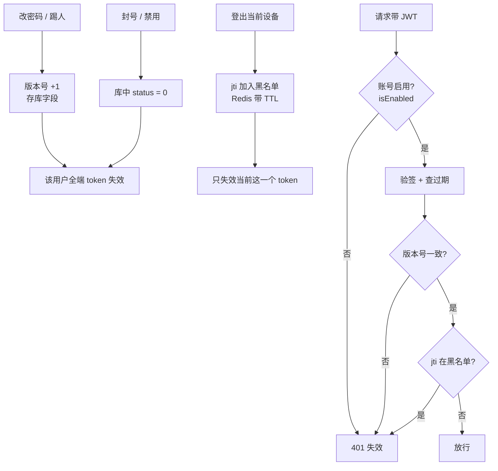

# mall Token 失效设计（版本号 + jti 黑名单）

> 设计记录第二篇。JWT 无状态的代价是"签发后收不回来"——本篇记录从"密码指纹"到"版本号 + jti 黑名单"的改造：一次查库同时解决鉴权与失效，全端失效与单设备登出各司其职。

## 一、问题：JWT 签发后收不回来

JWT 的验证只有两关：**验签名**（没被篡改）+ **查过期**（没到期）。服务端手里没有任何"已签发 Token 清单"，所以**签发之后收不回来**。

但业务需要"立刻失效"的场景有三类，且**影响范围不同**——这是设计的关键：

| 场景 | 期望影响范围 | 原因 |
|------|------------|------|
| **改密码** | 该用户**全端**失效 | 密码变了，旧凭据应全部作废 |
| **封号 / 踢人** | 该用户**全端**失效 | 管理员要立刻断掉该用户所有入口 |
| **登出当前设备** | 只失效**这一个** token | 手机登出不该把电脑也踢掉 |

**两类范围 → 需要两套机制**：一个管"全端"，一个管"单个"。

## 二、演进过程（git 记录）

| 提交 | 做法 | 问题 |
|------|------|------|
| `0504e86`（基线） | `validateToken` 比对 username + 过期 | **无主动失效能力**；username 比对是"自己等于自己"；查库只为拿权限 |
| `fadff9a`（密码指纹） | token 携带 `pwd` claim，比对库中密码 | ✅ 实现了改密码失效；❌ payload 泄露密码哈希、登出覆盖不了、单设备做不到 |
| 本次改造 | **版本号（库字段）+ jti 黑名单** | 见下文 |

两个版本的 `validateToken` 对比：

```java
// 基线:username 来自 token,又拿去查库再比对 → 恒等成立,对"验证"没有贡献
return username != null
    && username.equals(userDetails.getUsername())
    && !isTokenExpired(token);

// 密码指纹:多比一个 pwd,实现"改密码即失效"——但 payload 里带了密码哈希
return Objects.equals(username, userDetails.getUsername())
    && Objects.equals(pwd, userDetails.getPassword())   // ← 泄露风险点
    && !isTokenExpired(token);
```

**密码指纹方案的三个问题**：

1. **payload 泄露密码哈希**：token 是 base64 可解码的，任何拿到 token 的人都能看到 bcrypt 哈希 → 可离线爆破
2. **只覆盖"改密码"**：登出、封号、踢人都拦不住
3. **单设备做不到**：粒度是"用户级"，一登出就全端下线

## 三、方案总览：两个机制，各管一类失效



| 机制 | 存储 | 粒度 | 覆盖场景 |
|------|------|------|---------|
| **版本号** | 数据库字段 | 用户级 | 改密码、踢人（全端失效） |
| **jti 黑名单** | Redis（带 TTL） | 单个 token | 登出当前设备 |
| **`isEnabled()` 检查** | 数据库 `status` 字段 | 用户级 | 封号 / 禁用 |

> **封号为什么不用版本号？** 过滤器**每请求本来就要 `loadUserByUsername` 查库**，`UserDetails.isEnabled()` 的结果就在手边，判断一次零成本；而"改 status 时递增版本号"反而要多一次写库。两者都能实现全端失效，取更省的那条路。

## 四、版本号：实现全端失效

### 为什么用版本号而不是密码哈希

| | 密码哈希（原方案） | 版本号（改造后） |
|---|---|---|
| payload 内容 | 密码哈希（**敏感**） | 一个数字（不敏感） |
| 泄露后果 | 可离线爆破 | 无影响 |
| 语义 | "结果" | "开关" |
| 覆盖场景 | 只有改密码 | 改密码 / 封号 / 踢人 |

核心：**payload 里放"是否还有效"的开关（版本号），而不是放"凭据本身"（密码哈希）**。

### 存储位置：ums_admin 表字段

**定案：版本号存 `ums_admin.token_version` 字段（默认 0）。**

选择理由：

- **零额外查询**：`JwtAuthenticationTokenFilter` 本来就每请求 `loadUserByUsername` 查库（为了拿权限），版本号跟着 UserDetails 一起带出来，不增加任何查询
- **权威在库**：Redis 挂了 / 重启都不影响失效判断，失效语义由数据库保证
- **语义清晰**：版本号是用户的一个属性，放用户表天然合理

**Redis 的角色只是缓存**：用户信息（含 `token_version`）可以缓存到 Redis 减少查库压力，但**权威源始终是数据库**——改密码 / 封号时"更新库 + 删缓存"配套即可：

```java
// 改密码 / 封号:更新库(权威),再删缓存(下次请求重新加载)
// UPDATE ums_admin SET token_version = token_version + 1 WHERE id = #{id}
redis.del("user:details:" + username);
```

### 架构约束：依赖方向不能反

```
mall-security（基础模块）  ←  JwtTokenUtil / JwtAuthenticationTokenFilter
mall-admin（业务模块）     ←  AdminUserDetails（依赖 mall-security）
```

`JwtTokenUtil` 在 mall-security，**不能**强转 mall-admin 的 `AdminUserDetails`（会循环依赖）。正解是在 mall-security 定义能力接口：

```java
// mall-security:定义接口,依赖方向正确
public interface VersionedUserDetails extends UserDetails {
    long getTokenVersion();
}

// mall-admin:AdminUserDetails 实现它
public class AdminUserDetails implements VersionedUserDetails {
    @Override
    public long getTokenVersion() {
        return umsAdmin.getTokenVersion();   // 库字段带出来
    }
}

// mall-security:JwtTokenUtil 通过接口访问,不依赖具体类
public boolean validateToken(String token, UserDetails userDetails) {
    Map<String, Object> payload = getPayloadFromToken(token);
    if (payload == null) return false;
    if (!(userDetails instanceof VersionedUserDetails v)) return false;   // 不支持版本号 → 拒绝
    Object ver = payload.get("ver");
    return ver != null
        && ((Number) ver).longValue() == v.getTokenVersion()
        && !isTokenExpired(token);
}
```

### 实现清单

```java
// 1. 建表字段:ums_admin 加 token_version BIGINT DEFAULT 0
// 2. AdminUserDetails 实现 VersionedUserDetails(见上)
// 3. 签发:payload 带上版本号
claims.put("ver", userDetails.getTokenVersion());

// 4. 改密码 / 封号:版本 +1(一次 UPDATE,旧 token 全部失效)
// UPDATE ums_admin SET token_version = token_version + 1 WHERE id = #{id}
```

## 五、jti 黑名单：实现单设备登出

**jti（JWT ID）** 是 JWT 标准（RFC 7519）的注册 claim，作用是**给这个 token 一个唯一标识**。JWT 的 7 个标准 claim：

| claim | 含义 |
|-------|------|
| `iss` | 签发者 |
| `sub` | 主题（mall 存 username） |
| `aud` | 接收方 |
| `exp` | 过期时间 |
| `nbf` | 生效时间 |
| `iat` | 签发时间 |
| **`jti`** | **JWT 唯一 ID** ← 黑名单靠它 |

```java
// 签发:给 token 一个唯一 ID
claims.put("jti", UUID.randomUUID().toString());

// 登出:把 jti 拉黑,TTL = token 剩余有效期(过期后自动清理,黑名单不堆积)
redis.setex("jwt:blacklist:" + jti, 剩余秒数, "1");

// 鉴权:先查黑名单
if (redis.hasKey("jwt:blacklist:" + jti)) return false;
```

> 为什么 TTL 设成"剩余有效期"？token 过期后 jti 就失去拉黑的意义，让它自动消失即可——黑名单不会无限增长。

## 六、概念澄清（几个容易混的点）

### 1. jti 不改变 token 的独立性

每次登录签发的 token **本来就是独立的**（`created` 不同 → 签名不同），有没有 jti 都一样。jti 带来的是**服务端的可寻址能力**：

| | 没有 jti | 有 jti |
|---|---|---|
| token 本身独立吗 | ✅ 是 | ✅ 是（没变） |
| 服务端能识别"这是哪个 token" | ❌ 不能 | ✅ 能（jti 是身份证号） |
| 电脑登出只想踢电脑 | ❌ 只能用版本号**全端踢** | ✅ 拉黑该 jti，只踢电脑 |

### 2. admin 与 portal 的隔离靠 secret，与 jti 无关

两边配置用的是**不同的 secret**：

```yaml
# mall-admin
secret: mall-admin-secret
# mall-portal
secret: mall-portal-secret
```

密钥不同 → **admin 的 token 拿到 portal 验证直接签名失败**，这是硬隔离。即使两边 secret 相同也共享不了——payload 里的 admin 用户名在 portal 的用户表里查不到，`loadUserByUsername` 会失败。

### 3. 验签 ≠ 判有效性

**验签**只证明"这个 token 是我签发的、且中途没被篡改"；**判有效性**（用户是否被禁用、凭据是否还有效）必须**查状态**（库 / Redis）。所以"改密码后失效"这件事，验签这一步永远不会触发——想让它生效，就必须引入一次状态查询，这也是版本号方案的代价。

## 七、三个层次分开看

```
① 跨应用隔离（admin vs portal）    ← 靠 secret + 用户表，与 jti 无关
② 同用户多设备（手机 / 电脑）      ← 每次登录本来就独立签发，与 jti 无关
③ 服务端能否精确作废某一个 token   ← 这才是 jti 带来的能力
```

## 八、改造清单

- [x] `ums_admin` / `ums_member` 加 `token_version BIGINT NOT NULL DEFAULT 0`（改 mall.sql + 已有库执行 ALTER）
- [x] mall-security 新增 `VersionedUserDetails` 接口
- [x] `AdminUserDetails`（mall-admin）/ `MemberDetails`（mall-portal）实现该接口
- [x] `generateToken` 去掉 `pwd` claim，改带 `ver` + `jti`
- [x] `validateToken` 去掉密码比对，改比对版本号（`null` 也要拒绝）
- [x] 改密码接口：`token_version += 1`（mall-admin / mall-portal 各一处）
- [x] 登出接口：把 jti 写入 Redis 黑名单（TTL = 剩余有效期）
- [x] 鉴权链路：`isEnabled()` → 验签 + 过期 → 版本号比对 → jti 黑名单检查
- [x] 修复原有遗漏：封号后旧 token 仍有效（过滤器原先不检查 `isEnabled`）

> 落地提交：`123a2a8 feat(security): token 失效改造——版本号替代密码指纹，登出用 jti 黑名单`

## 相关

- [权限设计（RBAC + 动态权限）](/java-practice/mall-design/01-permission-design) - 认证与动态授权的整体模型
- [认证与授权](/service/auth) - JWT 原理、Session 对比、主动失效方案
- [收获记录](/java-practice/harvest) - 认证改造 / 循环依赖 / 异常分层实战沉淀
