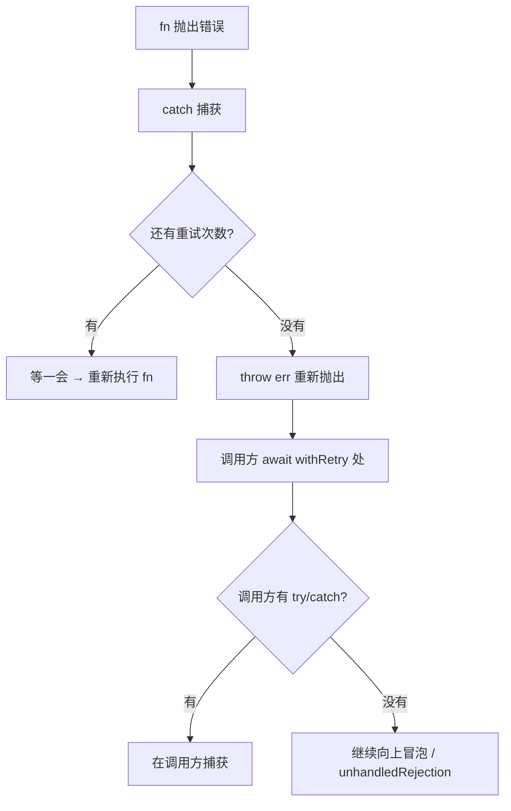
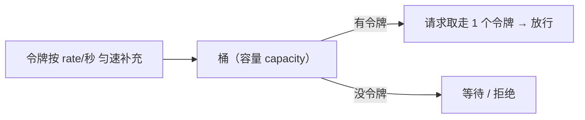

# 异步并发控制最佳实践

> **定位**：从"批量请求"到"限流 + 重试"，把并发控制的**场景与实现**讲透。既是面试高频手写题，也是工程中真实高频的需求（批量请求、爬虫、文件上传、LLM 批量调用、数据库批量操作）。
> 本文代码均经实测验证，末尾附"踩坑清单"——都是真实踩过的。

## 一、为什么需要并发控制

**不限并发会怎样？**

| 问题 | 后果 |
|------|------|
| 打爆下游 | 对方限流、封 IP、服务雪崩 |
| 内存暴涨 | 每个任务都持有数据，1000 个并发就是 1000 份 |
| 连接池耗尽 | 浏览器同域只有 6 个连接；Node 的 HTTP agent 也有限制 |
| 本地资源耗尽 | 文件句柄、线程、CPU 上下文切换 |

**目标**：控制"**同时在跑**"的数量，而不是"总共跑多少"。

```
❌ 无限制:1000 个请求同时发 → 下游挂了、自己内存也炸了
✅ 限流 10:始终最多 10 个在跑,跑完一个补一个 → 稳定、可控
```

## 二、先搞清 Promise 的四个并发 API

很多人手写并发控制时出错，根因是**没搞清这四个 API 的语义差异**：

| API | 语义 | 何时结束 |
|-----|------|---------|
| `Promise.all` | 全成功才成功 | 全 fulfilled → 结果数组；**任一 rejected → 立即 reject**（短路） |
| `Promise.allSettled` | 等全部完成 | 永远 resolve，结果是 `[{status,value/reason}]` |
| `Promise.race` | 第一个 settled | 第一个完成（无论成败）就返回 |
| `Promise.any` | 第一个 fulfilled | 第一个成功就返回；全失败才 reject（`AggregateError`） |

**两个高频误区**：

**① `Promise.all` 的短路不会取消其他任务**

```js
await Promise.all([slowTask(), failFastTask()])
// failFastTask 先失败 → Promise.all 立即 reject
// 但 slowTask 还在后台跑!只是它的结果被丢弃了(变成"孤儿任务")
```

真要取消，必须用 `AbortController` 把信号传进任务（见第五节）。

**② 空数组立即 resolve，不是挂起**

```js
await Promise.all([])        // → []
await Promise.allSettled([]) // → []   (实测确认)
```

## 三、核心场景：固定任务列表 + 并发限制

这是最经典的形态：给你一个**任务工厂数组**，要求同时最多跑 `limit` 个。

### 方案 A：worker 池（推荐）

思路：**起 `limit` 个 worker，每个 worker 循环"取任务 → 执行 → 再取"**，任务由共享的取号器动态分配。

```js
async function concurrencyLimit(tasks, limit) {
  const total = tasks.length
  if (total === 0) return []

  const results = new Array(total)
  let nextIndex = 0

  async function worker() {
    while (nextIndex < total) {
      const i = nextIndex++        // 取号(JS 单线程,自增不会竞争)
      results[i] = await tasks[i]()
    }
  }

  await Promise.all(
    Array.from({ length: Math.min(limit, total) }, () => worker())
  )
  return results
}
```

**为什么这里不需要锁？** `nextIndex++` 是**同步操作**，JS 单线程不会在自增中途被打断——所以 worker 能安全地"抢任务"。换成 Java/Go 就得上原子类或互斥锁。这是 JS 并发模型的天然优势。

**执行推演**（2 个 worker）：

```
Array.from 位置0 → worker() 进入 while → nextIndex 0→1 → 取 tasks[0] → await 挂起
Array.from 位置1 → worker() 进入 while → nextIndex 1→2 → 取 tasks[1] → await 挂起
                                                          ↑ 此刻只有 2 个任务在跑
tasks[0] 完成 → worker0 的 while 再判断 → nextIndex 2→3 → 取 tasks[2]
```

### 方案 B：信号量计数

思路：用一个计数器表示"剩余车道"，占一个减一、完成一个加一，并在完成时补充新任务。

```js
function concurrencyLimit(tasks, limit) {
  return new Promise((resolve) => {
    const total = tasks.length
    if (total === 0) return resolve([])

    const results = []
    let curIndex = -1
    let done = 0
    let restLane = limit

    function execTask() {
      while (curIndex + 1 < total && restLane > 0) {
        curIndex++
        const i = curIndex            // ← 必须捕获(闭包!)
        restLane--
        Promise.resolve()
          .then(() => tasks[i]())
          .then((val) => { results[i] = val })
          .catch((err) => { results[i] = err })
          .finally(() => {
            restLane++                // ← 释放车道(漏了会永久挂起!)
            done++
            done === total ? resolve(results) : execTask()
          })
      }
    }
    execTask()
  })
}
```

### 两种方案对比

| | worker 池 | 信号量 |
|---|---|---|
| 代码量 | 少（10 行） | 多（20+ 行） |
| 可读性 | 高 | 中 |
| 适合 | 静态任务列表 | **动态产生**任务的场景 |
| 易错点 | 几乎没有 | lane 忘释放、闭包索引、越界 |

> **面试建议**：默认写 worker 池（简洁、不易错）。如果面试官追问"任务列表是动态的怎么办"，再讲信号量/队列方案。

### 变体：不用 `Promise.all` 怎么等所有 worker

面试常加限制"不许用 `Promise.all`"。先明确它的职责——**只做一件事：等所有 worker 结束**。所以替代方案就是"用别的方式判断都跑完了"。

**写法 1：worker + 完成计数**

```js
function concurrencyLimit(tasks, limit) {
  return new Promise((resolve, reject) => {
    const total = tasks.length
    if (total === 0) return resolve([])
    const results = new Array(total)
    let nextIndex = 0
    let doneWorkers = 0
    const workerCount = Math.min(limit, total)

    async function worker() {
      while (nextIndex < total) {
        const i = nextIndex++
        results[i] = await tasks[i]()
      }
    }

    for (let w = 0; w < workerCount; w++) {
      worker().then(() => {
        if (++doneWorkers === workerCount) resolve(results)   // ← 自己判断"全完成"
      }, reject)
    }
  })
}
```

**写法 2：手写 mini `Promise.all`**

```js
function myAll(promises) {
  return new Promise((resolve, reject) => {
    const n = promises.length
    if (n === 0) return resolve([])
    const out = new Array(n)
    let count = 0
    promises.forEach((p, i) => {
      Promise.resolve(p).then((v) => {
        out[i] = v                            // 按索引存,保证顺序
        if (++count === n) resolve(out)
      }, reject)                              // 任一失败 → 立即 reject(同 Promise.all)
    })
  })
}

// 用法:把 Promise.all 换掉
await myAll(Array.from({ length: Math.min(limit, total) }, () => worker()))
```

> **写法 3（纯 then 链）** 就是上面的"方案 B 信号量"——它没有 worker，自然也不需要 `Promise.all`。

| 写法 | 特点 | 适用 |
|------|------|------|
| worker + 计数 | 保留 worker 池结构，改动最小 | 想"手写但保持 worker 思路" |
| 手写 `myAll` | 额外实现 all 的语义 | 面试同时考"手写 all" |
| 原生 `Promise.all` | 最简洁 | **工程首选** |

**语义差异要留意**：

```js
// Promise.all:任一 worker 失败 → 立即 reject(其他 worker 变孤儿)
// 若改成"失败也计入完成"→ 等价于 allSettled 语义(等所有 worker 跑完)
worker().then(
  () => { if (++doneWorkers === workerCount) resolve(results) },
  () => { if (++doneWorkers === workerCount) resolve(results) }
)
```

> 先想清楚"worker 失败时要不要等其他的"，再决定用哪个语义。

### 必测的 5 个用例

| 用例 | 期望 |
|------|------|
| 6 任务 / limit=2 | 最大并发 = 2，耗时 ≈ 3 轮（不是 6 轮） |
| 结果顺序 | 与**输入顺序**一致（不是完成顺序） |
| 空数组 | 立即返回 `[]` |
| limit > 任务数 | 并发 = 任务数（不多起 worker） |
| limit = 0 | 要防：任务一个都不执行且永不 resolve（加兜底） |

## 四、场景：要区分成功 / 失败（allSettled 语义）

**需求**：批量任务不该被个别失败中断——成功的要结果，失败的要错误，全都要。

### 实现：任务级 settle（推荐）

```js
async function concurrencyLimitAllSettled(tasks, limit) {
  const total = tasks.length
  if (total === 0) return []

  const results = new Array(total)
  let nextIndex = 0

  // 把单个任务包装成 allSettled 的结果格式
  const runOne = (i) =>
    Promise.resolve()
      .then(() => tasks[i]())
      .then(
        (value)  => { results[i] = { status: 'fulfilled', value } },
        (reason) => { results[i] = { status: 'rejected',  reason } }
      )

  async function worker() {
    while (nextIndex < total) {
      await runOne(nextIndex++)
    }
  }

  await Promise.all(
    Array.from({ length: Math.min(limit, total) }, () => worker())
  )
  return results
}
```

**实测结果**（5 个任务，第 3 个抛错）：

```
[ {status:'fulfilled', value:0}, {status:'fulfilled', value:1},
  {status:'rejected', reason:Error},          ← 失败被记录,其余照常
  {status:'fulfilled', value:3}, {status:'fulfilled', value:4} ]
```

### 关键细节：为什么用 `.then(onFulfilled, onRejected)` 而不是 `.then().catch()`

```js
// 写法 A:双参数(推荐,和 Promise.allSettled 内部实现一致)
promise.then(onFulfilled, onRejected)
// onRejected 只处理【前一个 Promise】的 rejection

// 写法 B:链式 catch
promise.then(onFulfilled).catch(onRejected)
// catch 会连【onFulfilled 里抛出的错】一起捕获 —— 语义更宽,不够精确
```

手写 allSettled 时用**双参数**形式更准确。

### 结果字段名要对齐规范

```js
{ status: 'fulfilled', value: 返回值 }     // ✅ 规范字段
{ status: 'rejected',  reason: 错误对象 }  // ✅
{ status: 'fulfilled', data: xxx }         // ❌ 字段名自创,和 allSettled 不兼容
```

> 如果不需要自定义结果结构，直接用 `Promise.allSettled` 更省事。手写主要用于面试，或者需要**自定义包装**（比如加上任务标识、耗时）。

## 五、场景：一个失败就取消其他（AbortController）

`Promise.all` 只是"提前返回"，**不会取消**其他任务。真取消要用 `AbortController`：

```js
async function runWithCancel(tasks, limit) {
  const controller = new AbortController()
  const { signal } = controller
  const results = []
  let nextIndex = 0

  async function worker() {
    while (nextIndex < tasks.length) {
      if (signal.aborted) return          // ← 检查取消信号
      const i = nextIndex++
      try {
        results[i] = await tasks[i](signal)   // ← 把 signal 传给任务
      } catch (err) {
        controller.abort()                    // ← 任一失败 → 取消其他
        throw err
      }
    }
  }

  await Promise.all(
    Array.from({ length: Math.min(limit, tasks.length) }, () => worker())
  )
  return results
}

// 任务内部要配合 signal
const fetchTask = (signal) => fetch(url, { signal })
```

**要点**：

- `signal` 必须**传进任务内部**才会生效（`fetch`/`axios` 都支持）
- 只检查 `signal.aborted` 不够——正在跑的任务不会被打断，只是不再取新任务
- 浏览器原生 API（fetch、addEventListener）都支持 signal，这是标准做法

## 六、场景：失败重试（与并发结合）

```js
// ① sleep:JS 没有内置 sleep,用"ms 后 resolve"来模拟
//    参数 r 就是 Promise 的 resolve(完整写法是 (resolve) => ...)
const sleep = (ms) => new Promise((r) => setTimeout(r, ms))

async function withRetry(fn, { times = 3, delay = 100 } = {}) {
  for (let attempt = 1; ; attempt++) {
    try {
      return await fn()                        // 成功 → 直接返回,退出循环
    } catch (err) {
      if (attempt >= times) throw err          // ② 重试次数用完 → 重新抛出
      await sleep(delay * 2 ** (attempt - 1))  // ③ 指数退避:100 → 200 → 400
    }
  }
}
```

### `new Promise((r) => setTimeout(r, ms))` 是什么

这是 JS 里**实现 sleep 的标准写法**（JS 没有内置的 `sleep`）。拆开看：

```js
new Promise((resolve) => setTimeout(resolve, ms))
//          ↑ 构造函数的执行器接收 (resolve, reject)
//            这里只用了 resolve(简写成 r),因为"等待"不会失败
```

执行过程：

1. `new Promise(executor)` → **同步**执行 executor
2. executor 里注册 `setTimeout(resolve, ms)`
3. `ms` 毫秒后定时器触发 → 调用 `resolve()` → Promise 变为 fulfilled
4. `await` 等到 fulfilled → 继续往下执行

> 所以这行的语义就是"**等 ms 毫秒**"。`reject` 参数被省略了（等待过程没有失败的理由），如果需要可以补上 `(resolve, reject) => ...`。

### 重试失败的错误，最终被谁捕获

分三层流转：



**第 1 层**（`withRetry` 内部）：`fn()` 失败被 `catch (err)` 捕获；没到上限就**吞掉错误继续重试**，到上限才 `throw err` **重新抛出**。

**第 2 层**（调用方）：重新抛出的错误冒泡到 `await withRetry(...)` 那里——调用方有 `try/catch` 就在那里捕获，没有就继续往上冒。

**第 3 层**（与并发控制组合时）：

```js
const tasks = urls.map((url) => () => withRetry(() => fetch(url), { times: 3 }))
await concurrencyLimit(tasks, 5)
// 某任务重试 3 次仍失败 → withRetry 抛出
//   → 工厂函数返回的 Promise reject
//   → worker 里 await tasks[i]() 抛出 → worker reject
//   → Promise.all(workers) 立即 reject → 整批失败
```

**结论：一个任务最终失败，会导致整批失败**（`Promise.all` 短路）。

如果希望"个别失败不影响整体"，就在**任务层面 settle**（呼应第四节的 allSettled 语义）：

```js
const tasks = urls.map((url) => () =>
  withRetry(() => fetch(url), { times: 3 })
    .then((value) => ({ status: 'fulfilled', value }))
    .catch((reason) => ({ status: 'rejected', reason }))   // ← 失败变成结果,不中断整批
)
```

**注意**：重试期间任务**仍占用并发额度**（它还在跑），所以重试会拉长整体耗时——必要时把重试任务的并发额度单独收紧。

## 七、场景：动态任务（边跑边加）

前面的方案都假设"任务列表已知"。如果是**流式产生**的任务（比如爬虫边抓边发现新链接），需要队列 + 消费者：

```js
class ConcurrencyPool {
  constructor(limit) {
    this.limit = limit
    this.running = 0
    this.queue = []
    this.resolveIdle = null
  }

  add(task) {
    this.queue.push(task)
    this.pump()
  }

  pump() {
    while (this.running < this.limit && this.queue.length) {
      const task = this.queue.shift()
      this.running++
      Promise.resolve()
        .then(task)
        .catch(() => {})            // 错误自己处理
        .finally(() => {
          this.running--
          this.pump()               // 释放后立刻补新任务
          if (this.running === 0 && this.queue.length === 0) {
            this.resolveIdle?.()    // 队列空 + 没有在跑 → 通知结束
          }
        })
    }
  }

  // 等待所有任务(含后续 add 进来的)完成
  idle() {
    if (this.running === 0 && this.queue.length === 0) return Promise.resolve()
    return new Promise((resolve) => { this.resolveIdle = resolve })
  }
}

// 用法
const pool = new ConcurrencyPool(5)
pool.add(() => fetch(url1))
pool.add(() => fetch(url2))
await pool.idle()
```

**关键差异**：结束条件是"**队列空 且 没有在跑**"，而不是"完成数 === 总数"（总数未知）。

## 八、场景：速率限制（单位时间内的请求数）

**并发限制 ≠ 速率限制**，两者常被混为一谈：

| | 并发限制 | 速率限制 |
|---|---|---|
| 限制什么 | **同时在跑**的数量 | **单位时间**内发起/完成的数量 |
| 例子 | 最多 10 个同时跑 | 每秒最多 100 次请求 |
| 适用 | 保护下游连接数、内存 | 防触发限流、配额控制 |
| 实现 | worker 池 / 信号量 | 令牌桶 / 漏桶 / 滑动窗口 |

### 令牌桶：完整实现

**要解决什么问题**：调用第三方 API 时对方常有 QPS 限制（如"每秒最多 100 次"），超了会被限流甚至封号。**并发限制管不了这个**——10 个并发如果跑得飞快，一秒可能发出几百个请求。



**两个参数的含义**（最容易绕晕的地方）：

| 参数 | 含义 | 直觉 |
|------|------|------|
| `capacity` | 桶容量 | **允许的突发上限**——桶里攒了货就能一次性放行这么多 |
| `rate` | 每秒补充数 | **长期平均速率**——即允许的 QPS |

举例：`new TokenBucket(200, 100)` = 长期平均 100 QPS，但允许**瞬间爆发 200 个**。

```js
class TokenBucket {
  /**
   * @param {number} capacity 桶容量 —— 允许的【突发】上限
   * @param {number} rate     每秒补充令牌数 —— 允许的【长期平均】速率
   */
  constructor(capacity, rate) {
    this.capacity = capacity
    this.rate = rate
    this.tokens = capacity            // 初始装满(允许一开始就突发)
    this.lastRefill = Date.now()
  }

  // 按流逝的时间补充令牌(惰性计算,不需要定时器)
  refill() {
    const now = Date.now()
    const elapsed = (now - this.lastRefill) / 1000
    if (elapsed > 0) {
      this.tokens = Math.min(this.capacity, this.tokens + elapsed * this.rate)
      this.lastRefill = now
    }
  }

  // 非阻塞:拿不到立即返回 false(适合"限流后直接拒绝 / 降级")
  tryTake(n = 1) {
    this.refill()
    if (this.tokens >= n) { this.tokens -= n; return true }
    return false
  }

  // 阻塞式:拿不到就等到有令牌(实际最常用)
  async take(n = 1) {
    for (;;) {
      this.refill()
      if (this.tokens >= n) { this.tokens -= n; return }
      const need = n - this.tokens
      const waitMs = Math.ceil((need / this.rate) * 1000)   // 攒够所需令牌的时间
      await new Promise((r) => setTimeout(r, waitMs))
    }
  }
}
```

**怎么用**（和并发控制组合）：

```js
// 第三方 API:100 QPS,允许突发 200
const bucket = new TokenBucket(200, 100)

async function request(url) {
  await bucket.take()      // ← 拿不到令牌就等,天然限速
  return fetch(url)
}

// 组合:并发 10(保护自己) + 限速 100 QPS(保护下游)
const tasks = urls.map((url) => () => request(url))
await concurrencyLimit(tasks, 10)
```

**实测效果**（容量 3、速率 3/s、连发 6 个请求）：

```
第1个请求放行 @ 0ms      ← 桶初始装满,前 3 个立即放行(这就是"突发")
第2个请求放行 @ 0ms
第3个请求放行 @ 0ms
第4个请求放行 @ 339ms    ← 之后每 1/3 秒才补充 1 个令牌
第5个请求放行 @ 670ms
第6个请求放行 @ 1002ms
总耗时 1016ms
```

**漏桶 vs 令牌桶**（面试常问）：

| | 漏桶（Leaky Bucket） | 令牌桶（Token Bucket） |
|---|---|---|
| 机制 | 请求先进桶，以**固定速率流出** | 令牌以固定速率**流入**，请求取令牌 |
| 突发流量 | ❌ 不允许（流出速率恒定） | ✅ 允许（桶里有存货就能爆发） |
| 典型用途 | 严格平滑流量（如音视频流控） | **API 限流**（大多数场景） |

**两者组合**才是生产级方案：并发控制保护自己，速率限制保护下游。

## 九、踩坑清单（都是实测踩过的）

| # | 坑 | 现象 | 修法 |
|---|----|------|------|
| 1 | **闭包捕获索引** | 异步回调里读 `curIndex` 拿到的是**最终值** → 结果互相覆盖 | `const i = curIndex` 先捕获 |
| 2 | **while 条件越界** | `while (curIndex < total)` 检查的是自增**前**的值 → 取到 `tasks[total] = undefined`，计数超过总数 | `while (curIndex + 1 < total)` |
| 3 | **车道忘释放** | `finally` 里漏了 `restLane++` → 第一批跑完后再不取新任务 → **Promise 永久 pending**（静默挂起，最难查） | `finally` 里必须释放 |
| 4 | **工厂函数忘调用** | `await tasks[i]` 少了 `()` → 任务从未执行（`await` 一个函数直接返回它） | `await tasks[i]()` |
| 5 | **`Array.from` 传错** | `Array.from({length:n}, worker())` 传的是调用结果 → mapFn 被忽略 | 传函数：`() => worker()` |
| 6 | **结果顺序错** | 用 `results.push()` 是按**完成顺序**，不是输入顺序 | 按索引写：`results[i] = ...` |
| 7 | **空数组不返回** | `total === 0` 时 while 不执行 → 没有 resolve → 永久 pending | `if (total === 0) return resolve([])` |
| 8 | **allSettled 字段名自创** | 用 `data` 而非 `value`/`reason`，和规范不兼容 | 对齐 `{status, value}` / `{status, reason}` |
| 9 | **`limit = 0` 没兜底** | 一个任务都不执行且永不 resolve | 加校验或兜底为 1 |

> 第 1、3 条最隐蔽：**不报错，但静默挂起或结果错乱**——比直接抛错更难排查。

## 十、面试答题模板

```
① 先澄清需求(这题没有唯一答案)
   - 结果要不要区分成功失败?(→ allSettled 语义)
   - 一个失败要不要取消其他?(→ AbortController)
   - 要不要重试?要不要限速?
   - 任务列表是静态的还是动态产生的?

② 选并发 API 的语义
   - Promise.all / allSettled / race / any 各自适用什么

③ 手写实现(默认 worker 池)
   - 起 limit 个 worker,while 循环取任务
   - 用 nextIndex++ 做无锁取号(点出 JS 单线程的优势)

④ 主动说边界
   - 空数组、limit 大于任务数、limit = 0
   - 结果顺序按输入

⑤ 追问应对
   - "怎么取消?" → AbortController,注意要传进任务
   - "任务动态产生?" → 队列 + 消费者,结束条件是"队列空且无在跑"
   - "要限速呢?" → 令牌桶,和并发控制是两个维度
```

**常见追问与答法**：

| 追问 | 回答要点 |
|------|---------|
| `Promise.all` 一个失败会怎样？ | 立即 reject（短路），但**其他任务不会取消**，仍在后台跑 |
| 怎么真正取消？ | `AbortController` + `signal`，且任务内部要配合 |
| 并发限制和限速的区别？ | 一个管"同时在跑"，一个管"单位时间数量"，通常要组合 |
| 重试算占并发吗？ | 算（任务还在跑），会拉长整体耗时 |
| 为什么不用锁？ | JS 单线程，`nextIndex++` 同步执行不会竞争 |

## 相关

- [异步编程与 Promise](/javascript/async) - Promise 基础、async/await
- [事件循环](/javascript/event-loop) - 微任务与宏任务
- [设计模式](/javascript/pubsub) - 发布订阅、观察者
