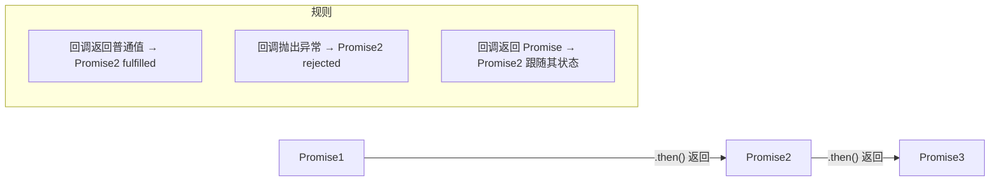

# 异步编程与 Promise 原理

## 一句话总结

JavaScript 是单线程的，异步编程的核心就是**让耗时操作不阻塞主线程**，通过事件循环在合适的时机拿到结果。

## 异步编程的演变

### 第一阶段：回调函数（Callback）

最原始的方式——把后续逻辑包成函数传进去，等异步操作完成后调用。

```javascript
// 读取文件，读完后执行回调
fs.readFile('data.txt', 'utf8', (err, data) => {
  if (err) return console.error(err)
  console.log(data)
})
```

**问题：回调地狱**。多个异步操作嵌套时，代码变成"金字塔"，难以阅读和维护。

```javascript
getUser(id, (user) => {
  getOrders(user, (orders) => {
    getOrderDetail(orders[0], (detail) => {
      // 嵌套越来越深...
    })
  })
})
```

### 第二阶段：Promise

Promise 将回调"拍平"，用链式调用解决嵌套问题。

```javascript
getUser(id)
  .then(user => getOrders(user))
  .then(orders => getOrderDetail(orders[0]))
  .then(detail => console.log(detail))
  .catch(err => console.error(err))
```

### 第三阶段：async / await（ES2017）

在 Promise 基础上进一步用同步的写法写异步代码，可读性最好。

```javascript
async function showDetail(id) {
  try {
    const user = await getUser(id)
    const orders = await getOrders(user)
    const detail = await getOrderDetail(orders[0])
    console.log(detail)
  } catch (err) {
    console.error(err)
  }
}
```

> **本质**：`async/await` 是 Promise 的语法糖，底层仍然是 Promise + 微任务。

## Promise 原理

### 三种状态

Promise 是一个**状态机**，一旦状态改变就不会再变：

| 状态 | 含义 | 能否转变 |
|------|------|---------|
| `pending` | 进行中 | → `fulfilled` 或 `rejected` |
| `fulfilled` | 已成功 | 不可变 |
| `rejected` | 已失败 | 不可变 |

```javascript
const p = new Promise((resolve, reject) => {
  // pending 状态
  setTimeout(() => resolve('ok'), 1000) // → fulfilled
})
```

### 链式调用的关键：`.then()` 返回新 Promise

这是 Promise 最核心的机制——**每个 `.then()` 都会返回一个新的 Promise**，新 Promise 的状态由回调的返回值决定：



```javascript
Promise.resolve(1)
  .then(val => val + 1)       // 返回 2 → 新 Promise fulfilled(2)
  .then(val => val * 3)       // 返回 6 → 新 Promise fulfilled(6)
  .then(console.log)          // 打印 6
```

### 为什么 `.then()` 是微任务？

Promise 的回调被放入**微任务队列（microtask queue）**，在当前宏任务结束后、下一个宏任务开始前执行。这保证了异步结果的回调能尽快执行，且优先级高于 `setTimeout` 等宏任务。

```javascript
console.log('1')          // 同步，立即执行

setTimeout(() => console.log('2'), 0)  // 宏任务

Promise.resolve().then(() => console.log('3'))  // 微任务

console.log('4')          // 同步，立即执行

// 输出顺序：1 → 4 → 3 → 2
```

执行流程：
1. 同步代码执行完毕 → 输出 `1`、`4`
2. 清空微任务队列 → 输出 `3`
3. 执行下一个宏任务 → 输出 `2`

## 手写一个简易 Promise

理解原理最好的方式是手写一个。以下是核心逻辑的简化版：

```javascript
class MyPromise {
  constructor(executor) {
    this.state = 'pending'
    this.value = undefined
    this.callbacks = [] // 存储 .then 注册的回调

    const resolve = (val) => this.#transition('fulfilled', val)
    const reject = (err) => this.#transition('rejected', err)

    try {
      executor(resolve, reject)
    } catch (err) {
      reject(err)
    }
  }

  #transition(state, val) {
    if (this.state !== 'pending') return
    this.state = state
    this.value = val
    // 状态改变后，异步执行所有已注册的回调
    queueMicrotask(() => this.callbacks.forEach(cb => cb(this)))
  }

  then(onFulfilled, onRejected) {
    // 返回新 Promise，实现链式调用
    return new MyPromise((resolve, reject) => {
      const callback = (promise) => {
        try {
          const fn = promise.state === 'fulfilled' ? onFulfilled : onRejected
          const result = fn ? fn(promise.value) : promise.value
          // 如果返回的是 Promise，跟随其状态
          result instanceof MyPromise
            ? result.then(resolve, reject)
            : resolve(result)
        } catch (err) {
          reject(err)
        }
      }

      // pending 时先存起来，状态改变后再执行
      this.state === 'pending'
        ? this.callbacks.push(callback)
        : callback(this)
    })
  }

  catch(onRejected) {
    return this.then(null, onRejected)
  }

  // ===== 静态方法 =====
  static resolve(value) {
    // ① 已经是 MyPromise 实例 → 直接返回它(规范要求,不包新的)
    if (value instanceof MyPromise) return value
    return new MyPromise((resolve, reject) => {
      // ② thenable(含原生 Promise)→ 跟随它的状态
      if (value && typeof value.then === 'function') {
        value.then(resolve, reject)
      } else {
        // ③ 普通值 → 直接 fulfilled
        resolve(value)
      }
    })
  }

  static reject(reason) {
    // 注意:reject 不做 thenable 展开,直接把 reason 作为拒绝原因
    return new MyPromise((resolve, reject) => reject(reason))
  }
}
```

关键设计点：
- **状态不可逆**：`#transition` 中检查 `state !== 'pending'` 直接返回
- **链式调用**：`.then()` 返回新 Promise，回调结果决定新 Promise 的状态
- **微任务调度**：用 `queueMicrotask` 保证回调异步执行
- **静态方法**：`resolve` 要处理三种输入（已是实例 / thenable / 普通值），`reject` 则直接拒绝、不做展开

**`resolve` 与 `reject` 的不对称**（容易忽略）：

| 输入 | `MyPromise.resolve(x)` | `MyPromise.reject(x)` |
|------|------------------------|----------------------|
| 已是 MyPromise 实例 | **直接返回它**（同一个对象） | 新建 rejected，reason 是它 |
| thenable / 原生 Promise | **跟随它的状态** | **不展开**，reason 就是这个 Promise 对象 |
| 普通值 | fulfilled，值就是它 | rejected，reason 就是它 |

```js
// 实测
await MyPromise.resolve(Promise.resolve('native'))   // → 'native'(跟随)
await MyPromise.reject(Promise.resolve('x'))         // → rejected,reason 是那个 Promise(不展开)
```

> **为什么不对称？** `reject` 的语义是"**以这个原因为由拒绝**"——如果它去展开 thenable，就变成"以 thenable 的结果为原因"，反而丢失了原始信息。

## 常见误区

❌ **Promise 能取消异步操作**
> Promise 一旦创建就会执行，无法中途取消。需要取消能力应使用 `AbortController`。

❌ **`.then()` 的回调是同步执行的**
> `.then()` 的回调始终是微任务，即使 Promise 已经 resolved，回调也不会同步执行。

❌ **`async` 函数返回的是普通值**
> `async` 函数永远返回一个 Promise。`return 1` 等价于 `return Promise.resolve(1)`。
