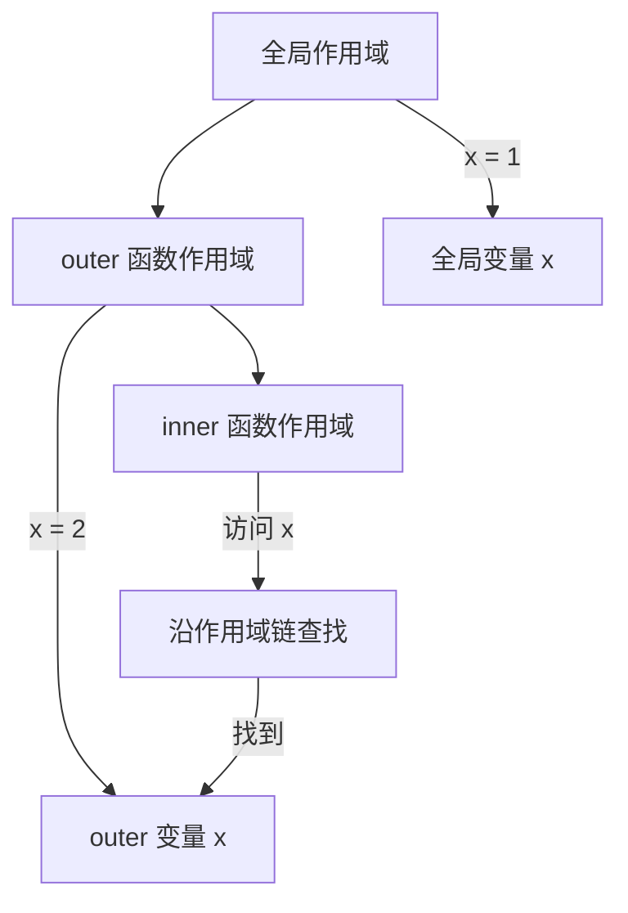
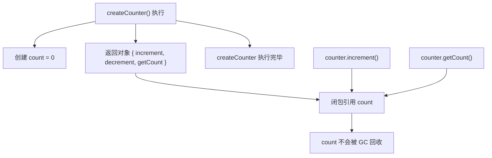
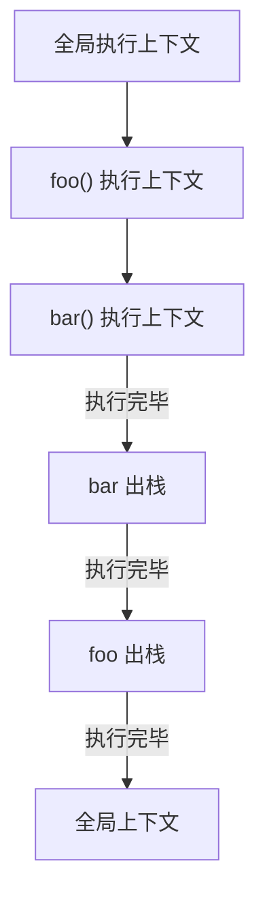

# JavaScript 闭包、作用域与 this

## 作用域

### 词法作用域（静态作用域）

JavaScript 采用词法作用域，函数的作用域在**定义时**就确定了，而不是在调用时。

```typescript
const x = 1;

function outer() {
  const x = 2;

  function inner() {
    console.log(x);  // 2（定义时的作用域）
  }

  return inner;
}

const fn = outer();
fn();  // 2，不是 1
```

### 作用域链

当访问变量时，会沿着作用域链向上查找，直到找到该变量或到达全局作用域。



```typescript
function outer() {
  const a = 1;

  function middle() {
    const b = 2;

    function inner() {
      const c = 3;
      console.log(a + b + c);  // 6（沿作用域链查找 a、b）
    }

    inner();
  }

  middle();
}

outer();
```

### 块级作用域

ES6 引入 `let` 和 `const`，支持块级作用域。

```typescript
// var - 函数作用域
function testVar() {
  if (true) {
    var x = 1;
  }
  console.log(x);  // 1（var 没有块级作用域）
}

// let/const - 块级作用域
function testLet() {
  if (true) {
    let y = 2;
  }
  // console.log(y);  // ReferenceError
}
```

---

## 闭包

### 定义

闭包是指函数**记住并访问**其词法作用域，即使函数在其词法作用域之外执行。

### 核心特征

1. 函数嵌套函数
2. 内部函数引用外部函数的变量
3. 外部函数执行完后，内部函数仍然可以访问外部函数的变量

### 示例

```typescript
function createCounter() {
  let count = 0;  // 被闭包捕获的变量

  return {
    increment() {
      count++;
      return count;
    },
    decrement() {
      count--;
      return count;
    },
    getCount() {
      return count;
    },
  };
}

const counter = createCounter();
console.log(counter.increment());  // 1
console.log(counter.increment());  // 2
console.log(counter.decrement());  // 1
console.log(counter.getCount());   // 1
// count 变量被闭包保护，外部无法直接访问
```

### 内存模型



### 常见应用场景

#### 1. 数据私有化

```typescript
function createBankAccount(initialBalance: number) {
  let balance = initialBalance;  // 私有变量

  return {
    deposit(amount: number) {
      balance += amount;
    },
    withdraw(amount: number) {
      if (amount > balance) throw new Error('Insufficient funds');
      balance -= amount;
    },
    getBalance() {
      return balance;
    },
  };
}

const account = createBankAccount(1000);
account.deposit(500);
console.log(account.getBalance());  // 1500
// balance 无法被外部直接修改
```

#### 2. 函数工厂

```typescript
function createMultiplier(factor: number) {
  return (x: number) => x * factor;
}

const double = createMultiplier(2);
const triple = createMultiplier(3);

console.log(double(5));  // 10
console.log(triple(5));  // 15
```

#### 3. 缓存（记忆化）

```typescript
function memoize<T extends (...args: any[]) => any>(fn: T): T {
  const cache = new Map<string, ReturnType<T>>();

  return ((...args: any[]) => {
    const key = JSON.stringify(args);
    if (cache.has(key)) {
      return cache.get(key)!;
    }
    const result = fn(...args);
    cache.set(key, result);
    return result;
  }) as T;
}

const fibonacci = memoize((n: number): number => {
  if (n <= 1) return n;
  return fibonacci(n - 1) + fibonacci(n - 2);
});

console.log(fibonacci(10));  // 55（快速计算）
```

#### 4. 事件监听器

```typescript
function setupButton() {
  let clickCount = 0;

  document.getElementById('btn')!.addEventListener('click', () => {
    clickCount++;
    console.log(`Clicked ${clickCount} times`);
  });
}
```

### 闭包的缺点

```typescript
// 内存泄漏风险
function createLargeClosure() {
  const largeData = new Array(1000000).fill('data');

  return function() {
    return largeData.length;  // largeData 无法被 GC
  };
}

// 解决方案：闭包长期持有大对象时，提供清理方法手动解除引用
function createSafeClosure() {
  let largeData = new Array(1000000).fill('data');

  const fn = function() {
    return largeData.length;
  };

  // 提供清理方法
  fn.cleanup = () => {
    largeData = null;
  };

  return fn;
}
```

---

## this 指向

### 核心规则

`this` 的指向在**函数调用时**确定，而不是在定义时。

### 四种绑定规则

#### 1. 默认绑定（独立函数调用）

```typescript
function foo() {
  console.log(this);
}

foo();  // 非严格模式：window/global；严格模式：undefined
```

#### 2. 隐式绑定（对象方法调用）

```typescript
const obj = {
  name: 'John',
  greet() {
    console.log(`Hello, ${this.name}`);
  },
};

obj.greet();  // 'Hello, John'（this 指向 obj）

// 隐式丢失
const greet = obj.greet;
greet();  // 'Hello, undefined'（this 指向 window/undefined）
```

#### 3. 显式绑定（call/apply/bind）

```typescript
function greet() {
  console.log(`Hello, ${this.name}`);
}

const obj = { name: 'John' };

greet.call(obj);    // 'Hello, John'
greet.apply(obj);   // 'Hello, John'

const boundGreet = greet.bind(obj);
boundGreet();       // 'Hello, John'
```

#### 4. new 绑定（构造函数调用）

```typescript
function Person(name: string) {
  this.name = name;
}

const person = new Person('John');
console.log(person.name);  // 'John'（this 指向新创建的实例）
```

### 箭头函数的 this

箭头函数**没有自己的 this**，它会捕获定义时的外层作用域的 this。

```typescript
const obj = {
  name: 'John',
  regular() {
    console.log(this.name);  // 'John'
  },
  arrow: () => {
    console.log(this.name);  // undefined（this 指向外层作用域）
  },
};

obj.regular();  // 'John'
obj.arrow();    // undefined
```

### 箭头函数的应用

```typescript
// 解决回调函数 this 丢失问题
class Timer {
  count = 0;

  start() {
    // 箭头函数捕获外层的 this
    setInterval(() => {
      this.count++;
      console.log(this.count);
    }, 1000);
  }
}

// 不使用箭头函数的替代方案
class TimerOld {
  count = 0;

  start() {
    const self = this;  // 保存 this
    setInterval(function() {
      self.count++;
      console.log(self.count);
    }, 1000);
  }
}
```

### this 指向总结表

| 调用方式 | this 指向 | 示例 |
|---------|----------|------|
| **默认调用** | 全局对象/undefined | `foo()` |
| **对象方法** | 调用者对象 | `obj.method()` |
| **call/apply** | 指定的对象 | `fn.call(obj)` |
| **bind** | 绑定的对象 | `fn.bind(obj)()` |
| **new** | 新创建的实例 | `new Foo()` |
| **箭头函数** | 外层作用域的 this | `() => {}` |
| **事件监听** | 触发事件的元素 | `element.addEventListener` |
| **定时器** | 全局对象 | `setTimeout` |

---

## 执行上下文

### 核心概念

执行上下文是 JavaScript 引擎在执行代码时创建的环境，包含变量对象、作用域链、this 绑定。

### 调用栈



```typescript
function bar() {
  console.log('bar');
}

function foo() {
  console.log('foo');
  bar();
}

foo();
```

### 执行上下文的生命周期

1. **创建阶段**：
   - 创建变量对象（VO/AO）
   - 建立作用域链
   - 确定 this 指向

2. **执行阶段**：
   - 变量赋值
   - 函数执行
   - 代码执行

```typescript
// 创建阶段
var a = 1;           // 变量提升：a = undefined
function foo() {}    // 函数提升

// 执行阶段
a = 1;               // 变量赋值
foo();               // 函数调用
```

---

## 常见面试题

### 1. 闭包与循环

```typescript
// 问题：输出 5 个 5
for (var i = 0; i < 5; i++) {
  setTimeout(() => {
    console.log(i);  // 5, 5, 5, 5, 5
  }, 1000);
}

// 解决方案 1：let 块级作用域
for (let i = 0; i < 5; i++) {
  setTimeout(() => {
    console.log(i);  // 0, 1, 2, 3, 4
  }, 1000);
}

// 解决方案 2：闭包
for (var i = 0; i < 5; i++) {
  (function(j) {
    setTimeout(() => {
      console.log(j);  // 0, 1, 2, 3, 4
    }, 1000);
  })(i);
}
```

### 2. this 指向判断

```typescript
const obj = {
  name: 'John',
  greet() {
    console.log(this.name);
  },
};

const greet = obj.greet;
greet();  // undefined（默认绑定）

obj.greet();  // 'John'（隐式绑定）

const boundGreet = obj.greet.bind({ name: 'Jane' });
boundGreet();  // 'Jane'（显式绑定）
```

### 3. 实现 bind

```typescript
Function.prototype.myBind = function(context: any, ...args: any[]) {
  const fn = this;

  return function(...innerArgs: any[]) {
    return fn.apply(context, [...args, ...innerArgs]);
  };
};
```

### 4. 实现 call

```typescript
Function.prototype.myCall = function(context: any, ...args: any[]) {
  context = context ?? globalThis;
  const fn = Symbol('fn');
  context[fn] = this;
  const result = context[fn](...args);
  delete context[fn];
  return result;
};
```

### 5. 闭包实现私有变量

```typescript
function createStack() {
  const items: number[] = [];

  return {
    push(item: number) {
      items.push(item);
    },
    pop() {
      return items.pop();
    },
    size() {
      return items.length;
    },
  };
}

const stack = createStack();
stack.push(1);
stack.push(2);
console.log(stack.size());  // 2
// items 无法被外部直接访问
```
