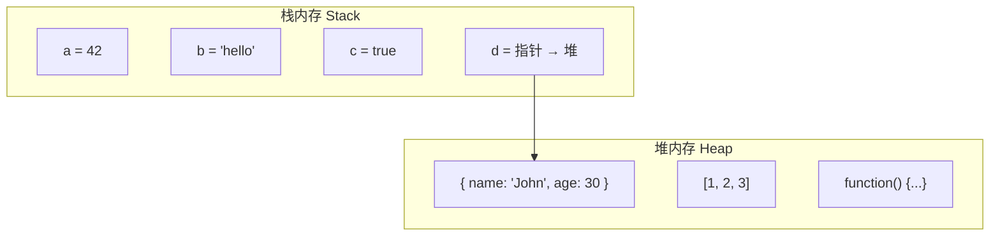
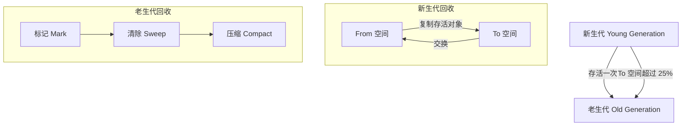

# JavaScript 数据类型与内存管理

## 数据类型

### 基本类型（Primitive Types）

| 类型 | 说明 | 示例 |
|------|------|------|
| `number` | 数字（整数、浮点数、NaN、Infinity） | `42`, `3.14`, `NaN` |
| `string` | 字符串 | `'hello'`, `"world"` |
| `boolean` | 布尔值 | `true`, `false` |
| `undefined` | 未定义 | `undefined` |
| `null` | 空值 | `null` |
| `symbol` | 唯一标识（ES6） | `Symbol('id')` |
| `bigint` | 大整数（ES2020） | `123n` |

### 引用类型（Reference Types）

| 类型 | 说明 |
|------|------|
| `Object` | 普通对象 |
| `Array` | 数组 |
| `Function` | 函数 |
| `Date` | 日期 |
| `RegExp` | 正则表达式 |
| `Map/Set` | ES6 新增 |
| `Promise` | 异步操作 |

### 类型判断

```typescript
// typeof - 判断基本类型
typeof 42           // 'number'
typeof 'hello'      // 'string'
typeof true         // 'boolean'
typeof undefined    // 'undefined'
typeof Symbol()     // 'symbol'
typeof null         // 'object' (历史遗留 bug)
typeof function(){} // 'function'

// instanceof - 判断引用类型
[] instanceof Array           // true
{} instanceof Object          // true
new Date() instanceof Date    // true

// Object.prototype.toString.call - 最准确
Object.prototype.toString.call(42)      // '[object Number]'
Object.prototype.toString.call('hello') // '[object String]'
Object.prototype.toString.call(null)    // '[object Null]'
Object.prototype.toString.call([])      // '[object Array]'
```

## 类型转换

### 显式转换

```typescript
// 转数字
Number('42')        // 42
Number('')          // 0
Number('abc')       // NaN
parseInt('42px')    // 42
parseFloat('3.14')  // 3.14

// 转字符串
String(42)          // '42'
(42).toString()     // '42'

// 转布尔值
Boolean(0)          // false
Boolean('')         // false
Boolean(null)       // false
Boolean(undefined)  // false
Boolean(NaN)        // false
Boolean(1)          // true
Boolean('hello')    // true
```

### 隐式转换（== 运算符）

```typescript
// 转为数字比较
'42' == 42          // true (字符串转数字)
true == 1           // true (布尔转数字)
false == 0          // true

// 转为字符串比较
null == undefined   // true (特殊规则)
null == 0           // false (不转换)

// === 严格相等（不转换）
'42' === 42         // false
null === undefined  // false
```

### 类型转换规则

| 原始值 | 转数字 | 转字符串 | 转布尔值 |
|--------|--------|----------|----------|
| `0` | `0` | `'0'` | `false` |
| `1` | `1` | `'1'` | `true` |
| `''` | `0` | `''` | `false` |
| `'hello'` | `NaN` | `'hello'` | `true` |
| `null` | `0` | `'null'` | `false` |
| `undefined` | `NaN` | `'undefined'` | `false` |
| `NaN` | `NaN` | `'NaN'` | `false` |
| `[]` | `0` | `''` | `true` |
| `{}` | `NaN` | `'[object Object]'` | `true` |

## 内存管理

### 栈内存与堆内存



| 特性 | 栈内存 | 堆内存 |
|------|--------|--------|
| **存储内容** | 基本类型、指针 | 引用类型 |
| **大小** | 固定、较小 | 动态、较大 |
| **访问速度** | 快 | 慢 |
| **生命周期** | 函数执行完自动释放 | 垃圾回收器管理 |
| **分配方式** | 静态分配 | 动态分配 |

### 浅拷贝与深拷贝

```typescript
// 浅拷贝：只复制第一层
const shallowCopy = (obj: any) => {
  if (Array.isArray(obj)) {
    return [...obj];
  }
  return { ...obj };
};

// 深拷贝：递归复制所有层
const deepCopy = (obj: any): any => {
  if (obj === null || typeof obj !== 'object') return obj;
  if (obj instanceof Date) return new Date(obj);
  if (obj instanceof RegExp) return new RegExp(obj);

  const copy = Array.isArray(obj) ? [] : {};
  for (const key in obj) {
    if (Object.prototype.hasOwnProperty.call(obj, key)) {
      copy[key] = deepCopy(obj[key]);
    }
  }
  return copy;
};

// JSON 序列化（有局限）
const jsonCopy = (obj: any) => JSON.parse(JSON.stringify(obj));
// 局限：无法处理函数、undefined、Symbol、循环引用、Date/RegExp 对象
```

### 垃圾回收机制



#### 新生代：Scavenge 算法

- 堆内存平分为 From 和 To 空间
- 存活对象从 From 复制到 To
- 交换 From 和 To，完成回收
- 适用：存活周期短的对象

#### 老生代：标记 - 清除（Mark-Sweep）

```typescript
// 伪代码
function markSweep() {
  // 1. 标记阶段：从根对象开始遍历，标记可达对象
  markFromRoots();

  // 2. 清除阶段：遍历堆内存，清除未标记对象
  sweep(HeapStart, HeapEnd);
}
```

**缺点**：产生内存碎片

#### 老生代：标记 - 压缩（Mark-Compact）

```typescript
// 伪代码
function markCompact() {
  // 1. 标记阶段
  markFromRoots();

  // 2. 压缩阶段：移动存活对象，消除碎片
  compact();

  // 3. 更新引用
  updateReferences();
}
```

**优点**：消除内存碎片

#### 引用计数法（不推荐）

```typescript
// 引用计数：跟踪每个值被引用的次数
let a = { name: 'John' };  // 引用次数 = 1
let b = a;                 // 引用次数 = 2
a = null;                  // 引用次数 = 1
b = null;                  // 引用次数 = 0，可回收
```

**问题**：循环引用无法回收

```typescript
let a = {};
let b = {};
a.ref = b;  // a 引用 b
b.ref = a;  // b 引用 a
// 即使 a、b 不再使用，引用次数都不为 0，无法回收
```

## 内存泄漏常见场景

| 场景 | 说明 | 解决方案 |
|------|------|----------|
| **全局变量** | 未声明的变量成为全局属性 | 使用 `let/const` |
| **定时器** | `setInterval` 未清除 | 组件卸载时 `clearInterval` |
| **事件监听** | 未移除的事件监听器 | 组件卸载时 `removeEventListener` |
| **闭包** | 闭包引用外部变量 | 长生命周期闭包中手动解除引用 |
| **DOM 引用** | 已删除 DOM 的引用 | 设置为 `null` |

## 最佳实践

```typescript
// 1. 长生命周期作用域中手动解除引用（局部变量无需此操作，函数返回后自动回收）
let cache = null;
function loadData() {
  cache = fetchLargeData();
}
function unloadData() {
  cache = null;  // 模块级变量不会自动回收，需手动解除引用
}

// 2. 使用 WeakMap/WeakSet
const weakCache = new WeakMap();
weakCache.set(obj, value);  // obj 被 GC 时，weakCache 中的条目自动移除

// 3. 避免全局变量
(function() {
  let temp = 'temporary';
  // 函数执行完，temp 自动回收
})();

// 4. 及时清理事件监听
useEffect(() => {
  const handler = () => console.log('click');
  window.addEventListener('click', handler);
  return () => window.removeEventListener('click', handler);
}, []);
```
