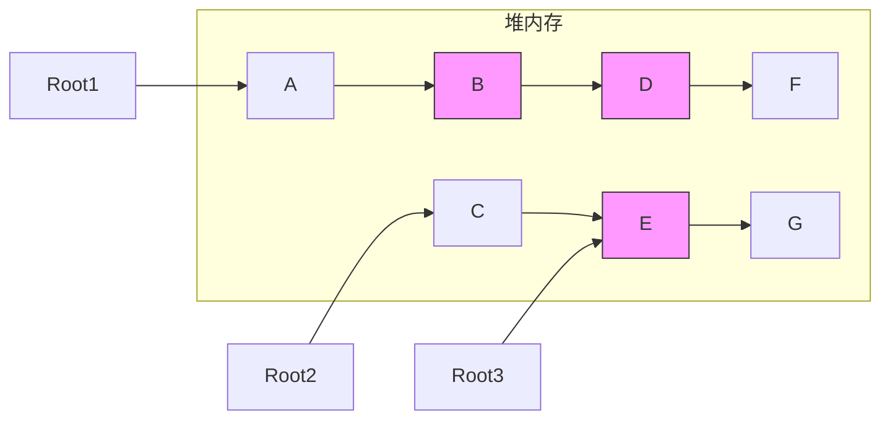
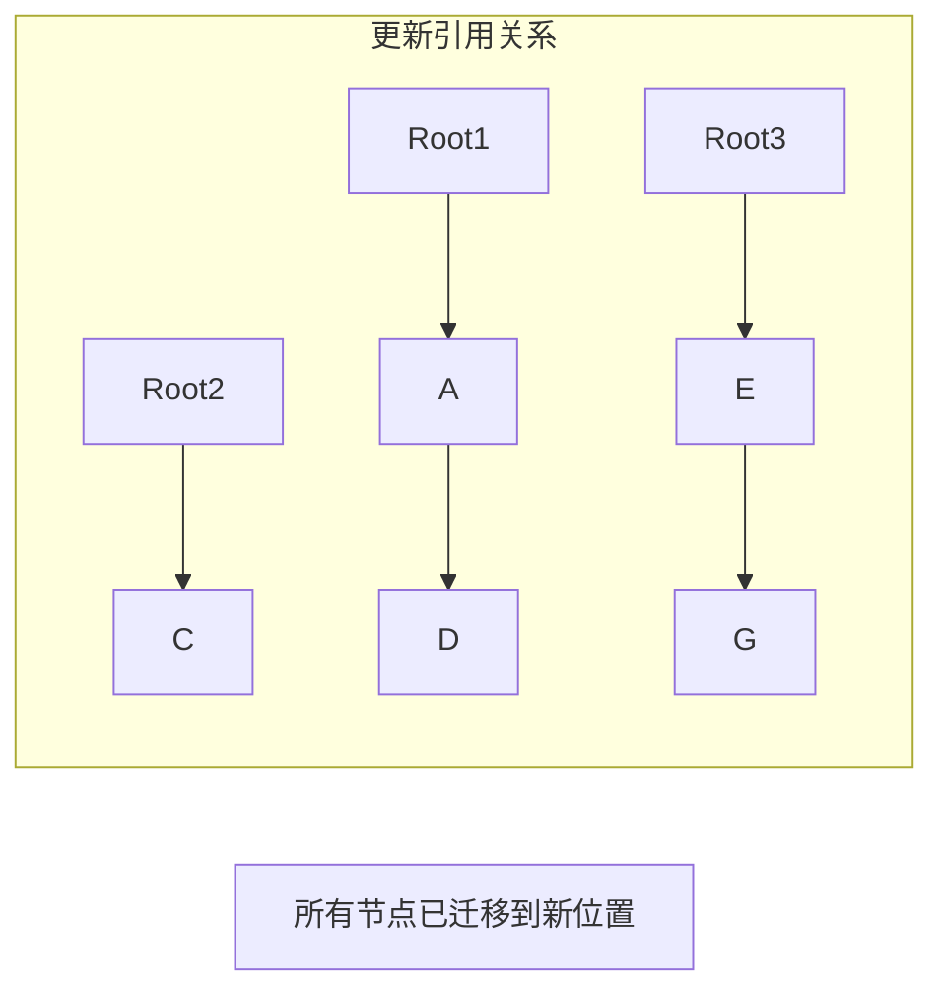
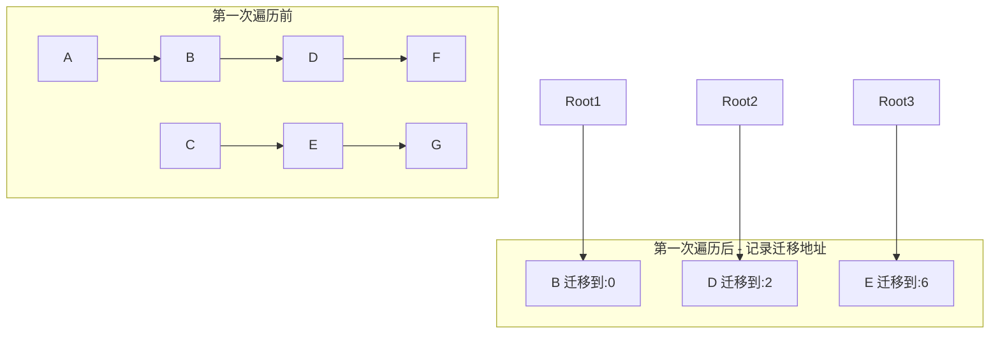
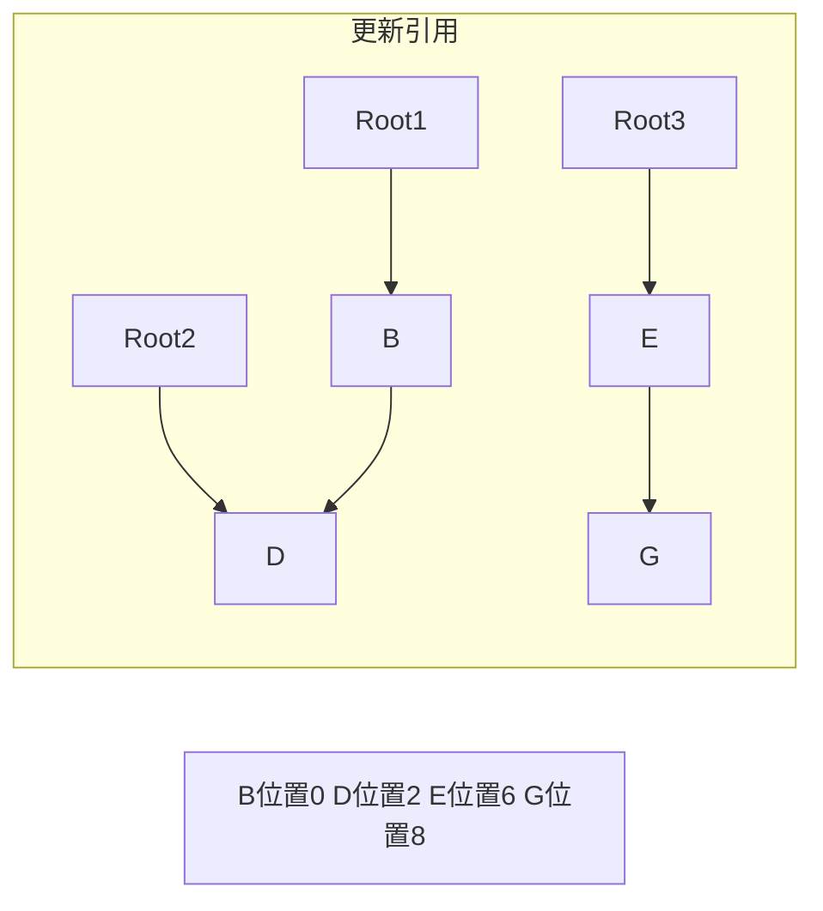
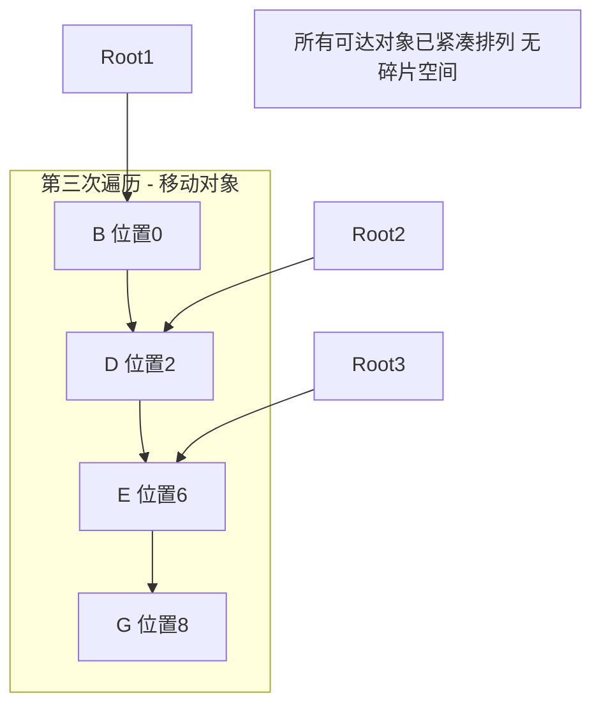

## javascript数据类型&内存管理机制

#### 一、javascript数据类型

javascript数据类型包含number,string,boolean,undefined,null,symbol这6种基本数据类型以及object,array两种复合数据类型

#### 二、内存管理机制

##### 栈内存&堆内存

javascript(后续简称js)内存分为栈、堆两种。其中栈内存中的变量一般是已知的且有范围上限，用于存放基本数据类型和指针；堆内存则用于存储复合类型。

##### 垃圾收集机制

堆内存分为两个部分：新生代和老生代。顾名思义新生代用于存储存活周期较短的对象，老生代存储存活周期较长的对象。新生代和老生代各自回收机制也是不一样的，下面分别介绍新生代和老生代的垃圾回收机制。

新生代采用Scavenge算法，实现中主要采用复制方式的方法--cheney算法，在新生代空间中平分成两部分，一部分是正在使用中的命名为from，另一部分是空闲空间命名为to，垃圾回收开始时会检查from空间中的存活的对象复制到to中，将死亡的对象进行销毁，然后将from和to空间互换，完成一次垃圾回收。

老生代主要采用标记清除(mark-sweep)和标记压缩(mark-compact)两种算法。先介绍下对象如何会存入老生代中：

1.当新生代中的对象经历了一次Scavenge之后还未被销毁则会存入老生代中

2.To 空间的对象占比大小超过 25 %。在这种情况下，为了不影响到内存分配，会将对象从新生代空间移到老生代空间中。

mark-sweep是将对象的状态进行标记，标记对象进入环境和离开环境状态，对离开环境的对象进行清除操作

mark-compact是将解决mark-sweep之后内存断断续续问题，将内存进行整合操作

还有一种引用计数法，这是一种不常见的垃圾收集策略，引用计数的含义是跟踪记录每个值被引用的次数。当声明了一个变量并将一个引用类型值赋给该变量时，则该值的引用次数就是1；如果同一个值又被赋给另一个变量，则该值的引用次数加1；如果包含对该值引用的变量又取得了另外一个值，则该值的引用次数减1。当该值的引用次数变为0时，则可以回收其占用的内存空间。当垃圾回收器下一次运行时，就会释放那些引用次数为0的值所占用的内存。面临的问题是循环引用。

然而，IE中有一部分对象并不是原生JavaScript对象，如BOM和DOM对象就是使用C++以COM（组件对象模型）对象的形式实现的，而COM对象的垃圾收集机制采用的就是引用计数策略，因此，即使IE的JavaScript引擎是使用标记清除策略实现的，但JavaScript访问的COM对象依然是基于引用计数策略的，也即是说，只要IE中涉及COM对象，就会存在循环引用的问题。

解决方式是手动解除相互引用。解除引用：一旦数据不再有用，最好通过将其设置为null来释放其引用。然而，解除一个值的引用不意味着自动回收该值所占用的内存，解除引用的真正作用是让值脱离执行环境，以便垃圾收集器下次运行时将其回收。

因此不推荐使用引用计数法，推荐标记清除法

##### 标记-清除算法:

collector：垃圾回收器。

mutation：除collector之外的部分，如：new(分配内存)、read(从内存读取内容)、write(写入内存)等。

mutator roots(mutator根对象)：mutator根对象一般指的是分配在堆内存之外，可以直接被mutator直接访问到的对象，一般是指静态/全局变量以及Thread-Local变量。

可达对象：从mutator根对象开始进行遍历，可以被访问到的对象都称为是可达对象。

算法原理：

1.mark：从mutator根对象开始遍历，将所有可访问到的对象，标记为可达对象(一般标记在对象header中)

2.sweep：从堆内存进行线性遍历，通过读取对象的header中的标记，将被标记的可达对象清除标记，没有被标记的对象进行回收

注意：Collector在进行标记和清除阶段时会将整个应用程序暂停(mutator)，等待标记清除结束后才会恢复应用程序的运行，这也是Stop-The-World这个单词的来历。

```c++
 //mutation操作 
 New():
    ref <- allocate()  //分配新的内存到ref指针
    if ref == null
       collect()  //内存不足，则触发垃圾收集
       ref <- allocate()
       if ref == null
          throw "Out of Memory"   //垃圾收集后仍然内存不足，则抛出Out of Memory错误
          return ref

 atomic collect():
    markFromRoots()
    sweep(HeapStart,HeapEnd)
   
 //标记根对象
 markFromRoots():
    worklist <- empty
    for each fld in Roots  //遍历所有mutator根对象
        ref <- *fld
        if ref != null && isNotMarked(ref)  //如果它是可达的而且没有被标记的，直接标记该对象并将其加到worklist中
           setMarked(ref)
           add(worklist,ref)
          mark()
 
 //深度标记
 mark():
    while not isEmpty(worklist)
          ref <- remove(worklist)  //将worklist的最后一个元素弹出，赋值给ref
          for each fld in Pointers(ref)  //遍历ref对象的所有指针域，如果其指针域(child)是可达的，直接标记其为可达对象并且将其加入worklist中
          //通过这样的方式来实现深度遍历，直到将该对象下面所有可以访问到的对象都标记为可达对象。
                child <- *fld
                if child != null && isNotMarked(child)
                   setMarked(child)
                   add(worklist,child)
 //清除阶段                
 sweep(start,end):
    scan <- start
   while scan < end
       if isMarked(scan)
          setUnMarked(scan)
      else
          free(scan)
      scan <- nextObject(scan)
```

缺点：

标记-清除算法的比较大的缺点就是垃圾收集后有可能会造成大量的内存碎片，像上面的图片所示，垃圾收集后内存中存在三个内存碎片，假设一个方格代表1个单位的内存，如果有一个对象需要占用3个内存单位的话，那么就会导致Mutator一直处于暂停状态，而Collector一直在尝试进行垃圾收集，直到Out of Memory。


##### 标记-压缩算法

目的：为了解决标记-清除带来的缺陷

###### Two-Finger算法

Two-Finger算法来自Edwards, 它在压缩阶段移动对象时是任意顺序移动的，它最适用于处理包含**固定大小**对象的内存区域。

Two-Finger算法是一个**Two Passes**算法，即需要遍历堆内存两次，第一次遍历是将堆末尾的可达对象移动到堆开始的空闲内存单元去，第二次遍历则需要修改可达对象的引用，因为一些可达对象已经被移动到别的地址，而原先引用它们的对象还指向着它们移动前的地址。

在这两次遍历过程中，首尾两个指针分别从堆的头尾两个位置向中间移动，直至两个指针相遇，由于它们的运动轨迹酷似两根手指向中间移动的轨迹，因此称为Two Finger算法。

第一次遍历伪代码：

```c++
compact():
    relocate(HeapStart,HeapEnd) //移动对象
    updateReferences(HeapStart,free) //更新引用

relocate(start,end)
    free <- start
    scan <- end
    
    while free < scan 
        //找到一个可以被释放的空间
        while isMarked(free)
            unsetMarked(free)
            free <- free + size(free)
        
        //找到一个可以移动的可达对象
        while not isMarked(scan) && scan > free
            scan <- scan - size(scan)
            
        if scan > free
            unsetMarked(scan)
            move(scan, free) //将scan位置的可达对象移动到free位置上
            *scan <- free //将可达对象移动后的位置写到原先可达对象处于的位置
            free <- free + size(free)
            scan <- scan - size(scan)
```



*图示：Two-Finger 算法第一次遍历 - 标记可达对象并计算迁移位置*

第二次遍历伪代码：

```c++
updateReferences(start,end)
    for each fld in Roots //先更新mutator根对象所引用的对象关系
        ref <- *fld
        if ref >= end
            *fld <- *ref //重新指向新位置
    scan <- start
    while scan < end
        for each fld in Pointers(scan) //更新可达对象的所有引用关系
            ref <- * fld
            if ref >= end 
                *fld <- *ref
        scan <- scan + size(scan)
```



*图示：Two-Finger 算法第二次遍历 - 更新所有引用指向新位置*

###### LISP2算法

Lisp2算法是一种应用更为广泛的压缩算法，它属于**滑动顺序**算法中的一种。它跟Two-Finger算法的不同还在于它可以处理不同大小的对象，而不再是固定大小的对象。同时，计算出来的可达对象的迁移地址需要额外的空间进行存储而不再是复写原先对象所在的位置。最后，Lips2算法需要进行3次堆内存的遍历。

第一次遍历：记录可达对象应该迁移的地址

```c++
compact():
    computeLocations(HeapStart,HeapEnd,HeapStart)
    updateReferences(HeapStart,HeapEnd)
    relocate(HeapStart,HeapEnd)
    
computeLocations(start,end,toRegion):
    scan <- start
    free <- toRegion
    while scan < end
        if isMarked(scan)
            forwardingAddress(scan) <- free
            free <- free + size(scan)
        scan <- scan + size(scan)
```



*图示：LISP2 算法第一次遍历 - 计算每个可达对象的迁移地址*

1. 指针free, scan同时指向堆起始位置，同时scan指针向堆尾移动，目的是要找到被标记的可达对象。
2. 找到可达对象后，在scan指针对应的位置分配一个额外的空间来存储该可达对象应该迁移到的地址 - 就是free指针指向的位置0，同时free指针向堆尾移动B对象大小的距离- free'指针指向的位置。最后scan指针继续往前走，直到寻找到下一个可达对象D - scan'指针指向的位置。
3. 同理，在可达对象D处分配一块空间来保存对象D应该迁移到的位置，由于B对象已经占用了2个内存单元，所以对象E的迁移地址是从位置2开始，也就是当前free指针指向的位置。
4. 指针free，scan继续向前移动。
5. 第一次遍历完后，所有的可达对象都有了对应的迁移地址，free指针指向位置9，因为所有的可达对象总共占了9个单元大小的空间。

第二次遍历：第二次遍历主要是修改对象间的引用关系，基本跟Two Finger算法的第二次遍历一样。

```c++
updateReferences(start,end):
    for each fld in Roots
        ref <- *fld
        if ref != null
            *fld <- forwardingAddress(ref)
    
    scan <- start
    while scan < end
        if isMarked(scan)
            for each fld in Pointers(scan)
                if *fld != null
                    *fld <- forwardingAddress(*fld)
        scan <- scan + size(scan)
```



*图示：LISP2 算法第二次遍历 - 修改所有对象的引用关系*

1. 修改根对象的引用关系，根对象1引用对象B，对象B的迁移地址为0，于是collector将根对象对B对象的引用指向它的迁移地址 - 位置0， 现在A对象所处的位置。
2. 同理，对于根对象2，3都执行同样的操作，将它们对其所引用的对象的引用修改为对应的它们所引用的对象的迁移地址。
3. 通过scan指针遍历堆内存，更新所有的可达对象对其引用对象的引用为其引用对象的迁移地址。比如说，对于可达对象B， 它引用了对象D，D的迁移地址是2，那么B直接将其对D对象的引用重新指向2这个位置。
4. 第二次遍历结束后的对象之间的引用关系。

第三次遍历：第三次遍历则是根据可达对象的迁移地址去移动可达对象，比如说可达对象B，它的迁移地址是0，那么就将其移动到位置0，同时去除可达对象的标记，以便下次垃圾收集。

```c++
relocate(start,end):
    scan <- start
    while scan < end
        if isMarked(scan)
            dest <- forwardingAddress(scan)
            move(scan,dest) //将可达对象从scan位置移动到dest位置
            unsetMarked(dest)
        scan <- scan + size(scan)
```




*图示：LISP2 算法第三次遍历 - 根据迁移地址移动对象，完成压缩*