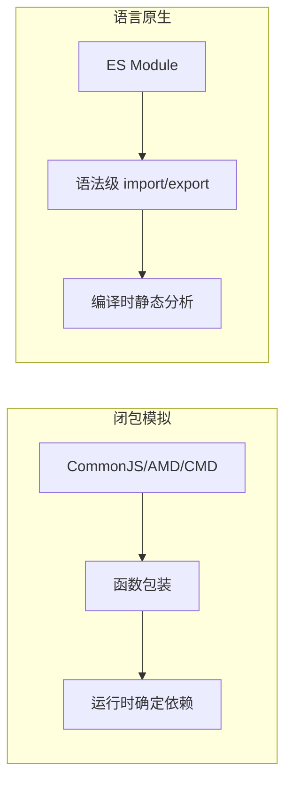
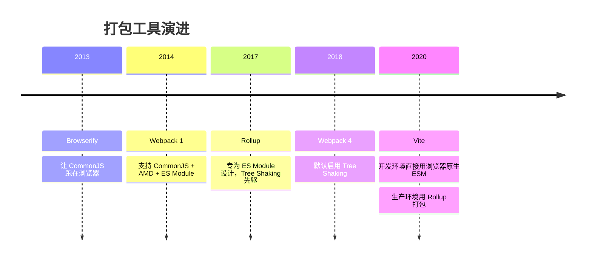
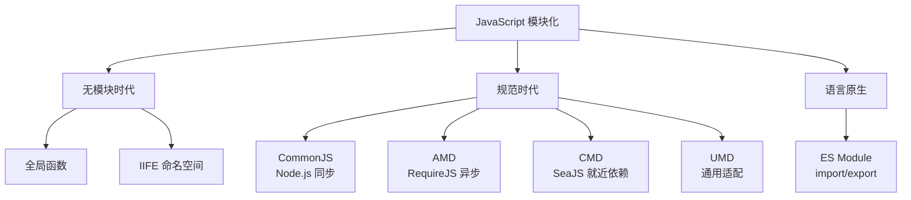

# JavaScript 模块化进化史

## 为什么需要模块化

早期 JavaScript 只有几十个文件、几百行代码，一个页面搞定一切。但随着前端应用越来越复杂，代码量爆炸式增长，**没有模块化**带来了三大问题：

| 问题 | 表现 |
|------|------|
| **命名冲突** | 多个脚本都定义 `utils`，后加载的覆盖先加载的 |
| **依赖混乱** | 文件 A 依赖 B，B 依赖 C，加载顺序错了就报错 |
| **无法复用** | 代码散落在全局，无法按需引入 |

模块化要解决的核心问题就两个：**隔离作用域**和**管理依赖**。

---

## 第一阶段：无模块时代（2005 以前）

### 全局函数

最原始的方式——直接在全局定义函数：

```typescript
// utils.js
function formatDate(date) {
  return date.toISOString()
}

// main.js
formatDate(new Date())  // 能用，但污染全局
```

所有变量和函数都挂在全局对象上，文件越多冲突越严重。

### IIFE（立即执行函数表达式）

用函数作用域模拟模块隔离：

```typescript
// utils.js
const Utils = (function () {
  let count = 0  // 私有变量，外部无法访问

  function formatDate(date) {
    return date.toISOString()
  }

  return {
    formatDate,
    getCount: () => count,
  }
})()

// main.js
Utils.formatDate(new Date())  // 通过命名空间访问
Utils.count  // undefined — 被隔离了
```

这就是**命名空间模式**——用一个全局对象（`Utils`）作为入口，内部变量通过闭包隐藏。

**优点**：零依赖，浏览器原生支持
**缺点**：依赖关系靠人工保证加载顺序，文件多了管理困难

---

## 第二阶段：CommonJS（2009）

### 背景

2009 年 Node.js 诞生，服务端 JS 需要文件系统访问、网络请求等能力，天然需要模块化。Ryan Dahl 选择了 **CommonJS** 规范。

### 核心语法

```typescript
// math.js
let PI = 3.14159

function add(a, b) {
  return a + b
}

module.exports = { add, PI }
```

```typescript
// main.js
const { add, PI } = require('./math.js')
console.log(add(1, 2))  // 3
```

### 实现原理

Node.js 在加载每个 `.js` 文件时，会把文件内容包裹在一个函数中执行：

```typescript
// 引擎实际执行的代码：
(function (exports, require, module, __filename, __dirname) {
  // 你的代码在这里
  let PI = 3.14159
  function add(a, b) { return a + b }
  module.exports = { add, PI }
})
```

所以 CommonJS 的"模块作用域"本质上是**函数作用域**——每个文件是一个闭包。

### 特点

| 特性 | 说明 |
|------|------|
| **同步加载** | `require()` 是同步的，读文件 → 执行 → 返回，服务端没问题 |
| **值拷贝** | 导出的是值的快照，源模块修改后导入方看不到变化 |
| **运行时确定** | `require()` 可以写在 `if` 里、函数里，路径可以动态拼接 |

```typescript
// CommonJS 可以动态 require
const moduleName = condition ? 'a.js' : 'b.js'
const mod = require(moduleName)  // ✅ 合法
```

### 局限

浏览器端无法使用——浏览器没有文件系统，`require()` 同步读文件会阻塞页面渲染。

---

## 第三阶段：AMD（2011）

### 背景

为了在浏览器端实现模块化，RequireJS 提出了 **AMD**（Asynchronous Module Definition）规范。核心思路：**异步加载，回调执行**。

### 核心语法

```typescript
// math.js
define([], function () {
  return {
    add: function (a, b) { return a + b },
  }
})

// main.js
define(['./math.js'], function (math) {
  console.log(math.add(1, 2))  // 3
})
```

### 特点

| 特性 | 说明 |
|------|------|
| **异步加载** | 模块通过 `<script>` 标签异步下载，不阻塞页面 |
| **依赖前置** | 依赖在 `define` 的第一个参数中声明，加载完才执行回调 |
| **浏览器友好** | 专为浏览器设计 |

### 缺点

语法啰嗦，每个模块都要包一层 `define`，依赖列表和回调参数要手动对齐：

```typescript
define(['a', 'b', 'c', 'd'], function (a, b, c, d) {
  // 依赖多了很难维护
})
```

---

## 第四阶段：CMD（2012）

### 背景

阿里玉伯开发的 SeaJS 提出了 **CMD**（Common Module Definition）规范，试图融合 CommonJS 的书写体验和 AMD 的异步加载。

### 核心语法

```typescript
// math.js
define(function (require, exports, module) {
  module.exports = {
    add: function (a, b) { return a + b },
  }
})

// main.js
define(function (require) {
  const math = require('./math.js')  // 就近依赖，像 CommonJS 一样写
  console.log(math.add(1, 2))
})
```

### AMD vs CMD 对比

| 对比项 | AMD（RequireJS） | CMD（SeaJS） |
|--------|-----------------|-------------|
| **依赖声明** | 前置声明 `define(['a'], ...)` | 就近依赖 `require('./a')` |
| **加载时机** | 提前加载所有依赖 | 执行到 `require` 时才加载 |
| **书写风格** | 偏函数式 | 偏 CommonJS |
| **代表库** | RequireJS | SeaJS |

CMD 的"就近依赖"让代码更直观，但"执行到才加载"意味着依赖的加载时机不可预测，不利于静态分析。

---

## 第五阶段：UMD（2013）

### 背景

CommonJS 和 AMD 互不兼容，库作者想同时支持 Node.js 和浏览器，于是出现了 **UMD**（Universal Module Definition）——一套代码兼容所有环境。

### 核心模式

```typescript
(function (root, factory) {
  if (typeof define === 'function' && define.amd) {
    // AMD
    define([], factory)
  } else if (typeof module === 'object' && module.exports) {
    // CommonJS
    module.exports = factory()
  } else {
    // 全局变量
    root.MyLib = factory()
  }
})(typeof self !== 'undefined' ? self : this, function () {
  return {
    add: function (a, b) { return a + b },
  }
})
```

UMD 本质上是**环境检测 + 适配**，通过判断 `define.amd`、`module.exports` 等特征选择导出方式。

**缺点**：模板代码冗长，每个库都要写一遍。

---

## 第六阶段：ES Module（2015）

### 背景

ES6（ES2015）终于在语言层面原生支持了模块化，`import`/`export` 成为标准语法。

### 核心语法

```typescript
// math.js
export const PI = 3.14159

export function add(a, b) {
  return a + b
}

// 默认导出
export default function multiply(a, b) {
  return a * b
}
```

```typescript
// main.js
import multiply, { add, PI } from './math.js'

console.log(add(1, 2))    // 3
console.log(multiply(3, 4))  // 12
```

### 与其他方案的本质区别



| 特性 | CommonJS | AMD/CMD | ES Module |
|------|----------|---------|-----------|
| **加载方式** | 同步 | 异步 | 静态（可异步） |
| **依赖确定时机** | 运行时 | 运行时 | **编译时** |
| **导出方式** | 值拷贝 | 值拷贝 | **实时绑定** |
| **Tree Shaking** | 不支持 | 不支持 | **支持** |
| **循环依赖** | 可能拿到不完整导出 | 不可靠 | **实时引用，可靠** |

### 实时绑定 vs 值拷贝

这是 ES Module 最重要的特性之一：

```typescript
// counter.js
export let count = 0
export function inc() { count++ }
```

```typescript
// CommonJS — 值拷贝
const { count, inc } = require('./counter.js')
inc()
console.log(count)  // 0 ❌ 拷贝的是旧值

// ES Module — 实时绑定
import { count, inc } from './counter.js'
inc()
console.log(count)  // 1 ✅ 实时同步
```

### 静态分析带来的好处

因为 `import`/`export` 在编译时就能确定，打包器可以做很多优化：

```typescript
// utils.js
export function used() { console.log('used') }
export function unused() { console.log('unused') }

// main.js
import { used } from './utils.js'
// 打包时 unused() 会被直接删除 — Tree Shaking
```

---

## 打包工具的演进

模块化方案的发展也推动了打包工具的演进：



| 工具 | 核心思路 |
|------|----------|
| **Browserify** | 把 CommonJS 模块打包成一个文件，模拟 `require` |
| **Webpack** | 万能打包器，支持所有模块格式，生态最丰富 |
| **Rollup** | 专注 ES Module，输出干净，适合库开发 |
| **Vite** | 开发时利用浏览器原生 ESM，无需打包，秒级启动 |

---

## 各方案总结



| 阶段 | 方案 | 作用域隔离 | 依赖管理 | 适用场景 |
|------|------|-----------|---------|---------|
| 无模块 | IIFE | 闭包模拟 | 手动 | 简单脚本 |
| 规范 | CommonJS | 函数包装 | `require` 同步 | Node.js |
| 规范 | AMD | 函数包装 | `define` 异步 | 浏览器 |
| 规范 | CMD | 函数包装 | `require` 就近 | 浏览器 |
| 规范 | UMD | 环境检测 | 兼容多端 | 库发布 |
| 原生 | ES Module | 模块作用域 | `import` 静态 | 通用 |

---

## 常见面试题

### 1. CommonJS 和 ES Module 的区别？

| 对比项 | CommonJS | ES Module |
|--------|----------|-----------|
| 加载时机 | 运行时 | 编译时（静态） |
| 加载方式 | 同步 | 异步（可静态分析） |
| 导出值 | 值的拷贝 | 实时绑定 |
| `this` 指向 | `module.exports` | `undefined` |
| Tree Shaking | 不支持 | 支持 |

### 2. 为什么 ES Module 能支持 Tree Shaking 而 CommonJS 不能？

ES Module 的 `import`/`export` 是静态语法，打包器在编译时就能确定哪些导出被使用了。CommonJS 的 `module.exports` 是运行时动态赋值的对象，打包器无法静态分析：

```typescript
// CommonJS — 无法静态分析
module.exports = condition ? { a } : { b }

// ES Module — 静态可分析
export { a }  // 打包器能确定 a 是否被引用
```

### 3. ES Module 的循环依赖怎么处理？

ES Module 通过**实时绑定**解决循环依赖。导入的是引用而非值拷贝，即使模块还没执行完，引用已经建立：

```typescript
// a.js
import { b } from './b.js'
export function a() { return 'a' }
export function callB() { return b() }

// b.js
import { a } from './a.js'
export function b() { return 'b' }
export function callA() { return a() }
```

CommonJS 的循环依赖则可能拿到不完整的 `module.exports`（只有已执行部分的导出）。

### 4. 浏览器原生支持 ES Module 了吗？

支持。现代浏览器通过 `<script type="module">` 原生加载 ES Module：

```html
<script type="module" src="./main.js"></script>
```

特点：
- 默认**延迟执行**（类似 `defer`）
- 默认**严格模式**
- 支持 `import`/`export`
- 支持 `import()` 动态导入（返回 Promise）
