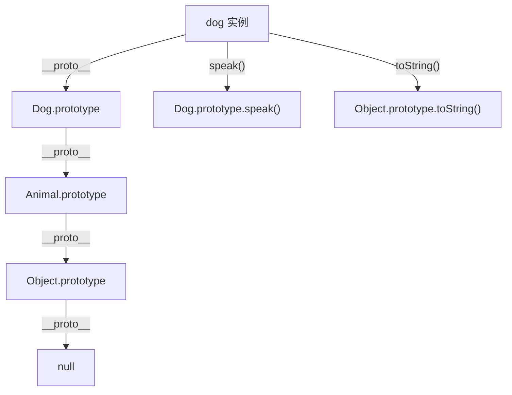
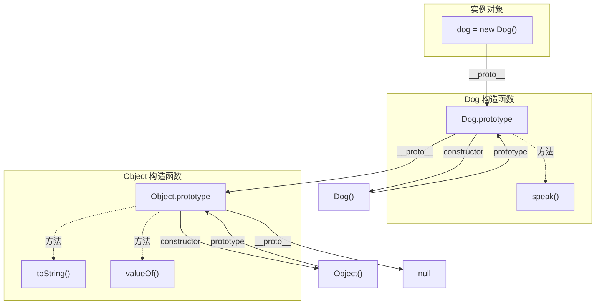

# JavaScript 原型与继承

## 原型链

### 核心概念

每个对象都有一个隐藏属性 `[[Prototype]]`（可通过 `__proto__` 或 `Object.getPrototypeOf()` 访问），指向它的原型对象。当访问对象的属性时，如果对象本身没有该属性，会沿着原型链向上查找。



### 原型链查找

```typescript
function Dog(name: string) {
  this.name = name;
}

Dog.prototype.speak = function() {
  return `${this.name} barks`;
};

const dog = new Dog('Buddy');

dog.name;           // 'Buddy'（自身属性）
dog.speak();        // 'Buddy barks'（原型链查找）
dog.toString();     // '[object Object]'（继续向上查找到 Object.prototype）
```

### 关键属性

| 属性 | 说明 |
|------|------|
| `prototype` | 构造函数的属性，指向原型对象 |
| `__proto__` | 实例的属性，指向构造函数的 `prototype`（不推荐使用） |
| `Object.getPrototypeOf()` | 获取对象的原型（推荐） |
| `Object.setPrototypeOf()` | 设置对象的原型 |
| `hasOwnProperty()` | 判断属性是否是自身的（非继承） |

```typescript
const obj = { a: 1 };

obj.hasOwnProperty('a');  // true
obj.hasOwnProperty('toString');  // false（继承自 Object.prototype）

'a' in obj;  // true（包括继承属性）
'toString' in obj;  // true
```

---

## 继承方式

### 1. 原型链继承

```typescript
function Parent() {
  this.name = 'Parent';
  this.colors = ['red', 'blue'];
}

Parent.prototype.getName = function() {
  return this.name;
};

function Child() {
  this.type = 'Child';
}

// 核心：将子类的 prototype 指向父类的实例
Child.prototype = new Parent();
Child.prototype.constructor = Child;

const child1 = new Child();
const child2 = new Child();

child1.colors.push('green');
console.log(child2.colors);  // ['red', 'blue', 'green']（引用类型共享问题）
```

**优点**：简单，父类方法可复用

**缺点**：
- 引用类型属性被所有实例共享
- 创建子类实例时无法向父类传参

---

### 2. 构造函数继承（经典继承）

```typescript
function Parent(name: string) {
  this.name = name;
  this.colors = ['red', 'blue'];
}

Parent.prototype.getName = function() {
  return this.name;
};

function Child(name: string, age: number) {
  // 核心：调用父类构造函数
  Parent.call(this, name);
  this.age = age;
}

const child1 = new Child('John', 18);
const child2 = new Child('Jane', 20);

child1.colors.push('green');
console.log(child1.colors);  // ['red', 'blue', 'green']
console.log(child2.colors);  // ['red', 'blue']（不共享）

console.log(child1.getName());  // TypeError（无法继承父类原型方法）
```

**优点**：
- 解决了引用类型共享问题
- 可以向父类传参

**缺点**：
- 无法继承父类原型方法
- 方法无法复用

---

### 3. 组合继承（原型链 + 构造函数）

```typescript
function Parent(name: string) {
  this.name = name;
  this.colors = ['red', 'blue'];
}

Parent.prototype.getName = function() {
  return this.name;
};

function Child(name: string, age: number) {
  Parent.call(this, name);  // 第二次调用
  this.age = age;
}

Child.prototype = new Parent();  // 第一次调用
Child.prototype.constructor = Child;
Child.prototype.getAge = function() {
  return this.age;
};

const child = new Child('John', 18);
console.log(child.getName());  // 'John'
console.log(child.getAge());   // 18
```

**优点**：结合了两种方式的优点

**缺点**：
- 父类构造函数被调用两次
- 原型上有不必要的父类实例属性

---

### 4. 原型式继承

```typescript
function createObject(o: any): any {
  function F() {}
  F.prototype = o;
  return new F();
}

// ES5 提供了 Object.create()
const parent = {
  name: 'Parent',
  colors: ['red', 'blue'],
};

const child1 = Object.create(parent);
const child2 = Object.create(parent);

child1.colors.push('green');
console.log(child2.colors);  // ['red', 'blue', 'green']（引用类型共享）
```

**优点**：简单

**缺点**：引用类型共享

---

### 5. 寄生式继承

```typescript
function createAnother(original: any): any {
  const clone = Object.create(original);
  clone.sayHi = function() {
    console.log('Hi');
  };
  return clone;
}

const person = {
  name: 'John',
  friends: ['Jane', 'Bob'],
};

const anotherPerson = createAnother(person);
anotherPerson.sayHi();  // 'Hi'
```

**优点**：在原型式基础上增强对象

**缺点**：引用类型共享，方法无法复用

---

### 6. 寄生组合式继承（最佳实践）

```typescript
function inheritPrototype(child: Function, parent: Function): void {
  const prototype = Object.create(parent.prototype);
  prototype.constructor = child;
  child.prototype = prototype;
}

function Parent(name: string) {
  this.name = name;
  this.colors = ['red', 'blue'];
}

Parent.prototype.getName = function() {
  return this.name;
};

function Child(name: string, age: number) {
  Parent.call(this, name);  // 只调用一次
  this.age = age;
}

// 核心：只继承原型，不创建父类实例
inheritPrototype(Child, Parent);

Child.prototype.getAge = function() {
  return this.age;
};

const child = new Child('John', 18);
console.log(child.getName());  // 'John'
console.log(child.getAge());   // 18
```

**优点**：
- 只调用一次父类构造函数
- 原型链保持不变
- 是最理想的继承方式

---

### 7. ES6 Class 继承

```typescript
class Parent {
  name: string;
  colors: string[];

  constructor(name: string) {
    this.name = name;
    this.colors = ['red', 'blue'];
  }

  getName(): string {
    return this.name;
  }
}

class Child extends Parent {
  age: number;

  constructor(name: string, age: number) {
    super(name);  // 必须调用 super
    this.age = age;
  }

  getAge(): number {
    return this.age;
  }
}

const child = new Child('John', 18);
console.log(child.getName());  // 'John'
console.log(child.getAge());   // 18
```

**本质**：ES6 Class 是寄生组合式继承的语法糖

```typescript
// class 继承等价于
function Child(name, age) {
  Parent.call(this, name);
  this.age = age;
}

Child.prototype = Object.create(Parent.prototype);
Child.prototype.constructor = Child;
```

---

## 继承方式对比

| 方式 | 引用类型共享 | 可传参 | 方法复用 | 调用次数 | 推荐度 |
|------|------------|--------|---------|---------|--------|
| **原型链** | ❌ | ❌ | ✅ | 1 | ⭐ |
| **构造函数** | ✅ | ✅ | ❌ | 1 | ⭐⭐ |
| **组合继承** | ✅ | ✅ | ✅ | 2 | ⭐⭐⭐ |
| **原型式** | ❌ | ❌ | ❌ | 1 | ⭐ |
| **寄生式** | ❌ | ❌ | ❌ | 1 | ⭐ |
| **寄生组合式** | ✅ | ✅ | ✅ | 1 | ⭐⭐⭐⭐⭐ |
| **ES6 Class** | ✅ | ✅ | ✅ | 1 | ⭐⭐⭐⭐⭐ |

---

## 原型链图解



---

## 常见面试题

### 1. 如何判断一个对象的原型链上是否有某个属性？

```typescript
function hasPrototypeProperty(obj: any, prop: string): boolean {
  return prop in obj && !obj.hasOwnProperty(prop);
}
```

### 2. 如何创建一个没有原型的对象？

```typescript
const obj = Object.create(null);
// obj 没有 __proto__，不会继承任何方法
```

### 3. `instanceof` 的原理是什么？

```typescript
function myInstanceof(instance: any, constructor: Function): boolean {
  let proto = Object.getPrototypeOf(instance);
  while (proto !== null) {
    if (proto === constructor.prototype) return true;
    proto = Object.getPrototypeOf(proto);
  }
  return false;
}
```

### 4. 如何实现一个简单的 `new`？

```typescript
function myNew(constructor: Function, ...args: any[]): any {
  // 1. 创建空对象，原型指向构造函数的 prototype
  const obj = Object.create(constructor.prototype);

  // 2. 执行构造函数，绑定 this
  const result = constructor.apply(obj, args);

  // 3. 返回对象（如果构造函数返回对象则返回该对象）
  return result instanceof Object ? result : obj;
}
```
