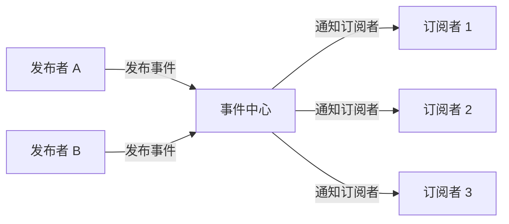
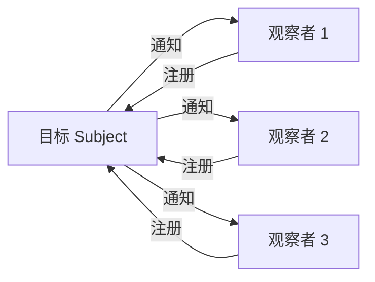
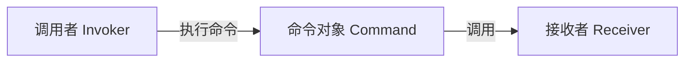

# JavaScript 设计模式

## 发布订阅模式（Publish-Subscribe）

### 核心概念

发布者和订阅者**不直接通信**，通过**事件中心**（消息队列）解耦。



### 实现

```typescript
class EventEmitter {
  private events: Map<string, Function[]> = new Map();

  // 订阅
  on(event: string, callback: Function): this {
    const callbacks = this.events.get(event) || [];
    callbacks.push(callback);
    this.events.set(event, callbacks);
    return this;
  }

  // 取消订阅
  off(event: string, callback?: Function): this {
    if (!callback) {
      this.events.delete(event);
    } else {
      const callbacks = this.events.get(event) || [];
      const index = callbacks.indexOf(callback);
      if (index > -1) {
        callbacks.splice(index, 1);
      }
    }
    return this;
  }

  // 发布
  emit(event: string, ...args: any[]): boolean {
    const callbacks = this.events.get(event);
    if (!callbacks || callbacks.length === 0) return false;
    callbacks.forEach(cb => cb.apply(this, args));
    return true;
  }

  // 一次性订阅
  once(event: string, callback: Function): this {
    const wrapper = (...args: any[]) => {
      callback.apply(this, args);
      this.off(event, wrapper);
    };
    return this.on(event, wrapper);
  }
}

// 使用示例
const emitter = new EventEmitter();

const handler = (msg: string) => console.log(`收到：${msg}`);

emitter.on('message', handler);
emitter.emit('message', 'Hello');  // 收到：Hello
emitter.off('message', handler);
emitter.emit('message', 'World');  // 无输出
```

### 应用场景

- **Vue 事件总线**：`$on`、`$emit`、`$off`
- **Node.js EventEmitter**：流、HTTP 服务器
- **Redux/Vuex**：状态变化通知
- **WebSocket 消息分发**

---

## 观察者模式（Observer）

### 核心概念

观察者**直接订阅**目标对象，目标对象状态变化时**主动通知**所有观察者。



### 实现

```typescript
interface Observer {
  update(state: any): void;
}

class Subject {
  private observers: Observer[] = [];
  private state: any;

  getState(): any {
    return this.state;
  }

  setState(state: any): void {
    this.state = state;
    this.notify();
  }

  subscribe(observer: Observer): void {
    this.observers.push(observer);
  }

  unsubscribe(observer: Observer): void {
    const index = this.observers.indexOf(observer);
    if (index > -1) {
      this.observers.splice(index, 1);
    }
  }

  notify(): void {
    this.observers.forEach(observer => observer.update(this.state));
  }
}

// 使用示例
class Logger implements Observer {
  update(state: any) {
    console.log(`状态变化：${state}`);
  }
}

const subject = new Subject();
const logger = new Logger();

subject.subscribe(logger);
subject.setState('new state');  // 状态变化：new state
```

### 发布订阅 vs 观察者

| 维度 | 发布订阅 | 观察者 |
|------|---------|--------|
| **耦合度** | 完全解耦（通过事件中心） | 松耦合（直接订阅） |
| **通信方式** | 发布者 → 事件中心 → 订阅者 | 目标 → 观察者 |
| **灵活性** | 高（可动态添加/移除事件） | 中（需实现接口） |
| **典型应用** | EventEmitter、消息队列 | MVC、响应式系统 |

---

## 单例模式（Singleton）

### 核心概念

确保一个类**只有一个实例**，并提供全局访问点。

### 实现

```typescript
class Singleton {
  private static instance: Singleton | null = null;
  private name: string;

  private constructor(name: string) {
    this.name = name;
  }

  static getInstance(name?: string): Singleton {
    if (!Singleton.instance) {
      Singleton.instance = new Singleton(name || 'default');
    }
    return Singleton.instance;
  }

  getName(): string {
    return this.name;
  }
}

// 使用示例
const s1 = Singleton.getInstance('first');
const s2 = Singleton.getInstance('second');
console.log(s1 === s2);  // true
console.log(s1.getName());  // 'first'
```

### 应用场景

- **全局状态管理**：Redux Store、Vuex Store
- **数据库连接池**
- **日志记录器**
- **配置管理器**

---

## 工厂模式（Factory）

### 核心概念

定义创建对象的接口，让子类决定实例化哪个类。

### 实现

```typescript
interface Product {
  use(): void;
}

class ConcreteProductA implements Product {
  use() {
    console.log('Using Product A');
  }
}

class ConcreteProductB implements Product {
  use() {
    console.log('Using Product B');
  }
}

type ProductType = 'A' | 'B';

class Factory {
  static createProduct(type: ProductType): Product {
    switch (type) {
      case 'A':
        return new ConcreteProductA();
      case 'B':
        return new ConcreteProductB();
      default:
        throw new Error(`Unknown product type: ${type}`);
    }
  }
}

// 使用示例
const productA = Factory.createProduct('A');
productA.use();  // Using Product A
```

### 应用场景

- **Vue 组件创建**
- **HTTP 请求封装**（axios 实例）
- **数据库驱动选择**

---

## 策略模式（Strategy）

### 核心概念

定义一系列算法，把它们封装起来，并且使它们可相互替换。

### 实现

```typescript
interface Strategy {
  execute(a: number, b: number): number;
}

class AddStrategy implements Strategy {
  execute(a: number, b: number): number {
    return a + b;
  }
}

class MultiplyStrategy implements Strategy {
  execute(a: number, b: number): number {
    return a * b;
  }
}

class Context {
  private strategy: Strategy;

  constructor(strategy: Strategy) {
    this.strategy = strategy;
  }

  setStrategy(strategy: Strategy): void {
    this.strategy = strategy;
  }

  executeStrategy(a: number, b: number): number {
    return this.strategy.execute(a, b);
  }
}

// 使用示例
const context = new Context(new AddStrategy());
console.log(context.executeStrategy(2, 3));  // 5

context.setStrategy(new MultiplyStrategy());
console.log(context.executeStrategy(2, 3));  // 6
```

### 应用场景

- **表单验证**（不同验证规则）
- **排序算法**（不同排序策略）
- **支付方式**（支付宝、微信、银联）

---

## 装饰器模式（Decorator）

### 核心概念

动态地给对象添加一些额外的职责，不改变原有接口。

### 实现

```typescript
interface Component {
  operation(): string;
}

class ConcreteComponent implements Component {
  operation(): string {
    return 'ConcreteComponent';
  }
}

class Decorator implements Component {
  protected component: Component;

  constructor(component: Component) {
    this.component = component;
  }

  operation(): string {
    return this.component.operation();
  }
}

class ConcreteDecoratorA extends Decorator {
  operation(): string {
    return `DecoratorA(${this.component.operation()})`;
  }
}

class ConcreteDecoratorB extends Decorator {
  operation(): string {
    return `DecoratorB(${this.component.operation()})`;
  }
}

// 使用示例
const component = new ConcreteComponent();
const decorated = new ConcreteDecoratorB(new ConcreteDecoratorA(component));
console.log(decorated.operation());  // DecoratorB(DecoratorA(ConcreteComponent))
```

### 应用场景

- **React 高阶组件（HOC）**
- **Vue 混入（Mixin）**
- **日志记录、性能监控**

---

## 命令模式（Command）

### 核心概念

将**请求封装为对象**，使请求的发送者和接收者解耦。每个命令对象包含执行操作所需的全部信息，支持撤销、排队、日志等扩展能力。



### 实现

```typescript
// 接收者：真正执行操作的对象
class Light {
  turnOn(): void {
    console.log('灯亮了');
  }
  turnOff(): void {
    console.log('灯灭了');
  }
}

// 命令接口
interface Command {
  execute(): void;
  undo(): void;
}

// 具体命令
class LightOnCommand implements Command {
  constructor(private light: Light) {}
  execute() { this.light.turnOn(); }
  undo() { this.light.turnOff(); }
}

class LightOffCommand implements Command {
  constructor(private light: Light) {}
  execute() { this.light.turnOff(); }
  undo() { this.light.turnOn(); }
}

// 调用者：触发命令，不关心具体操作
class RemoteControl {
  private history: Command[] = [];

  press(command: Command): void {
    command.execute();
    this.history.push(command);
  }

  undo(): void {
    const cmd = this.history.pop();
    cmd?.undo();
  }
}

// 使用示例
const light = new Light();
const remote = new RemoteControl();

remote.press(new LightOnCommand(light));   // 灯亮了
remote.press(new LightOffCommand(light));  // 灯灭了
remote.undo();                              // 灯亮了（撤销上一步）
```

### 应用场景

- **撤销/重做**：编辑器、绘图工具
- **宏命令**：批量操作组合
- **任务队列**：命令排队执行
- **前端按钮绑定**：按钮不直接绑定业务逻辑，而是绑定命令对象

---

## 设计模式对比

| 模式 | 目的 | 核心思想 | 典型应用 |
|------|------|---------|---------|
| **发布订阅** | 解耦通信 | 通过事件中心传递消息 | EventEmitter、消息队列 |
| **观察者** | 状态同步 | 目标主动通知观察者 | MVC、响应式系统 |
| **单例** | 控制实例数量 | 全局唯一实例 | Store、连接池 |
| **工厂** | 创建对象 | 封装创建逻辑 | 组件创建、请求封装 |
| **策略** | 算法替换 | 封装算法族 | 验证、排序、支付 |
| **装饰器** | 动态扩展 | 包装原有对象 | HOC、Mixin |
| **命令** | 请求封装 | 命令对象封装操作 | 撤销/重做、任务队列 |
