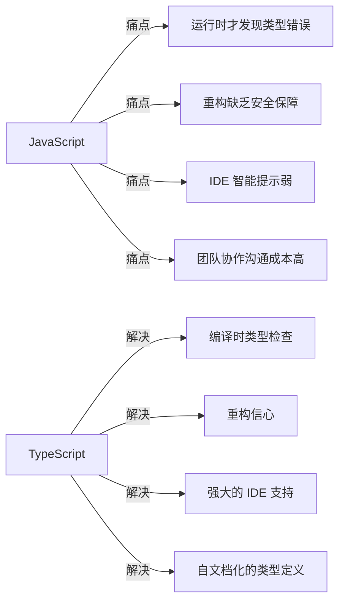
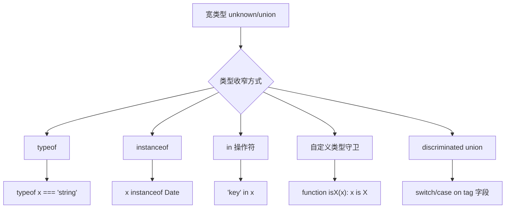
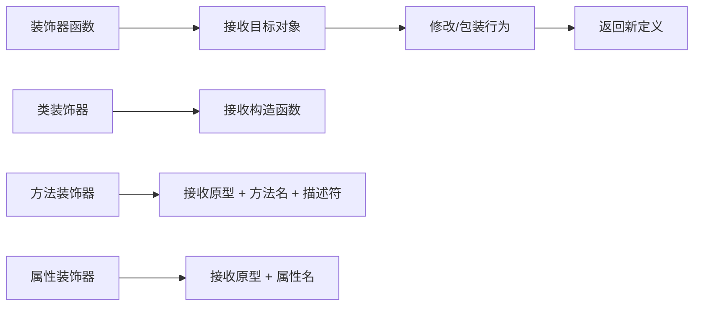

# TypeScript 核心

## 为什么需要 TypeScript



| 维度 | JavaScript | TypeScript |
|------|-----------|------------|
| 类型检查 | 运行时 | 编译时 |
| 错误发现 | 上线后 | 编码时 |
| 重构 | 全局搜索替换 | 类型系统保障 |
| 文档 | 靠注释 | 类型即文档 |
| 学习成本 | 低 | 中等 |

## 类型系统

### 基础类型

| 类型 | 说明 | 示例 |
|------|------|------|
| `string` | 字符串 | `"hello"`, `` `hi ${name}` `` |
| `number` | 数字（整数/浮点） | `42`, `3.14` |
| `boolean` | 布尔 | `true`, `false` |
| `null` | 空值 | `null` |
| `undefined` | 未定义 | `undefined` |
| `symbol` | 唯一标识 | `Symbol('id')` |
| `bigint` | 大整数 | `123n` |
| `void` | 无返回值 | `function(): void {}` |
| `never` | 永不存在的值 | 抛出异常、死循环 |
| `unknown` | 未知类型（安全） | 需要类型收窄后才能使用 |
| `any` | 任意类型（关闭检查） | 尽量不用 |

```typescript
// unknown vs any
let u: unknown = "hello";
// u.length;  // 报错：unknown 不能直接访问属性
if (typeof u === "string") {
  u.length;  // OK：类型收窄后
}

let a: any = "hello";
a.length;  // OK：any 跳过所有检查（危险）
```

### 类型注解与推断

```typescript
// 显式注解
let count: number = 42;
let name: string = "TypeScript";

// 类型推断（TS 自动推导）
let x = 42;        // 推断为 number
let arr = [1, 2];  // 推断为 number[]

// 函数类型
const add = (a: number, b: number): number => a + b;

// 可选参数、默认参数、剩余参数
function greet(name: string, age?: number, prefix = "Hello", ...rest: string[]) {}
```

### 对象类型

```typescript
// 方式一：对象字面量类型
let user: { name: string; age: number } = { name: "John", age: 30 };

// 方式二：interface（推荐用于对象结构）
interface User {
  name: string;
  age: number;
  email?: string;       // 可选属性
  readonly id: number;  // 只读属性
}

// 方式三：type 别名（适用于所有类型）
type Point = { x: number; y: number };

// interface vs type
// interface 支持声明合并，适合定义对象结构
// type 支持联合、交叉、映射等高级类型
```

### 数组与元组

```typescript
// 数组
let nums: number[] = [1, 2, 3];
let strs: Array<string> = ["a", "b"];  // 泛型写法

// 元组（固定长度和类型的数组）
let tuple: [string, number] = ["hello", 42];
tuple[0];  // string
tuple[1];  // number

// 命名元组（TS 4.0+）
type Pair = [name: string, age: number];
```

## 接口与类型别名

### interface

```typescript
interface Animal {
  name: string;
  speak(): void;
}

interface Dog extends Animal {
  breed: string;
}

// 声明合并（同名 interface 自动合并）
interface Window {
  myCustomProp: string;
}
interface Window {
  anotherProp: number;
}
// 最终 Window 同时拥有两个属性
```

### type 别名

```typescript
// 基本类型别名
type ID = string | number;

// 联合类型
type Status = "success" | "error" | "loading";

// 交叉类型
type Admin = User & { role: "admin" };

// 映射类型
type Readonly<T> = { readonly [K in keyof T]: T[K] };

// 条件类型
type IsString<T> = T extends string ? true : false;

// 模板字面量类型
type EventName = `on${Capitalize<string>}`;  // "onClick" | "onSubmit" | ...
```

### interface vs type 选择

| 场景 | 推荐 |
|------|------|
| 定义对象结构 | `interface` |
| 需要声明合并 | `interface` |
| 联合/交叉类型 | `type` |
| 映射/条件类型 | `type` |
| 基本类型别名 | `type` |

## 泛型

### 核心思想

泛型 = **类型参数化**，让代码在保持类型安全的同时具备复用性。

```typescript
// 不使用泛型：丢失类型信息
function firstElement(arr: any[]): any {
  return arr[0];
}
const result = firstElement([1, 2, 3]);  // result: any（类型丢失）

// 使用泛型：保留类型信息
function firstElement<T>(arr: T[]): T {
  return arr[0];
}
const result = firstElement([1, 2, 3]);  // result: number（类型保留）
```

### 泛型约束

```typescript
// extends 约束
interface HasLength {
  length: number;
}

function logLength<T extends HasLength>(arg: T): T {
  console.log(arg.length);
  return arg;
}

logLength("hello");      // OK: string 有 length
logLength([1, 2, 3]);    // OK: array 有 length
// logLength(42);        // 报错：number 没有 length
```

### 泛型类与接口

```typescript
// 泛型接口
interface Repository<T> {
  getAll(): T[];
  getById(id: number): T | undefined;
  create(item: T): void;
}

// 泛型类
class Stack<T> {
  private items: T[] = [];
  push(item: T): void { this.items.push(item); }
  pop(): T | undefined { return this.items.pop(); }
}

const numStack = new Stack<number>();
numStack.push(42);
```

## 函数重载与 this 类型

### 函数重载（与 Java 不同：只能有一个实现）

TS 的函数重载 = **多个"重载签名"（对外门面）+ 1 个"实现签名"（函数本体）**。
和 Java 最大的区别：TS **不允许写多个函数体**，实现逻辑只能有一份，靠重载签名声明"同一函数能接受的多种参数形状"，函数体内再自己分派。

```typescript
// 重载签名：只声明不写函数体，对外可见
function format(input: string): string;
function format(input: number): string;
// 实现签名：真正的函数体，参数放宽到能覆盖所有重载；不对外可见
function format(input: string | number): string {
  if (typeof input === "string") return input.trim();
  return input.toFixed(2);
}

format(" hi ");   // ✅ 命中 string 重载
format(3.14159);  // ✅ 命中 number 重载
format(true);     // ❌ 没有匹配的重载，编译报错
```

要点：
- 调用时 TS 只在**重载签名列表**中匹配，实现签名不参与匹配、对调用方不可见
- 为什么实现签名不能对外可见：它的参数往往故意放宽（如上例 `string | number`），若直接暴露，任何参数都能传进来，重载就失去精确约束了
- 实现签名的参数/返回类型必须能**覆盖并兼容**所有重载签名，否则编译报错

### this 参数

`this` 参数 = 参数列表最前面的"假参数"，用来给函数体内的 `this` 标注类型（不写默认是 any，类型不安全）。

```typescript
type User = { name: string; role: "user" | "admin" };

// this is 收窄 this：守卫通过后，调用处的 this 类型被收窄为管理员
function isAdmin(this: User): this is User & { role: "admin" } {
  return this.role === "admin";
}
```

`this` 参数配合 `call`/`apply`/类方法签名使用，常见于给"回调函数的 this 上下文"上类型。

```typescript
// 场景一：this 参数 + call/apply —— 调用时强制校验 this 的形状
type Logger = { prefix: string; count: number };

function logCount(this: Logger) {
  console.log(`${this.prefix}: ${this.count}`);
}
const logger: Logger = { prefix: "hit", count: 3 };
logCount.call(logger);                  // ✅ this 匹配 Logger
logCount.call({ prefix: "hit" });       // ❌ TS2345：缺 count，this 形状不匹配

// 场景二：对象方法的 this 参数 —— 解构导致 this 丢失，编译期就能暴露
const counter = {
  step: 0,
  next(this: { step: number }): number {
    this.step++;
    return this.step;
  },
};
counter.next();      // ✅ this 绑定为 counter，类型匹配
const { next } = counter;
next();              // ❌ TS2684：解构后 this 不再是 { step: number }，调用被拦截
```

`this` 参数不参与运行时——编译产物里会被擦掉，它纯粹是"给 this 上类型 + 让编译器校验调用方式"的编译期工具。

## 类型收窄（Type Narrowing）



### 常见收窄方式

```typescript
// typeof
function padLeft(value: string | number, padding: string | number) {
  if (typeof padding === "number") {
    return " ".repeat(padding) + value;  // padding: number
  }
  return padding + value;  // padding: string
}

// instanceof
function getDays(date: Date | string) {
  if (date instanceof Date) {
    return date.getDate();  // date: Date
  }
  return new Date(date).getDate();  // date: string
}

// in 操作符
interface Fish { swim(): void }
interface Bird { fly(): void }

function move(animal: Fish | Bird) {
  if ("swim" in animal) {
    animal.swim();  // animal: Fish
  } else {
    animal.fly();   // animal: Bird
  }
}

// 自定义类型守卫
function isString(x: unknown): x is string {
  return typeof x === "string";
}

// 可辨识联合（Discriminated Union）
type Shape =
  | { kind: "circle"; radius: number }
  | { kind: "square"; side: number };

function area(shape: Shape): number {
  switch (shape.kind) {
    case "circle": return Math.PI * shape.radius ** 2;
    case "square": return shape.side ** 2;
  }
}
```

## 高级类型

### 索引访问类型

```typescript
interface User {
  name: string;
  age: number;
  email: string;
}

type UserName = User["name"];        // string
type UserFields = User["name" | "age"];  // string | number
```

### 映射类型

```typescript
// 将属性变为可选
type Partial<T> = { [K in keyof T]?: T[K] };

// 将属性变为只读
type Readonly<T> = { readonly [K in keyof T]: T[K] };

// 将属性变为 required(- 号去掉可选修饰符)
type Required<T> = { [K in keyof T]-?: T[K] };

// 排除某些属性
type Omit<T, K extends keyof T> = { [P in Exclude<keyof T, K>]: T[P] };

// ===== 修饰符增删：readonly / ? 前可加 + 或 -(默认 +) =====
// 关键坑：遍历 keyof T 的"同态映射"会保留原属性的 readonly / ? 修饰符，
// 所以"去掉只读"不能靠重写一遍映射，必须显式写 -readonly
type MyMutable<T> = { -readonly [K in keyof T]: T[K] };
type Clean<T> = { -readonly [K in keyof T]-?: T[K] };  // 同时去只读 + 去可选
// 验证：const o: MyMutable<{ readonly a: 1 }> = { a: 1 }; o.a = 2; // OK
// 若用 { [K in keyof T]: T[K] } 重写，a 仍是 readonly，赋值会报 TS2540

// ===== as 键重映射(key remapping) =====
// 语法：{ [K in keyof T as 新键表达式]: T[K] }，as 后面把键 K 改写成新键名
// K & string 的原因：keyof T 可能含 string | number | symbol，
// 而 Uppercase / 模板字面量只认 string，& string 把键收窄到字符串部分(过滤 symbol)

// 所有键转大写
type UppercaseKeys<T> = { [K in keyof T as Uppercase<K & string>]: T[K] };

// 所有键加前缀
type AddPrefix<T, P extends string> = {
  [K in keyof T as `${P}_${K & string}`]: T[K];
};

// 键名改造 + 值类型一起变(每个属性包装成同名 getter 函数)
type Getters<T> = {
  [K in keyof T as `get${Capitalize<string & K>}`]: () => T[K];
};

type UserGetters = Getters<{ name: string; age: number }>;
// { getName: () => string; getAge: () => number }
type Upper = UppercaseKeys<{ name: string }>;       // { NAME: string }
type Prefixed = AddPrefix<{ name: string }, 'config'>;  // { config_name: string }
```

### 条件类型

```typescript
// 基本语法：T extends U ? X : Y
type IsArray<T> = T extends any[] ? true : false;

type A = IsArray<number[]>;   // true
type B = IsArray<string>;     // false

// 推断类型（infer）
type ReturnType<T> = T extends (...args: any[]) => infer R ? R : never;

type Fn = () => string;
type Result = ReturnType<Fn>;  // string

// 提取 Promise 的值类型
type UnpackPromise<T> = T extends Promise<infer U> ? U : T;
type A = UnpackPromise<Promise<string>>;  // string
type B = UnpackPromise<number>;           // number
```

### 模板字面量类型

在反引号字符串中嵌入 `${类型}`，基于字面量类型/联合"拼"出新的字符串字面量类型，还能参与模式匹配与递归。

```typescript
type Color = "red" | "green" | "blue";
type HexColor = `#${string}`;
type Greet = `hello ${"world"}`;  // "hello world"
```

**插值联合会自动做笛卡尔积展开**（每个插值点取一个成员，两两组合）：

```typescript
type Route = `${"get" | "post"}/api`;
// "get/api" | "post/api"

type Padding = `${"top" | "bottom"}-${"left" | "right"}`;
// "top-left" | "top-right" | "bottom-left" | "bottom-right"(2 × 2 = 4 个)
```

**`${string}` 通配：匹配"任意一段字符串"**，用于形状判定和约束：

```typescript
type HttpUrl = `http${string}`;          // "http://a"、"https://b" 都满足
type EventName = `on${Capitalize<string>}`;  // "onClick" | "onInput" | ...

// 判定某个字符串是否符合形状
type R = "prefix_name" extends `prefix_${string}` ? true : false;  // true
```

**infer 提取与递归拆分**（比 `${string}` 更进一步——能取出内容再用）：

```typescript
// 去掉已知前缀:前缀已知直接拼,剩余未知用 infer R 抓
type RemovePrefix<T extends string, P extends string> = T extends `${P}${infer R}` ? R : T;
type A = RemovePrefix<"prefix_name", "prefix_">;  // "name"

// 递归按 "." 把路径拆成各段联合
type ParsePath<T extends string> =
  T extends `${infer Head}.${infer Tail}` ? Head | ParsePath<Tail> : T;
type B = ParsePath<"user.profile.name">;  // "user" | "profile" | "name"

// 去掉最后一段(判断 Tail 是否还含分隔符)
type RemoveLast<T extends string> =
  T extends `${infer Head}.${infer Tail}`
    ? Tail extends `${string}.${string}`
      ? `${Head}.${RemoveLast<Tail>}`
      : Head
    : T;
type C = RemoveLast<"a.b.c">;  // "a.b"
```

> 经验：只判断形状用 `${string}` 通配；需要"取出内容再用"用 `infer X`；需要拆到底用递归。

**字符串操作内置类型**（可嵌套、可结合泛型参数）：

```typescript
type Upper = Uppercase<"hello">;    // "HELLO"
type Lower = Lowercase<"HELLO">;    // "hello"
type Cap = Capitalize<"hello">;     // "Hello"
type Uncap = Uncapitalize<"Hello">; // "hello"

type EventName<T extends string> = `on${Capitalize<T>}`;
type E = EventName<"click">;  // "onClick"
```

**实战组合：配合映射类型的 `as` 重映射，对键名做筛选/改造**（详见上节"as 键重映射"）：

```typescript
// 所有键转大写
type UppercaseKeys<T> = { [K in keyof T as Uppercase<K & string>]: T[K] };

// 条件筛键:只保留 onXxx 事件键,其余用 never 丢弃
type HandlerMap = { onClick(): void; onChange(): void; total: number };
type EventOnly<T> = {
  [K in keyof T as K extends `on${string}` ? K : never]: T[K]
};
// { onClick(): void; onChange(): void }(total 被过滤)
```

常见面试题 `ParsePath`、`Split`、`Trim` 等字符串体操，本质都是"模板匹配 + infer 递归"的组合，可对照上面的 RemoveLast 理解。

## 内置工具类型

| 工具类型 | 作用 | 示例 |
|---------|------|------|
| `Partial<T>` | 所有属性可选 | `Partial<User>` |
| `Required<T>` | 所有属性必填 | `Required<User>` |
| `Readonly<T>` | 所有属性只读 | `Readonly<User>` |
| `Record<K, V>` | 键值对对象 | `Record<string, number>` |
| `Pick<T, K>` | 选取部分属性 | `Pick<User, "name">` |
| `Omit<T, K>` | 排除部分属性 | `Omit<User, "age">` |
| `Exclude<T, U>` | 从联合类型排除 | `Exclude<"a"\|"b", "a">` → `"b"` |
| `Extract<T, U>` | 从联合类型提取 | `Extract<"a"\|"b", "a">` → `"a"` |
| `NonNullable<T>` | 排除 null/undefined | `NonNullable<string \| null>` → `string` |
| `ReturnType<T>` | 获取函数返回值类型 | `ReturnType<() => string>` → `string` |
| `Parameters<T>` | 获取函数参数类型 | `Parameters<(a: string) => void>` → `[string]` |
| `InstanceType<T>` | 获取类的实例类型 | `InstanceType<typeof Date>` → `Date` |
| `Awaited<T>` | 获取 Promise 解析类型 | `Awaited<Promise<string>>` → `string` |

## 枚举

```typescript
// 数字枚举（默认从 0 开始）
enum Direction {
  Up,       // 0
  Down,     // 1
  Left,     // 2
  Right,    // 3
}

// 字符串枚举（推荐）
enum Status {
  Success = "SUCCESS",
  Error = "ERROR",
  Loading = "LOADING",
}

// const enum（编译时内联，无运行时开销）
const enum Color {
  Red = "RED",
  Green = "GREEN",
}

// const enum 的机制与限制：
// - 编译时"就地替换"：const c = Color.Red 编译后直接变成 const c = "RED"，
//   枚举定义和调用都不留运行时产物，这是"零开销"的来源
// - 不能有计算成员：内联要求编译器在编译期就知道成员的值，
//   所以成员只能是常量表达式（字面量、1 + 1、"a".length 等）；
//   A = f() 这类运行时求值的写法会报错 TS2474（普通 enum 运行时才求值，故允许）
// - isolatedModules 下受限：单文件独立编译的工具（esbuild、Babel）每次只看一个文件，
//   看不到 const enum 的定义，无法做就地替换，因此需要额外配置才能编译；
//   很多项目因此直接禁用 const enum，这也是推荐下面字面量联合方案的又一个原因

// 枚举的替代方案：联合类型 + const（更推荐）
const STATUS = {
  SUCCESS: "SUCCESS",
  ERROR: "ERROR",
  LOADING: "LOADING",
} as const;
type Status = typeof STATUS[keyof typeof STATUS];
// "SUCCESS" | "ERROR" | "LOADING"

// 为什么更推荐 const 替代 enum：
// 1. 零运行时开销：enum 会编译成真实对象（含双向映射），const 编译后就是普通对象
// 2. 类型推断更精确：as const 得到的是标准字面量类型（"SUCCESS"），与 string 体系完全互通；
//    enum 的类型是枚举成员类型（如 EStatus.Success），始终携带"枚举身份"且兼容性单向：
//    EStatus.Success 可赋给 "SUCCESS"，但 "SUCCESS" 不能赋给 EStatus.Success
// 3. 与 JS 生态兼容：enum 是 TS 特有语法，const 是标准 JS
// 4. （历史）TS 5.0 之前，数字枚举的类型检查形同虚设：任何 number 都能赋给枚举类型，
//    比如 enum Direction { Up, Down } 时 let d: Direction = 42 是合法的，
//    也就是说未定义的非法状态值（42、-1 等）能绕过类型检查直接混进来；
//    TS 5.0 起数字枚举成员有了独立的字面量类型，此坑已修复
```

## 装饰器

### 原理

装饰器本质是**高阶函数**，在编译时自动执行，用于**扩展或修改类、方法、属性的行为**。



**执行时机：** 类定义时立即执行（不是实例化时），按从内到外、从下到上的顺序。

### 常见用途

| 场景 | 说明 |
|------|------|
| 日志/埋点 | 自动记录方法调用 |
| 权限校验 | 拦截方法执行前检查权限 |
| 缓存 | 自动缓存方法返回值 |
| 依赖注入 | Angular 等框架的核心机制 |
| 元数据 | 给类/方法附加额外信息 |

### 优缺点

| 优点 | 缺点 |
|------|------|
| 代码复用，减少重复逻辑 | 调试困难，堆栈信息不直观 |
| 关注点分离，业务代码更干净 | 学习成本高，理解执行顺序需要时间 |
| 声明式语法，意图清晰 | 性能开销，每次调用都有额外函数执行 |
| 易于组合，多个装饰器可叠加 | 实验性特性，TC39 提案尚未最终定稿 |
| 框架支持好（Angular、NestJS） | 过度使用会导致代码难以追踪 |

### 示例

```typescript
// 类装饰器
function sealed(constructor: Function) {
  Object.seal(constructor);
  Object.seal(constructor.prototype);
}

@sealed
class Greeter {
  greeting: string;
  constructor(message: string) {
    this.greeting = message;
  }
}

// 方法装饰器
function log(target: any, key: string, descriptor: PropertyDescriptor) {
  const original = descriptor.value;
  descriptor.value = function (...args: any[]) {
    console.log(`Calling ${key} with`, args);
    return original.apply(this, args);
  };
}

class Calculator {
  @log
  add(a: number, b: number) {
    return a + b;
  }
}
```

## 模块系统

```typescript
// 命名导出
export interface User { name: string }
export const defaultUser: User = { name: "Guest" };
export function createUser(name: string): User { return { name }; }

// 默认导出
export default class UserService { /* ... */ }

// 导入
import UserService, { User, defaultUser, createUser } from "./user";

// 重新导出
export { User } from "./user";
export * from "./types";
```

## tsconfig.json 核心配置

```json
{
  "compilerOptions": {
    "target": "ES2020",          // 编译目标
    "module": "ESNext",          // 模块系统
    "strict": true,              // 开启所有严格检查
    "noUnusedLocals": true,      // 未使用变量报错
    "noUnusedParameters": true,  // 未使用参数报错
    "noImplicitReturns": true,   // 函数必须有返回值
    "esModuleInterop": true,     // 兼容 CommonJS 导入
    "skipLibCheck": true,        // 跳过声明文件检查
    "forceConsistentCasingInFileNames": true,
    "resolveJsonModule": true,   // 导入 JSON
    "declaration": true,         // 生成 .d.ts
    "sourceMap": true,           // 生成 sourcemap
    "outDir": "./dist",          // 输出目录
    "rootDir": "./src",          // 源码目录
    "baseUrl": "./src",          // 模块解析基准
    "paths": {                   // 路径别名
      "@/*": ["./*"]
    }
  },
  "include": ["src"],
  "exclude": ["node_modules", "dist"]
}
```

### strict 模式包含的检查

| 选项 | 作用 |
|------|------|
| `strictNullChecks` | `null/undefined` 不能赋给其他类型 |
| `strictFunctionTypes` | 函数参数类型逆变检查 |
| `strictBindCallApply` | `bind/call/apply` 类型检查 |
| `noImplicitAny` | 禁止隐式 `any` |
| `noImplicitThis` | 禁止隐式 `this: any` |
| `alwaysStrict` | 所有文件使用严格模式 |

## 实用模式

### 条件渲染类型

```typescript
// 根据条件选择类型
type Props = {
  type: "text";
  value: string;
} | {
  type: "number";
  value: number;
  min?: number;
  max?: number;
};

function render(props: Props) {
  if (props.type === "text") {
    props.value;  // string
  } else {
    props.value;  // number
    props.min;    // number | undefined
  }
}
```

### 链式调用类型

```typescript
class QueryBuilder<T> {
  where(condition: Partial<T>): this { return this; }
  orderBy(field: keyof T): this { return this; }
  limit(n: number): this { return this; }
  execute(): Promise<T[]> { return Promise.resolve([]); }
}

new QueryBuilder<User>()
  .where({ name: "John" })
  .orderBy("age")
  .limit(10)
  .execute();
```

### 类型安全的 Event Emitter

```typescript
interface Events {
  login: { userId: string };
  logout: { reason: string };
  error: { code: number; message: string };
}

class TypedEmitter<T extends Record<string, any>> {
  private handlers = new Map<keyof T, Array<(data: any) => void>>();

  on<K extends keyof T>(event: K, handler: (data: T[K]) => void) {
    if (!this.handlers.has(event)) this.handlers.set(event, []);
    this.handlers.get(event)!.push(handler);
  }

  emit<K extends keyof T>(event: K, data: T[K]) {
    this.handlers.get(event)?.forEach(h => h(data));
  }
}

const emitter = new TypedEmitter<Events>();
emitter.on("login", data => console.log(data.userId));  // data: { userId: string }
emitter.emit("login", { userId: "123" });
```

## 常见面试题速查

| 问题 | 答案 |
|------|------|
| `interface` 和 `type` 的区别？ | interface 支持声明合并和 extends；type 支持联合、交叉、映射 |
| `any` 和 `unknown` 的区别？ | any 跳过所有检查；unknown 必须类型收窄后才能使用 |
| `never` 和 `void` 的区别？ | never 表示永不存在的值；void 表示无返回值 |
| 泛型约束怎么写？ | `T extends SomeType` |
| 如何获取函数返回值类型？ | `ReturnType<Fn>` |
| 如何实现深 Readonly？ | 递归映射类型 |
| `as const` 的作用？ | 将值推广为字面量类型而非宽泛类型 |
| 什么是声明合并？ | 同名 interface 自动合并属性 |
| `keyof` 是什么？ | 获取对象所有键的联合类型 |
| 条件类型中的 `infer`？ | 在条件分支中推断类型变量 |
