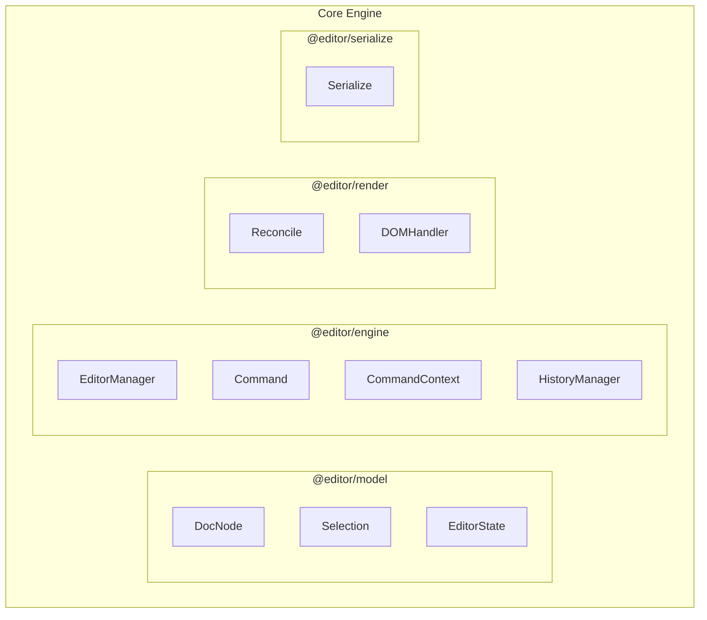

# 自研模板编辑器

::: tip 背景
一个支持 Email / PDF 双模式的模板编辑器，结合 FreeMarker 语法实现模板能力，面向跨技术栈使用场景设计。本文记录其架构设计和核心实现思路。
:::

## 产品定位

**目标**：提供一个可视化的模板编辑工具，让运营/产品人员无需写代码即可编辑 Email 和 PDF 模板。

**核心能力**：

| 能力 | 说明 |
|------|------|
| 双模式 | Email 模式 / PDF 模式，渲染规则不同 |
| 模板语法 | 基于 FreeMarker，支持条件、循环、表达式 |
| 变量系统 | 导入变量 → 拖拽到编辑区 → 高亮展示友好 label |
| 填充预览 | 填入变量值后实时预览最终渲染效果 |

---

## 技术架构

```
┌─────────────────────────────────────────────────┐
│           Web Component（对外暴露）               │
│         跨框架：React / Vue / Angular 均可接入     │
├─────────────────────────────────────────────────┤
│           React 外壳（交互层）                    │
│     工具栏 / 变量面板 / 属性配置 / 拖拽交互        │
├─────────────────────────────────────────────────┤
│           Core Engine（TypeScript）              │
│     Command 模式 / 文档模型 / 选区管理 / 序列化    │
├─────────────────────────────────────────────────┤
│           样式策略                               │
│  交互 UI → Tailwind CSS                         │
│  内容渲染 → 内联样式（确保预览 = 真实渲染）         │
└─────────────────────────────────────────────────┘
```

### Core Engine 模块关系

按职责和依赖关系，Core Engine 分为 4 个包：

```
packages/
├── @editor/model        # 纯数据层，无 DOM 依赖
── @editor/engine       # 核心引擎，Command + Manager
├── @editor/render       # 渲染层，DOM 操作
└── @editor/serialize    # 序列化层，DocNode → FreeMarker 模板
```



**模块职责**：

| 模块 | 职责 |
|------|------|
| DocNode | 文档树，Single Source of Truth |
| Selection | 选区管理（模型坐标 nodeId + offset） |
| EditorState | 顶层状态容器，区分持久化配置和运行时状态 |
| EditorManager | 状态中枢，持有 DocNode、选区、历史栈 |
| Command | 封装所有编辑操作（输入、拖拽、样式修改） |
| CommandContext | Command 与 Manager 的通信通道，解耦两者 |
| HistoryManager | DocNode JSON 快照，支持 Undo/Redo |
| Reconcile | 统一渲染引擎，首次加载和后续 patch 共用 |
| DOMHandler | 按节点类型导出 create/bindEvents/destroy 纯函数 |
| Serialize | DocNode 树 → FreeMarker 模板字符串（保存/预览） |

### 构建工具

- **Vite** — 开发体验 + Web Component 打包

### 为什么用 Web Component 暴露？

编辑器需要被不同技术栈的项目接入（React 项目、Vue 项目、甚至纯 HTML 页面），Web Component 是框架无关的标准：

```html
<!-- 任何框架中都能这样用 -->
<template-editor
  mode="email"
  variables='[{"name":"user_name","label":"用户名"}]'
></template-editor>
```

---

## 样式策略

编辑器中样式分两套体系，这是一个关键设计决策：

| 场景 | 方案 | 原因 |
|------|------|------|
| 编辑器交互 UI（工具栏、面板、按钮） | Tailwind CSS | 快速开发，不影响输出内容 |
| 模板内容渲染（文字、布局、间距） | 内联样式 | Email 客户端不支持 class，PDF 渲染需要确定性样式 |

**核心原则**：编辑区看到什么样，最终渲染就是什么样（WYSIWYG）。内联样式保证编辑态和输出态一致，不会因为运行环境缺少 CSS 文件而样式丢失。

---

## Command 模式

所有编辑操作封装为 Command 对象：

```typescript
interface Command {
  execute(ctx: CommandContext): void;
}
```

每个用户操作（输入文字、拖入变量、修改样式）= 一个 Command，统一走引擎调度。

**为什么没有 undo/redo 接口？** 因为 Undo/Redo 由快照机制承担（见下文），不需要 Command 自己实现逆操作。Manager 执行 Command 前存快照，undo 时直接恢复快照，跟 Command 本身无关。Command 只关心"怎么做"，不关心"怎么撤"。

---

## CommandContext 通信机制

Command 不直接引用 EditorManager，而是通过一个 **Context 对象**与外界通信。这是引擎解耦的关键设计：

```typescript
interface CommandContext {
  // 查询状态
  getSelection(): Selection;
  getDocument(): DocNode;
  getMode(): 'email' | 'pdf';
  getVariables(): VariableRef[];
  getSettings(): EmailSettings | PDFSettings;

  // UI 状态通知
  setToolbarState(state: {
    undoable: boolean;
    redoable: boolean;
    disabled: string[];   // 当前不可用的按钮
  }): void;

  // 操作
  applyCommand(cmd: Command): void;   // 嵌套调用其他 command
  undo(): void;
  redo(): void;
}
```

**Command 通过 Context 执行**：

```typescript
interface Command {
  execute(ctx: CommandContext): void;
}

// 示例：插入变量
class InsertVariableCommand implements Command {
  constructor(private variable: VariableRef, private position: Position) {}

  execute(ctx: CommandContext) {
    const doc = ctx.getDocument();
    const newDoc = insertNode(doc, this.position, {
      type: 'variable',
      variable: this.variable,
    });

    // 通知外界更新
    ctx.setToolbarState({ undoable: true, redoable: false, disabled: [] });
  }
}
```

**设计意图**：

| 好处 | 说明 |
|------|------|
| 解耦 | Command 只依赖 Context 接口，不知道 Manager 存在，可独立单测 |
| 单一通道 | 所有 Command 与外界的交互收口在一个对象，职责清晰 |
| 可控暴露 | Manager 决定 Context 上挂什么能力，Command 拿不到不该拿的东西 |
| 状态集中 | 选区、文档、历史栈由 Manager 持有，Context 只是访问代理 |

**Manager 与 Context 的关系**：

```
EditorManager（持有所有状态）
  │
  ├── document: DocNode
  ├── selection: Selection
  ├── history: HistoryManager
  ├── mode: 'email' | 'pdf'
  │
  └── createContext(): CommandContext  ← 每次执行 Command 时创建
        │
        ▼
      Command.execute(ctx)  ← Command 通过 ctx 读写状态
```

Manager 是状态的 Owner，Context 是 Command 视角的"窗口"。这样 Command 无法绕过 Manager 直接修改内部状态，所有变更都经过 Manager 的调度（快照、事件派发、脏标记等）。

---

## DOMHandler 视图层

Command 只操作文档模型（DocNode 树），**所有跟 DOM 相关的逻辑由 DOMHandler 承担**。每个节点类型有一个对应的 Handler 模块，导出 create/bindEvents/destroy 等纯函数：

```
用户点击"加粗"
  │
  ▼
BoldCommand：修改文档模型
  给选区内 text 节点添加 mark: { type: "bold" }
  （纯数据操作，不碰 DOM）
  │
  ▼
TextDOMHandler：同步到 DOM
  检测到 mark: bold → 包裹 <b> 标签
  （纯渲染操作）
```

**Command 示例**（操作模型）：

```typescript
class BoldCommand implements Command {
  execute(ctx: CommandContext) {
    const { anchor, focus } = ctx.getSelection();
    const doc = ctx.getDocument();
    applyMark(doc, anchor, focus, { type: 'bold' });
  }
}

class AlignCommand implements Command {
  constructor(private align: 'left' | 'center' | 'right') {}

  execute(ctx: CommandContext) {
    const block = getSelectedBlock(ctx);
    block.attrs.textAlign = this.align;
  }
}
```

**DOMHandler 接口**（参考 ProseMirror NodeView 设计，每个 Handler 是一个模块，导出纯函数）：

```typescript
interface DOMHandler {
  create(node: DocNode): HTMLElement;          // 必须：根据 DocNode 创建 DOM 元素
  bindEvents(el: HTMLElement, ctx: CommandContext): void;  // 必须：绑定交互事件
  destroy(el: HTMLElement): void;              // 必须：节点移除时清理
  update?(el: HTMLElement, node: DocNode): void;  // 可选：原地 patch，不实现则自动重建
}
```

`update` 是可选的——简单组件不导出，reconcile 自动 destroy + create 重建；复杂组件导出了就原地 patch，避免子节点不必要的重建。

**简单组件示例**（不导出 update，重建即可）：

```typescript
// handlers/text.ts
export function create(node: DocNode): HTMLElement {
  const el = document.createElement('span');
  el.textContent = node.content;
  if (node.marks?.some(m => m.type === 'bold')) return wrapWith(el, 'b');
  if (node.marks?.some(m => m.type === 'italic')) return wrapWith(el, 'i');
  return el;
}
export function bindEvents() {}
export function destroy() {}
// 不导出 update → reconcile 发现属性变了直接重建

// handlers/variable.ts
export function create(node: DocNode): HTMLElement {
  const chip = document.createElement('span');
  chip.className = 'variable-chip';
  chip.textContent = node.variable.label;
  chip.dataset.variableName = node.variable.name;
  return chip;
}
export function bindEvents(el: HTMLElement, ctx: CommandContext) {
  el.addEventListener('click', () => showConfig(el, ctx));
  el.addEventListener('contextmenu', (e) => {
    e.preventDefault();
    ctx.applyCommand(new DeleteVariableCommand(el.dataset.variableName));
  });
}
export function destroy() {}

// handlers/block.ts
export function create(node: DocNode): HTMLElement {
  const el = document.createElement('div');
  el.style.textAlign = node.attrs.textAlign || 'left';
  return el;
}
export function bindEvents() {}
export function destroy() {}
```

**复杂组件示例**（导出 update，原地 patch 避免子节点重建）：

```typescript
// handlers/condition.ts
export function create(node: DocNode): HTMLElement {
  const el = document.createElement('div');
  el.className = 'condition-block';
  el.innerHTML = `
    <div data-branch="true"></div>
    <div data-branch="false"></div>
  `;
  return el;
}

export function update(el: HTMLElement, node: DocNode) {
  // 原地切换显隐，不重建子节点
  const result = evaluateExpression(node.expression, ctx.getVariables());
  el.querySelector('[data-branch="true"]').style.display = result ? '' : 'none';
  el.querySelector('[data-branch="false"]').style.display = result ? 'none' : '';
}

export function bindEvents() {}
export function destroy() {}
```

---

## 统一 Reconcile

首次渲染和后续 patch 走同一个 reconcile 函数，不关心容器是空还是已有内容：

```typescript
import * as text from './handlers/text';
import * as variable from './handlers/variable';
import * as block from './handlers/block';
import * as condition from './handlers/condition';
import * as loop from './handlers/loop';

const handlerMap: Record<NodeType, DOMHandler> = {
  text, variable, block, condition, loop,
};

function reconcile(parentEl: HTMLElement, newNodes: DocNode[], ctx: CommandContext) {
  const oldChildren = Array.from(parentEl.children)
    .filter(c => c.dataset.nodeId);

  for (let i = 0; i < Math.max(oldChildren.length, newNodes.length); i++) {
    const oldEl = oldChildren[i];
    const newNode = newNodes[i];

    if (!newNode) {
      // 多余的老节点 → 从叶到父依次销毁
      destroyNode(oldEl);
    } else if (!oldEl) {
      // 新节点 → 创建 + 递归子节点
      const el = createNode(newNode, ctx);
      parentEl.appendChild(el);
    } else if (oldEl.dataset.nodeId !== newNode.id) {
      // 节点被替换 → 销毁旧的（含子节点），创建新的
      destroyNode(oldEl);
      const el = createNode(newNode, ctx);
      oldEl.replaceWith(el);
    } else {
      // 同一节点 → 有 update 就原地 patch，没有就重建
      const handler = handlerMap[newNode.type];
      if (handler.update) {
        handler.update(oldEl, newNode);
        // update 只处理自身属性，子节点需要递归 reconcile
        reconcile(oldEl, newNode.children ?? [], ctx);
      } else {
        // 没有 update → 重建，createNode 内部已递归处理子节点
        destroyNode(oldEl);
        const el = createNode(newNode, ctx);
        oldEl.replaceWith(el);
      }
    }
  }
}

function createNode(node: DocNode, ctx: CommandContext): HTMLElement {
  const handler = handlerMap[node.type];
  const el = handler.create(node);
  el.dataset.nodeId = node.id;
  el.dataset.nodeType = node.type;
  handler.bindEvents(el, ctx);
  reconcile(el, node.children ?? [], ctx);
  return el;
}

// 从叶到父递归销毁（先清理子节点，再清理自身）
function destroyNode(el: HTMLElement) {
  for (const child of Array.from(el.children)) {
    if (child.dataset.nodeId) destroyNode(child);
  }
  handlerMap[el.dataset.nodeType].destroy(el);
  el.remove();
}
```

三种场景统一走 reconcile：

```typescript
// 场景 1：首次加载（容器为空，oldChildren 为空数组，全走"新节点→创建"分支）
reconcile(container, [doc], ctx);

// 场景 2：Undo/Redo 后 patch（diff 出 dirtyIds，对变化的子节点调用 reconcile）
const dirtyIds = diffDocNodes(currentDoc, prevDoc);
for (const id of dirtyIds) {
  const parentEl = findParent(id);
  reconcile(parentEl, parentDocNode.children, ctx);
}

// 场景 3：正常编辑后局部更新（事件已知变化位置，对父节点调用 reconcile）
ctx.applyCommand(new InsertVariableCommand(variable, pos));
reconcile(parentEl, parentDocNode.children, ctx);
```

**分层职责**：

| | Command | DOMHandler | Reconcile |
|---|---|---|---|
| 职责 | 模型怎么变 | 单个节点怎么创建/更新/销毁 | 树结构怎么同步（增删改查 + 递归） |
| 复杂度 | 按工具有差异 | 简单组件 3 行，复杂组件按需实现 update | 统一一份，所有节点类型共用 |

---

## 工具设计

编辑器提供多种工具，每个工具由 **Command（改模型）+ DOMHandler（渲染 DOM）+ UI 交互** 三部分组成。

### 变量插入工具

**触发方式**：从变量面板拖拽 / 点击变量后插入到光标位置

**Command**：
```typescript
class InsertVariableCommand implements Command {
  constructor(private variable: VariableRef, private position: Position) {}

  execute(ctx: CommandContext) {
    const doc = ctx.getDocument();
    // 在指定位置插入 variable 节点
    insertNode(doc, this.position, {
      type: 'variable',
      variable: this.variable,
    });
  }
}
```

**DOMHandler**（`handlers/variable.ts`）：
```typescript
export function create(node: DocNode): HTMLElement {
  const chip = document.createElement('span');
  chip.className = 'variable-chip';
  chip.textContent = node.variable.label;  // 显示友好名
  chip.dataset.variableName = node.variable.name;
  return chip;
}

export function bindEvents(el: HTMLElement, ctx: CommandContext) {
  el.addEventListener('click', () => showVariableConfig(el, ctx));
  el.addEventListener('contextmenu', (e) => {
    e.preventDefault();
    ctx.applyCommand(new DeleteVariableCommand(el.dataset.variableName));
  });
}
export function destroy() {}
```

**样式**：
```css
.variable-chip {
  background: #e0f2fe;
  border: 1px solid #0284c7;
  border-radius: 4px;
  padding: 2px 6px;
  cursor: pointer;
  user-select: none;  /* 不可部分选中 */
}
```

---

### 条件块工具

**触发方式**：工具栏点击"插入条件"按钮

**Command**：
```typescript
class InsertConditionCommand implements Command {
  constructor(private expression: string, private position: Position) {}

  execute(ctx: CommandContext) {
    const doc = ctx.getDocument();
    insertNode(doc, this.position, {
      type: 'condition',
      expression: this.expression,
      children: [
        { type: 'block', branch: 'true', children: [] },
        { type: 'block', branch: 'false', children: [] },
      ],
    });
  }
}
```

**DOMHandler**（`handlers/condition.ts`）：
```typescript
export function create(node: DocNode): HTMLElement {
  const container = document.createElement('div');
  container.className = 'condition-block';
  container.dataset.collapsed = 'false';

  // 标题栏（点击折叠/展开）
  const header = document.createElement('div');
  header.className = 'condition-header';
  header.innerHTML = `
    <span class="toggle-icon">▼</span>
    <span class="expression">条件：${node.expression}</span>
  `;
  header.addEventListener('click', () => toggleCollapse(container));
  container.appendChild(header);

  // 分支内容区（由 reconcile 递归渲染 children）
  const branches = document.createElement('div');
  branches.className = 'condition-branches';
  container.appendChild(branches);

  return container;
}

export function update(el: HTMLElement, node: DocNode) {
  el.querySelector('.expression').textContent = `条件：${node.expression}`;
}

export function bindEvents() {}
export function destroy() {}

function toggleCollapse(container: HTMLElement) {
  const collapsed = container.dataset.collapsed === 'true';
  container.dataset.collapsed = String(!collapsed);
  container.querySelector('.toggle-icon').textContent = collapsed ? '▼' : '▶';
  const branches = container.querySelector('.condition-branches');
  branches.style.display = collapsed ? '' : 'none';
}
```

**样式**：
```css
.condition-block {
  border: 1px solid #d1d5db;
  border-radius: 6px;
  margin: 8px 0;
  background: #f9fafb;
}

.condition-header {
  padding: 6px 10px;
  background: #e5e7eb;
  cursor: pointer;
  user-select: none;
  display: flex;
  align-items: center;
  gap: 6px;
}

.condition-header:hover {
  background: #d1d5db;
}

.condition-branches {
  padding: 10px;
}

.condition-block[data-collapsed="true"] .condition-branches {
  display: none;
}
```

**嵌套支持**：reconcile 递归渲染 children，condition 内部可以有 loop，loop 内部可以有 condition，每个容器独立管理折叠状态。

---

### 循环块工具

**触发方式**：工具栏点击"插入循环"按钮

**Command**：
```typescript
class InsertLoopCommand implements Command {
  constructor(private expression: string, private position: Position) {}

  execute(ctx: CommandContext) {
    const doc = ctx.getDocument();
    insertNode(doc, this.position, {
      type: 'loop',
      expression: this.expression,  // 如 "items as item"
      children: [{ type: 'block', children: [] }],
    });
  }
}
```

**DOMHandler**（`handlers/loop.ts`）：与 ConditionDOMHandler 结构类似，标题显示"循环：${expression}"，内部递归渲染 children。

---

### 文本样式工具

**触发方式**：工具栏按钮 / 快捷键（Ctrl+B / Ctrl+I）

**Command**：
```typescript
class BoldCommand implements Command {
  execute(ctx: CommandContext) {
    const { anchor, focus } = ctx.getSelection();
    const doc = ctx.getDocument();
    applyMark(doc, anchor, focus, { type: 'bold' });
  }
}

class ItalicCommand implements Command {
  execute(ctx: CommandContext) {
    const { anchor, focus } = ctx.getSelection();
    const doc = ctx.getDocument();
    applyMark(doc, anchor, focus, { type: 'italic' });
  }
}
```

**DOMHandler**（`handlers/text.ts`）：
```typescript
export function create(node: DocNode): HTMLElement {
  const el = document.createElement('span');
  el.textContent = node.content;
  if (node.marks?.some(m => m.type === 'bold')) return wrapWith(el, 'b');
  if (node.marks?.some(m => m.type === 'italic')) return wrapWith(el, 'i');
  return el;
}
export function bindEvents() {}
export function destroy() {}
// 不导出 update → 属性变化时 reconcile 自动重建
```

---

### 对齐工具

**触发方式**：工具栏对齐按钮（左/中/右）

**Command**：
```typescript
class AlignCommand implements Command {
  constructor(private align: 'left' | 'center' | 'right') {}

  execute(ctx: CommandContext) {
    const block = getSelectedBlock(ctx);
    block.attrs.textAlign = this.align;
  }
}
```

**DOMHandler**（`handlers/block.ts`）：
```typescript
export function create(node: DocNode): HTMLElement {
  const el = document.createElement('div');
  el.style.textAlign = node.attrs.textAlign || 'left';
  return el;
}
export function bindEvents() {}
export function destroy() {}
```

---

## 变量系统

### 工作流程

```
导入变量（JSON/接口） → 变量面板展示 → 拖拽到编辑区 → 高亮渲染（显示 label）
```

### 编辑区展示

变量在编辑区中**不显示原始变量名**，而是显示友好的 label：

```
编辑区显示：  [用户名]  ← 高亮 chip
实际模板输出：${user_name}  ← FreeMarker 语法
```

### 变量填充与预览

支持填入模拟数据，实时预览模板最终渲染效果：

```
编辑模式：  亲爱的 [用户名]，您的订单 [订单号] 已发货
预览模式：  亲爱的 张三，您的订单 ORD-20260101 已发货
```

---

## FreeMarker 模板语法与序列化

### 支持的语法

编辑器底层使用 FreeMarker 语法，支持：

```ftl
<#-- 变量输出 -->
${user_name}

<#-- 条件判断 -->
<#if is_vip>
  尊敬的 VIP 用户
<#else>
  亲爱的用户
</#if>

<#-- 循环 -->
<#list items as item>
  ${item.name} - ¥${item.price}
</#list>
```

编辑器将这些语法封装为可视化操作，用户无需直接编写模板代码。

### 单一数据源

数据库**只存一份 DocNode JSON**，模板字符串是它的派生产物：

```
数据库：DocNode JSON（Single Source of Truth）
  │
  ├── 编辑时：JSON → 加载到编辑器 → DocNode 树
  ├── 渲染时：JSON → serialize() → FreeMarker 模板字符串 → 渲染器
  └── 版本对比：JSON diff
```

不再维护"模板字符串 + 编辑器内容"两份数据，避免同步不一致的问题。

### 序列化（文档树 → 模板）

保存和预览时，DocNode 树序列化为 FreeMarker 模板字符串：

```typescript
function serialize(nodes: DocNode[]): string {
  return nodes.map(node => {
    switch (node.type) {
      case 'text':
        return node.content;
      case 'variable':
        return `\${${node.variable.name}}`;
      case 'condition':
        const trueBranch = serialize(node.children.filter(n => n.branch === 'true'));
        const falseBranch = serialize(node.children.filter(n => n.branch === 'false'));
        return `<#if ${node.expression}>\n${trueBranch}<#else>\n${falseBranch}</#if>`;
      case 'loop':
        const body = serialize(node.children);
        return `<#list ${node.expression} as item>\n${body}</#list>`;
      case 'block':
        const inner = serialize(node.children);
        return wrapWithHTML(node, inner); // 包裹对应的 HTML 标签 + 内联样式
    }
  }).join('');
}
```

**设计要点**：
- 序列化时内联样式从节点 attrs 生成，确保输出 HTML 自包含
- 保留原始模板中编辑器不识别的 FreeMarker 指令（作为 raw 节点透传）

---

## 双模式差异

| 维度 | Email 模式 | PDF 模式 |
|------|-----------|---------|
| 布局 | 表格布局为主（兼容邮件客户端） | 自由布局 / Flex |
| 样式 | 内联 + 受限 CSS 子集 | 完整 CSS 支持 |
| 尺寸 | 固定宽度（600px 常见） | A4 / 自定义尺寸 |
| 输出 | HTML 字符串 | PDF 文件（服务端渲染） |

---

## 文档模型（DocumentModel）

编辑器在操作 DOM 的同时，维护一棵**文档树（DocNode）**作为 Single Source of Truth。DOM 是用户直接交互的界面，DocNode 是结构化的数据模型，两者保持同步。

### 节点结构

```typescript
type NodeType = 'root' | 'block' | 'inline' | 'text' | 'variable' | 'condition' | 'loop';

interface DocNode {
  id: string;
  type: NodeType;
  children?: DocNode[];
  attrs?: Record<string, any>;     // 样式、对齐等
  content?: string;                // text 节点的文本
  variable?: VariableRef;          // variable 节点的变量引用
  expression?: string;             // condition/loop 节点的 FreeMarker 表达式
}

interface VariableRef {
  name: string;       // 变量名：user_name
  label: string;      // 显示名：用户名
  defaultValue?: string;
}
```

### 设计要点

- **模型更新策略**：用户输入走"DOM 先变 → 同步回 DocNode"，工具操作走"Command 改 DocNode → reconcile 渲染"，DOM 不是模型，DocNode 才是 Single Source of Truth。历史独立性由快照深拷贝保证（见 Undo/Redo 章节），不依赖不可变更新
- **ID 稳定**：节点 ID 在编辑过程中不变，用于 DOM diff 和选区锚定
- **序列化友好**：树结构可直接 JSON 序列化存储，也可转换为 FreeMarker 模板字符串

### 文档树示例

```
root
├── block (type: "header", attrs: {textAlign: "center"})
│   └── text ("尊敬的 ")
│   └── variable ({name: "user_name", label: "用户名"})
│   └── text ("：")
├── block (type: "paragraph")
│   └── text ("您的订单 ")
│   └── variable ({name: "order_id", label: "订单号"})
│   └── text (" 已发货。")
└── condition (expression: "is_vip")
    ├── [true] block → text ("感谢您的长期支持！")
    └── [false] block → text ("欢迎再次选购。")
```

### 编辑器状态（EditorState）

DocNode 树只描述文档内容和结构。编辑器还有大量配置信息（模式、变量列表、纸张尺寸、字号字色等），这些信息不属于文档树本身。顶层用一个 **EditorState** 对象统一管理，区分持久化内容和运行时状态：

```typescript
interface EditorState {
  // ---- 持久化（存数据库，跟着模板走）----
  mode: 'email' | 'pdf';                    // 外部通过 Web Component 传入
  variables: VariableRef[];
  settings: EmailSettings | PDFSettings;    // 按模式分组
  content: DocNode;                         // 文档树

  // ---- 运行时（不存数据库，会话级别）----
  readonly: boolean;
  zoom: number;
  activeTool: string;
}

interface EmailSettings {
  width: number;                            // 邮件布局宽度（如 600px）
  compatibility: 'modern' | 'legacy';       // 邮件客户端兼容级别
}

interface PDFSettings {
  pageSize: 'A4' | 'A5' | 'Letter';
  lineHeight: number;
  backgroundColor: string;
  fontSize: number;
  fontColor: string;
  margin: { top: number; right: number; bottom: number; left: number };
}
```

**分层逻辑**：

| | 存哪 | 持久化 | 例子 |
|---|---|---|---|
| 文档配置 | `settings` | 是 | 纸张尺寸、字号、背景色、邮件宽度 |
| 文档内容 | `content` | 是 | DocNode 树 |
| 编辑器状态 | 顶层 | 否 | readonly、zoom、当前选中工具 |

存数据库时只序列化 `mode + variables + settings + content`，zoom、readonly 这些运行时状态丢了也无所谓。`mode` 由外部开发者通过 Web Component 属性传入，编辑器内部只读取和使用。

CommandContext 按需暴露各层：

```typescript
createContext(): CommandContext {
  return {
    getMode: () => this.state.mode,
    getVariables: () => this.state.variables,
    getSettings: () => this.state.settings,
    getDocument: () => this.state.content,
    // ...
  };
}
```

---

## 选区与光标管理

### 选区模型

```typescript
interface Selection {
  anchor: Position;   // 选区起点
  focus: Position;    // 选区终点（光标位置）
}

interface Position {
  nodeId: string;     // 所在节点
  offset: number;     // 节点内偏移（文本节点为字符偏移，容器节点为子节点索引）
}
```

### 关键处理

| 场景 | 处理方式 |
|------|---------|
| 变量节点不可部分选中 | 选区进入变量节点时自动扩展为整节点选中 |
| 跨节点选区 | anchor 和 focus 可以在不同节点，渲染时遍历路径高亮 |
| IME 输入法 | compositionstart 时冻结选区更新，compositionend 后一次性提交 |
| 选区恢复 | Undo/Redo 后根据快照中保存的 selection 恢复光标位置 |

### 选区 → DOM 映射

```typescript
// 单点转换：文档 Position → DOM 点（Range 起点）
function positionToDOM(pos: Position, container: HTMLElement): Range {
  const nodeEl = container.querySelector(`[data-node-id="${pos.nodeId}"]`);
  const range = document.createRange();

  if (isTextNode(nodeEl)) {
    range.setStart(nodeEl.firstChild, pos.offset);
  } else {
    range.setStart(nodeEl, pos.offset);
  }
  return range;
}

// 完整选区恢复：组合 anchor + focus 两个点
function restoreSelection(selection: Selection, container: HTMLElement) {
  const anchor = positionToDOM(selection.anchor, container);
  const focus = positionToDOM(selection.focus, container);

  window.getSelection().setBaseAndExtent(
    anchor.startContainer, anchor.startOffset,
    focus.startContainer, focus.startOffset
  );
}
```

- 光标（collapsed）：anchor === focus，两点重合
- 选区（expanded）：anchor ≠ focus，两点组合为范围

---

## 拖拽系统

### 变量拖拽流程

```
变量面板（draggable）
  │ dragstart → 设置 dataTransfer: {type: "variable", payload: VariableRef}
  ▼
编辑区（dropzone）
  │ dragover → 计算插入位置（根据鼠标坐标定位最近的文本偏移）
  │ drop → 创建 InsertVariableCommand → 引擎执行
  ▼
渲染更新
  │ 插入 variable 节点 → 渲染为高亮 chip
```

### 插入位置计算

```typescript
function getDropPosition(e: DragEvent): Position {
  // 利用 caretRangeFromPoint 获取鼠标位置对应的文本偏移
  const range = document.caretRangeFromPoint(e.clientX, e.clientY);
  const nodeId = range.startContainer.parentElement.dataset.nodeId;
  const offset = range.startOffset;
  return { nodeId, offset };
}
```

### 编辑区内拖拽排序

块级节点（block）支持拖拽排序：

- dragstart 记录源节点 ID
- dragover 时显示插入指示线（上方/下方）
- drop 时创建 MoveNodeCommand

---

## Web Component 通信协议

### 属性（Attributes → 组件）

```typescript
// 外部通过属性传入配置
<template-editor
  mode="email"
  variables='[{"name":"user_name","label":"用户名"}]'
  template="<p>Dear ${user_name}</p>"
  readonly="false"
></template-editor>
```

| 属性 | 类型 | 说明 |
|------|------|------|
| `mode` | `"email" \| "pdf"` | 编辑模式 |
| `variables` | JSON string | 可用变量列表 |
| `template` | string | 初始模板内容（FreeMarker） |
| `readonly` | boolean | 只读模式 |

### 事件（组件 → 外部）

```typescript
// 组件内部 dispatch
this.dispatchEvent(new CustomEvent('template-change', {
  detail: { template: string, dirty: boolean }
}));

this.dispatchEvent(new CustomEvent('selection-change', {
  detail: { selection: Selection | null }
}));
```

| 事件 | 触发时机 | detail |
|------|---------|--------|
| `template-change` | 模板内容变化 | `{template, dirty}` |
| `selection-change` | 选区变化 | `{selection}` |
| `variable-drop` | 变量拖入 | `{variable, position}` |
| `ready` | 组件初始化完成 | `{}` |

### 方法（外部 → 组件）

```typescript
const editor = document.querySelector('template-editor');

editor.getTemplate();          // 获取当前 FreeMarker 模板字符串
editor.setTemplate(str);       // 设置模板
editor.fillVariables(data);    // 填充变量值，进入预览
editor.undo();                 // 撤销
editor.redo();                 // 重做
editor.exportHTML();           // 导出渲染后的纯 HTML
```

### Shadow DOM 隔离

```typescript
class TemplateEditor extends HTMLElement {
  constructor() {
    super();
    this.attachShadow({ mode: 'open' });
  }

  connectedCallback() {
    // 在 shadow root 中挂载 React 应用
    const mountPoint = document.createElement('div');
    this.shadowRoot.appendChild(mountPoint);
    ReactDOM.createRoot(mountPoint).render(<App host={this} />);
  }
}
customElements.define('template-editor', TemplateEditor);
```

Shadow DOM 确保编辑器内部样式（Tailwind）不会泄漏到宿主页面，宿主页面的全局样式也不会影响编辑器。

---

## 渲染管线与性能优化

DocNode JSON 有两条转换路径：

```
DocNode JSON
  │
  ├──→ DOM（编辑态）：有交互，持续更新，性能敏感
  │
  └──→ Template Content（输出态）：无交互，一次性转换
```

### JSON → Template Content（静态输出）

涉及两个场景：

| 场景 | 触发时机 | 说明 |
|------|---------|------|
| 保存 | 用户点击保存 | 序列化为 FreeMarker 模板字符串存入数据库，业务用它 + 生产变量渲染真实邮件/PDF |
| 预览 | 用户填充变量后点击预览 | 序列化 → 调用渲染服务 → 用填充的变量值渲染出最终效果 |

这条路径无交互、无增量更新，就是遍历树拼接字符串，性能不是瓶颈。唯一优化：防抖（停止编辑 300ms 后再序列化），避免频繁触发。

### JSON → DOM（交互编辑）

这是性能核心。首次加载和后续更新统一走 reconcile 函数（见 DOMHandler 章节），不关心容器是空还是已有内容：

```typescript
// 首次加载：容器为空，reconcile 全走"新节点→创建"分支
// 离屏构建（DocumentFragment），一次挂载，一次 reflow
const fragment = document.createDocumentFragment();
reconcile(fragment, [doc], ctx);
container.appendChild(fragment);
```

#### 更新：事件驱动，靶向操作，无需 diff

正常编辑时，**事件本身就告诉你改了什么**，不需要 diff：

| 操作 | 事件告知的信息 | 处理方式 |
|------|--------------|-------------|
| 手动输入 | 哪个文本节点、内容变了 | DOM 已自动更新（contenteditable），只需同步回 DocNode |
| 加粗/斜体 | 选区范围 | 更新模型 + 对选区内节点包裹/解包标签 |
| 对齐 | 当前 block 节点 | 更新模型 + 改 style.textAlign |
| 变量拖入 | 变量数据 + 插入位置 | 更新模型 + 在目标位置插入 chip 元素 |
| 块级拖拽排序 | 源节点 + 目标位置 | 更新模型 + moveBefore/moveAfter |

**DOM ↔ DocNode 怎么互相定位？** 事件处理器里拿到的只有 DOM 元素，如何找到对应的虚拟节点？答案是 `createNode` 时烙在元素上的 `dataset.nodeId` 双向桥：

```typescript
// 创建节点时烙上 ID（见 DOMHandler 章节的 createNode）
el.dataset.nodeId = node.id;
el.dataset.nodeType = node.type;

// DOM → DocNode：事件里向上找最近带 ID 的祖先
const nodeId = e.target.closest('[data-node-id]').dataset.nodeId;
const node = doc.getNodeById(nodeId);

// DocNode → DOM：定位某节点的元素
const el = container.querySelector(`[data-node-id="${pos.nodeId}"]`);
```

- `closest` 处理深层元素：点击落在 text 节点的文本子节点上，向上找到最近带 ID 的容器
- `dataset` 读取 O(1)，`querySelector` 浏览器原生实现很快；节点量大时可维护 `Map<nodeId, HTMLElement>`（createNode 注册、destroyNode 注销），双向都变 O(1)
- 为什么不直接存 DOM 引用进 DocNode：`@editor/model` 是纯数据层（无 DOM 依赖，可单测、可序列化），dataset 桥接既保持纯数据、又拿到 O(1) 映射

```typescript
// 示例：手动输入（contenteditable 下 DOM 已自动变化，只需同步模型）
function handleInput(e: InputEvent, ctx: CommandContext) {
  const nodeId = e.target.closest('[data-node-id]').dataset.nodeId;
  const newContent = e.target.textContent;

  // DOM 已经是最新的了，只需要把变更同步回 DocNode
  ctx.applyCommand(new UpdateTextCommand(nodeId, newContent));
}

// 示例：变量拖入
function handleDrop(e: DragEvent, ctx: CommandContext) {
  const variableRef = JSON.parse(e.dataTransfer.getData('variable'));
  const pos = getDropPosition(e);

  // 1. 更新模型
  ctx.applyCommand(new InsertVariableCommand(variableRef, pos));

  // 2. 靶向插入 DOM
  const newNode = ctx.getDocument().getNodeById(newNodeId);
  const chip = variable.create(newNode);
  const refEl = getInsertionReference(pos);
  refEl.parentNode.insertBefore(chip, refEl);
  variable.bindEvents(chip, ctx);
}
```

**为什么不需要 diff**：diff 解决的是"不知道什么变了"的问题。但编辑器的每次变更都是用户操作触发的，操作类型 + 目标节点 + 变更内容全都知道，直接操作 DOM 即可。唯一需要 diff 的场景是 Undo/Redo，见下方独立章节。

#### 选区保持

DOM 更新前后保存和恢复选区（模型坐标 nodeId + offset），只要节点 ID 稳定就能定位回去：

```typescript
function updateWithSelection(updateFn: () => void) {
  const saved = saveSelection();
  updateFn();
  restoreSelection(saved);
}
```

#### 优化策略汇总

| 阶段 | 策略 | 说明 |
|------|------|------|
| 首次加载 | reconcile + DocumentFragment | 离屏构建，一次 reflow |
| 正常编辑 | 事件驱动 + reconcile | 对变化节点的父节点调用 reconcile |
| Undo/Redo | 快照 diff + reconcile | diff 出 dirtyIds，对父节点调用 reconcile |
| 序列化 | 防抖 300ms | 避免频繁序列化 FreeMarker |
| 快照 | 节流 500ms | 连续输入合并为一次快照 |
| 长文档 | 虚拟化 | PDF 模式只渲染可视区域节点 |

---

## Undo/Redo 实现

### 整体思路

```
正常编辑：用户操作 → Command 改 DocNode → 事件驱动靶向更新 DOM → 存快照
Undo/Redo：取快照 → diff 前后 DocNode → 靶向更新 DOM → 恢复选区
```

选择快照而非逆操作的原因：模板编辑涉及复合操作（拖入变量 = 插入节点 + 绑定数据 + 应用样式），逆操作实现复杂且容易出 bug。快照简单可靠，DocNode JSON 体积小，加上 diff 靶向更新 DOM，性能完全够用。

### 快照存储

```typescript
class HistoryManager {
  private undoStack: DocNode[] = [];
  private redoStack: DocNode[] = [];
  private lastPushTime = 0;

  push(doc: DocNode) {
    const now = Date.now();
    // 500ms 内连续输入合并为一次快照（如连续打字）
    if (now - this.lastPushTime < 500 && this.undoStack.length > 0) {
      return;
    }
    this.undoStack.push(structuredClone(doc));
    this.redoStack = [];  // 新操作清空 redo 栈
    this.lastPushTime = now;
  }

  undo(currentDoc: DocNode): DocNode | null {
    const prev = this.undoStack.pop();
    if (!prev) return null;
    this.redoStack.push(structuredClone(currentDoc));
    return prev;
  }

  redo(currentDoc: DocNode): DocNode | null {
    const next = this.redoStack.pop();
    if (!next) return null;
    this.undoStack.push(structuredClone(currentDoc));
    return next;
  }
}
```

**关键设计**：
- 快照存的是 DocNode JSON 的深拷贝，不存 DOM
- 500ms 节流：连续打字合并为一次快照，避免 undo 要按几十次才退回去
- 新操作清空 redo 栈：符合用户直觉（做了新操作就不能 redo 回去了）

### Diff 算法

基于节点稳定 ID 的树遍历，找出前后两棵树的差异节点：

```typescript
function diffDocNodes(before: DocNode, after: DocNode): string[] {
  const dirtyIds: string[] = [];

  function walk(oldNode: DocNode | undefined, newNode: DocNode | undefined) {
    if (!oldNode && newNode) { dirtyIds.push(newNode.id); return; }  // 新增
    if (oldNode && !newNode) { dirtyIds.push(oldNode.id); return; }  // 删除
    if (!shallowEqual(oldNode, newNode)) { dirtyIds.push(newNode.id); }  // 修改

    const maxLen = Math.max(oldNode.children?.length ?? 0, newNode.children?.length ?? 0);
    for (let i = 0; i < maxLen; i++) {
      walk(oldNode.children?.[i], newNode.children?.[i]);
    }
  }

  walk(before, after);
  return dirtyIds;
}
```

模板文档从几十到上千节点不等（PDF 长模板如多页合同、报表节点较多），但 diff 是 O(n) 遍历，千级节点也在毫秒级。而且 PDF 模板静态内容偏多，undo/redo 时变化的往往只是少数节点，dirtyIds 通常很少。

### DOM 靶向更新

diff 出 dirtyIds 后，逐个 patch，不全量 re-render：

```typescript
function performUndo() {
  const prevDoc = history.undo(currentDoc);
  if (!prevDoc) return;

  const dirtyIds = diffDocNodes(currentDoc, prevDoc);

  for (const id of dirtyIds) {
    const newNode = prevDoc.getNodeById(id);
    const oldEl = container.querySelector(`[data-node-id="${id}"]`);

    if (!newNode) {
      oldEl.remove();                              // 节点被删除
    } else if (!oldEl) {
      insertDOMAtPosition(newNode, prevDoc);       // 节点被恢复
    } else {
      patchDOMElement(oldEl, newNode);             // 节点属性变化
    }
  }

  currentDoc = prevDoc;
  restoreSelection(history.getSelection());
}
```

三种情况的处理：
- **节点被删除**（undo 撤销了插入）：移除对应 DOM 元素
- **节点被恢复**（undo 撤销了删除）：在正确位置重新插入 DOM 元素
- **节点属性变化**（undo 撤销了修改）：原地 patch 属性，复用 DOM 元素

### 选区恢复

```typescript
function restoreSelection(selection: Selection) {
  const anchor = positionToDOM(selection.anchor, container);
  const focus = positionToDOM(selection.focus, container);

  window.getSelection().setBaseAndExtent(
    anchor.startContainer, anchor.startOffset,
    focus.startContainer, focus.startOffset
  );
}
```

选区以模型坐标（nodeId + offset）保存在快照中，DOM 更新后通过 `positionToDOM` 翻译回浏览器坐标恢复光标位置。只要节点 ID 稳定，DOM 替换后依然能定位回去。

### 完整流程

```
用户按 Ctrl+Z
  │
  ▼
history.undo(currentDoc)
  │  弹出上一个快照 prevDoc
  │  把 currentDoc 推入 redoStack
  ▼
diffDocNodes(currentDoc, prevDoc)
  │  遍历两棵树，返回 dirtyIds: ["node-5", "node-12"]
  ▼
逐个 patch DOM
  │  node-5: 属性变化 → patchDOMElement（改 textContent / style）
  │  node-12: 被删除 → oldEl.remove()
  ▼
currentDoc = prevDoc
  │
  ▼
restoreSelection(savedSelection)
  │  光标回到操作前的位置
  ▼
完成
```

### 恢复期间的 input 事件拦截（必踩的坑）

Undo/Redo 恢复 DOM 时（`patchDOMElement` / `oldEl.remove()`），会触发 contentEditable 的 `input` 事件。如果没有拦截，`handleInput` 会把"恢复出来的内容"当作一次新的编辑，生成 `UpdateTextCommand` 推入历史栈——**undo 操作自己污染了历史**，连续按 Ctrl+Z 可能出现"撤销又被顶回去"的循环。

解决：恢复期间设置 `isRestoring` 标志，`handleInput` 检测到直接跳过：

```typescript
let isRestoring = false;

function performUndo() {
  isRestoring = true;   // 恢复前上锁
  try {
    // ...diff + patch DOM + restoreSelection
  } finally {
    isRestoring = false;  // 恢复完解锁
  }
}

function handleInput(e: InputEvent, ctx: CommandContext) {
  if (isRestoring) return;  // 恢复 DOM 触发的 input 事件，不当作新编辑
  const nodeId = e.target.closest('[data-node-id]').dataset.nodeId;
  const newContent = e.target.textContent;
  ctx.applyCommand(new UpdateTextCommand(nodeId, newContent));
}
```

其他同样会触发 `input`/`change` 的恢复路径（redo、从外部 `setTemplate()` 加载）也要走同一把锁。
