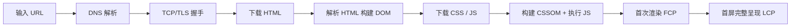
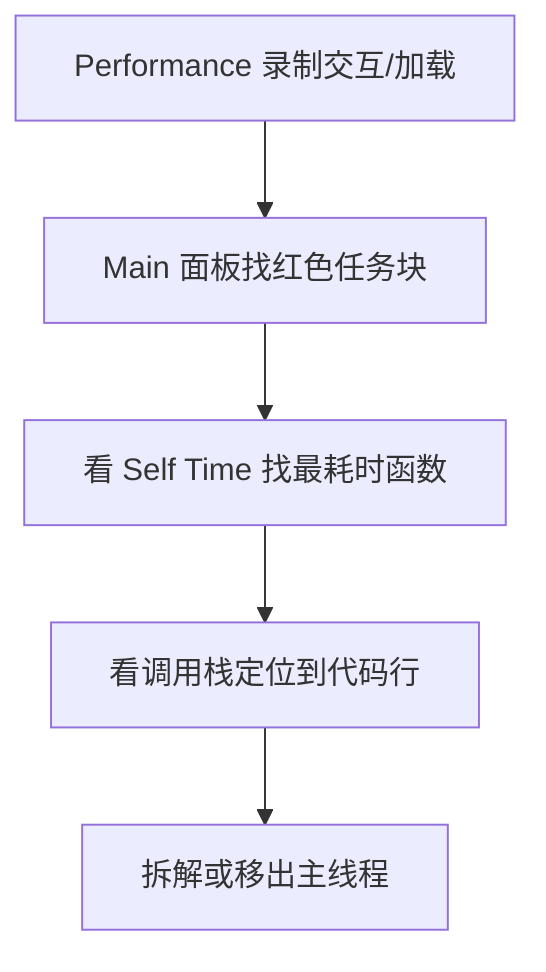

# 首屏优化详解

> [性能优化清单](./best-practices) 是覆盖全链路的条目清单；本文聚焦**首屏**这一个场景：首屏怎么定义、时间花在哪、每个阶段怎么优化，以及主线程上的头号敌人——**长任务**的识别与拆解。

## 一、什么是首屏

首屏 = 用户打开页面后，**第一屏可视区域**完整可用的时刻。它不等于"页面完全加载"（`load` 事件），而是"用户最先看到的这屏内容渲染完成且可交互"。

| 概念 | 含义 |
|------|------|
| **首屏** | 第一屏内容渲染完成、可交互 |
| **整页加载** | 所有资源（含视口外图片、非关键脚本）下载完成 |

优化首屏就是优化"用户等第一屏"的时间，它直接决定用户的第一印象。

## 二、首屏时间怎么衡量

### 2.1 核心指标

| 指标 | 全称 | 含义 | 目标 |
|------|------|------|------|
| **FCP** | First Contentful Paint | 第一个内容（文字/图片）绘制 | ≤ 1.8s |
| **LCP** | Largest Contentful Paint | 最大内容（首屏主体）绘制 | ≤ 2.5s |
| **TTI** | Time to Interactive | 页面可交互（主线程空闲） | ≤ 3.8s |
| **TBT** | Total Blocking Time | FCP 到 TTI 间长任务总阻塞时间 | ≤ 200ms |
| **INP** | Interaction to Next Paint | 交互响应延迟（受长任务影响） | ≤ 200ms |

> 首屏体验 ≈ FCP（看到东西）+ LCP（看到主要内容）+ TBT/TTI（能点）。

### 2.2 怎么测

- **Lighthouse**：一键出报告，给 FCP/LCP/TBT 分数与优化建议（实验室数据）
- **Chrome Performance 面板**：录制加载过程，看每个阶段耗时与主线程任务
- **PerformanceObserver + web-vitals**：线上真实用户数据（RUM），比实验室更真实
- **Network 面板**：看资源瀑布，找慢资源、串行加载

## 三、首屏的时间都花在哪了

从输入 URL 到首屏渲染，拆成三个阶段：



| 阶段 | 包含 | 瓶颈 | 特点 |
|------|------|------|------|
| **网络阶段** | DNS、TCP/TLS、下载 HTML 与资源 | 带宽、RTT、资源体积 | 纯等待，与渲染无关 |
| **解析阶段** | 构建 DOM/CSSOM、下载并执行 JS | 资源数量、脚本阻塞 | CSS 阻塞渲染、JS 阻塞解析 |
| **渲染阶段** | 样式计算、布局、绘制、合成 | 主线程繁忙（长任务） | 决定"画完多久能用" |

> 一句话：**网络阶段决定"资源多久到"，解析阶段决定"页面多久能画"，渲染阶段决定"画完多久能用"。**

## 四、每个阶段怎么优化

### 4.1 网络阶段：让资源更快到达

| 手段 | 原理 | 适用 |
|------|------|------|
| 代码拆分 + 按需加载 | 首屏只下载必要 JS | 路由/组件级拆分 |
| 压缩 | Brotli/Gzip 减小传输体积 | 文本资源 |
| CDN | 边缘节点就近返回，缩短 RTT | 静态资源 |
| HTTP/2+ | 多路复用减少连接开销 | 需 HTTPS |
| 强缓存 + hash 指纹 | 二次访问零下载 | 带 hash 资源 |
| preconnect / dns-prefetch | 提前建连，省握手时间 | 跨域接口、CDN |
| preload | 提前加载首屏关键资源（LCP 图、字体） | 首屏要用但发现晚的资源 |

```html
<!-- 首屏关键资源：告诉浏览器"现在就要"，别等解析到才下载 -->
<link rel="preload" as="image" href="/hero.webp">
<link rel="preconnect" href="https://api.example.com">
```

### 4.2 解析阶段：让页面更快画出来

- **CSS 阻塞渲染**：CSSOM 未构建完成不会渲染（防止样式突变）。优化：首屏关键 CSS 内联进 HTML，非关键 CSS 异步加载
- **JS 阻塞解析**：`<script>` 不下载完不继续解析 HTML（怕脚本改 DOM）。优化：`defer`（保序执行）、`async`（不阻塞解析）、按需加载
- **字体阻塞文字**：自定义字体未加载时文字可能不可见（FOIT）。优化：`font-display: swap` + 子集化

```html
<!-- defer：下载不阻塞解析，DOM 就绪后按序执行 -->
<script src="/app.js" defer></script>

<!-- 非关键 CSS 异步加载：先渲染，加载完再应用 -->
<link rel="stylesheet" href="other.css" media="print" onload="this.media='all'">
```

### 4.3 渲染阶段：让页面更快可用

- **骨架屏**：先给结构占位，减少感知等待（"先看到，再完整"）
- **SSR/SSG**：首屏 HTML 直出，省去客户端首轮渲染（框架选型层面）
- **避免长任务**：主线程不被长时间占用，TTI 更快（见下一节）
- **首屏只渲染可见内容**：视口外组件 Suspense 延迟、列表虚拟滚动

## 五、长任务（Long Task）：首屏与交互的头号敌人

> 对应面试题：页面卡顿如何定位主线程阻塞？（08-06 第 1.3 题）

### 5.1 什么是长任务

**定义**：主线程**连续执行超过 50ms** 的任务（Long Task）。

为什么阈值是 50ms？RAIL 模型要求用户交互 **100ms** 内得到响应——浏览器还要留约 50ms 给渲染，所以 JS 的时间预算就是 50ms。超过 50ms 的同步任务意味着：**用户在这段时间内点任何东西都没反应**。

```javascript
// 一个典型的长任务：200ms 同步计算，期间页面完全"冻结"
function heavyInit() {
  for (let i = 0; i < 10000000; i++) { /* 耗时 200ms */ }
}
```

**危害**：
- 阻塞交互（点击/滚动无响应）→ INP/FID 变差
- 阻塞渲染（掉帧、白屏感）
- 首屏场景：长任务让 TTI 大幅推迟，页面"看着加载完了，但点了没反应"

### 5.2 怎么识别长任务

**① Chrome Performance 面板（最常用）**

1. DevTools → Performance → 录制（或重新加载页面）
2. 看 **Main** 面板（主线程火焰图）
3. **红色任务块** = 长任务（>50ms），块右上角有红色小三角标记
4. 点开任务块看 **Self Time**（自身耗时）和**调用栈**（谁调了它），定位到具体函数



**② Long Tasks API（线上监控）**

```javascript
// 线上采集真实用户的长任务，上报监控平台
new PerformanceObserver((list) => {
  for (const entry of list.getEntries()) {
    // entry.duration > 50ms 就是长任务
    report({ duration: entry.duration, startTime: entry.startTime })
  }
}).observe({ type: 'longtask', buffered: true })
```

**③ Lighthouse**：直接报告 TBT（总阻塞时间）与最耗时任务。

### 5.3 怎么拆解长任务

核心思路：**把一个大同步任务切成多个小块，块之间让出主线程**，让浏览器有机会处理交互和渲染。

**① 时间切片（最通用）**

```javascript
// ❌ 一次性 200ms 同步处理，期间交互全卡
data.forEach(heavyProcess)

// ✅ 每帧处理 100 条，处理完让出主线程
let index = 0
function processChunk() {
  const chunk = data.slice(index, index + 100)
  chunk.forEach(heavyProcess)
  index += 100
  if (index < data.length) {
    requestAnimationFrame(processChunk)  // 下一帧继续
  }
}
processChunk()
```

**② yield 主动让出**

```javascript
// ✅ 按耗时让出：每 50ms 让出一次，保证单块不超长任务预算
async function processAll(items) {
  let lastYield = performance.now()
  for (let i = 0; i < items.length; i++) {
    heavyProcess(items[i])
    if (performance.now() - lastYield > 50) {
      await new Promise((r) => setTimeout(r, 0))  // 宏任务边界，让出主线程
      lastYield = performance.now()
    }
  }
}
```

**注意**：
- 让出必须用**宏任务级 API**（`setTimeout`、`MessageChannel`、`requestAnimationFrame`、`scheduler.yield()`）；用 `await Promise.resolve()` 只让出微任务，浏览器会一口气执行完微任务队列才渲染，等于没让出
- 批次粒度**按耗时调而不是按条数**：让出的频率要保证每块总耗时 < 50ms（理想 < 16ms），否则块内依然是长任务
- 嵌套的 `setTimeout` 会被钳制到最短 4ms，`scheduler.yield()`（Chrome 105+）是专门为让出主线程设计的 API，更干净：

```javascript
async function processAll(items) {
  for (let i = 0; i < items.length; i++) {
    heavyProcess(items[i])
    if (i % 100 === 0) {
      await scheduler.yield()  // 让出主线程，交互优先插队
    }
  }
}
```

**③ requestIdleCallback：空闲时做低优先级工作**

```javascript
// 浏览器空闲（一帧渲染完、没有交互）才执行，不挤占关键任务
requestIdleCallback((deadline) => {
  while (deadline.timeRemaining() > 0 && hasWork()) {
    doOnePiece()  // 在剩余空闲时间内处理
  }
}, { timeout: 2000 })
```

**④ Web Worker：纯计算直接移出主线程**

```javascript
// main.js
const worker = new Worker('worker.js')
worker.postMessage(data)
worker.onmessage = (e) => updateUI(e.data)  // 计算结果再回主线程

// worker.js：独立线程，不占用主线程
self.onmessage = (e) => {
  const result = heavyComputation(e.data)
  self.postMessage(result)
}
```

**拆解手段选型**：

| 手段 | 原理 | 适用 | 限制 |
|------|------|------|------|
| 时间切片 | 分批 + rAF 让出 | 循环遍历型任务 | 依赖数据可分块 |
| yield | 宏任务让出 | 循环中需要响应交互 | 每轮仍占用一帧 |
| requestIdleCallback | 空闲时间执行 | 低优先级、可中断任务 | 空闲时间不确定，需 timeout 兜底 |
| Web Worker | 另起线程 | 纯计算 | 不能碰 DOM（见下） |
| 数据层面 | 分页/虚拟列表/增量渲染 | 数据量大的列表/图表 | 需产品配合 |

### 5.4 Web Worker 的边界：不能解决所有卡顿

Worker 不是万能药，**只适用于"可异步的纯计算"**：

- ❌ **不能访问 DOM**：不能操作元素、不能改样式（UI 更新必须回主线程）
- ❌ **不能依赖主线程状态**：闭包、全局变量、页面状态都进不去（只能靠 postMessage 传数据）
- ⚠️ **消息传递有序列化开销**：大数据结构来回传（structuredClone 拷贝）可能比计算还贵，大对象尽量留在主线程
- ✅ 适用：图像处理、数据解析、加密/哈希、数据转换、AI 推理等**纯数据任务**

```javascript
// 反例：Worker 里拿不到 DOM，下面的代码会报错
self.onmessage = () => {
  document.getElementById('app').textContent = 'hi'  // ❌ ReferenceError
}
```

> 判断标准一句话：**任务里有没有 DOM / 主线程状态？有 → 只能拆解；没有 → 可以丢 Worker。**

## 六、实战：一个首屏优化的完整过程

场景：某管理后台首页 LCP 3.8s，用户反馈"打开很慢"。

**第一步：测量定位（用数据说话）**

| 测量 | 结果 | 结论 |
|------|------|------|
| Lighthouse | LCP 3.8s，TBT 400ms | 两项都超标 |
| Network | 首屏 JS 1.2MB，6 个阻塞脚本 | 体积 + 数量问题 |
| Performance | Main 面板 3 个红色长任务（数据初始化 320ms） | 主线程问题 |

**第二步：逐项优化**

| 问题 | 手段 | 效果 |
|------|------|------|
| 首屏 JS 太大 | 路由懒加载 + 大依赖换轻量库（moment → dayjs） | 首屏 JS 1.2MB → 400KB |
| 脚本阻塞解析 | defer + 关键脚本 preload | HTML 解析不被卡 |
| 数据初始化长任务 | 时间切片 + 分批渲染表格 | TBT 400ms → 90ms |
| 接口慢 | 首屏接口 preconnect + CDN 缓存 | 接口 P95 减 300ms |
| 白屏等待 | 骨架屏 | 感知时间明显下降 |

**第三步：复测**：LCP 3.8s → 1.4s，TTI 4.2s → 1.9s，核心用户流程无回归。

## 总结

- 首屏 = 第一屏内容**可交互**，不是页面加载完
- 三个阶段瓶颈不同：**网络（等资源）→ 解析（等绘制）→ 渲染（等可用）**
- 定位靠数据：Lighthouse 初查 + Performance 精查 + 线上 RUM 持续观测
- 长任务（>50ms）是主线程卡顿的元凶：Performance 红色任务块识别，时间切片 / yield / requestIdleCallback / Worker 拆解，Worker 只适合纯计算
