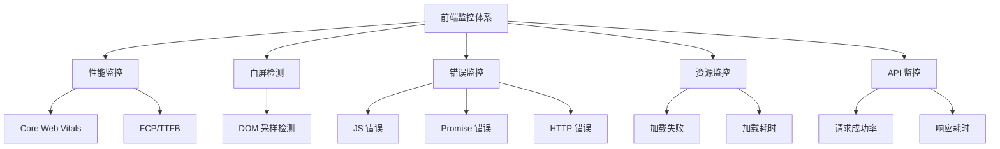
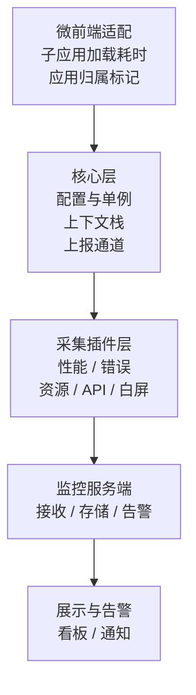
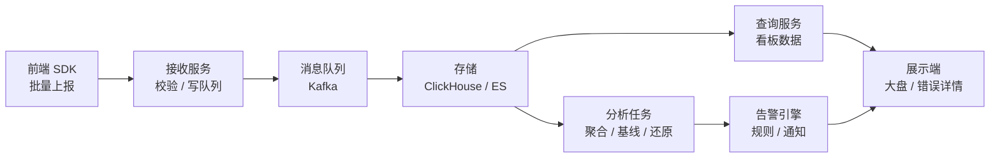

# 前端监控最佳实践

生产环境需要多维度的监控体系，单一工具无法覆盖所有场景。本文从**自研通用 SDK** 的角度完整讲解：一个既能跑在常规前端应用、也能跑在微前端架构下的监控 SDK，应该怎么设计。

## 监控体系概览



## SDK 设计目标

| 目标 | 说明 |
|------|------|
| **通用** | 一套 SDK 覆盖常规应用与微前端，主应用、子应用同一份代码 |
| **低侵入** | 一行 `init()` 完成接入，业务代码零改动 |
| **可插拔** | 采集能力按插件组织，按需开启 |
| **高性能** | 采集不阻塞主线程、上报不丢数据（页面卸载也能送达） |
| **可溯源** | 每条数据带应用归属、Trace ID，能串联前后端完整链路 |

## SDK 总体架构



**分层原则**：核心层只做三件事——管配置、管归属、管上报；所有"采集什么"的逻辑都在插件层。这样新增一种监控能力不需要动核心代码，符合开闭原则。

## 1. 核心层设计

### 1.1 配置与单例

```typescript
interface MonitorOptions {
  dsn: string             // 上报地址
  appName: string         // 应用标识（微前端下主/子应用各自注册）
  samplingRate?: number   // 采样率 0-1，默认 1（大数据量时按比例采样降成本）
  batchSize?: number      // 批量上报条数，默认 10
  flushInterval?: number  // 批量刷新间隔 ms，默认 1000
  enabled?: boolean       // 是否启用（本地开发可关）
}

let instance: Monitor | null = null

export function init(options: MonitorOptions): Monitor {
  if (instance) return instance  // 单例：重复 init 返回已有实例
  instance = new Monitor(options)
  instance.start()
  return instance
}
```

**为什么必须单例？** 微前端下主应用和多个子应用都会加载 SDK。如果各自建实例：

- 同一个错误事件冒泡到 window，会被多个实例重复捕获、重复上报
- 上报通道、采样器各维护一份，资源浪费且数据不一致

全局单例（挂在 `window.__MONITOR__`）保证：**一套核心、多个应用注册**。子应用加载 SDK 时发现已有实例，只注册自己的 `appName` 上下文，不重复建通道。

### 1.2 上下文栈（微前端错误归属的关键）

微前端最难的问题之一：**错误发生了，属于哪个应用？** 错误事件在 window 上统一捕获，但主应用和子应用的 JS 都在同一个 window 上执行，不标记就分不清。

解法是维护一个**应用上下文栈**：

```typescript
// 栈顶 = 当前正在执行的应用
const contextStack: string[] = []

// 包裹一段"属于某个应用"的执行过程（渲染、事件处理、路由切换…）
export function withContext<T>(appName: string, fn: () => T): T {
  contextStack.push(appName)
  try {
    return fn()
  } finally {
    contextStack.pop()  // 无论成功失败都出栈，保证栈不泄漏
  }
}

// 错误发生时取栈顶，就是当前应用的归属
export function getCurrentApp(): string | undefined {
  return contextStack[contextStack.length - 1]
}
```

**为什么用栈而不是单个变量？** 应用可能嵌套：子应用渲染过程中又调用了主应用的公共组件。栈能正确记录"内层错误归子应用、外层错误归主应用"。单个变量会被覆盖。

**异步穿透问题**：`setTimeout`、`Promise` 回调执行时上下文栈已经弹出，错误归属会丢。两个兜底：

1. **关键异步操作包裹**：子应用路由守卫、请求拦截器里用 `withContext` 包一层
2. **事件标记兜底**：微前端框架（qiankun/wujie）在沙箱中执行子应用代码，可以在沙箱入口自动包 `withContext`

### 1.3 上报通道

上报设计有三个硬要求：**批量**（减少请求数）、**不丢**（页面卸载也要送达）、**不阻塞**（不能影响业务性能）。

```typescript
class Reporter {
  private buffer: ReportItem[] = []
  private timer: ReturnType<typeof setTimeout> | null = null

  constructor(private options: MonitorOptions) {}

  report(item: ReportItem) {
    if (!this.options.enabled) return
    // 采样：高流量场景按比例丢弃，保数据量可控
    if (Math.random() > (this.options.samplingRate ?? 1)) return
    // 去重：同应用 + 同错误栈 + 同行号，时间窗口内只报一次
    if (this.isDuplicate(item)) return
    // 附加公共字段：归属应用、页面、链路 ID
    item.app = getCurrentApp() ?? this.options.appName
    item.url = window.location.href
    item.traceId = getTraceId()
    item.timestamp = Date.now()

    this.buffer.push(item)
    // 批量策略：攒够 N 条立即发，否则定时器兜底（1s 一刷）
    if (this.buffer.length >= (this.options.batchSize ?? 10)) {
      this.flush()
    } else if (!this.timer) {
      this.timer = setTimeout(() => this.flush(), this.options.flushInterval ?? 1000)
    }
  }

  private flush() {
    if (!this.buffer.length) return
    const items = this.buffer.splice(0)
    const body = JSON.stringify(items)
    // sendBeacon 优先：不阻塞主线程，页面卸载时也能送达
    if (navigator.sendBeacon) {
      navigator.sendBeacon(this.options.dsn, body)
    } else {
      // 降级：fetch keepalive（不兼容时放弃，不能阻塞业务）
      fetch(this.options.dsn, { method: 'POST', body, keepalive: true }).catch(() => {})
    }
    this.timer = null
  }
}
```

**为什么用 sendBeacon 而不是 fetch/axios？** 关键场景是**页面卸载时**（跳转、关闭）上报——fetch 的请求在卸载瞬间会被浏览器取消，数据丢失；sendBeacon 由浏览器保证送达，且不阻塞卸载流程。批量上报把几十条合并成一条，进一步减少请求数。

**去重细节**：错误刷屏是常见事故（一个空指针在循环里报 10 万次），会打爆上报通道。按"应用 + 错误消息 + 行列号"做 key，存进一个带时间窗口的 Map，窗口内重复直接丢弃。

## 2. 采集插件层

### 2.1 性能监控（Core Web Vitals）

使用 `web-vitals` 库测量，但它只负责"取数"，上报走 SDK 的通道：

```typescript
import { onLCP, onINP, onCLS, onFCP, onTTFB } from 'web-vitals'

export function performancePlugin(reporter: Reporter) {
  const send = (metric: any) => {
    reporter.report({
      type: 'performance',
      name: metric.name,       // 'LCP' | 'INP' | 'CLS' ...
      value: metric.value,     // 指标值（ms 或无单位）
      rating: metric.rating,   // 'good' | 'needs-improvement' | 'poor'
      navigationType: metric.navigationType, // 首屏导航还是往返缓存
    })
  }
  onLCP(send)
  onINP(send)
  onCLS(send)
  onFCP(send)
  onTTFB(send)
}
```

评级标准（web-vitals 内部已按此评级，采集端直接透传）：

| 指标 | Good | Needs Improvement | Poor |
|------|------|-------------------|------|
| **LCP** | ≤ 2500ms | ≤ 4000ms | > 4000ms |
| **INP** | ≤ 200ms | ≤ 500ms | > 500ms |
| **CLS** | ≤ 0.1 | ≤ 0.25 | > 0.25 |
| **FID** | ≤ 100ms | ≤ 300ms | > 300ms |

### 2.2 错误监控

统一入口设计：**所有采集器最终都调 `reporter.report`**，后续要加字段、做去重、接告警，只改一处。

```typescript
export function errorPlugin(reporter: Reporter) {
  // 捕获阶段监听：资源错误不会冒泡，必须在捕获阶段才能收到
  window.addEventListener('error', (e) => {
    if (e.target !== window) {
      // 资源加载错误：event.target 是出错元素（img/script/link）
      reporter.report({
        type: 'resource-error',
        tagName: e.target.tagName,
        src: (e.target as HTMLElement).src || (e.target as HTMLElement).href,
      })
    } else {
      // JS 运行时错误：归属当前上下文的应用
      reporter.report({
        type: 'js-error',
        message: e.message,
        lineno: e.lineno,
        colno: e.colno,
        stack: e.error?.stack,
      })
    }
  }, true)

  // Promise 未捕获异常
  window.addEventListener('unhandledrejection', (e) => {
    reporter.report({
      type: 'promise-error',
      message: e.reason?.message || String(e.reason),
      stack: e.reason?.stack,
    })
  })
}
```

**框架错误怎么接？** 框架内错误不一定冒泡到 window：

- **Vue**：`app.config.errorHandler = (err) => reporter.report({ type: 'vue-error', ... })`
- **React**：ErrorBoundary 的 `componentDidCatch` 里上报

**SourceMap 还原**：上报的堆栈是压缩后代码的行列号，人看不懂。生产构建把 sourcemap 传给监控服务端（**不上公网**），服务端用 `source-map` 库还原（`SourceMapConsumer.originalPositionFor`）得到源码位置。客户端只发原始堆栈——还原放服务端，客户端体积和耗时都最小。

### 2.3 资源与长任务监控

```typescript
export function resourcePlugin(reporter: Reporter) {
  // 慢资源：JS/CSS/图片加载超阈值
  new PerformanceObserver((list) => {
    for (const entry of list.getEntries()) {
      if (entry.duration > 3000) {
        reporter.report({
          type: 'slow-resource',
          url: entry.name,
          duration: entry.duration,
          initiatorType: (entry as PerformanceResourceTiming).initiatorType,
        })
      }
    }
  }).observe({ entryTypes: ['resource'] })

  // 长任务：主线程阻塞超 50ms，往往是卡顿元凶
  new PerformanceObserver((list) => {
    for (const entry of list.getEntries()) {
      reporter.report({
        type: 'long-task',
        duration: entry.duration,
        startTime: entry.startTime,
      })
    }
  }).observe({ entryTypes: ['longtask'] })
}
```

**长任务为什么重要？** 主线程一次执行超过 50ms 就会掉帧，用户感知"卡"。长任务监控能定位到是哪个时间段、多长的阻塞，配合 Performance 面板能还原当时的执行栈。

### 2.4 API 监控 + 链路 ID

拦截 fetch/XHR，统计成功率与耗时，同时**注入 Trace ID** 串联前后端：

```typescript
export function apiPlugin(reporter: Reporter) {
  const originalFetch = window.fetch

  window.fetch = async function (...args: Parameters<typeof fetch>) {
    const start = performance.now()
    const url = typeof args[0] === 'string' ? args[0] : args[0]?.url
    const traceId = genTraceId()

    // 请求头带链路 ID：后端日志、追踪系统能按同一 ID 关联
    const [input, init = {}] = args
    init.headers = { ...init.headers, 'X-Trace-ID': traceId }

    try {
      const res = await originalFetch(input, init)
      reporter.report({
        type: 'api',
        url,
        status: res.status,
        success: res.ok,
        duration: performance.now() - start,
        traceId,
      })
      return res
    } catch (e) {
      reporter.report({
        type: 'api-error',
        url,
        message: (e as Error).message,
        duration: performance.now() - start,
        traceId,
      })
      throw e  // 不能吞错误，业务方还要处理
    }
  }
}
```

**Trace ID 链路**：前端发起请求带 `X-Trace-ID` → 后端中间件透传并写日志 → 监控数据也带同一 ID。出问题时：用户报障 → 按 traceId 查到前端请求、后端日志、数据库慢查询，全链路还原。

### 2.5 白屏检测

页面加载后采样 9 个点，超过 7 个点无实质内容判定白屏：

```typescript
export function whiteScreenPlugin(reporter: Reporter) {
  const check = () => {
    let emptyPoints = 0
    for (let i = 1; i <= 9; i++) {
      const el = document.elementFromPoint(
        (window.innerWidth * i) / 10,  // 横向等距采样
        window.innerHeight / 2          // 垂直中线
      )
      if (isContainer(el)) emptyPoints++
    }
    if (emptyPoints >= 7) {
      reporter.report({ type: 'white-screen', emptyPoints })
    }
  }

  if (document.readyState === 'complete') {
    check()
  } else {
    window.addEventListener('load', check)
  }
}

function isContainer(el: Element | null) {
  if (!el) return true
  const tag = el.tagName.toLowerCase()
  // 无内容的容器标签视为"空"
  return ['html', 'body', 'div', 'ul', 'ol'].includes(tag)
    && el.children.length === 0
    && !el.textContent.trim()
}
```

**为什么白屏要单独检测？** 白屏不一定会抛 JS 错误（比如路由配置错误、CSS 挂了、接口返回慢），只有从"用户视角"看页面是不是空的才能发现。它是 JS 错误监控之外的另一道防线。

## 3. 微前端适配

### 3.1 接入方式

主应用是唯一 `init` 的人，子应用只注册 + 标记：

```typescript
// 主应用入口
import { init, withContext } from '@monitor/sdk'
init({ dsn: '/api/monitor', appName: 'main-app' })

// 挂载子应用时包裹上下文：子应用 JS 执行期间的错误自动归到 child-app
withContext('child-app', () => {
  loadMicroApp({ name: 'child-app', entry: 'http://child.example.com' })
})
```

```typescript
// 子应用入口：检测到已有实例，只注册自己，不重复建通道
import { init } from '@monitor/sdk'
init({ dsn: '/api/monitor', appName: 'child-app' })  // 内部走单例合并
```

**单例合并逻辑**：`init` 发现 `window.__MONITOR__` 已存在 → 返回已有实例 → 追加注册子应用名。子应用卸载（`unmount`）时移除自己的上下文，避免"幽灵应用"归属。

### 3.2 子应用加载耗时

子应用 JS/CSS 是动态加载的资源，按 URL 前缀过滤 resource 条目即可拆解：

```typescript
export function microFrontendPlugin(reporter: Reporter, childEntry: string) {
  let mountStart = 0

  new PerformanceObserver((list) => {
    for (const entry of list.getEntries()) {
      // 只统计属于该子应用的资源
      if (entry.name.startsWith(childEntry)) {
        reporter.report({
          type: 'child-app-load',
          app: 'child-app',
          resource: entry.name,
          duration: entry.duration,
          initiatorType: (entry as PerformanceResourceTiming).initiatorType,
        })
      }
    }
  }).observe({ entryTypes: ['resource'] })

  // 子应用从"开始加载"到"首屏渲染完成"的整体耗时：
  // 主应用加载子应用前调 markChildAppStart，子应用挂载完成调 markChildAppMounted
  return {
    markChildAppStart() { mountStart = performance.now() },
    markChildAppMounted() {
      reporter.report({ type: 'child-app-mount', duration: performance.now() - mountStart })
    },
  }
}
```

**加载耗时拆解维度**：资源加载（JS/CSS 分文件）、脚本执行、首屏渲染，三段相加才是子应用完整体验。子应用变慢时先看是哪一段——资源慢是网络/CDN 问题，执行慢是代码问题，渲染慢是 DOM 复杂度问题。

### 3.3 微前端专属坑

| 坑 | 表现 | 对策 |
|----|------|------|
| **错误重复上报** | 主应用子应用各捕获一次 | 单例 + 全局统一监听 |
| **归属错乱** | 子应用错误记到主应用头上 | appContext 栈 + 沙箱入口包裹 |
| **应用卸载后仍上报** | 幽灵数据污染统计 | unmount 时销毁插件、清上下文 |
| **样式/资源加载跨应用** | 子应用引了主应用资源 | 按 entry 前缀过滤归属 |

## 4. 数据链路：从采集到告警

SDK 只是采集端，完整监控体系要打通：**采集 → 存储 → 基线 → 告警 → 归因**。

### 4.1 数据形态

上报到服务端的数据统一结构：

```typescript
interface ReportItem {
  type: string          // 'js-error' | 'performance' | 'api' ...
  app: string           // 归属应用（微前端关键字段）
  url: string           // 页面地址
  traceId: string       // 链路 ID，串联前后端
  timestamp: number
  // 各类型自有字段（message/stack/value/duration...）
  [key: string]: unknown
}
```

### 4.2 基线建立与劣化告警

光有数据不会自动发现问题，要建立**基线 + 相对阈值**：

| 环节 | 做法 |
|------|------|
| **基线建立** | 连续采集后按**分位数**（p50/p95）而非平均值建立基线——平均值会被极端值带偏，p95 代表"大多数用户的下限体验" |
| **劣化判定** | 相对阈值：超基线 30% 告警；或绝对阈值：LCP > 2.5s |
| **时间对比** | 同比上周同时段（监控有周期性：工作日/周末、白天/晚上流量不同） |
| **发版 diff** | 每次发版对比前后指标，劣化立即定位到版本 |
| **告警分级** | 仅通知 → 拉群 → 拦截发布，按严重程度逐级升级 |

**核心思维**：告警不是"指标超了阈值"，而是"**相对自身基线的劣化**"。绝对阈值会漏掉"从 1s 涨到 2.4s"的慢性劣化，相对阈值能抓住每次变化。

## 5. 监控系统设计

SDK 只是采集端，负责"把数据送出来"；监控系统负责"收、存、算、看、告"——**SDK 存数据，系统给人看**。两者合起来才是完整体系。

### 5.1 系统架构



### 5.2 接收服务

职责**单一**：收数据、校验、写队列。重计算（聚合、还原）全部放下游，保证接收端永远快。

```typescript
// 接收端接口示意：一次收一批（SDK 端已批量），不做业务处理
app.post('/api/monitor', async (ctx) => {
  const items = ctx.request.body as ReportItem[]
  // 1. 基本校验：丢弃空/超大/非法数据（防刷防脏）
  const valid = items.filter(isValid)
  // 2. 写消息队列即返回，聚合由下游异步消费
  await kafka.send('monitor-events', valid)
  ctx.status = 204
})
```

要点：

- **限流**：按 `app + IP` 限流，防误埋点刷爆服务
- **无状态多副本**：接收服务可以水平扩容，不存状态
- **为什么过 Kafka**：采集数据峰值波动大（大促、发版瞬间），队列削峰，存储层不会被瞬时洪峰打垮

### 5.3 存储选型

监控数据的特征决定选型：**写多读少、按时间聚合、高基数**（url × app × 错误类型组合爆炸）。

| 方案 | 适用 | 原因 |
|------|------|------|
| **ClickHouse** | 中大规模（首选） | 列存 + 按天分区，时间序列聚合秒级，写入吞吐高 |
| **Elasticsearch** | 需要全文检索 | 错误消息模糊搜索、堆栈检索，但聚合性能弱于 ClickHouse |
| **MySQL** | 小规模/起步 | 简单，但高基数聚合慢、写入是瓶颈 |

自建首选 **ClickHouse**：监控查询几乎都是"按时间 + 维度聚合"，这正是列存数据库的强项；按天分区后，过期数据直接 DROP 分区，天然管理数据生命周期。

### 5.4 数据聚合与还原

- **实时聚合**：错误率、API 成功率、性能分位数，1 分钟粒度滚动聚合——告警依赖它
- **离线基线**：每天跑一次 p50/p95、同比上周，更新基线表——劣化判断依赖它
- **SourceMap 还原**：服务端异步任务消费错误数据，用 `source-map` 库还原堆栈（客户端只发原始堆栈，还原结果缓存，同一位置不重复算）

### 5.5 展示端

| 页面 | 内容 |
|------|------|
| **大盘** | PV、错误率、性能趋势总览，一眼看出今天整体健康度 |
| **错误列表/详情** | 按"消息+位置"聚合去重，堆栈已还原，关联 traceId 跳链路 |
| **性能分析** | 指标趋势 + p50/p95 + 版本 diff（发版前后对比） |
| **链路查询** | 输入 traceId → 前端请求、后端日志、数据库慢查询全链路还原 |

### 5.6 告警引擎

```typescript
interface AlertRule {
  metric: string        // 'error-rate' | 'api-fail-rate' | 'lcp-p95' ...
  type: 'absolute' | 'baseline'  // 绝对阈值 or 相对基线
  threshold: number     // 绝对：0.05（5%）；相对：1.3（超基线 30%）
  level: 'P0' | 'P1' | 'P2'
  duration: number      // 持续 N 分钟才告警，防瞬时抖动误报
}
```

| 分级 | 动作 | 场景 |
|------|------|------|
| **P0** | 拦截发布 + 立即拉群 | 错误率 > 10% 持续 5 分钟 |
| **P1** | 拉群 + 邮件 | 超基线 30% 持续 10 分钟 |
| **P2** | 邮件/看板标红 | 轻微劣化，观察 |

**防告警风暴**：同一规则告警后进入"抑制期"，恢复前不重复告警；恢复后自动关闭，避免刷屏。

## 6. 与 Sentry 等平台的关系

| 需求 | 推荐方案 |
|------|---------|
| **轻量级自研** | 本 SDK + 简易接收服务，web-vitals + 错误/资源/API/白屏 |
| **完整自建** | SDK + 接收服务 + Kafka + ClickHouse + 看板 + 告警（本文 5 节） |
| **错误追踪开箱即用** | Sentry（错误 + 性能 + 堆栈还原） |
| **完整商业化平台** | Fundbug（国内）、阿里云 ARMS |

**要不要和 Sentry 互补？看自建深度**：

- **完整自建**（5 节全做）：不需要 Sentry——堆栈还原、聚合、告警工作流自建都能覆盖，只是开发成本高（尤其还原与聚合的成熟度）
- **互补式**：自研聚焦业务链路（微前端归属、基线告警、链路 ID），错误聚合交给 Sentry——适合已有 Sentry 基建、不想重复造轮子的团队
- **起步阶段**：自建"接收 + 存储 + 简易看板"，错误追踪用 Sentry 免费版，成本最低

**实践建议**：开发阶段用 Lighthouse 做实验室优化，生产环境跑自研 SDK 的 RUM 数据。是否接 Sentry 取决于团队是否已有基建，而不是"必须"。若决定自建，按本文 5 节落地即可形成完整闭环。
