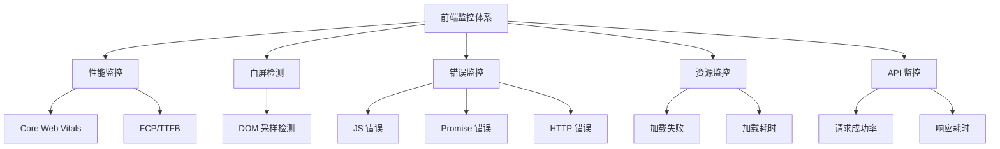

# 前端监控最佳实践

生产环境需要多维度的监控体系，单一工具无法覆盖所有场景。

## 监控体系概览



## 1. 性能监控

使用 `web-vitals` 库测量 Core Web Vitals 指标。

### 安装

```bash
npm install web-vitals
```

### 基础用法

```javascript
import { onLCP, onFID, onCLS, onINP } from 'web-vitals';

function sendToAnalytics(metric) {
  navigator.sendBeacon('/api/metrics', JSON.stringify({
    name: metric.name,
    value: metric.value,
    rating: metric.rating,
    url: window.location.href
  }));
}

onLCP(sendToAnalytics);
onFID(sendToAnalytics);
onCLS(sendToAnalytics);
onINP(sendToAnalytics);
```

### Metric 对象结构

每个回调收到的 `metric` 对象包含：

```javascript
{
  name: 'LCP',              // 指标名称
  value: 2500,              // 指标值（毫秒或无单位）
  rating: 'good',           // 评级：'good' | 'needs-improvement' | 'poor'
  delta: 2500,              // 与上次报告的变化量
  id: 'v1-123456',          // 唯一 ID
  navigationType: 'navigate', // 导航类型
  entries: [...]            // 底层 PerformanceEntry 数组
}
```

### 评级标准

| 指标 | Good | Needs Improvement | Poor |
|------|------|-------------------|------|
| **LCP** | ≤ 2500ms | ≤ 4000ms | > 4000ms |
| **INP** | ≤ 200ms | ≤ 500ms | > 500ms |
| **CLS** | ≤ 0.1 | ≤ 0.25 | > 0.25 |
| **FID** | ≤ 100ms | ≤ 300ms | > 300ms |

### 与 Lighthouse 的区别

| 维度 | web-vitals | Lighthouse |
|------|-----------|------------|
| **数据来源** | 真实用户数据（RUM） | 实验室模拟数据 |
| **运行环境** | 生产环境 | 开发/测试环境 |
| **数据真实性** | 高（反映真实体验） | 中（模拟环境） |
| **使用场景** | 持续监控 | 开发阶段优化 |

## 2. 白屏检测

通过 DOM 采样检测页面是否为空。

### 检测原理

在页面关键位置采样，检查是否有实质内容：

```
采样点分布（9 个点）：
┌───┬───┬───┐
│ 1 │ 2 │ 3 │
├───┼───┼───┤
│ 4 │ 5 │ 6 │  ← 页面垂直中心线
├───┼──────┤
│ 7 │ 8 │ 9 │
└───┴───┴───┘
```

### 实现代码

```javascript
function checkWhiteScreen() {
  let emptyPoints = 0;
  
  // 在页面 9 个关键点采样
  for (let i = 1; i <= 9; i++) {
    const element = document.elementFromPoint(
      (window.innerWidth * i) / 10,
      window.innerHeight / 2
    );
    
    // 检查是否是容器元素（无实质内容）
    if (isContainer(element)) emptyPoints++;
  }
  
  // 超过 7 个点为空，判定为白屏
  if (emptyPoints >= 7) {
    reportWhiteScreen();
  }
}

function isContainer(element) {
  if (!element) return true;
  const tagName = element.tagName.toLowerCase();
  // 无内容的容器标签
  return ['html', 'body', 'div', 'ul', 'ol'].includes(tagName) 
    && element.children.length === 0 
    && !element.textContent.trim();
}

// 页面加载完成后检测
if (document.readyState === 'complete') {
  checkWhiteScreen();
} else {
  window.addEventListener('load', checkWhiteScreen);
}
```

### 检测时机说明

| 写法 | 含义 |
|------|------|
| `document.readyState === 'complete'` | 页面**已经**加载完了，直接执行检查 |
| `window.addEventListener('load', ...)` | 页面**还没**加载完，等加载完再执行检查 |

这是防御性写法，确保无论代码何时执行，都能在页面加载完成后检查白屏。

## 3. 错误监控

捕获三类错误：JS 运行时错误、Promise 未捕获异常、资源加载错误。

### JS 运行时错误

```javascript
window.addEventListener('error', (event) => {
  reportError({
    type: 'js-error',
    message: event.message,
    filename: event.filename,
    lineno: event.lineno,
    colno: event.colno,
    stack: event.error?.stack
  });
});
```

### Promise 未捕获异常

```javascript
window.addEventListener('unhandledrejection', (event) => {
  reportError({
    type: 'promise-error',
    message: event.reason?.message || String(event.reason),
    stack: event.reason?.stack
  });
});
```

### 资源加载错误

```javascript
// 注意：需要在捕获阶段监听
window.addEventListener('error', (event) => {
  if (event.target !== window) {
    reportError({
      type: 'resource-error',
      tagName: event.target.tagName,
      src: event.target.src || event.target.href
    });
  }
}, true);  // 捕获阶段
```

### 错误上报

```javascript
function reportError(error) {
  navigator.sendBeacon('/api/errors', JSON.stringify({
    ...error,
    url: window.location.href,
    userAgent: navigator.userAgent,
    timestamp: Date.now()
  }));
}
```

## 4. 资源加载监控

使用 `PerformanceObserver` 监控资源加载。

### 慢资源监控

```javascript
const observer = new PerformanceObserver((list) => {
  for (const entry of list.getEntries()) {
    if (entry.initiatorType === 'script' && entry.duration > 3000) {
      // JS 文件加载超过 3 秒，上报
      reportSlowResource({
        url: entry.name,
        duration: entry.duration,
        type: entry.initiatorType
      });
    }
  }
});

observer.observe({ entryTypes: ['resource'] });
```

### 长任务监控

```javascript
const longTaskObserver = new PerformanceObserver((list) => {
  for (const entry of list.getEntries()) {
    reportLongTask({
      duration: entry.duration,
      startTime: entry.startTime
    });
  }
});

longTaskObserver.observe({ entryTypes: ['longtask'] });
```

## 5. API 请求监控

拦截 fetch 请求，监控成功率和耗时。

```javascript
const originalFetch = window.fetch;

window.fetch = async function(...args) {
  const startTime = performance.now();
  const url = typeof args[0] === 'string' ? args[0] : args[0]?.url;
  
  try {
    const response = await originalFetch.apply(this, args);
    
    // 上报成功请求
    reportApiRequest({
      url,
      method: args[1]?.method || 'GET',
      status: response.status,
      duration: performance.now() - startTime,
      success: response.ok
    });
    
    return response;
  } catch (error) {
    // 上报失败请求
    reportApiRequest({
      url,
      method: args[1]?.method || 'GET',
      error: error.message,
      duration: performance.now() - startTime,
      success: false
    });
    throw error;
  }
};
```

## 监控平台推荐

| 平台 | 类型 | 特点 |
|------|------|------|
| **Sentry** | 开源/自托管 | 错误监控为主，支持性能监控 |
| **Fundbug** | 商业 | 国内服务，中文支持好 |
| **阿里云 ARMS** | 商业 | 阿里云生态，功能全面 |
| **自建** | 自研 | 完全可控，开发成本高 |

## 方案选择

| 需求 | 推荐方案 |
|------|---------|
| **轻量级** | web-vitals + 自己实现白屏/错误监控 |
| **开箱即用** | Sentry（错误 + 性能）、Fundbug（国内） |
| **完全可控** | 自建监控平台 |

**最佳实践：** 开发阶段用 Lighthouse 优化，生产环境用 web-vitals 监控真实用户数据，配合 Sentry 做错误追踪。
