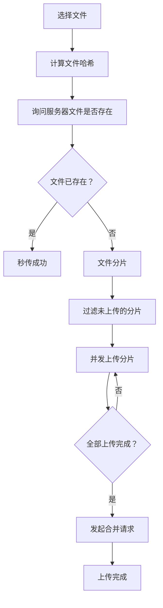

# 大文件上传

大文件上传的核心思路：**分片 + 并发 + 断点续传 + 秒传**。

## 基本流程



## 实现步骤

### 1. 计算文件哈希

```javascript
// 使用 Web Worker + requestIdleCallback 计算哈希
function calculateHash(file) {
  return new Promise((resolve) => {
    const worker = new Worker('hash-worker.js');
    worker.postMessage(file);
    worker.onmessage = (e) => {
      resolve(e.data);
    };
  });
}
```

**优化**：
- 文件较大时，完整计算哈希很耗时
- 建议**取样计算**（如每 100KB 取一个样本）
- 使用 **Web Worker** 避免阻塞主线程
- 使用 **requestIdleCallback** 在空闲时计算

### 2. 秒传检测

```javascript
// 带着文件哈希询问服务器
const response = await fetch('/check', {
  method: 'POST',
  body: JSON.stringify({ hash: fileHash }),
});

const { exists, uploadedChunks } = await response.json();

if (exists) {
  // 文件已存在，秒传成功
  console.log('秒传成功');
} else {
  // 文件不存在，需要上传
  // uploadedChunks: 已上传的分片（断点续传）
}
```

### 3. 文件分片

```javascript
const CHUNK_SIZE = 5 * 1024 * 1024; // 5MB 每片
const chunks = [];

for (let i = 0; i < file.size; i += CHUNK_SIZE) {
  chunks.push({
    file: file.slice(i, i + CHUNK_SIZE),
    hash: `${fileHash}-${i}`,
    index: i / CHUNK_SIZE,
    status: 'wait', // wait | uploading | done | error
    progress: 0,
  });
}

// 过滤出未上传的分片（断点续传）
const unuploadedChunks = chunks.filter(
  chunk => !uploadedChunks.includes(chunk.hash)
);
```

### 4. 并发上传

```javascript
async function uploadChunks(chunks, max = 4, retrys = 3) {
  let idx = 0;
  let counter = 0;
  const retryCount = new Array(chunks.length).fill(0);

  const start = async () => {
    while (counter < chunks.length && max > 0) {
      max--; // 占用通道
      
      const i = chunks.findIndex(
        v => v.status === 'wait' || v.status === 'error'
      );
      if (i < 0) return;
      
      chunks[i].status = 'uploading';
      
      try {
        await uploadChunk(chunks[i]);
        chunks[i].status = 'done';
        counter++;
        max++; // 释放通道
        
        if (counter === chunks.length) {
          return; // 全部完成
        }
        start(); // 继续上传
      } catch (err) {
        retryCount[i]++;
        
        if (retryCount[i] >= retrys) {
          throw new Error(`分片 ${i} 上传失败`);
        }
        
        chunks[i].status = 'error';
        max++; // 释放通道
        start(); // 重试
      }
    }
  };

  start();
}
```

### 5. 合并分片

```javascript
await fetch('/merge', {
  method: 'POST',
  body: JSON.stringify({
    hash: fileHash,
    total: chunks.length, // 分片总数（服务端校验完整性用）
  }),
});
```

## 服务端设计（Koa）

前端只管发，服务端要接得住。核心是三个接口 + 一个安全的存储结构。

### 接口总览

| 接口 | 方法 | 作用 |
|------|------|------|
| `/check` | POST | 秒传检测 + 返回已上传分片（断点续传） |
| `/upload` | POST | 接收单个分片（multipart），落盘到临时目录 |
| `/merge` | POST | 校验分片齐全后**流式合并**，清理临时分片 |

### 存储结构

```
uploads/
  tmp/<fileHash>/       # 分片临时目录（上传中）
    0.bin
    1.bin
  files/<fileHash>.bin  # 合并后的完整文件（文件名即哈希，天然秒传）
```

### 1. /check：秒传检测 + 断点续传

```javascript
import Router from '@koa/router'
import fs from 'fs'
import path from 'path'

const router = new Router()
const UPLOAD_DIR = path.resolve('uploads')

router.post('/check', async (ctx) => {
  const { hash } = ctx.request.body
  const filePath = path.join(UPLOAD_DIR, 'files', hash)
  const tmpDir = path.join(UPLOAD_DIR, 'tmp', hash)

  // 完整文件已存在 → 秒传
  if (fs.existsSync(filePath)) {
    ctx.body = { exists: true, uploadedChunks: [] }
    return
  }

  // 返回已上传分片，格式与前端 chunk.hash（`${fileHash}-${i}`）对齐
  const uploadedChunks = fs.existsSync(tmpDir)
    ? fs.readdirSync(tmpDir).map((f) => `${hash}-${parseInt(f)}`)
    : []
  ctx.body = { exists: false, uploadedChunks }
})
```

### 2. /upload：分片上传（幂等）

用 `koa-body` 处理 multipart，分片已落盘为临时文件（`file.filepath`），不会占内存：

```javascript
import koaBody from 'koa-body'

app.use(koaBody({ multipart: true }))

router.post('/upload', async (ctx) => {
  const { hash, index } = ctx.request.body
  const file = ctx.request.files.chunk
  const tmpDir = path.join(UPLOAD_DIR, 'tmp', hash)
  fs.mkdirSync(tmpDir, { recursive: true })

  // 分片也走流式写入，避免内存暴涨
  const reader = fs.createReadStream(file.filepath)
  const writer = fs.createWriteStream(path.join(tmpDir, `${index}.bin`))
  reader.pipe(writer)
  await new Promise((resolve, reject) => {
    writer.on('finish', resolve)
    writer.on('error', reject)
  })

  ctx.body = { ok: true }
})
```

**幂等**：同一分片重复上传直接覆盖同名文件——断点续传时前端重传已上传的分片也不会出错。

### 3. /merge：流式合并

合并是重头戏：**绝对不能 `readFileSync` 把全部分片拼进内存**（1GB 文件直接 OOM，见 node-core 的流式读写）。正确姿势是分片逐个 `pipe`，内存恒定：

```javascript
router.post('/merge', async (ctx) => {
  const { hash, total } = ctx.request.body
  const tmpDir = path.join(UPLOAD_DIR, 'tmp', hash)
  const destPath = path.join(UPLOAD_DIR, 'files', hash)

  // 校验分片是否齐全
  const chunks = fs.readdirSync(tmpDir).sort((a, b) => parseInt(a) - parseInt(b))
  if (chunks.length !== total) {
    ctx.status = 400
    ctx.body = { error: `分片不完整：${chunks.length}/${total}` }
    return
  }

  // 逐片 pipe：每一片读完再读下一片，内存始终 ~64KB
  const writer = fs.createWriteStream(destPath)
  for (const chunk of chunks) {
    const reader = fs.createReadStream(path.join(tmpDir, chunk))
    reader.pipe(writer, { end: false })  // end: false = 读完当前片不关闭 writer
    await new Promise((resolve, reject) => {
      reader.on('end', resolve)
      reader.on('error', reject)
    })
  }
  writer.end()
  await new Promise((resolve) => writer.on('finish', resolve))

  // 合并完成，清理分片目录
  fs.rmSync(tmpDir, { recursive: true, force: true })

  ctx.body = { ok: true, url: `/files/${hash}` }
})
```

### 注意事项

| 事项 | 说明 |
|------|------|
| **合并必须流式** | `readFile` 一次性加载，大文件直接 OOM；流式合并内存恒定 |
| **分片校验** | 合并前数分片数量，不全直接 400，防止损坏文件 |
| **分片幂等** | 同名覆盖，断点续传安全 |
| **孤儿分片清理** | 上传中断会残留 tmp 目录，定时任务清理超过 N 小时未合并的目录 |
| **大小限制** | `koa-body` 配置 `formidable` 的 `maxFileSize`，防止超大请求拖垮服务 |
| **鉴权与校验** | 真实项目合并前校验 hash 与分片一致性（可选：边合并边算哈希对比） |

## 暂停/恢复

### 暂停

```javascript
// 存储所有 XHR 请求
const xhrList = [];

// 暂停：取消所有请求
xhrList.forEach(xhr => xhr.abort());
```

### 恢复

从第 2 步（秒传检测）开始重新执行，服务器会返回已上传的分片，继续上传未完成的分片。

## 进度条

### 单分片进度

```javascript
xhr.upload.onprogress = (e) => {
  if (e.lengthComputable) {
    chunk.progress = (e.loaded / e.total) * 100;
  }
};
```

### 整体进度

```javascript
const totalProgress = chunks.reduce((sum, chunk) => {
  return sum + chunk.progress;
}, 0) / chunks.length;
```

### 方块进度条

每个方块代表一个分片的上传状态：

```
□ □ □ ■ ■ ■ □ □ □ □
0%  20%  40%  60%  80%  100%
```

```css
.chunk-progress {
  display: flex;
  gap: 4px;
}

.chunk-block {
  width: 20px;
  height: 20px;
  background: #e0e0e0;
}

.chunk-block.done {
  background: #52c41a;
}

.chunk-block.uploading {
  background: #1890ff;
}

.chunk-block.error {
  background: #f5222d;
}
```

## 关键设计

### 并发控制

| 参数 | 说明 | 默认值 |
|------|------|--------|
| `max` | 最大并发数 | 4 |
| `retrys` | 失败重试次数 | 3 |

**原理**：
- 维护一个"通道池"，最多同时上传 `max` 个分片
- 上传成功/失败后释放通道，继续上传下一个
- 失败重试，超过 `retrys` 次标记为失败

### 断点续传

- 每个分片有独立的 hash
- 服务器记录已上传的分片 hash
- 重新上传时，只上传未完成的分片

### 秒传

- 计算整个文件的 hash
- 服务器检查文件是否已存在
- 已存在则直接返回成功，无需上传

## 优化建议

| 优化 | 说明 |
|------|------|
| **取样哈希** | 大文件不要完整计算哈希，取样计算 |
| **Web Worker** | 哈希计算放到 Worker，避免阻塞 UI |
| **分片大小** | 根据网络情况动态调整（通常 1-5MB） |
| **并发数** | 根据设备性能调整（通常 3-6） |
| **进度反馈** | 实时更新进度条，提升用户体验 |
