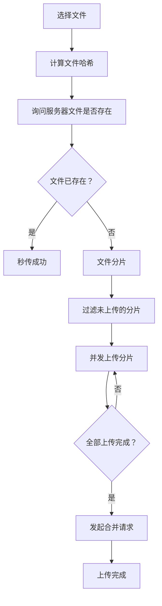

# 大文件上传

大文件上传的核心思路：**分片 + 并发 + 断点续传 + 秒传**。

## 基本流程



## 实现步骤

### 1. 计算文件哈希

```javascript
// 使用 Web Worker + requestIdleCallback 计算哈希
function calculateHash(file) {
  return new Promise((resolve) => {
    const worker = new Worker('hash-worker.js');
    worker.postMessage(file);
    worker.onmessage = (e) => {
      resolve(e.data);
    };
  });
}
```

**优化**：
- 文件较大时，完整计算哈希很耗时
- 建议**取样计算**（如每 100KB 取一个样本）
- 使用 **Web Worker** 避免阻塞主线程
- 使用 **requestIdleCallback** 在空闲时计算

### 2. 秒传检测

```javascript
// 带着文件哈希询问服务器
const response = await fetch('/check', {
  method: 'POST',
  body: JSON.stringify({ hash: fileHash }),
});

const { exists, uploadedChunks } = await response.json();

if (exists) {
  // 文件已存在，秒传成功
  console.log('秒传成功');
} else {
  // 文件不存在，需要上传
  // uploadedChunks: 已上传的分片（断点续传）
}
```

### 3. 文件分片

```javascript
const CHUNK_SIZE = 5 * 1024 * 1024; // 5MB 每片
const chunks = [];

for (let i = 0; i < file.size; i += CHUNK_SIZE) {
  chunks.push({
    file: file.slice(i, i + CHUNK_SIZE),
    hash: `${fileHash}-${i}`,
    index: i / CHUNK_SIZE,
    status: 'wait', // wait | uploading | done | error
    progress: 0,
  });
}

// 过滤出未上传的分片（断点续传）
const unuploadedChunks = chunks.filter(
  chunk => !uploadedChunks.includes(chunk.hash)
);
```

### 4. 并发上传

```javascript
async function uploadChunks(chunks, max = 4, retrys = 3) {
  let idx = 0;
  let counter = 0;
  const retryCount = new Array(chunks.length).fill(0);

  const start = async () => {
    while (counter < chunks.length && max > 0) {
      max--; // 占用通道
      
      const i = chunks.findIndex(
        v => v.status === 'wait' || v.status === 'error'
      );
      if (i < 0) return;
      
      chunks[i].status = 'uploading';
      
      try {
        await uploadChunk(chunks[i]);
        chunks[i].status = 'done';
        counter++;
        max++; // 释放通道
        
        if (counter === chunks.length) {
          return; // 全部完成
        }
        start(); // 继续上传
      } catch (err) {
        retryCount[i]++;
        
        if (retryCount[i] >= retrys) {
          throw new Error(`分片 ${i} 上传失败`);
        }
        
        chunks[i].status = 'error';
        max++; // 释放通道
        start(); // 重试
      }
    }
  };

  start();
}
```

### 5. 合并分片

```javascript
await fetch('/merge', {
  method: 'POST',
  body: JSON.stringify({
    hash: fileHash,
    chunks: chunks.map(c => c.hash),
  }),
});
```

## 暂停/恢复

### 暂停

```javascript
// 存储所有 XHR 请求
const xhrList = [];

// 暂停：取消所有请求
xhrList.forEach(xhr => xhr.abort());
```

### 恢复

从第 2 步（秒传检测）开始重新执行，服务器会返回已上传的分片，继续上传未完成的分片。

## 进度条

### 单分片进度

```javascript
xhr.upload.onprogress = (e) => {
  if (e.lengthComputable) {
    chunk.progress = (e.loaded / e.total) * 100;
  }
};
```

### 整体进度

```javascript
const totalProgress = chunks.reduce((sum, chunk) => {
  return sum + chunk.progress;
}, 0) / chunks.length;
```

### 方块进度条

每个方块代表一个分片的上传状态：

```
□ □ □ ■ ■ ■ □ □ □ □
0%  20%  40%  60%  80%  100%
```

```css
.chunk-progress {
  display: flex;
  gap: 4px;
}

.chunk-block {
  width: 20px;
  height: 20px;
  background: #e0e0e0;
}

.chunk-block.done {
  background: #52c41a;
}

.chunk-block.uploading {
  background: #1890ff;
}

.chunk-block.error {
  background: #f5222d;
}
```

## 关键设计

### 并发控制

| 参数 | 说明 | 默认值 |
|------|------|--------|
| `max` | 最大并发数 | 4 |
| `retrys` | 失败重试次数 | 3 |

**原理**：
- 维护一个"通道池"，最多同时上传 `max` 个分片
- 上传成功/失败后释放通道，继续上传下一个
- 失败重试，超过 `retrys` 次标记为失败

### 断点续传

- 每个分片有独立的 hash
- 服务器记录已上传的分片 hash
- 重新上传时，只上传未完成的分片

### 秒传

- 计算整个文件的 hash
- 服务器检查文件是否已存在
- 已存在则直接返回成功，无需上传

## 优化建议

| 优化 | 说明 |
|------|------|
| **取样哈希** | 大文件不要完整计算哈希，取样计算 |
| **Web Worker** | 哈希计算放到 Worker，避免阻塞 UI |
| **分片大小** | 根据网络情况动态调整（通常 1-5MB） |
| **并发数** | 根据设备性能调整（通常 3-6） |
| **进度反馈** | 实时更新进度条，提升用户体验 |
