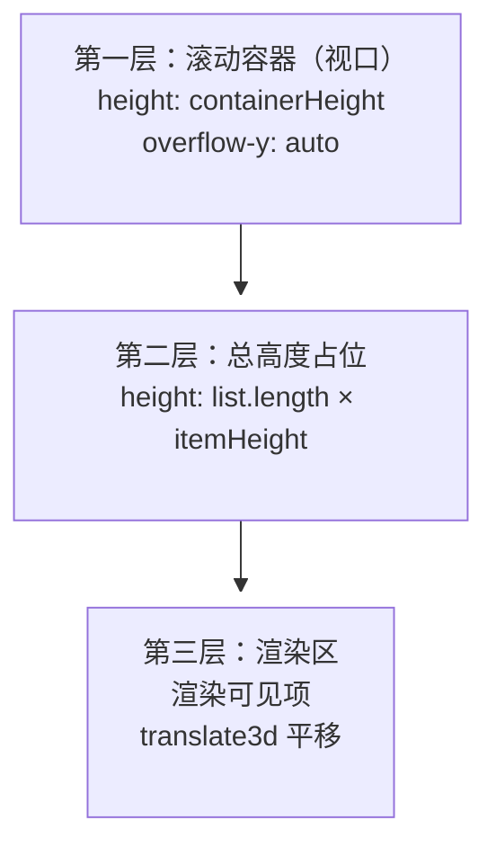

# 长列表优化：虚拟滚动

::: tip 阅读建议
本文从最佳实践角度完整讲解虚拟列表的实现：先讲核心思想，再给出**定高**和**不定高**两版可直接使用的完整代码（关键行有逐行注释），最后总结面试答题框架。建议先理解"三层 DOM 结构"和"两个公式"，再看代码。
:::

## 为什么需要虚拟滚动

### 一次性渲染的代价

假设一个列表有 10 万条数据，直接 `map` 渲染：

- **DOM 节点爆炸**：10 万个节点，浏览器维护它们的成本很高
- **内存占用高**：每个节点都有样式、事件、内部数据结构
- **布局/绘制慢**：样式计算（style/layout）和绘制都要遍历所有节点，滚动时每一帧都在重复

| 数据量 | 渲染的 DOM 节点数 | 首屏渲染 | 滚动体验 |
|--------|------------------|---------|---------|
| 1,000 | 1,000 | 快 | 流畅 |
| 10,000 | 10,000 | 数百 ms | 开始掉帧 |
| 100,000 | 100,000 | 数秒 | 明显卡顿 |

### 虚拟滚动的思路

**不管数据有多少，只渲染"视口内能看到的那些项"**。视口一次只能显示几十个，那就只渲染这几十个，其余用"总高度占位"骗过滚动条，滚动时动态换一批。

这样 DOM 节点数恒定为"视口项数 + 缓冲区"（几十个），与总数据量无关，10 万条和 100 条的性能一样。

## 核心公式与三层 DOM

定高列表（每项高度固定为 `itemHeight`）的核心是三个公式：

```
可见起始索引  startIndex = floor(scrollTop / itemHeight)
可见结束索引  endIndex   = startIndex + 视口容纳项数 + 缓冲区项数
渲染区偏移    offset     = scrollTop - (scrollTop % itemHeight)
```

对应的 DOM 结构是经典的三层：



- **第一层**是真正的滚动容器，负责监听 scroll
- **第二层**只提供高度，不渲染内容——滚动条的长度由它决定
- **第三层**是唯一渲染内容的地方，滚动时把可见项平移进视口

## 定高虚拟列表

### 完整代码实现

```jsx
import React, { useState, useEffect, useRef, useCallback } from 'react';

/**
 * 定高虚拟列表组件
 * 使用前提：所有列表项高度一致
 *
 * @param {Array}     list            数据源（可能上万条）
 * @param {number}    itemHeight      每一项的固定高度（px）
 * @param {number}    containerHeight 滚动容器可视高度（px）
 * @param {number}    bufferCount     缓冲区项数：视口上下各多渲染几项，防止快速滚动闪白
 * @param {Function}  onRequest       滚动到底部附近时触发（常用于加载更多）
 * @param {Function}  onRefresh       滚动回顶部附近时触发（常用于刷新）
 * @param {Component} Component       列表项渲染组件
 */
const VirtualList = ({
  list,
  itemHeight,
  containerHeight,
  bufferCount = 5,
  onRequest,
  onRefresh,
  Component,
  ...props
}) => {
  // 视口内第一个可见项的索引（slice 的左边界，闭区间）
  const [startIndex, setStartIndex] = useState(0);
  // 视口内最后一个可见项的索引 + 1（slice 的右边界，开区间，方便直接 slice(start, end)）
  const [endIndex, setEndIndex] = useState(0);
  // 渲染区偏移量：可见项整体向下平移的距离（px）
  const [offset, setOffset] = useState(0);

  // 滚动容器的 DOM 引用：读 scrollTop、挂滚动监听
  const containerRef = useRef(null);

  // 存 rAF 句柄，用于一帧内去重（连续滚动只调度一次计算）
  const rafId = useRef(null);

  /**
   * 核心计算：根据当前 scrollTop 算出 startIndex / endIndex / offset
   *
   * 1. startIndex = floor(scrollTop / itemHeight)
   *    向下取整：scrollTop 处那一项可能只露出一半，它仍在视口内
   * 2. endIndex = startIndex + ceil(containerHeight / itemHeight) + bufferCount + 1
   *    ceil 算出视口能完整容纳的项数；bufferCount 是上方缓冲；
   *    +1 是因为 slice 的 end 是开区间，否则视口内最后一项会被漏掉
   * 3. offset = scrollTop - (scrollTop % itemHeight)
   *    把偏移对齐到 itemHeight 的整数倍，让第一项完整地顶在视口顶部
   */
  const updateIndices = useCallback(() => {
    const scrollTop = containerRef.current.scrollTop;

    const visibleStart = Math.floor(scrollTop / itemHeight);
    const visibleEnd =
      visibleStart + Math.ceil(containerHeight / itemHeight) + bufferCount + 1;

    setStartIndex(visibleStart);
    setEndIndex(visibleEnd);
    setOffset(scrollTop - (scrollTop % itemHeight));
  }, [itemHeight, containerHeight, bufferCount]);

  // 滚动监听：rAF 节流 + 底部加载更多 + 顶部刷新
  useEffect(() => {
    const onScroll = () => {
      // rAF 去重：一帧内 scroll 事件可能触发多次，只调度一次计算
      if (!rafId.current) {
        rafId.current = requestAnimationFrame(() => {
          rafId.current = null;
          updateIndices();
        });
      }

      // 滚动到底部阈值内 → 加载更多
      // 判断依据：当前滚动位置 + 视口高度 是否接近 总内容高度
      const el = containerRef.current;
      if (el.scrollTop + el.clientHeight >= el.scrollHeight - 100) {
        onRequest?.();
      }
      // 滚动回顶部阈值内 → 刷新
      if (el.scrollTop <= 50) {
        onRefresh?.();
      }
    };

    const el = containerRef.current;
    el.addEventListener('scroll', onScroll);
    return () => el.removeEventListener('scroll', onScroll);
  }, [updateIndices, onRequest, onRefresh]);

  // 数据或尺寸变化后重算可见范围（首屏加载完成、resize 等）
  useEffect(() => {
    updateIndices();
  }, [list, updateIndices]);

  return (
    // 第一层：定高的滚动容器，它就是"视口"
    <div ref={containerRef} style={{ height: containerHeight, overflowY: 'auto' }}>
      {/* 第二层：总高度占位。高度 = 数据总量 × 每项高度，
          浏览器靠它生成滚动条，滚动空间与真实数据量一致 */}
      <div style={{ height: list.length * itemHeight, position: 'relative' }}>
        {/* 第三层：渲染区。只渲染 [startIndex, endIndex) 的可见项，
            transform 整体平移 offset 像素，让第一项恰好顶在视口顶部 */}
        <div style={{ transform: `translate3d(0, ${offset}px, 0)` }}>
          {list.slice(startIndex, endIndex).map((item, i) => (
            // key 用数据唯一 id；子项高度固定，位置由父级 transform 统一决定
            <div key={item.id} style={{ height: itemHeight }}>
              <Component data={item} index={startIndex + i} {...props} />
            </div>
          ))}
        </div>
      </div>
    </div>
  );
};

export default React.memo(VirtualList);
```

### 三个关键设计

**1. 为什么用 transform 平移而不是逐项绝对定位？**

绝对定位方案需要给每项设置 `position: absolute; top: index * itemHeight`，滚动时每一项的 top 都要改，触发布局。而 transform 只作用于渲染区这一个节点，且 `translate3d` 会触发 GPU 合成，滚动时渲染区整体移动，不触发重排，性能好得多。

**2. 为什么需要缓冲区？**

滚动是逐帧发生的，帧与帧之间 scrollTop 会突变。如果只渲染视口内恰好可见的项，快速滚动时新一帧需要的项还没来得及渲染，就会出现"白屏闪烁"。缓冲区就是**视口上下各多渲染几项**，滚动时新的可见项大概率已在 DOM 里，直接复用。

**3. 为什么用 rAF？**

现代浏览器里 scroll 事件已经与渲染帧同步（每帧最多派发一次，且早于 rAF 执行），"一帧多次触发"主要出现在旧浏览器、JS 同步 `scrollTo`、resize 拖拽等场景。rAF 的真正价值是**帧边界对齐**：

- 把滚动计算推迟到**渲染管线入口**（layout 之前）执行，而不是在帧早期的 scroll 回调里做——配合去重标志，一帧最多调度一次
- 合成线程保证"滚得实时"，rAF 保证"画得跟上"

但要精确一点：React 的 setState 渲染是**异步宏任务调度**，rAF 里 setState 后 DOM 实际在**下一帧**才生效——这一帧滞后由**缓冲区**吸收：新滚到的项大概率已在缓冲区内渲染过，视觉无感。这也是缓冲区更本质的作用：**容忍"内容更新比滚动位置慢一帧"**。要严格同帧生效，需要 `flushSync` 包 setState，或直接操作 DOM。

## 性能的三个机制

很多人以为虚拟列表快是因为"复用 DOM"，其实它的性能来自三个**独立**机制，各司其职：

**1. 渲染总量控制（核心）**

只渲染"可见项 + 缓冲区"，DOM 数量从 O(n) 降到 O(视口项数)，恒定为几十个，与数据总量无关。这是虚拟列表快的**第一性原理**——跟复用没有关系。

**2. 缓冲区：提前渲染**

缓冲区本质是**提前渲染**：多渲染几个还没滚到的项，换来快速滚动时新可见项已经在 DOM 里，不闪白。属于"用预渲染换平滑"。

**3. 节点复用：附带收益**

相邻两帧的渲染窗口有交集（缓冲区保证的），交集内 key（id）相同的项，React 会按 key 复用节点，不销毁重建。但这是**结果而非目标**——即使完全不复用、每次全部重建，只要总量小，性能依然好。

真正持续的复用是：**项还在窗口内滚动时，它的 DOM 节点从未被销毁**，只是随渲染区整体 `transform` 平移。

| 机制 | 作用 | 本质 |
|------|------|------|
| 总量控制 | DOM 恒定为几十个，与数据量无关 | 虚拟列表快的核心原因 |
| 提前渲染（缓冲区） | 快速滚动不白屏 | 用预渲染换平滑 |
| 节点复用（key） | 交集项不销毁重建 | 附带收益，锦上添花 |

一句话总结：**虚拟列表快是因为总量小，缓冲区是提前渲染，复用只是锦上添花。**

## 不定高虚拟列表

### 难点

定高列表直接 `scrollTop / itemHeight` 就能定位。但如果**每项高度不同**（图片、富文本、动态内容）：

- 无法用除法算出 startIndex → 需要记录每项的位置
- 总高度不是 `length × itemHeight` → 需要动态维护
- 高度只有在 DOM 渲染后才知道 → 需要先预估、后修正

解法是引入 **positions 数组**：为每一项记录 `{ top, bottom, height }`，初始按预估高度排布，渲染后测量真实高度逐步修正。

### 完整代码实现

```jsx
import React, { useState, useEffect, useRef, useCallback } from 'react';

/**
 * 不定高虚拟列表组件
 * 使用前提：列表项高度不固定，需要传入"预估高度"
 *
 * @param {Array}    items            数据源（每项必须有唯一 id）
 * @param {number}   estimatedHeight  预估高度：取所有项高度的平均值或最小值，
 *                                    越接近真实值，滚动定位越准
 * @param {number}   containerHeight  容器可视高度（px）
 * @param {number}   bufferCount      缓冲区项数
 * @param {Function} onLoadMore       滚动到底部附近时触发加载更多
 */
const VirtualList = ({
  items,
  estimatedHeight,
  containerHeight,
  bufferCount = 5,
  onLoadMore,
}) => {
  // 视口内第一个可见项索引（二分查找结果）
  const [startIndex, setStartIndex] = useState(0);
  // 最后一个可见项索引 + 1（开区间）
  const [endIndex, setEndIndex] = useState(0);

  // positions 是整套算法的心脏：
  // 每项记录 { top, bottom, height }，初始按预估高度排布，
  // DOM 渲染后测量真实高度逐步修正
  const [positions, setPositions] = useState([]);

  // 列表总高度（滚动条占位），由最后一个位置的 bottom 派生，无需单独维护
  const listHeight = positions.length
    ? positions[positions.length - 1].bottom
    : 0;

  const containerRef = useRef(null); // 滚动容器
  const listRef = useRef(null);      // 渲染区 DOM，用于测量真实高度

  // positions 的最新值放进 ref：
  // 滚动回调里读它，避免 positions 每次修正都导致 useCallback/监听器重建
  const positionsRef = useRef(positions);
  useEffect(() => {
    positionsRef.current = positions;
  }, [positions]);

  /**
   * 初始化 / 追加 positions
   * - 首次加载：按预估高度从 0 开始铺
   * - 加载更多：只追加新项的预估位置，保留旧项已修正的真实高度
   * 用函数式 setState，不依赖旧的 positions state
   */
  useEffect(() => {
    setPositions((prev) => {
      if (prev.length >= items.length) return prev; // 数据没变多，不动
      const next = prev.map((p) => ({ ...p }));     // 拷贝，保留已修正的值
      for (let i = next.length; i < items.length; i++) {
        const prevItem = next[i - 1];
        const top = prevItem ? prevItem.bottom : 0; // 新项接在最后一项底部
        next.push({ height: estimatedHeight, top, bottom: top + estimatedHeight });
      }
      return next;
    });
  }, [items, estimatedHeight]);

  /**
   * 二分查找第一个可见项
   *
   * positions 的 bottom 单调递增（每项紧贴前一项底部），
   * 所以可以二分找到"第一个 bottom > scrollTop 的项"——
   * 该项是第一个还没有完全滚出视口顶部的项，即 startIndex
   */
  const updateStartIndex = useCallback(() => {
    const scrollTop = containerRef.current.scrollTop;
    const pos = positionsRef.current;

    let left = 0;
    let right = pos.length - 1;
    let ans = 0;
    while (left <= right) {
      const mid = (left + right) >> 1;
      if (pos[mid].bottom > scrollTop) {
        ans = mid;       // mid 的底部还在视口内，是一个候选答案
        right = mid - 1; // 继续往左找更靠前的
      } else {
        left = mid + 1;  // mid 整项都在视口上方，往右找
      }
    }

    // 结束索引 = 起始 + 视口容纳数 + 缓冲区，超界时截断到数据末尾
    const visibleCount = Math.ceil(containerHeight / estimatedHeight) + bufferCount;
    setStartIndex(ans);
    setEndIndex(Math.min(items.length, ans + visibleCount));
  }, [containerHeight, estimatedHeight, bufferCount, items.length]);

  // 数据/尺寸变化后立即算一次可见范围，避免首屏空白
  useEffect(() => {
    updateStartIndex();
  }, [items.length, positions.length > 0]);

  // 滚动监听：rAF 节流 + 二分定位 + 底部加载更多
  const rafId = useRef(null);
  useEffect(() => {
    const onScroll = () => {
      if (!rafId.current) {
        rafId.current = requestAnimationFrame(() => {
          rafId.current = null;
          updateStartIndex();

          // 距离底部不足 20px 时加载更多
          const el = containerRef.current;
          if (el.scrollHeight - el.clientHeight - el.scrollTop <= 20) {
            onLoadMore?.();
          }
        });
      }
    };

    const el = containerRef.current;
    el.addEventListener('scroll', onScroll);
    return () => el.removeEventListener('scroll', onScroll);
  }, [updateStartIndex, onLoadMore]);

  /**
   * 渲染完成后测量真实高度并修正 positions —— 不定高列表的核心
   *
   * 触发时机：滚动（startIndex 变化）或数据变化，此时渲染区 DOM 已更新
   * 三步：
   * 1. 拷贝 positions
   * 2. 遍历渲染区 DOM，用真实高度覆盖 height，并重算 bottom
   * 3. 从"第一个渲染项的下一个"开始重排 top/bottom：
   *    第一个渲染项之前的项没被渲染，位置仍是预估高度（它们已滚出视口，看不见）；
   *    第一个渲染项本身的 top 不能动，动了列表会跳
   */
  useEffect(() => {
    const nodes = listRef.current?.children;
    if (!nodes || !nodes.length) return;

    setPositions((prev) => {
      if (prev.length !== items.length) return prev; // positions 未初始化，等下一轮
      const next = prev.map((p) => ({ ...p }));

      // 2. 用真实 DOM 高度覆盖预估高度，同时做"脏检查"：
      //    本轮实测高度与缓存一致 → 重排结果是幂等的，直接短路
      let dirty = false;
      for (const node of nodes) {
        const i = +node.dataset.index;               // 渲染时埋的全局索引
        const realHeight = node.getBoundingClientRect().height;
        // 0.5px 容差：getBoundingClientRect 返回浮点数，避免子像素误差误判
        if (Math.abs(realHeight - next[i].height) > 0.5) dirty = true;
        next[i].height = realHeight;
        next[i].bottom = next[i].top + realHeight;   // 底部 = 顶部 + 真实高度
      }

      // 稳定内容滚动时（大多数滚动帧）高度不变，跳过 O(n) 重排传播；
      // 返回 prev 引用不变，React 直接跳过这次 setState 的渲染
      if (!dirty) return prev;

      // 3. 从第一个渲染项的下一个开始重排
      const first = +nodes[0].dataset.index;
      for (let i = first + 1; i < next.length; i++) {
        next[i].top = next[i - 1].bottom;            // 紧贴前一项的真实底部
        next[i].bottom = next[i].top + next[i].height;
      }

      return next;
    });
  }, [startIndex, items]);

  return (
    // 第一层：视口
    <div ref={containerRef} style={{ height: containerHeight, overflowY: 'auto' }}>
      {/* 第二层：总高度占位，由 positions 最后一个 bottom 派生 */}
      <div style={{ height: listHeight, position: 'relative' }}>
        {/* 第三层：渲染区，向下平移第一个可见项的 top */}
        <div
          ref={listRef}
          style={{ transform: `translate3d(0, ${positions[startIndex]?.top ?? 0}px, 0)` }}
        >
          {items.slice(startIndex, endIndex).map((item, i) => {
            const globalIndex = startIndex + i;
            return (
              // 关键：不能给 item 设置固定 height，高度必须由内容自然撑开，
              // 否则 getBoundingClientRect 永远量出固定值，修正机制失效
              <div key={item.id} data-index={globalIndex}>
                {item.content}
              </div>
            );
          })}
        </div>
      </div>
    </div>
  );
};

export default React.memo(VirtualList);
```

### 关键点解析

**1. 预估高度怎么选？**

原则：**宁小勿大**。预估高度偏小，渲染区能容纳的项数比实际需要的多，只是多渲染几项；预估高度偏大，渲染的项数不够，滚动时会出现**空白**（位置已经滚过，但真实项还没渲染出来）。最理想是取所有项高度的平均值，拿不准就取最小值。

**2. 为什么用二分查找？**

positions 的 bottom 是单调递增序列，直接遍历是 O(n)，二分是 O(log n)。10 万条数据遍历一次也有成本，而滚动事件每帧都可能触发，二分能保证定位计算开销可忽略。

**3. 为什么只重排"第一个渲染项之后"的位置？**

第一项之前的项没有渲染，拿不到真实高度，只能维持预估。第一项本身虽然在视口内，但它的 top 由它前面的项决定，改 top 会让整个列表跳动，所以也不动。从第一项之后开始，每一项的 top 都由前一项的**真实 bottom** 推导，修正就沿链传播下去了。

**4. 为什么加载更多时用函数式 setState 只追加？**

如果 `items` 变化时全量重建 positions，之前测量修正过的高度全部丢失，总高度（滚动条）会先跳回预估值再修正回来，视觉上闪一下。函数式更新保留旧项的修正结果，只给新增项追加预估位置，体验更平滑。

**5. 为什么加脏检查？**

稳定内容的滚动是常态：项渲染过一次后高度不再变化，每次滚动测量结果与缓存一致，此时从 `first + 1` 重排到末尾是纯浪费（重排结果幂等，和上次一模一样）。脏检查用一次 O(可见项数) 的遍历换掉 O(n) 的传播：大多数滚动帧直接短路（返回 `prev`，引用不变，React 跳过渲染），只有**首次测量某区域**或**内容变化导致高度改变**时才真正重排。它本质是"测量结果缓存"——图片懒加载、数据更新等会触发高度变化，缓存自然失效重新校准。

## 定高 vs 不定高

| 维度 | 定高 | 不定高 |
|------|------|--------|
| 输入 | `itemHeight` 固定值 | `estimatedHeight` 预估高度 |
| 定位 | 除法直接算，O(1) | positions 二分查找，O(log n) |
| 总高度 | `length × itemHeight` | positions 最后一项的 bottom |
| 是否需要测量修正 | 不需要 | 必须（渲染后测量真实高度） |
| 适用场景 | 表单列表、纯文本列表 | 图片、富文本、动态内容 |

**选型建议**：能用定高就用定高，实现简单、定位精确；内容高度不固定（图片没加载完、文本长度不一）才需要不定高。

## 工程化补充

### content-visibility：一行 CSS 的"平替"

`content-visibility: auto` 是浏览器原生优化：**跳过视口外元素的渲染**（不执行 layout/paint），元素仍留在 DOM 中。它和虚拟列表是**不同层面**的优化：

| 维度 | content-visibility: auto | 虚拟列表 |
|------|--------------------------|----------|
| 优化对象 | 跳过渲染（视口外不 layout/paint） | 不创建 DOM（只渲染可见项） |
| DOM 数量 | 不变，1 万条仍是 1 万个节点 | 恒定为几十个 |
| 实现成本 | 一行 CSS | 需要库或手写逻辑 |
| 内存 | 节点本身仍占内存 | 占用小 |
| 动态增删 | 全量增删成本不变 | 只增删几十个，成本极低 |
| 兼容性 | Chromium 全支持、Safari 新版支持、**Firefox 不支持** | 全浏览器 |

一句话：content-visibility 是"**不画**"，虚拟列表是"**不存在**"。

**怎么选**：

- **内容多但 DOM 量可控**（几千条静态内容：评论、文章、文档）→ content-visibility 够用，一行 CSS 白嫖首屏和滚动优化（Wikipedia 就是这么做的）
- **数据量万级 + 高频增删**（信息流、聊天记录）→ 必须虚拟列表——此时瓶颈是 DOM 节点本身的创建/内存/维护，不渲染也救不了
- **组合使用**：虚拟列表渲染出的单项内容很重时，再叠一层 content-visibility 跳过视口外绘制，两个优化不互斥

```css
/* 必须配 contain-intrinsic-size：给未渲染内容一个占位尺寸，
   否则滚动条长度会跳动 */
.list-item {
  content-visibility: auto;
  contain-intrinsic-size: auto 200px; /* 占位高度 */
}
```

**兼容性兜底**：Firefox 不支持 `content-visibility`，用 `@supports` 做渐进增强，或者直接上虚拟列表。

### 其他工程实践

- **优先用成熟方案**：React 用 `react-window` / `react-virtualized`，Vue 用 `vue-virtual-scroller`。它们处理了更多边界（键盘导航、动态测量、滚动锚定），自己实现用于学习或定制场景
- **内容尺寸变化**：列表项高度可能因图片加载、窗口 resize 变化，可以用 `ResizeObserver` 监听项尺寸变化并触发重新测量
- **组合使用**：虚拟滚动常和无限加载组合——滚动到底加载下一页，加载后只追加 positions 不动已渲染项，这就是上面不定高版的默认行为
- **首屏优化**：虚拟滚动 + 占位骨架（skeleton），避免加载中整屏空白
- **离屏暂停渲染**：高频更新的场景（如 AI 聊天逐字输出），内容区滚出视口时用 `IntersectionObserver` 暂停 DOM 更新（继续累积数据），回到视口一次补渲染。它和虚拟滚动是"视口感知"优化的两个方向——虚拟滚动**减少 DOM 数量**，离屏暂停**停止 DOM 更新**，两者可组合使用

## 总结（面试答题框架）

> **Q：长列表（上万条数据）怎么优化？**
>
> 1. **思路**：虚拟滚动——只渲染视口内可见的项，用总高度占位撑起滚动条，DOM 数量与总数据量无关
> 2. **结构**：三层 DOM——滚动容器（视口）、总高度占位层、渲染区（transform 平移）
> 3. **定高**：`startIndex = floor(scrollTop / itemHeight)`，除法直接定位；`endIndex` 加视口容纳数和缓冲区
> 4. **不定高**：维护 positions 数组（top/bottom/height），预估高度排布 → 二分查找定位 → 渲染后测量真实高度修正
> 5. **细节**：rAF 节流滚动计算、缓冲区防闪白、translate3d 硬件加速、预估高度宁小勿大
