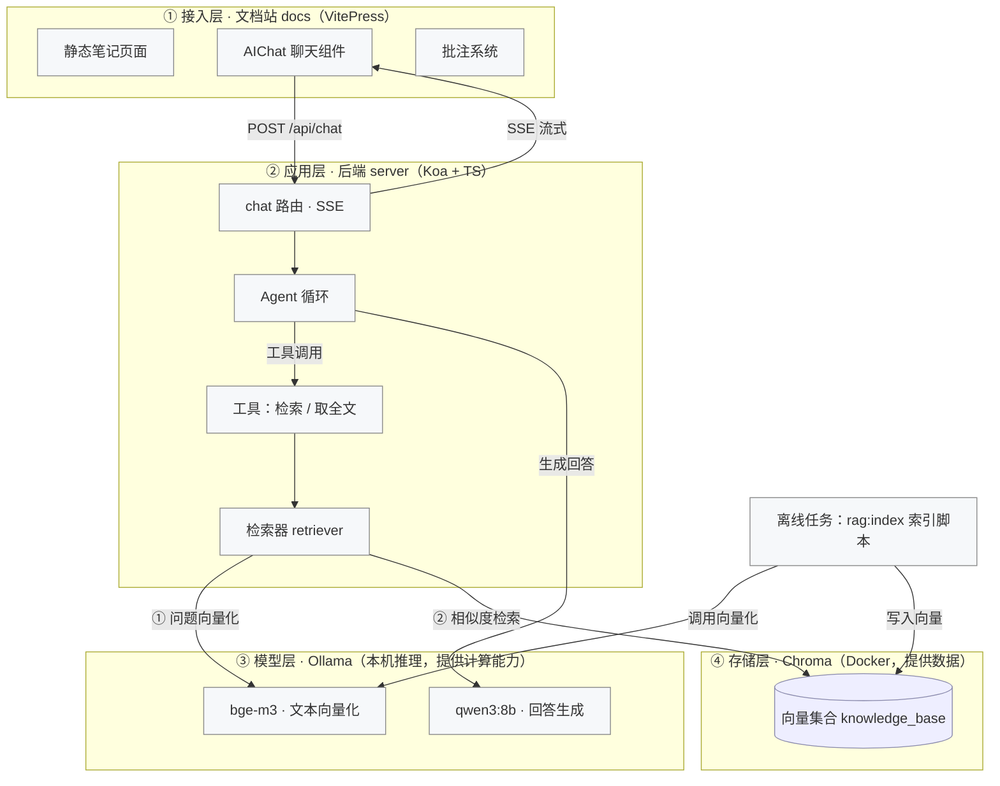
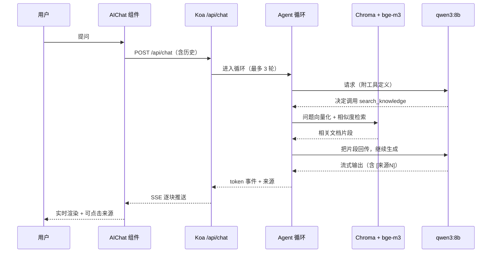

# 01 · 总览与架构

> 目标：读完这一篇，你能说清这个项目是什么、由哪些部分组成、一次问答是怎么跑通的。
> 后续几篇再逐个模块深入。

## 一、它是什么

一个**完全跑在本地**的个人技术知识库，由两部分组成：

1. **知识库站点**（`docs/`）：基于 VitePress 的静态文档站，承载 250+ 篇技术笔记（React/Vue 原理、浏览器、工程化、服务端、AI Agent 等）。
2. **AI 问答服务**（`server/`）：基于 Koa + TypeScript 的后端，把笔记做成向量索引（RAG），接本地大模型实现**带引用溯源**的自然语言问答。

**关键特性**：不联网、零 API 成本、数据不出本机——模型和向量库全部本地运行（Ollama + Docker 里的 Chroma）。

## 二、解决什么问题

| 问题 | 这个项目怎么做 |
|------|--------------|
| 笔记越写越多，找不到 | 全站本地搜索 + 用自然语言问 AI |
| 通用 AI 不懂你的笔记 | RAG：先检索你的笔记，再让模型基于笔记回答 |
| AI 回答不可信 | 回答强制标注引用来源，可点开原文核对；检索不到就明确说"没找到" |
| 担心数据隐私 / API 费用 | 模型与向量库全部本地运行 |

## 三、整体架构



**模型层（③）和存储层（④）不是同一级**，别被"都跑在本机"误导了：

- **模型层（Ollama）**是**无状态的计算能力**：被调用来做"文本 → 向量"和"生成回答"，用完即走。
- **存储层（Chroma）**是**有状态的数据**：持久化保存向量，只能被查询（检索时）或写入（索引时）。

要注意：**③ 和 ④ 之间没有箭头——它们互相不调用**。应用层是它们共同的上游，分别直连两层：

```
检索器 retriever ──① embedQuery：问题文本交给 bge-m3，换回向量──→ 模型层
                ──② 拿向量请求 Chroma，由它算相似度返回 topK──→ 存储层
```

对应的代码只有一行 `store.similaritySearchWithScore(query, k)`，内部就是这两步——**相似度计算发生在 Chroma 服务端**（HNSW 近似检索），应用层拿到的只是排好序的结果。

所以图上的"分层"是按**职责**划分（提供能力 vs 提供数据），不是调用链的串联：模型层不查库、存储层不算向量，谁也不依赖谁；而模型层和存储层都是应用层的下游依赖。

三条独立的数据流要分清：

1. **写入流**（离线）：`rag:index` 读 `docs` 下的 md → 切块 → bge-m3 向量化 → 写入 Chroma（默认增量，只处理内容变更的文件）。
2. **问答流**（在线）：用户提问 → Koa → Agent 循环（可能多次检索）→ qwen3:8b 生成 → SSE 流式回前端。
3. **展示流**：VitePress 静态站点（笔记页面 + 聊天 UI）。

## 四、基座包与实例

**通用能力在独立仓库 `../kb-base`（基座），本仓库是一个「实例」**——只放内容、配置与数据；
实例单向依赖基座，基座不含任何个人内容。本地开发期通过 `link:` 指向基座仓库，发布 npm 后改为版本号依赖。

| 包 / 目录 | 职责 | 入口 |
|----|------|------|
| `@kb/core`（基座 `../kb-base/packages/core`） | RAG 引擎（索引/切分/检索/重排）、Agent 工具调用、Koa 服务、评估框架、CLI | `src/cli.ts`（命令 `kb`） |
| `@kb/site`（基座 `../kb-base/packages/site`） | VitePress 主题、批注与 AI 组件、站点配置派生（`defineSite`） | `config/define-site.mjs` |
| 仓库根（实例） | 内容 `docs/`、配置 `knowledge.config.mjs`、数据 `eval/` 与 `data/` | `knowledge.config.mjs` |
| `resume/` | 简历与面试准备资料（不参与构建） | — |

> 命令行统一走基座 CLI：`kb index | serve | dev | build | preview | eval | eval:baseline | cases:gen | cases:review`；
> 根 `package.json` 里的 `pnpm rag:index` / `pnpm test:rag` 等只是它的封装。

> `archive/` 是历史归档，只读，不参与构建。

## 五、技术栈

| 层 | 选型 | 说明 |
|----|------|------|
| 文档站 | VitePress 1.6 + Vue 3 | 静态站，自带本地搜索；主题做了扩展 |
| 图表 | Mermaid 11 | 客户端按需加载渲染，支持点击放大 |
| 后端 | Koa + TypeScript | 轻量；`koa-bodyparser` / `@koa/cors` / `@koa/router` |
| RAG 框架 | LangChain.js 0.3 | 用它封装的文本切分器与 Chroma / Embeddings 适配 |
| 向量库 | Chroma（Docker） | 轻量、可持久化到本地目录 |
| 向量模型 | bge-m3（Ollama） | 中文检索质量好 |
| 生成模型 | qwen3:8b（Ollama） | 本地 8B，够用于"检索 + 总结" |
| 流式 | SSE（`text/event-stream`） | 后端手写 SSE，前端 `fetch` + `ReadableStream` 解析 |

## 六、目录结构（简化）

```
front-end-knowledge-summary/
├── docs/                     # 文档站
│   ├── .vitepress/
│   │   ├── config.mts        # 站点配置（导航/侧边栏/环境区分）
│   │   └── theme/            # 主题扩展：Mermaid 渲染、AIChat、批注
│   ├── ai-agent/ javascript/ react/ vue/ ...   # 各类笔记
│   └── interview-questions/  # 面试题（由脚本从 resume 同步）
├── server/
│   └── src/
│       ├── index.ts          # Koa 入口
│       ├── config/index.ts   # 统一配置
│       ├── routes/chat.ts    # 聊天接口（SSE）
│       ├── agent/            # Agent 循环 + 工具实现
│       └── rag/              # 索引 / 切分 / 检索 / 重排
├── resume/                   # 简历与面试资料
├── scripts/                  # 部署脚本、面试题同步脚本
└── package.json              # 根：命令转发
```

## 七、一次问答的完整链路



要点：

- 模型**自己决定**要不要检索、检索几次（Function Calling），不是硬编码"先检索再回答"。
- 最多 3 轮循环，防止模型一直调工具兜圈子。
- 回答里的 `[来源1]` 编号由工具结果提供，前端渲染成可点击标签。

## 八、怎么跑起来

```bash
# 1. 依赖
pnpm install

# 2. 模型（首次，共约 6.5GB）
pnpm ollama:pull-chat     # qwen3:8b
pnpm ollama:pull-embed    # bge-m3

# 3. 向量库 + 索引
pnpm chroma:start         # Docker 启动 Chroma
pnpm rag:index            # 增量更新索引（文档改动后跑，只处理变更的文件）

# 4. 启动
pnpm dev                  # 前后端一起（docs 5173 / server 3000）
```

访问 `http://localhost:5173`，首页会自动跳到 `/ai-agent/`，右下角是 AI 助手。

### 常用命令

| 命令 | 作用 |
|------|------|
| `pnpm dev:docs` / `pnpm dev:server` | 单独启动文档站 / 后端 |
| `pnpm build` | 构建文档站（默认带 `BASE_PATH=/knowledge/`） |
| `pnpm preview` | 预览构建产物（同样带 base） |
| `pnpm rag:index` | 增量更新向量索引（只处理变更的文件） |
| `pnpm rag:index:full` | 全量重建索引（首次或需要重建时） |
| `kb eval` | 跑检索质量评估 |

## 九、接下来读什么

- 想了解**站点怎么配置、怎么部署** → [02 · 文档站（docs）](./02-docs-site.md)
- 想了解**索引和检索怎么做** → [03 · 后端与 RAG 检索](./03-server-rag.md)
- 想了解**问答链路和流式** → [04 · Agent 与流式对话](./04-agent-chat.md)
- 想了解**为什么这么设计、踩过什么坑** → [05 · 设计决策与踩坑](./05-decisions.md)
