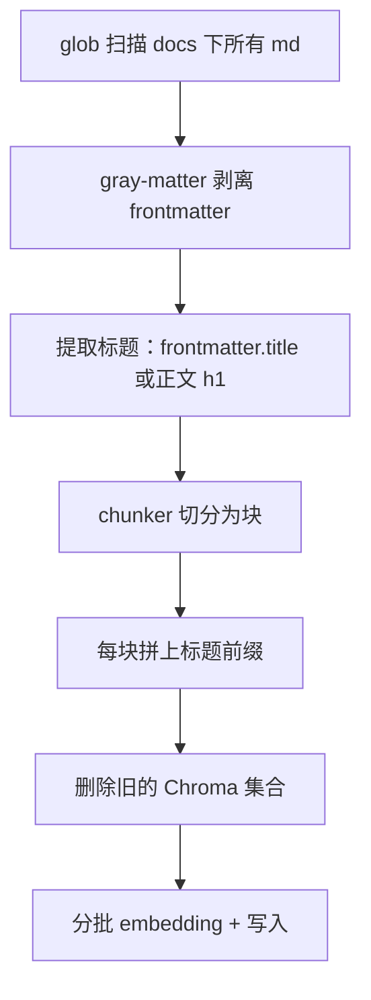

# 03 · 后端与 RAG 检索

> 目标：搞清笔记是怎么变成向量的（索引链路）、提问时怎么查（检索链路）、以及怎么衡量"查得准不准"。

## 一、`server` 包结构

```
server/src/
├── index.ts            # Koa 入口：装配中间件与路由
├── config/index.ts     # 统一配置（模型、端口、切分参数…）
├── routes/
│   ├── chat.ts         # POST /api/chat（SSE 流式）
│   └── health.ts       # 健康检查
├── agent/
│   ├── loop.ts         # Agent 工具调用循环
│   └── tools.ts        # 工具定义与实现
└── rag/
    ├── indexer.ts      # 建索引（离线）
    ├── chunker.ts      # 文本切分
    ├── retriever.ts    # 检索
    └── reranker.ts     # 重排（默认关闭）
```

## 二、统一配置

`src/config/index.ts` 集中了所有可调参数，改模型或调参只动这里：

```ts
export const config = {
  ollamaBaseUrl: 'http://localhost:11434/v1',  // Ollama 兼容 OpenAI API 格式
  chatModel: 'qwen3:8b',
  embeddingModel: 'bge-m3',
  chromaHost: process.env.CHROMA_HOST || 'localhost',
  chromaPort: parseInt(process.env.CHROMA_PORT || '8000'),
  collectionName: 'knowledge_base',
  docsPath: path.resolve(__dirname, '../../../docs'),  // 直接扫 docs 目录
  chunkSize: 1000,
  chunkOverlap: 200,
  rerankEnabled: false,   // 实测反而变差，默认关
  rerankCandidates: 20,
  port: parseInt(process.env.PORT || '3000'),
}
```

注意 `docsPath` 指向 `docs/`，所以**索引直接复用文档站的笔记**，不需要另外维护一份语料。

## 三、索引链路：`rag:index`

对应 `pnpm rag:index`，流程是"全量重建"：



### 关键代码 1：扫描与元数据提取

```ts
const files = await glob('**/*.md', {
  cwd: config.docsPath,
  // 排除非知识正文：面试题与正文同质，会挤占检索结果
  ignore: ['node_modules/**', '.vitepress/**', 'interview-questions/**'],
  absolute: true,
})

for (const file of files) {
  const raw = await fs.readFile(file, 'utf-8')
  const { content, data } = matter(raw)          // 正文 / frontmatter
  const relativePath = path.relative(config.docsPath, file)
  // frontmatter 没有 title 时，回退到正文第一个一级标题
  const h1 = content.match(/^#\s+(.+)$/m)?.[1]?.trim()
  docs.push(new Document({
    pageContent: content,
    metadata: { source: relativePath, title: data.title || h1 || '' },
  }))
}
```

两个细节：

- **`gray-matter`**：把 Markdown 顶部的 `---` 元数据块和正文分开。不剥掉的话，元数据也会被切成块、混进向量里，成为检索噪声。
- **h1 兜底**：只有 1/4 的笔记写了 frontmatter title，所以用正文的一级标题兜底，避免退化成英文文件路径。

### 关键代码 2：块前缀

```ts
for (const chunk of chunks) {
  const title = chunk.metadata.title || chunk.metadata.source || ''
  chunk.pageContent = title ? `【${title}】\n${chunk.pageContent}` : chunk.pageContent
}
```

切分后的块往往只剩正文、不知道自己出自哪篇文章。在块首拼上标题，让向量同时编码"来自哪篇"。

### 关键代码 3：分批写入

```ts
// Chroma 服务端对单次请求体大小有限制（约 35MB），一次性提交会 413
const BATCH_SIZE = 300
for (let i = 0; i < chunks.length; i += BATCH_SIZE) {
  await vectorStore.addDocuments(chunks.slice(i, i + BATCH_SIZE))
}
```

同时每次索引都是**删掉旧集合再重建**（`deleteCollection`），避免随机 ID 造成数据重复累积。

### 切分策略：`chunker.ts`

当前用的是 LangChain 的 `RecursiveCharacterTextSplitter`，按分隔符优先级递归切：

```ts
separators: ['\n## ', '\n### ', '\n---\n', '\n\n', '\n', ' ', '']
```

先用 `##` 切，段落超长再用 `###`，再超长用空行、换行……直到满足 `chunkSize`(1000) / `chunkOverlap`(200)。

> 曾经试过"按标题切分 + 拼完整面包屑"，块数从 2602 涨到 4115，但检索指标反而下降，所以回退了。详见 [05 篇](./05-decisions.md)。

## 四、检索链路：`retriever.ts`

```ts
export async function searchDocs(query: string, k: number = 5) {
  const store = await getVectorStore()
  const candidates = await store.similaritySearchWithScore(query, Math.max(k, config.rerankCandidates))

  if (!config.rerankEnabled) {
    return dedupeBySource(candidates, k)
  }

  const ranked = await rerank(query, candidates.map(([doc]) => doc), candidates.length)
  return dedupeBySource(ranked.map((r) => [r.doc, r.score] as [Document, number]), k)
}
```

### 先看懂：`similaritySearchWithScore` 内部发生了什么

上面看似一行的 `store.similaritySearchWithScore(query, k)`，内部是跨两层的两步：

1. `embeddings.embedQuery(query)` —— HTTP 调 Ollama 的 bge-m3，把问题文本变成向量（**模型层**）
2. 拿着向量请求 Chroma —— 相似度计算在 **Chroma 服务端**完成（HNSW 近似检索），返回 topK 文档与距离（**存储层**）

所以检索器是**分别直连**模型层与存储层的，两层之间互相不调用——这是理解架构图分层的关键。

### 顺藤摸瓜：向量化到底发生在哪一行

把上面第 1 步展开，是一条贯穿 4 层的调用链。先说结论：**我们仓库里没有向量化算法本身**——bge-m3 模型跑在 Ollama 里，我们的代码只负责"配置它指向哪、触发它调用"。

**① 我们的代码 · `server/src/rag/retriever.ts`** —— 只做配置和触发：

```ts
const embeddings = new OpenAIEmbeddings({
  modelName: config.embeddingModel,   // 'bge-m3'
  apiKey: 'ollama',
  configuration: { baseURL: config.ollamaBaseUrl },  // http://localhost:11434/v1
  batchSize: 10,
})

// searchDocs 里的一行触发一切：
const candidates = await store.similaritySearchWithScore(query, k)
```

**② LangChain 基类 · `@langchain/core/dist/vectorstores.js:274`** —— 问题向量化就发生在这：

```js
async similaritySearchWithScore(query, k = 4, filter) {
  return this.similaritySearchVectorWithScore(
    await this.embeddings.embedQuery(query),  // ← 问题文本 → 向量
    k, filter
  );
}
```

**③ OpenAI 适配层 · `@langchain/openai/dist/embeddings.js:268`** —— 用 openai SDK 发出 HTTP 请求：

```js
const res = await this.client.embeddings.create(request, requestOptions);
```

**④ Ollama 服务端** —— 收到请求并返回向量：

```
POST http://localhost:11434/v1/embeddings
{ "model": "bge-m3", "input": "什么是闭包" }
```

实际调用的返回（bge-m3 把文本编码成 **1024 维**向量）：

```
模型: bge-m3
向量维度: 1024
前 5 维: [0.01726, -0.00177, -0.02747, 0.02648, -0.00463]
```

这个 1024 维数组紧接着被传给 Chroma 做相似度检索——也就是上面第 2 步。

> 注：②③ 的行号来自当前锁定的依赖版本（LangChain 0.3.x），升级依赖后行号可能变化，但调用链结构不变。

三个要点：

### 1. 多召回再筛选

即使只要 5 条，也先召回 20 条候选，给后续去重/重排留空间。

### 2. 按来源去重（一个实用改进）

```ts
function dedupeBySource(results: [Document, number][], k: number) {
  const seen = new Set<string>()
  const out = []
  for (const item of results) {
    const src = String(item[0].metadata.source || '')
    if (seen.has(src)) continue     // 同一篇只保留最相关的一块
    seen.add(src)
    out.push(item)
    if (out.length >= k) break
  }
  return out
}
```

**为什么需要**：不去重时 top5 常被同一篇的多个块占满（实测「前端错误监控」前 4 名全是同一篇），既浪费位置，也给 LLM 的上下文是重复内容。去重后 top3 变成不同来源的 3 篇，信息量更足。

### 3. 可选重排（默认关闭）

`reranker.ts` 用本地 cross-encoder（`bge-reranker-base`）对 `(query, doc)` 一起编码打分，精度理论上高于向量。但**实测在本项目里反而变差**（Top1 83% → 58%），因此 `config.rerankEnabled = false`，代码保留待换更强的模型再验证。

## 五、怎么衡量"查得准不准"

`scripts/rag-eval.ts` 是一个 12 题的回归测试集，每题标注期望命中的文档，输出三个指标：

| 指标 | 含义 |
|------|------|
| Top5 命中率 | 期望文档是否出现在前 5（宽松） |
| **Top1 命中率** | 期望文档是否排第一（严格） |
| **MRR** | 期望文档排名倒数的平均，越接近 1 越好 |

```bash
pnpm --filter @knowledge/server rag:eval
```

> 一开始只有"命中率"，结果 12 题全是 100%，**任何优化都测不出差别**。加上 Top1/MRR 后才有区分度——这是做优化前必须先补好的基础设施。

### 已跑过的实验结论

| 改动 | Top1 | MRR | 结论 |
|------|------|-----|------|
| 基线（含面试题） | 58% | 0.743 | — |
| 排除面试题 | 75% | 0.861 | **有效** |
| 纯字符切分（当前） | 83% | 0.917 | — |
| + 按来源去重 | 83% | 0.917 | 指标持平，但多样性变好 → 保留 |
| + Rerank | 58% | 0.764 | **负结果** → 关闭 |
| 标题路径切分 | 75% | 0.861 | **负结果** → 回退 |

---

**下一篇**：[04 · Agent 与流式对话](./04-agent-chat.md)
