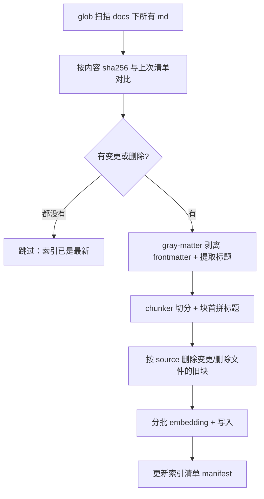

# 03 · 后端与 RAG 检索

> 目标：搞清笔记是怎么变成向量的（索引链路）、提问时怎么查（检索链路）、以及怎么衡量"查得准不准"。

## 一、后端包结构（`@minijun/kb-core`）

后端代码在基座包 `@minijun/kb-core` 里（装好后位于 `node_modules/@minijun/kb-core`）：

```
src/
├── cli.ts              # CLI 入口（kb 命令：init / import / index / menu:export / chroma:* / ollama:* / serve / eval …）
├── server.ts           # 组装 Koa 应用（中间件 + 路由）
├── index.ts            # 进程入口
├── config/
│   ├── index.ts        # 统一配置出口（加载并归一化后的 config）
│   ├── loader.ts       # 加载实例的 knowledge.config.mjs 并归一化
│   ├── clients.ts      # 客户端工厂：聊天 / 向量 / Chroma 连接参数，收敛「本地 vs 远程」的差异
│   └── types.ts        # 配置类型
├── routes/
│   ├── chat.ts         # POST /api/chat（SSE 流式）
│   ├── health.ts       # 健康检查
│   ├── import.ts       # 导入：预检 / 执行 / 收件箱计数
│   └── manage.ts       # 收件箱树 / 归档 / 删除 / 建立索引（SSE）
├── import.ts           # 导入逻辑（扫描、命名规范化、冲突检测、落盘）
├── manage.ts           # 归档逻辑（收件箱树、分类、移动、删除）
├── menu.ts             # 菜单配置导出（kb menu:export / --check）
├── init.ts             # 生成实例骨架（kb init）
├── chroma.ts           # 向量库容器管理（kb chroma:start / chroma:stop；容器名按实例区分）
├── docker.ts           # docker 命令封装（探测端口占用、挑空闲端口）
├── ollama.ts           # 本地模型管理（kb ollama:pull / ollama:stop）
├── agent/
│   ├── loop.ts         # Agent 工具调用循环
│   ├── prompt.ts       # 系统提示词
│   └── tools.ts        # 工具定义与实现
├── rag/
│   ├── indexer.ts      # 建索引（离线）
│   ├── chunker.ts      # 文本切分
│   ├── retriever.ts    # 检索
│   ├── bm25.ts         # 关键词检索（混合检索的第二路）
│   └── reranker.ts     # 重排（默认关闭；依赖 @huggingface/transformers，见下）
└── eval/               # 检索层 / 生成层评估（rag-eval、rag-gen-eval、出题与审核）
```

> 导入与归档的服务端细节（落盘规则、预检字段、接口清单）见 [02 篇 · 内容管理](./02-docs-site.md#六、内容管理-导入与归档)。

## 二、统一配置

配置集中在**实例根**的 `knowledge.config.mjs`（单一入口），由基座包的 `@minijun/kb-core` 里 `config/loader.ts` 加载并归一化
（定位 → 动态 import → 相对路径转绝对路径 → 合并 env）：

```js
// knowledge.config.mjs（实例）
export default {
  collectionName: 'knowledge_base',
  dataDir: './data',
  evalDir: './eval',
  models: { baseUrl: 'http://localhost:11434/v1', chat: 'qwen3:8b', embedding: 'bge-m3' },
  chunk: { size: 1000, overlap: 200 },
  rerank: { enabled: false, candidates: 20 },  // 实测反而变差，默认关
  chroma: { host: 'localhost', port: 8000 },
  port: 3000,
}
```

> `models.chat` / `models.embedding` 也可以写成对象（`{ baseUrl, model, apiKeyEnv }`）指向远程服务；
> 加载后归一化成 `config.chat.baseUrl` / `config.embedding.baseUrl` 等，运行时只认这一份。

> 加载后的绝对路径以 `config.docsPath` 等形式提供给运行时代码。
> **内容根固定为实例根下的 `docs/`**（不再可配）——内容与站点共用同一批 Markdown，不需要另外维护一份语料。
> 早期版本支持把内容放到仓库外（`contentRoot` 可配），后来发现"两个根"带来的配置错配远多于收益，
> 已收敛成一个目录：笔记搬进来比指过去更自然（搬迁用站点的导入能力）。
> `CHROMA_HOST/PORT`、`PORT` 可被环境变量覆盖。

## 三、索引链路：`kb index`

索引有**全量重建**和**增量更新**两种模式，默认增量、自动判断：



- **首次运行 / 集合不存在 / `pnpm kb index --full`** → 全量重建（清空集合、全部重写）
- **平时 `pnpm kb index`** → 增量：只有内容变了的文件才重新切分、向量化、写入，没变的一律跳过

差距很直观：全量约 **4 分钟**，增量在无变更时 **1 秒**。

### 关键代码 1：扫描、内容哈希与差异计算

```ts
// ① 扫描：glob 按通配符匹配文件（** = 任意层级，* = 任意文件名）
//    索引范围（include / exclude）由实例配置的 index 字段提供，这里直接取归一化后的值
const files = await glob(config.indexInclude, {
  cwd: config.docsPath,
  // 排除非知识正文：与正文同质的"问答式笔记"会挤占检索；站点说明 / 快速上手属于元信息
  // （具体清单写在 knowledge.config.mjs 的 index.exclude 里）
  ignore: config.indexExclude,
  absolute: true,
})

// ② 内容哈希：作为"文件有没有变"的判据
const current = new Map<string, { raw: string; hash: string }>()
for (const file of files) {
  const raw = await fs.readFile(file, 'utf-8')
  const rel = path.relative(config.docsPath, file)
  current.set(rel, { raw, hash: hashContent(raw) })   // hashContent = sha256
}

// ③ 差异：与上次清单（manifest）对比
const manifest = forceFull ? {} : readManifest()      // relativePath -> sha256
const changed = [...current]
  .filter(([rel, info]) => manifest[rel] !== info.hash)
  .map(([rel]) => rel)
const removed = Object.keys(manifest).filter((rel) => !current.has(rel))
```

三个细节：

- **为什么用内容哈希，而不是文件修改时间（mtime）**：mtime 在 `git checkout`、复制文件、重新 clone 时都会变，会导致"没改也算变更"（白跑一遍 embedding）；**内容哈希只在内容真的变了时才变**，判断更准。
- **h1 兜底标题**：只有约 1/4 的笔记写了 frontmatter title，其余用正文一级标题兜底（`data.title || h1 || ''`），避免块上下文退化成英文文件路径。
- **`gray-matter`**：把 Markdown 顶部的 `---` 元数据块和正文分开。不剥掉的话，元数据也会被切成块、混进向量，成为检索噪声。

### 关键代码 2：块前缀

```ts
for (const chunk of chunks) {
  const title = chunk.metadata.title || chunk.metadata.source || ''
  chunk.pageContent = title ? `【${title}】\n${chunk.pageContent}` : chunk.pageContent
}
```

切分后的块往往只剩正文、不知道自己出自哪篇文章。在块首拼上标题，让向量同时编码"来自哪篇"。

### 关键代码 3：分批写入

```ts
// Chroma 服务端对单次请求体大小有限制（约 35MB），一次性提交会 413
const BATCH_SIZE = 300
for (let i = 0; i < chunks.length; i += BATCH_SIZE) {
  await vectorStore.addDocuments(chunks.slice(i, i + BATCH_SIZE))
}
```

> 分批的目的是**规避 Chroma 的请求体限制**，不是为了省内存——所有块始终都在内存里（文档正文合计约 2.9MB，Node 堆毫无压力）。

### 关键代码 4：增量更新（只重索引变了的文件）

全量重建用 `deleteCollection` 清空重来；增量则要**精准删掉"变更/删除"文件的旧块**，否则同一文件会在库里累积多份向量：

```ts
// 按 metadata.source 过滤删除（Chroma 支持按 metadata 删）
const collection = await vectorStore.ensureCollection()
for (const rel of [...changed, ...removed]) {
  await collection.delete({ where: { source: rel } })
}

// 然后只把 changed 的文件重新切分、向量化、写入
const docs = changed.map((rel) => toDocument(rel, current.get(rel)!.raw))
const chunks = await chunkDocuments(docs)
await writeChunks(vectorStore, chunks)
```

最后把新的 `relativePath -> hash` 清单写盘，供下次对比：

```ts
const next: Record<string, string> = {}
for (const [rel, info] of current) next[rel] = info.hash
writeManifest(next)   // data/index-manifest.json
```

**实测四种场景**（脚本自动判断模式）：

| 场景 | 行为 | 耗时 |
|------|------|------|
| 无文件变更 | 直接跳过 | **1 秒** |
| 新增 1 个文件 | 只切分/写入该文件 | 秒级 |
| 删除 1 个文件 | 从库里删掉它的块 | 秒级 |
| 首次 / `pnpm kb index --full` | 清空集合、全量重建 | ~4 分钟 |

> 风险提示：全量重建是"先删集合、再写入"，若写入中途失败（例如 Chroma 服务挂了），**索引会变空**。更稳的做法是"写入临时集合、成功后再切换"，当前项目没做这层保护——重建后留意日志。

### 切分策略：`chunker.ts`

当前用的是 LangChain 的 `RecursiveCharacterTextSplitter`，按分隔符优先级递归切：

```ts
separators: ['\n## ', '\n### ', '\n---\n', '\n\n', '\n', ' ', '']
```

先用 `##` 切，段落超长再用 `###`，再超长用空行、换行……直到满足 `chunkSize`(1000) / `chunkOverlap`(200)。

> 曾经试过"按标题切分 + 拼完整面包屑"，块数从 2602 涨到 4115，但检索指标反而下降，所以回退了。详见 [05 篇](./05-decisions.md)。

## 四、检索链路：`retriever.ts`

```ts
export async function searchDocs(query: string, k: number = 5) {
  const store = await getVectorStore()
  const depth = config.hybridEnabled
    ? Math.max(k, config.hybridCandidates)   // 混合检索要两路各取 50 做融合
    : Math.max(k, config.rerankCandidates)

  const candidates = await store.similaritySearchWithScore(query, depth)

  // 开了 rerank 就以精排为准（不再叠加混合检索，避免两套排序打架）
  if (config.rerankEnabled) { /* ... */ }

  if (!config.hybridEnabled) return dedupeBySource(candidates, k)

  return hybridFuse(query, candidates, k)   // 向量 + BM25 加权融合
}
```

### 认识两个关键对象：`embeddings` 与 `store`

`searchDocs` 第一行的 `getVectorStore()` 里有两个关键对象，先搞懂它们，后面的流程就好理解了。

**① `embeddings` —— "文本 → 向量"的能力对象**

```ts
// @minijun/kb-core 的 config/clients.ts —— 聊天 / 向量客户端都从这里造，
// 「本地 Ollama（apiKey 用占位符）vs 远程服务（从 apiKeyEnv 读）」的差异收敛在这一处
export function createEmbeddings(): OpenAIEmbeddings {
  return new OpenAIEmbeddings({
    modelName: config.embedding.model,                     // 'bge-m3'
    apiKey: config.embedding.apiKey || 'ollama',           // 占位（Ollama 不校验，但 SDK 要求非空）
    configuration: { baseURL: config.embedding.baseUrl },  // http://localhost:11434/v1
    batchSize: 10,
  })
}
```

它本身**不存任何数据**，只有两个核心方法：

| 方法 | 用途 | 何时用 |
|------|------|--------|
| `embedQuery(text)` | 把一个**问题**转成向量 | 检索时 |
| `embedDocuments(texts[])` | 把**一批文档**转成向量 | 索引时 |

它叫 `OpenAIEmbeddings` 却在调 Ollama，是因为 **Ollama 提供了 OpenAI 兼容的 API**（`POST /v1/embeddings`），只改 `baseURL` 就能复用现成的适配类。

**② `store` —— 连到 Chroma 的句柄，几乎不占内存**

```ts
// @minijun/kb-core 的 rag/retriever.ts
cachedStore = await Chroma.fromExistingCollection(createEmbeddings(), {
  collectionName: config.collectionName,
  ...chromaVectorStoreParams(),   // url + clientParams（远程时的 token / tenant / database 都在里面）
})
```

一个常见担心：向量数据是不是都塞进 Node 内存了？**没有**——

- 这里用的是 **Chroma Server 模式**（独立 Docker 服务），`store` 只是一根**远程连接句柄**，Node 侧仅持有"连哪、连哪个集合"的元数据；
- 向量数据在 **Chroma 服务端**（持久化到 `data/chroma`）。按当前约 2750 块 × 1024 维估算，原始向量仅 ~11MB 量级，加 HNSW 索引开销也就几十 MB，可忽略；
- 内存真正的大头是**模型**（bge-m3 ~1.2GB、qwen3:8b ~5.2GB），但那在 Ollama 进程里，和 `store` 无关。

`cachedStore` 缓存的是**连接**而非数据，为的是免去每次检索重复建连。由于 `kb index` 会删库重建、导致旧句柄失效，所以用 `cacheValidated` 标记 + `invalidateRetriever()` 触发重建：

```ts
let cachedStore: Chroma | null = null
let cacheValidated = false

// kb index 删库重建后，调用方（tools.ts 的检索重试）调用它让句柄失效
export function invalidateRetriever() {
  cacheValidated = false
}
```

### 先看懂：`similaritySearchWithScore` 内部发生了什么

上面看似一行的 `store.similaritySearchWithScore(query, k)`，内部是跨两层的两步：

1. `embeddings.embedQuery(query)` —— HTTP 调 Ollama 的 bge-m3，把问题文本变成向量（**模型层**）
2. 拿着向量请求 Chroma —— 相似度计算在 **Chroma 服务端**完成（HNSW 近似检索），返回 topK 文档与距离（**存储层**）

所以检索器是**分别直连**模型层与存储层的，两层之间互相不调用——这是理解架构图分层的关键。

### 顺藤摸瓜：向量化到底发生在哪一行

把上面第 1 步展开，是一条贯穿 4 层的调用链。先说结论：**我们仓库里没有向量化算法本身**——bge-m3 模型跑在 Ollama 里，我们的代码只负责"配置它指向哪、触发它调用"。

**① 我们的代码 · `@minijun/kb-core` 的 `rag/retriever.ts`** —— 只做配置和触发（`embeddings` 的构造见上一节）：

```ts
// searchDocs 里的一行触发一切：
const candidates = await store.similaritySearchWithScore(query, k)
```

**② LangChain 基类 · `@langchain/core/dist/vectorstores.js:274`** —— 问题向量化就发生在这：

```js
async similaritySearchWithScore(query, k = 4, filter) {
  return this.similaritySearchVectorWithScore(
    await this.embeddings.embedQuery(query),  // ← 问题文本 → 向量
    k, filter
  );
}
```

**③ OpenAI 适配层 · `@langchain/openai/dist/embeddings.js:268`** —— 用 openai SDK 发出 HTTP 请求：

```js
const res = await this.client.embeddings.create(request, requestOptions);
```

**④ Ollama 服务端** —— 收到请求并返回向量：

```
POST http://localhost:11434/v1/embeddings
{ "model": "bge-m3", "input": "什么是闭包" }
```

实际调用的返回（bge-m3 把文本编码成 **1024 维**向量）：

```
模型: bge-m3
向量维度: 1024
前 5 维: [0.01726, -0.00177, -0.02747, 0.02648, -0.00463]
```

这个 1024 维数组紧接着被传给 Chroma 做相似度检索——也就是上面第 2 步。

> 注：②③ 的行号来自当前锁定的依赖版本（LangChain 0.3.x），升级依赖后行号可能变化，但调用链结构不变。

三个要点：

### 1. 多召回再筛选

即使只要 5 条，也先召回 20 条候选，给后续去重/重排留空间。

### 2. 按来源去重（一个实用改进）

```ts
function dedupeBySource(results: [Document, number][], k: number) {
  const seen = new Set<string>()
  const out = []
  for (const item of results) {
    const src = String(item[0].metadata.source || '')
    if (seen.has(src)) continue     // 同一篇只保留最相关的一块
    seen.add(src)
    out.push(item)
    if (out.length >= k) break
  }
  return out
}
```

**为什么需要**：不去重时 top5 常被同一篇的多个块占满（实测「前端错误监控」前 4 名全是同一篇），既浪费位置，也给 LLM 的上下文是重复内容。去重后 top3 变成不同来源的 3 篇，信息量更足。

### 3. 可选重排（默认关闭）

`reranker.ts` 用本地 cross-encoder（`bge-reranker-base`）对 `(query, doc)` 一起编码打分，精度理论上高于向量。但**实测在本项目里反而变差**（Top1 83% → 58%），因此 `config.rerankEnabled = false`，代码保留待换更强的模型再验证。

> 后来又重测了一次：修好 2 道题，但代价是 **33.5 秒 / 每次查询**，性价比仍然不够，维持关闭。

> **依赖说明**：重排依赖 `@huggingface/transformers`，但它**默认不安装**（在 `@minijun/kb-core` 里声明为
> **可选 peer + 惰性加载**）—— 它背后会拖进原生 ONNX 运行时（`onnxruntime-node` / `onnxruntime-web` / `sharp`，
> 几十 MB），而重排默认又是关的，不该让所有人为此买单。要开启就先 `pnpm add @huggingface/transformers`，
> 没装时会给明确提示而不是静默降级。

### 4. 混合检索（默认开启，本项目收益最大的一项）

`bm25.ts` + `retriever.ts` 的 `hybridFuse`：向量召回与 BM25 关键词召回**两路并行**，各自归一化后加权相加。

**为什么需要**：纯向量在**精确词**上最弱——英文缩写、专有名词、代码标识符这类内容在向量空间里容易和无关文档"漂"到一起。实测本项目所有"文档明明讲了却没捞到"的题都带精确词（`FMP`/`LCP`、`## 代码审查文化`…）。

```ts
// 两路各自取 50 → 分别除以本查询内的最大值归一 → 加权相加
score[source] = (1 - distance / dMax) * 0.7 + (bm25 / bm25Max) * 0.3
```

#### 拆开看：`distance` 是什么

它是向量检索（查 Chroma）时随结果一起返回的字段，嵌在 `[Document, number]` 二元组的第二个位置：

```ts
const candidates = await vectorStore.similaritySearch(query, 50)  // [Document, distance][]
const dMax = Math.max(...vec.map(([, d]) => d))                    // ← distance 从这里解构出来
```

**含义是向量之间的距离（L2 / 欧氏距离），越小 = 越相关。** 这跟「余弦相似度越大越相关」是同一件事的两个方向：

| | 值域 | 方向 |
|---|---|---|
| `distance`（L2 距离） | 0 ~ 2 | **越小越相关** |
| 余弦相似度 | -1 ~ 1 | **越大越相关** |

本项目的 embedding 做了归一化，所以两者可以互换：`L2²/2 = 1 - cos`。

#### 为什么必须除以 `dMax`（最容易看不懂的一步）

**因为 `distance` 的绝对值跨 query 不可比。** 不同提问算出来的距离分布完全不同：

```
query A 的候选距离：[0.18, 0.35, 0.52]     ← 都很近
query B 的候选距离：[0.62, 0.81, 0.95]     ← 都很远
```

query B 的所有候选都「远」，但这**不代表它检索得差**—— 只是这个提问的向量分布偏散。可要是直接拿这些数字和 BM25 分数相加，BM25 分数是无界的（可能 0~30），向量那侧的 0~1 会被彻底淹没。

**归一化就是各自压到 [0, 1]，让两边可比。** 拿 query A 举例：

| 候选 | distance | `(1 - d/dMax)` | × 0.7 |
|---|---|---|---|
| 最相关 | 0.18 | 0.796 | **0.557** |
| 中间 | 0.52 | 0.409 | 0.286 |
| 最远 | 0.88 | **0.000** | 0.000 |

注意最后一个：**`1 - d/dMax` 会让最远的那个恒等于 0**。这是设计取舍 —— 只看「本query 里谁最接近」，绝对距离不参与。但如果只有一个候选时它既是`dMin` 又是 `dMax`，会算出 0 分，所以代码里写了 `Math.max(..., 1e-6)` 防除零。

#### 两个权重（0.7 / 0.3）的由来

**不是照抄最佳实践，是被分词器质量逼出来的。**

BM25 路用的是零依赖的**字符 bigram** 分词（切「跨域」→「跨」「域」），这比生产级分词器噪声大——会产生大量无意义的匹配。实测用行业默认的**等权 RRF**（不按质量加权、只按排名）时，Hit@1 从 87.6%掉到 86.4%：**17 道原本排第一的题被BM25 的噪声挤了下去**。

所以这里给向量 0.7、BM25 0.3。等哪天换上了正经分词器，权重应该重新调 —— **权重是补偿手段，不是常量**。

几个关键取舍（都是实测出来的，不是照抄最佳实践）：

| 选择 | 为什么 |
|---|---|
| 中文用**字符 bigram** 而非 jieba | 零依赖，不必装原生模块；噪声大，所以权重只给到 0.3 |
| 用**归一化加权**而非行业默认的等权 RRF | 等权 RRF 实测把 Hit@1 从 87.6% 打到 86.4%（17 道原本排第一的被 BM25 噪声挤下去） |
| **必须归一化** | 不归一化的话两个分数尺度不可比，向量会被压制（Hit@1 反而降到 88%） |
| 语料从**向量库**读而非重新扫文件 | 保证两路面对的"块"完全一致，也不会因切分逻辑改动而漂移 |
| 建索引失败时**降级为纯向量** | 新实例还没跑过 `kb index` 时集合不存在，不能让关键词这路把检索拖挂 |

**实测收益**（249 题评估集）：Hit@5 98.4%→**100%**，Hit@1 87.6%→**90%**，MRR 0.923→**0.944**，Recall@5 0.964→**0.985**；成本是零模型、微秒级。

#### BM25 到底是什么

BM25 是经典的**关键词相关性打分**公式。它**不看语义**，只看三件事：

1. 查询里的词在这块里出现了几次（**TF**，词频）
2. 这个词在全库里有多稀有（**IDF**，逆文档频率）
3. 这块有多长（**长度归一化**）

把它写成公式，对每个查询词 `t` 累加：

```
IDF(t)  = ln( 1 + (N - df(t) + 0.5) / (df(t) + 0.5) )    // 越稀有，权重越高
TF 部分 = tf × (k1 + 1) / ( tf + k1 × (1 - b + b × len / avgLen) )

score += IDF(t) × TF 部分
```

| 符号 | 含义 |
|---|---|
| `tf` | 词 `t` 在这一块里出现的次数 |
| `df(t)` | 全库有多少块包含这个词（`N` 是总块数） |
| `len` / `avgLen` | 这一块的长度 / 全库平均长度 |
| `k1 = 1.5` | 词频**饱和**速度（经典默认值） |
| `b = 0.75` | 长度归一化强度（经典默认值） |

两个设计让它比"单纯数词频"聪明：

- **词频饱和**：一个词出现 10 次，不比出现 3 次重要 3 倍——分子分母都有 `tf`，得分会收敛，不会让堆砌关键词的块占便宜。
- **长度归一化**：长块天然词多，`b` 项按长度打折，避免"越长越容易命中"。

**它和向量检索是互补的**：向量懂"语义相近"（"性能" ≈ "优化速度"），BM25 懂"字面精确"（`LCP` 就是 `LCP`）。前者会飘，后者不会。

#### 中文怎么分词（实现里唯一的非标准处）

BM25 要先把文本切成"词"。英文按空格切就行，**中文没有空格**：

```ts
// 英文/数字：按词切（保留 . _ + -，代码里的标识符不会被切断）
for (const m of t.matchAll(/[a-z0-9][a-z0-9._+-]*/g)) out.push(m[0])

// 中文：单字 + 相邻两字（bigram）
for (const seg of t.match(/[\u4e00-\u9fff\u3040-\u30ff]+/g) ?? []) {
  for (let i = 0; i < seg.length; i++) {
    out.push(seg[i])
    if (i + 1 < seg.length) out.push(seg.slice(i, i + 2))
  }
}
```

用 bigram 而不是分词器（jieba 之类）的理由：**零依赖**，不用装原生模块。
代价是噪声更大（"调度"会命中"调度"，也会和"调用/调查"这类词有重叠），所以它在融合时只拿到 **0.3** 的权重。

#### 实现要点

- 倒排索引在**内存**里建（`Map<词, Map<块下标, 词频>>`）。实测 2775 块**建索引 387ms**、单次检索（取 50 条候选）**0.53ms**——基本可以忽略
- 语料从**向量库**读，而不是重新扫文件切分：保证两路检索面对的块完全一致，也不会因切分逻辑改动而漂移
- 建索引失败（还没跑过 `kb index`、Chroma 连不上）→ **降级为纯向量**，绝不让关键词这路把整个检索拖挂

配置在实例 `knowledge.config.mjs` 的 `retrieval.hybrid`，可一键关掉回退纯向量。

## 五、怎么衡量"查得准不准"

评估逻辑在基座包 `@minijun/kb-core` 的 `src/eval/rag-eval.ts`；**题目是数据**，放在实例的 `eval/retrieval-cases.json`（目前 249 题），每题标注期望命中的文档。输出四个指标：

| 指标 | 含义 |
|------|------|
| Hit@5（Top5 命中率） | 期望文档是否出现在前 5（宽松） |
| **Hit@1（Top1 命中率）** | 期望文档是否排第一（严格） |
| Recall@5 | 期望文档有几个被前 5 覆盖（多标签题才有区分度） |
| **MRR** | 期望文档排名倒数的平均，越接近 1 越好 |

```bash
kb eval
```

> 一开始只有"命中率"，结果 12 题全是 100%，**任何优化都测不出差别**。加上 Top1/MRR 后才有区分度——这是做优化前必须先补好的基础设施。

### 已跑过的实验结论

> 下表是**早期 12 题小集**上的实验记录，方向和结论仍然成立（当前 249 题的结果见 [06 篇](./06-evaluation.md)）。

| 改动 | Top1 | MRR | 结论 |
|------|------|-----|------|
| 基线（含同质笔记） | 58% | 0.743 | — |
| 排除同质笔记 | 75% | 0.861 | **有效** |
| 纯字符切分（当前） | 83% | 0.917 | — |
| + 按来源去重 | 83% | 0.917 | 指标持平，但多样性变好 → 保留 |
| + Rerank | 58% | 0.764 | **负结果** → 关闭 |
| 标题路径切分 | 75% | 0.861 | **负结果** → 回退 |

---

