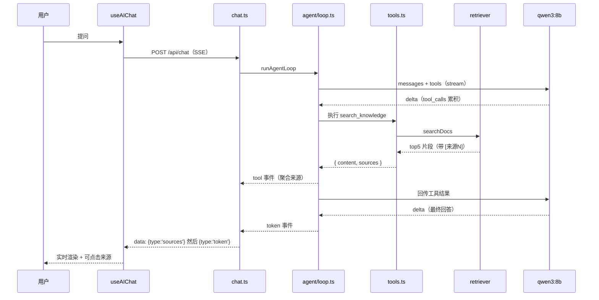

# 04 · Agent 与流式对话

> 目标：搞清一次问答在前后端之间是怎么流转的——工具调用循环怎么跑、SSE 怎么推、前端怎么解析。

## 一、为什么不是"先检索再回答"

早期版本是固定流程：检索 → 拼上下文 → 生成。但用户问题差异很大：

- "什么是闭包" → 检索一次就够
- "对比 React 和 Vue 的响应式" → 可能要检索两次
- "帮我总结 javascript/closure.md" → 直接读全文更合适
- "你好" → 根本不该检索

所以改成了 **Function Calling**：把能力定义成工具交给模型，由模型自己决定调不调、调几次。

## 二、工具定义：`agent/tools.ts`

给模型的两个工具（OpenAI 兼容的 JSON Schema）：

| 工具 | 作用 | 参数 |
|------|------|------|
| `search_knowledge` | 检索相关片段 | `query`、`top_k`（默认 3，最大 10） |
| `get_doc_content` | 读取某篇完整内容 | `path`（如 `javascript/closure.md`） |

```ts
export const toolDefinitions = [
  {
    type: 'function',
    function: {
      name: 'search_knowledge',
      description: '在知识库中检索与用户问题相关的文档片段…返回结果带 [来源N] 编号…',
      parameters: { /* query、top_k */ },
    },
  },
  // get_doc_content ...
]
```

工具实现返回 `{ content, sources }`：`content` 回传给模型，`sources` 供前端展示。

### 一个必须注意的安全点

`get_doc_content` 会按路径读文件，必须防路径穿越：

```ts
const docsRoot = path.resolve(config.docsPath)
const resolved = path.resolve(docsRoot, p)

// 路径穿越防护：必须位于知识库目录内
if (resolved !== docsRoot && !resolved.startsWith(docsRoot + path.sep)) {
  return { content: JSON.stringify({ error: '非法路径：不允许访问知识库目录之外的文件' }), sources: [] }
}
```

否则模型（或构造出的输入）可以读 `../../` 之外的任意文件。

### 工具结果的格式

```ts
const content = docs
  .map(([doc], i) => `[来源${i + 1}: ${doc.metadata.source}]\n${doc.pageContent}`)
  .join('\n\n---\n\n')
```

编号 `[来源N]` 是让模型在回答里标注引用的依据，前端再把编号渲染成可点击标签。

## 三、Agent 循环：`agent/loop.ts`

```ts
export async function* runAgentLoop(opts): AsyncGenerator<LoopEvent> {
  const { messages, definitions, implementations, client, model, maxIterations = 3 } = opts

  for (let turn = 0; turn < maxIterations; turn++) {
    const response = await client.chat.completions.create({
      model, messages, tools: definitions, stream: true, temperature: 0.7,
    })

    // 流式收集 content + tool_calls（delta 分段累积）
    const toolCalls = []
    for await (const chunk of response) {
      const delta = chunk.choices[0]?.delta
      if (delta?.content) yield { type: 'token', content: delta.content }
      if (delta?.tool_calls) { /* 累积拼接 */ }
    }

    if (toolCalls.length === 0) return    // 没有工具调用 → 回答已流出，结束

    messages.push({ role: 'assistant', content: null, tool_calls: /* ... */ })

    for (const tc of toolCalls) {
      // 执行工具，结果 push 为 role: 'tool' 消息
      messages.push({ role: 'tool', tool_call_id: tc.id, content: result.content })
      yield { type: 'tool', name: tc.function.name, args, sources: result.sources }
    }
  }
}
```

三个关键点：

1. **`tool_calls` 是 delta 分段的**：函数名和参数 JSON 会被切成很多块，必须按 `index` 累积拼接，不能只取第一片。
2. **循环有上限**（`maxIterations = 3`）：防止模型反复调工具兜圈子。
3. **错误信息也回传**：工具不存在或执行异常时，把错误作为 `role: 'tool'` 的内容交给模型，让它自己决定怎么回复，而不是直接崩掉。

对外只产出两类事件：

```ts
type LoopEvent =
  | { type: 'token'; content: string }                                  // 流式文本
  | { type: 'tool'; name: string; args: unknown; sources: SourceItem[] } // 工具执行完
```

## 四、SSE 输出：`routes/chat.ts`

```ts
// SSE 流式响应需要手动控制写入时机，绕过 Koa 的自动响应机制
ctx.respond = false

res.writeHead(200, {
  'Content-Type': 'text/event-stream',
  'Cache-Control': 'no-cache',
  Connection: 'keep-alive',
  'X-Accel-Buffering': 'no',   // 关掉 nginx 缓冲，否则流式会被攒着发
})
```

然后消费 Agent 循环的事件并写入：

```ts
for await (const event of runAgentLoop({ messages, definitions, implementations, client, model })) {
  if (event.type === 'tool') {
    // 聚合来源（去重），在第一个 token 前一次性发出
    for (const s of event.sources) {
      if (!allSources.some((x) => x.source === s.source)) allSources.push(s)
    }
  } else if (event.type === 'token') {
    sendSources()   // 先发来源，再发第一个字
    res.write(`data: ${JSON.stringify({ type: 'token', data: event.content })}\n\n`)
  }
}
sendSources()       // 兜底：模型全程无输出时也把来源发出去
res.write(`data: ${JSON.stringify({ type: 'done' })}\n\n`)
```

### 前后端事件协议

| type | 时机 | data |
|------|------|------|
| `sources` | 第一个 token 之前（一次性） | `[{ source, title }]` |
| `token` | 生成过程中逐块 | 文本片段 |
| `done` | 结束 | — |
| `error` | 异常 | 错误提示 |

**为什么来源要"延迟到第一个 token 再发"**：如果检索完立刻显示"参考来源"，而模型还要几秒才出字，用户会看到"来源先出、正文迟迟不来"的割裂感。

## 五、前端解析：`useAIChat.ts`

用 `fetch` + `ReadableStream` 手写 SSE 解析（不用 `EventSource`，因为要 POST 且要带历史消息）：

```ts
const reader = response.body!.getReader()
const decoder = new TextDecoder()
let buffer = ''

while (true) {
  const { done, value } = await reader.read()
  if (done) break

  buffer += decoder.decode(value, { stream: true })
  const lines = buffer.split('\n')
  buffer = lines.pop() || ''        // 半行留到下一轮

  for (const line of lines) {
    if (!line.startsWith('data: ')) continue
    const json = JSON.parse(line.slice(6))
    // 按 type 处理 sources / token / done / error
  }
}
```

要点：

- **必须留 buffer**：一次 `read()` 拿到的可能是不完整的行，`lines.pop()` 把最后半行留到下次拼接。
- **流式更新绕过 Vue 响应式**：token 通过回调（`onToken`）直接交给 UI 更新，不经过响应式数组，避免高频触发 diff。
- **支持中断**：`AbortController` + `stopGeneration()`，中断时保留已生成内容并补发来源。

## 六、完整时序



---

**下一篇**：[05 · 设计决策与踩坑](./05-decisions.md)
