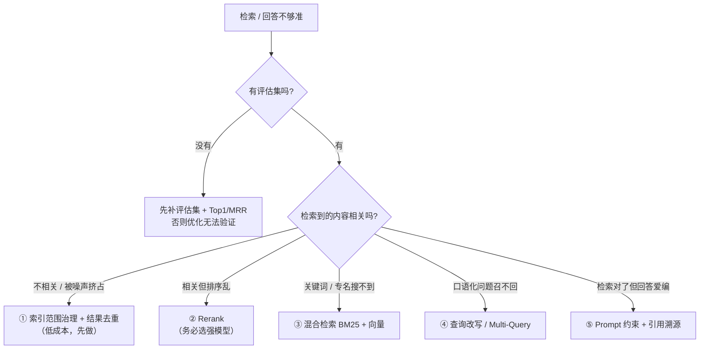

# 05 · 设计决策与踩坑

> 目标：理解"为什么这么选"，以及这个项目实际踩过的坑（含两次**优化失败**的复盘）。

## 一、关键设计决策

| 决策 | 选择 | 理由 |
|------|------|------|
| 模型运行方式 | 本地 Ollama | 零 API 成本、数据不出本机（笔记有隐私性）；代价是能力弱于云端大模型，但对"检索 + 总结"够用 |
| 向量库 | Chroma（Docker） | 轻量、嵌入式、可持久化到本地目录；生产规模会换 Milvus / pgvector |
| RAG 框架 | LangChain.js | 复用成熟的文本切分器与向量库 / Embeddings 适配，后端是 TS 所以选 JS 版 |
| 向量模型 | bge-m3 | 中文检索质量显著更好（做过对比实测） |
| 问答流程 | Function Calling（Agent） | 让模型自己决定检不检索、检索几次，比固定流程灵活 |
| 部署方式 | 本地构建推 `gh-pages` | 账号 GitHub Actions 有 billing 限制，绕开它 |
| 个人内容 | nav 兼任「仅本地」唯一来源（`knowledge.config.mjs`） | `site.nav` 里带 `onlyLocal` 的项派生"线上隐藏 + 排除编译/sidebar/死链"，只维护一份 |
| 检索结果 | 按来源去重 | 避免同一篇占满 top5，提升给 LLM 的上下文多样性 |

## 二、踩过的坑

### 坑 1：Markdown 里的 Vue 冲突语法导致构建失败

**现象**：把 `resume/interview-questions/` 的笔记放进 `docs/` 后，构建直接报错，提示解析 JavaScript 表达式失败。

**根因**：这些笔记里有 Vue 模板语法和裸 HTML 标签，而 VitePress 会把 Markdown 交给 Vue 编译器处理，于是它们被当成"要编译的模板"。

```md
Hello, {{name}}!
{{if showAge}}Age: {{age}}{{/if}}
`<script defer>` vs `<script async>`
```

- 大括号插值会被当成表达式求值，内容不是合法 JS 时就报错；
- 副作用标签（script / style）即使在代码块或行内代码里也会被特殊处理而报错。

**解法**：不直接引用，改用同步脚本 `scripts/sync-interview-questions.mjs`，只处理**围栏代码块之外**的内容：

```js
function escapeText(text) {
  return text
    // 断开插值：{{ → {ZW{ ，}} → }ZW}
    .replaceAll('{{', `{${ZW}{`)
    .replaceAll('}}', `}${ZW}}`)
    // 转义标签起始的 <，避免被当成组件/副作用标签
    .replace(/<(?=[a-zA-Z/!])/g, '&lt;')
}
```

其中 `ZW` 是零宽空格 `&#8203;`。

> 关键教训：**HTML 实体 `&#123;` 对"非法插值"无效**——因为 Vue 会先把实体解码回字符，然后照样当插值解析。必须用零宽字符把**两个左花括号物理断开**，让它根本不被识别成插值。
> 顺带一提：本页面把这类示例都写在围栏代码块里，正是因为它们受保护、不会被 Vue 解析；而行内代码里的同样写法就不安全。

### 坑 2：目录根没有 `index.md` → 访问 404

**现象**：访问 `/interview-questions/`（目录根）报 404，但 `/interview-questions/2026-08-05` 能打开。

**根因**：目录下只有若干文章、没有首页文件，VitePress 不会为目录根自动生成页面。

**解法**：同步脚本为每个目录额外生成 `index.md`（列出各篇链接），这也是为什么"面试题"分类能在菜单里点进去。

### 坑 3：`pnpm preview` 满屏静态资源 404

**现象**：构建正常，预览时 CSS / JS 全部 404。

**根因**：构建用了 `BASE_PATH=/knowledge/`（产物里资源路径是 `/knowledge/assets/...`），但预览没设这个变量，服务器在 `/` 下服务，两边对不上。

**解法**：预览也用同一个 base，并固化到脚本里：

```json
"preview": "BASE_PATH=/knowledge/ pnpm --filter @kb/site preview"
```

访问时要带路径：`http://localhost:4173/knowledge/`（根 `/` 本身 404 是正常的）。

### 坑 4：把 `isProd` 写成字面量 → 构建报死链

**现象**：构建报 `2 dead link(s) found`。

**根因**：配置里 `const isProd = false`（字面量）覆盖了原本的 `process.env.NODE_ENV === 'production'` 判断，导致构建时也走"全量模式"：本地专属内容被构建，且开启了死链检查，于是笔记里指向本地调试地址的链接被判为死链。

**解法**：恢复环境判断，不要写死字面量：

```ts
const isProd = process.env.NODE_ENV === 'production'
```

这样 dev 时是 `false`（看全量）、build 时是 `true`（排除本地专属内容 + 关闭相关死链检查）。

### 坑 5：面试题污染检索结果

**现象**：问"什么是跨域"，top1 命中的是面试题文档而不是知识正文。

**根因**：索引脚本扫 `docs` 下所有 md，面试题和正文是**同质内容**（同一批知识点），但它是精炼问答、和提问的相似度更高，于是挤占检索结果。

**解法**：索引时排除：

```ts
ignore: ['node_modules/**', '.vitepress/**', 'interview-questions/**'],
```

排除后 Top1 命中率 **58% → 75%**（再叠加后面的"切分回退"最终到 83%），是本项目收益最大的一类改动。

### 坑 6：top5 被同一篇文档占满

**现象**：「前端错误监控」题，前 4 名全是同一篇文档的不同块。

**根因**：一篇长文会被切成多个块，它们和问题的相似度都高，于是集体进 top5。

**解法**：按来源去重（同一篇只保留最相关的一块）。指标持平，但**结果多样性明显变好**：top3 从"同一篇重复 4 次"变成 3 个不同来源，给 LLM 的上下文信息量更足。

### 坑 7：两次"看起来很专业、实测没用"的优化

这两次都做了完整 A/B 验证，结果是**负结果**，最终都回退，但过程记录了下来（见 `ai-agent/rag/retrieval-optimization.md`）：

| 优化 | 假设 | 实测 | 处置 |
|------|------|------|------|
| 标题路径切分（每块拼 `文档 > h2 > h3` 面包屑） | 章节上下文更完整，检索更准 | Top1 83% → 75% | 回退 |
| Rerank（bge-reranker-base 重排） | 专用重排模型精度更高 | Top1 83% → 58% | 默认关闭 |

失败原因主要是：**切分更细导致块变小、同篇小块互相竞争**；以及 **小模型对中文技术文档的判别力不如已在用的 bge-m3 向量**。

> 两次都先做了"是不是我写错了"的验证（如给 reranker 一条明显相关、一条明显不相关的候选看打分），确认实现无误后才判定是方案不适用——这一步很重要，否则会误把"实现 bug"当成"方案无效"。

### 坑 8：pnpm 拦截 `onnxruntime-node` 构建脚本

**现象**：装完 `@huggingface/transformers` 后，`pnpm build` 报 `ERR_PNPM_IGNORED_BUILDS`。

**根因**：pnpm 默认不运行依赖的构建脚本，需要显式声明。

**解法**：该包自带 arm64 预编译二进制、无需构建，在 `pnpm-workspace.yaml` 里显式声明忽略：

```yaml
allowBuilds:
  esbuild: true
  onnxruntime-node: false
  protobufjs: true
  puppeteer: true
```

## 三、提高知识库回答准确性的常用手段

> RAG 的准确性可以拆成三段看：**索引（放进库的数据质量）→ 检索（捞出来的内容质量）→ 生成（照着内容写得好不好）**。
> 先定位问题出在哪一段，再选对应手段——不要一上来就堆模型。

### ① 索引层（数据进入向量库之前）

| 手段 | 简介 | 最适合的场景 | 优点 | 代价 |
|------|------|------------|------|------|
| **索引范围治理** | 排除噪声/同质内容（草稿、问答对、重复内容），别"能塞就塞" | 库里有大量"看着相关其实没用"的内容 | 收益大、成本低 | 需要人工判断哪些该排 |
| **切分策略** | 调 chunk 大小/重叠；或按标题层级切 | 长文档、结构清晰的文档 | 决定检索粒度 | 调参繁琐，且效果因库而异（见坑 7） |
| **元数据 / 标题前缀** | 每块带上"来自哪篇/哪节" | 文档多、块容易断章取义 | 成本低、改善上下文 | 实测对"文件级命中"提升有限 |

### ② 检索层（问答时怎么捞）

| 手段 | 简介 | 最适合的场景 | 优点 | 代价 |
|------|------|------------|------|------|
| **向量检索** | bge-m3 这类 bi-encoder 做语义相似 | 默认方案 | 快、语义泛化好 | 对专有名词、精确匹配弱 |
| **混合检索（Hybrid）** | BM25 关键词 + 向量，用 RRF/加权融合 | 有代码标识符、专有名词、精确查询 | 召回更稳、鲁棒性好 | 要维护两套索引 + 融合权重调参 |
| **Rerank 重排** | cross-encoder 对 topN 候选精排 | 检索"内容都沾边，但顺序不对" | 模型够强时精度提升明显 | 更慢、要额外模型；**小模型可能反而变差**（本项目实测） |
| **查询改写 / Multi-Query** | 让 LLM 改写问题，或扩成多个子查询 | 用户提问口语化、一句话问多件事 | 召回率提升 | 多一次 LLM 调用、延迟增加 |
| **结果去重（多样性）** | 同一篇文档只保留最相关的一块 | topK 被同一篇的多个块占满 | 上下文更丰富、信息量更大 | 基本没有代价（本项目保留） |
| **元数据过滤** | 先限定分类/时间再检索 | 问题能明确归到某个领域 | 减少跨域误召 | 依赖分类判断的准确性 |
| **参数调优** | topK、相似度阈值、chunk 参数 | 边界情况的最后打磨 | 零成本 | 必须有评估集支撑 |

### ③ 生成层

| 手段 | 简介 | 最适合的场景 | 优点 | 代价 |
|------|------|------------|------|------|
| **Prompt 约束** | "只根据以下资料回答""没找到就说没有" | 模型爱编（幻觉多） | 立竿见影、零成本 | 要和工具/上下文配合 |
| **引用溯源** | 回答里标注来源 `[来源N]`，可点击核对 | 对可信度有要求 | 可验证、体验好 | 需要检索结果自带来源 |
| **上下文精简** | 只喂最相关的几条，去重/压缩后入 prompt | 上下文噪声多、token 成本敏感 | 降噪、更快、更省 | 需要 rerank / 压缩支持 |

### ④ 评估（贯穿全程，是前提不是可选项）

| 手段 | 简介 | 为什么重要 |
|------|------|-----------|
| **评估集 + 指标** | 一组"问题 → 期望文档"，算 Top1 / MRR | **没有它，任何优化都无法验证**（本项目的 Top5 指标曾全 100%，毫无区分度） |
| **数据驱动取舍** | 用 A/B 决定去留，负结果也记录 | 避免"看起来更专业"的假优化（见坑 7） |

### 本项目的实践对照

| 手段 | 是否试过 | 效果 |
|------|---------|------|
| 索引范围治理（排除面试题） | ✅ | Top1 58% → 75%，**有效** |
| 结果去重（按来源） | ✅ | 指标持平，多样性明显变好 → 保留 |
| Prompt 约束 + 引用溯源 | ✅ | 内置在 `SYSTEM_PROMPT` 与工具结果里 |
| 评估集升级（Top1 / MRR） | ✅ | 有了区分度，后续优化才有据可依 |
| Rerank（bge-reranker-base） | ✅ | Top1 83% → 58%，**负结果，默认关闭**（换候选 100 重测：修 2 题但要 33.5s/次，仍不划算） |
| 标题路径切分 | ✅ | Top1 83% → 75%，**负结果，已回退** |
| **混合检索（BM25 + 向量）** | ✅ | **Hit@5 98.4%→100%、Hit@1 87.6%→90%、MRR 0.923→0.944，零模型成本 → 已采用为默认** |
| 微调 | ❌ | 知识频繁更新，RAG 更合适（见 [RAG vs 微调](../ai-agent/rag/rag-vs-finetuning.md)） |

### 怎么选：一条决策路径



**投入产出的大致顺序**（由便宜到贵，括号内为本项目实测）：
`索引治理（+17pp）→ 结果去重（多样性）→ 混合检索（+1.6pp Hit@5 / +2.4pp Hit@1，零成本）→ Prompt 约束+引用 → Rerank / 查询改写 → 换更强的模型/embedding →（最后才考虑）微调`

> 注意顺序后来修正过一次：早期把"混合检索"排在 Rerank 之后，实测下来它**性价比远高于 Rerank**
> （零模型、微秒级 vs 33 秒/次），所以提到 Prompt 约束之前。这条也和 Anthropic
> Contextual Retrieval 的数据一致——混合检索那一步的收益比 rerank 大得多。

一句话原则：**先从最便宜、影响面最大的数据层下手，再逐步往贵的模型层走**；每一步都用评估集量化，负结果就果断回退。

## 四、经验总结

1. **先有可度量的评估，再做优化**：只有"命中率"时 12 题全 100%，什么都测不出来；补上 Top1 / MRR 才有了区分度。
2. **负结果也是结果**：别用"设计上更优雅"替代"实测更有效"，两次回退都是靠数据说话。
3. **索引范围是一等公民**：不是"能塞进去就塞"，同质内容会稀释检索质量。
4. **环境变量要在同一条链路上保持一致**：base 在构建和预览不一致会直接导致 404。
5. **配置用单一数据源派生**：`site.nav` 一份数据派生 `srcExclude` / `ignoreDeadLinks` / sidebar 过滤 / nav 过滤，加内容只改一处，避免遗漏。

---

**回到**：[知识库项目架构](./index.md)
