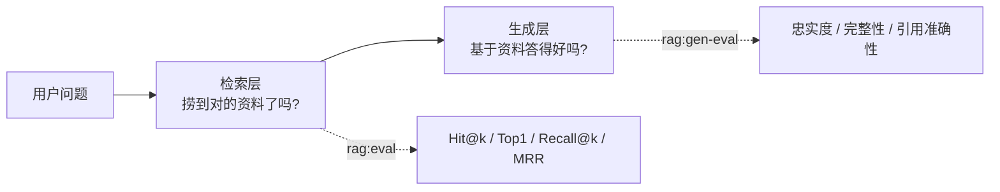

# 06 · RAG 评估体系设计

> 这篇讲清一件事：**怎么衡量"检索准不准、回答好不好"**。
> 评估是优化的前提——没有它，所有改动都只能靠感觉。

## 一、为什么必须先有评估

这个项目最典型的一课：早期评估只有 12 道题、只看"命中率"，结果 **12 题全是 100%**。指标饱和了——无论怎么改检索、换不换模型，数字都不变，**根本测不出好坏**。

所以顺序必须是：**先把评估做对，再谈优化**。评估集就是"优化这件事的度量衡"。

## 二、两层评估

RAG 的链路长，一个改动可能只影响其中一段，所以要分两层测：



**关键认知：检索好 ≠ 回答好。** 本项目实测过——检索层 Hit@5 已经 100%，但生成层照样发现"模型没检索就编造引用"的问题。**只看检索会漏掉一半的问题。**

| 层 | 脚本 | 回答的问题 | 耗时 |
|----|------|-----------|------|
| 检索层 | `pnpm rag:eval` | 期望文档能不能被捞出来、排第几 | ~30 秒 |
| 生成层 | `pnpm rag:gen-eval` | 回答是否忠实、完整、引用是否准确 | ~14 分钟 |

## 三、检索层设计（`rag-eval.ts`）

### 3.1 数据集

数据**独立存放**在 `server/eval/retrieval-cases.json`——**数据与评估逻辑分离**，加题/改题只改数据、不碰代码，也便于 diff 和多人维护。

```ts
type EvalCase = { q: string; expect: string[]; category: string }
```

- **`expect` 是数组**：一个问题可能多篇文档都算对（如"Vue 响应式"对应 3 篇）。
- **`category` 用于分层**：覆盖 React / Vue / 浏览器 / JS / CSS / 性能 / 工程化 / 服务端 / AI Agent / 算法 / 大前端 共 11 类、50 题。
- **刻意加"难例"**：跨文档问题（对比 React/Vue 响应式）、相似文档区分（`monitoring` vs `error-monitoring`）。

### 3.2 指标：一个排名，派生四个视角

核心只需要算一个值——**期望文档在结果里最早出现的排名**：

```ts
function rankOf(sources: string[], expect: string[], k: number) {
  // 精确匹配（不是子串），返回最佳命中排名 + topK 内命中的期望文档数
}
```

由它派生四个指标，各自回答**不同的问题**：

#### ① Hit@5 —— "至少捞到一篇了吗"（最宽松）

- **算法**：`排名 > 0` 的题数 ÷ 总题数
- **含义**：期望文档里**任意一篇**进了前 5，这题就算通过
- **示例**：某题期望 `javascript/closure.md`，检索结果第 3 名命中 → **Hit@5 记 1（通过）**
- **盲区**：只要"沾边就算过"，看不出排得准不准、也看不出多篇捞全没捞全

#### ② Hit@1 —— "排第一了吗"（严格）

- **算法**：`排名 = 1` 的题数 ÷ 总题数
- **含义**：期望文档必须**排在第一位**
- **示例**：上例期望文档排第 3 → **Hit@1 记 0（不通过）**
- **为什么必须有它**：比 Hit@5 严格得多，反映**排序质量**。本项目实测中，同一套检索 **Hit@5 全程 100%**，而 Hit@1 从 58% 涨到 88%——**只有它才看得出优化效果**

#### ③ Recall@5 —— "该捞的捞全了吗"（多篇场景，最严格）

- **算法**：每题 `top5 内命中的期望文档数 ÷ 期望文档总数`，再对所有题取平均
- **含义**：衡量**覆盖率**——当一道题的答案散落在多篇文档时，捞到了几成
- **示例（关键）**：

```
expect（3 篇）: vue/reactive.md, vue/primitive-reactive.md, vue/double-binding.md
检索 top5    : [reactive.md, primitive-reactive.md, 其他A, 其他B, 其他C]
→ 命中 2 / 期望 3 → Recall@5 = 0.667
```

- **它的独特价值**：这条题 `Hit@5 = 1`（捞到了）、`Hit@1 = 1`（还排第一）——**只有 Recall@5 暴露出"3 篇只捞到 2 篇"**。本项目实测 Recall@5 只有 0.96，就是这么发现的

#### ④ MRR —— "整体排得靠不靠前"

- **算法**：`MRR = (1/N) × Σ(1/rankᵢ)`，`rankᵢ` 是第 i 题的命中排名（未命中记 0）
- **含义**：排名越靠前贡献越大（第 1 名得 1 分、第 2 名 0.5、第 3 名 0.33…）
- **示例**：

```
第 1 题 rank=1 → 1/1 = 1.0
第 2 题 rank=2 → 1/2 = 0.5
第 3 题 rank=5 → 1/5 = 0.2
第 4 题 未命中  → 0
MRR = (1.0 + 0.5 + 0.2 + 0) / 4 = 0.425
```

- **它的价值**：Hit 类只区分"中/不中"，MRR 能区分"**中得靠不靠前**"——第 1 名和第 5 名在 Hit@5 里都是 1，但 MRR 分别是 **1.0** 和 **0.2**

#### 为什么四个都要（互为补充）

| 指标 | 严格度 | 盲区 |
|------|--------|------|
| Hit@5 | 最宽 | 排序质量、覆盖率都看不出 |
| Hit@1 | 严 | 多篇场景覆盖不全看不出 |
| Recall@5 | 最严（覆盖） | 只看覆盖，不看排序 |
| MRR | 中 | 不区分覆盖几篇，只看最佳排名 |

> 本项目正是靠这四个的组合，分别发现了"**面试题污染**"（Hit@1 偏低）和"**多篇覆盖不全**"（Recall@5 偏低）——**两种性质完全不同的问题**。

### 3.3 匹配策略：精确 + 部分分

- **精确路径匹配**：用 `===`（配合路径规范化），而不是 `includes` 子串——避免 `xxx/react/concept.md` 被 `react/concept.md` 误判命中。
- **多篇期望给部分分**：`Recall@k` 天然支持"命中 2/3 篇"得 0.67，比"全有或全无"更细腻。

### 3.4 分类统计：定位弱项

输出按 `category` 分组，一眼看出哪个主题是短板：

```
React：6 题 | Hit@5 100% | Hit@1 83% | Recall@5 0.917 | MRR 0.917
Vue：  5 题 | Hit@5 100% | Hit@1 100% | Recall@5 0.833 | MRR 1.000
...
```

> 实际就是这么发现 **Vue、CSS 的 Recall@5 偏低**（多篇文档覆盖不全）的。

### 3.5 数据集怎么扩充：脚本生成 + 人工审核

样本量是评估可信度的地基，但手动出题慢。所以提供了一个生成脚本：

```bash
pnpm rag:gen-cases --limit 20   # 用本地 LLM 逐篇文档生成"能由它回答的问题"
```

它遍历文档、让模型基于内容出一个问题，产出 `server/eval/retrieval-cases.generated.json` 作为**初稿**。

**但必须人工审核**——实测生成结果里混进了 `index.md`、`GUIDE.md` 这类**项目说明文档**（不属于技术知识，不该进评估集）；措辞、期望文档的准确性也要人工过一遍。审核通过后再合并进 `retrieval-cases.json`。

## 四、生成层设计（`rag-gen-eval.ts`）

### 4.1 评估维度

| 维度 | 含义 |
|------|------|
| **忠实度** | 回答是否完全基于检索到的资料，有无编造 |
| **完整性** | 是否真正回答了问题 |
| **引用准确性** | `[来源N]` 标注是否恰当、编号是否有效 |

### 4.2 判定方式：自动检查 + LLM 打分 + 可人工复核

三层结合，各司其职：

1. **自动检查（确定性的，最可靠）**
   - **引用合法性**：回答里的 `[来源N]`，编号是否都在 `1..来源数` 范围内
   - **拒答检测**：负例题是否如实说"没有/未找到/无法提供"
2. **LLM-as-judge**：用本地 `qwen3:8b` 按 rubric 给三项各打 1~5 分（输出 JSON）
   - 局限：8B 模型自评可能不够客观，需人工校准
3. **人工复核**：脚本把"问题 + 检索来源 + 回答 + 评分"写进 `server/data/gen-eval-report.md`，人工过一遍

### 4.3 负例题：专门测"不知道就说不知道"

这是**测幻觉的关键设计**。评估集里放了几道**知识库答不了**的题：

```ts
{ q: '今天上海的天气怎么样？', category: '知识库外(负例)', expectAnswer: false },
{ q: '请介绍一下 Kubernetes 的 Pod 调度机制', category: '知识库外(负例)', expectAnswer: false },
{ q: '2025 年世界杯冠军是谁？', category: '知识库外(负例)', expectAnswer: false },
```

对这类题，**正确的行为是"如实说知识库没有"**，而不是硬答。脚本用关键词（没有/未找到/无法提供…）粗判，人工复核。

## 五、评估体系的演进（实战顺序）

| 阶段 | 做了什么 | 发现了什么 |
|------|---------|-----------|
| ① 12 题 + Top5 | 最初的评估 | **指标饱和**（全 100%），什么都测不出 |
| ② 扩到 50 题 + 分层 | 按主题铺开 | 暴露弱项（Vue/CSS 的 Recall 低），且校准了 1 条错标 |
| ③ 匹配改严 | 精确匹配 + Recall@5 | 发现"多篇期望覆盖不全"是真实短板 |
| ④ 加生成层评估 | 端到端 + 负例题 | **发现"无检索却编造引用"**（检索层完全看不到） |

每一步都在"上一层的盲区"里——这就是为什么要**分层**。

## 六、实战收获

| 发现 | 哪一层发现的 | 修复 |
|------|------------|------|
| 面试题污染检索 | 检索层 | 索引时排除（Hit@1 58% → 75%） |
| 多篇期望覆盖不全 | 检索层（Recall@5） | 待优化 |
| **无检索却编造引用** | **生成层** | Prompt 强化"先检索才能标引用"（引用合法性 4/10 → **10/10**） |
| 拒答检测误报 | 生成层（自动检查） | 补齐正则（"无法提供"等） |

> 最有教育意义的是最后两条：**检索指标一片绿，生成层却发现了最严重的问题。**

## 七、自动化：怎么防止退化

评估做完要能**持续跑**，否则改动一次就退回解放前。目标是：**一条命令跑回归，指标跌破底线就报错**。

> 前提：评估依赖本地 Ollama + Chroma，所以 **CI 跑不了**（除非改用云端 API，违背"本地零成本"）。方案落在**本地命令 + 留档**。

### 三个命令

| 命令 | 做什么 | 耗时 |
|------|--------|------|
| `pnpm test:rag` | 检索评估 + 对比 + 阈值门禁 | ~30 秒 |
| `pnpm test:rag:full` | 再加生成层评估 | ~15 分钟 |
| `pnpm test:rag:baseline` | 把当前成绩固化为基线 | 秒级 |

### 三份数据，角色不同

| 文件 | 角色 | 说明 |
|------|------|------|
| `server/eval/thresholds.json` | **硬底线** | 跌破即 `exit 1`（数值可调，不用改代码） |
| `server/data/eval-history.jsonl` | **流水账** | 每次运行追加一行 → 支持"较上次"与长期趋势 |
| `server/data/eval-baseline.json` | **参考靶子** | 被认可的某次成绩 → 回答"现在离达标版差多少" |

三者互补：**阈值管"不许退化到底线以下"，基线管"和认可的那版比差多少"，历史管"最近一路怎么走的"**。

> 记录里带**环境指纹**（embedding 模型、题数等）——换了模型或重建索引后，不同环境的数据不可直接比。

### 阈值（可在 `thresholds.json` 调整）

| 层 | 指标 | 阈值 |
|----|------|------|
| 检索 | Hit@1 | ≥ 90% |
| 检索 | Recall@5 | ≥ 0.90 |
| 检索 | MRR | ≥ 0.90 |
| 生成 | 引用合法性 | = 100% |
| 生成 | 忠实度均分 | ≥ 4.0 |

### 实际输出

```
==== 对比 ====
较上次：Hit@5 100% (持平) | Hit@1 94% (持平) | Recall@5 93% (持平) | MRR 97% (持平)
较基线：Hit@5 100% (持平) | Hit@1 94% (持平) | Recall@5 93% (持平) | MRR 97% (持平)

✅ 阈值门禁通过（retrieval）
```

跌破底线时：

```
❌ 阈值门禁未通过（retrieval）：
   - Hit@1: 94% < 要求 99%
```

脚本会**非零退出**，因此可以接入任何自动化流程（hook、脚本、将来的 CI）。

### 建议的使用节奏

1. 改完检索逻辑 / prompt → `pnpm test:rag`（快）
2. 结果满意 → `pnpm test:rag:baseline` 固化为新基线
3. 大改动（换模型、改索引）→ `pnpm test:rag:full`

## 八、局限与后续

- **样本量**：50 题仍不算大，单题差异仍有噪声——可用 `pnpm rag:gen-cases` 生成初稿、人工审核后扩充；
- **LLM judge 自评偏差**：用同一个 8B 模型评自己，可能偏乐观，需人工校准；
- **文件级而非块级**：目前判"命中哪篇文档"，未判"命中正确章节"；
- **未覆盖多轮对话**：当前只评测单轮问答。

## 延伸阅读

- [03 · 后端与 RAG 检索](./03-server-rag.md) —— 被评估的检索链路
- [05 · 设计决策与踩坑](./05-decisions.md) —— 提高准确性的手段与踩坑
- [RAG vs 微调](../ai-agent/rag/rag-vs-finetuning.md) —— 为什么选 RAG
