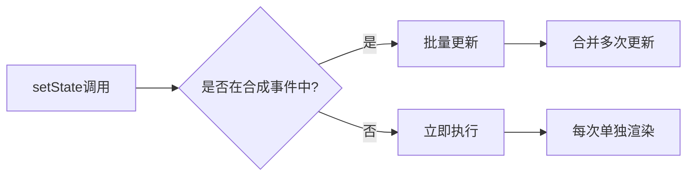
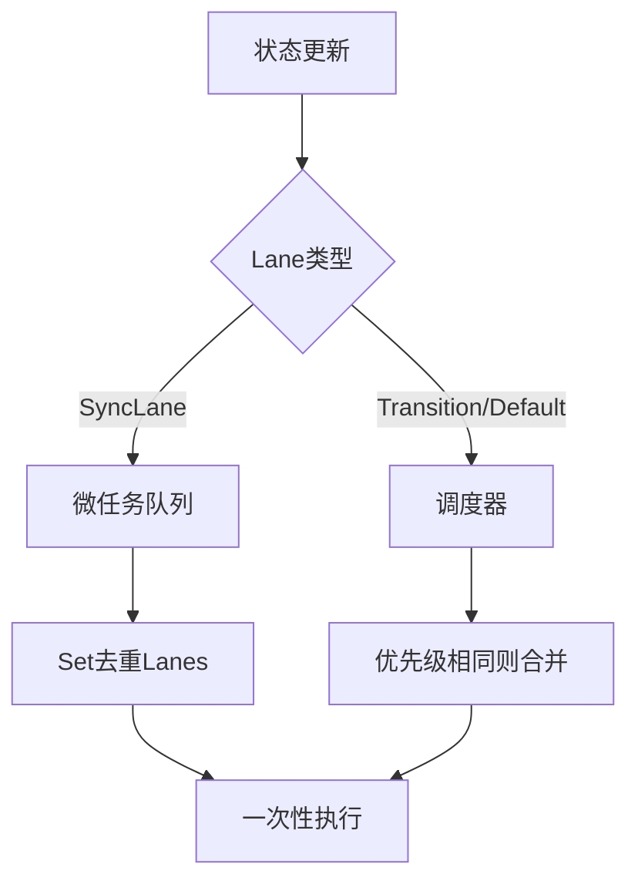
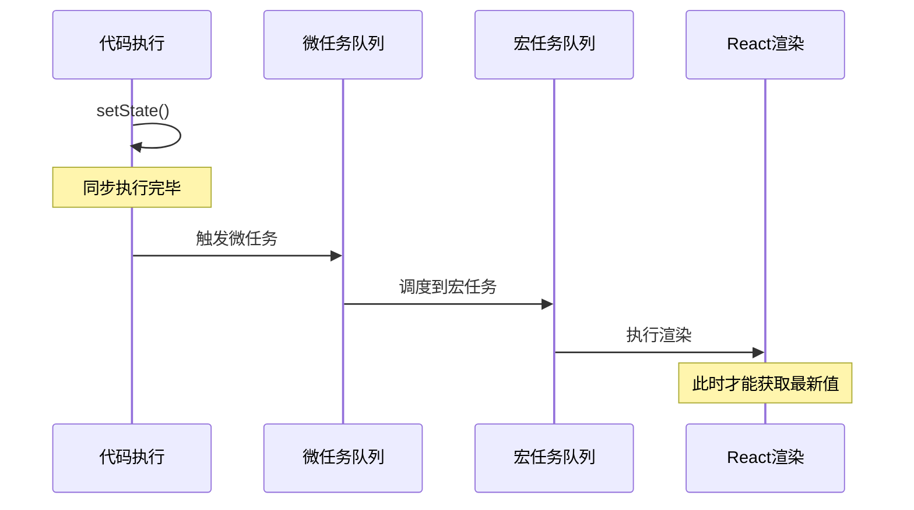

## Batched Updates
批量更新：多个更新的合并
区别与lanes的概念，lanes指的是多个lane的集合

### React Batched Updates 发展史

#### Legacy Mode (React 16及之前)

**特点：半自动批量更新**

在Legacy模式下，React只在**合成事件回调**中自动批量更新，异步代码不会批量处理。



**示例对比：**

```javascript
// ✅ 合成事件中 - 批量更新(只渲染1次)
function handleClick() {
  setCount(c => c + 1);  // 不立即渲染
  setName('John');        // 不立即渲染
  // 函数结束时统一渲染
}

// ❌ 异步代码中 - 非批量更新(渲染2次)
function handleClick() {
  setTimeout(() => {
    setCount(c => c + 1);  // 立即渲染
    setName('John');        // 再次渲染
  }, 0);
}
```

**实现原理：**

通过`batchedUpdates` API控制执行上下文：

```javascript
// 简化版实现
let executionContext = NoContext;

function batchedUpdates(fn) {
  const prevContext = executionContext;
  executionContext |= BatchedContext;  // 设置批量上下文
  try {
    fn();  // 执行用户代码
  } finally {
    executionContext = prevContext;  // 恢复上下文
    // 如果上下文为空，立即刷新队列
    if (executionContext === NoContext) {
      flushSyncQueue();
    }
  }
}
```

**问题：**
- ❌ **只能处理同步代码**：`BatchedContext` 只在合成事件的同步执行期间有效
- ❌ **异步场景无法批量**：setTimeout、Promise、原生事件等都会脱离批量上下文
- ❌ **需要手动调用**：在非合成事件场景中，需要手动包裹 `unstable_batchedUpdates`

**哪些场景需要手动调用？**

```javascript
import { unstable_batchedUpdates } from 'react-dom';

// ❌ setTimeout
setTimeout(() => {
  unstable_batchedUpdates(() => {
    setCount(c => c + 1);
    setName('John');
  });
}, 0);

// ❌ Promise
fetch('/api').then(() => {
  unstable_batchedUpdates(() => {
    setData(result);
    setLoading(false);
  });
});

// ❌ 原生事件
document.getElementById('btn').addEventListener('click', () => {
  unstable_batchedUpdates(() => {
    setCount(c => c + 1);
    setName('John');
  });
});

// ❌ 自定义回调
function handleClick(callback) {
  callback();
}
handleClick(() => {
  unstable_batchedUpdates(() => {
    setCount(c => c + 1);
    setName('John');
  });
});
```

---

#### Concurrent Mode (React 18+)

**特点：全自动批量更新**

React 18引入了**Automatic Batching**，无论同步还是异步代码，都会自动批量更新。



**新行为示例：**

```javascript
// ✅ 所有场景都批量更新(只渲染1次)
function handleClick() {
  // 同步代码
  setCount(c => c + 1);
  setName('John');
  
  // 异步代码也批量！
  setTimeout(() => {
    setAge(25);     // 不立即渲染
    setEmail('x');  // 不立即渲染
  }, 0);
  
  // Promise也批量！
  fetch('/api').then(() => {
    setData(result);  // 不立即渲染
  });
}
```

**实现机制：**

1. **SyncLane任务**：通过位运算去重 + 微任务合并
   
   React 内部**不是用 Set**，而是用**位运算**实现去重：
   
   ```javascript
   // FiberRootNode 的属性
   const root = {
     pendingLanes: NoLanes,  // 位掩码，表示所有待处理的 lanes
   };
   
   // 每次 setState 时
   function markUpdateLaneFromFiberToRoot(fiber, lane) {
     // 位运算合并，天然去重
     // 0b100 | 0b100 = 0b100（相同 lane 不会重复）
     root.pendingLanes |= lane;
     
     // 向上冒泡
     let parent = fiber.return;
     while (parent !== null) {
       parent.childLanes |= lane;
       parent = parent.return;
     }
   }
   
   // 在微任务中统一调度
   queueMicrotask(() => {
     const lanes = root.pendingLanes;
     root.pendingLanes = NoLanes;  // 清空
     scheduleRender(lanes);  // 一次性渲染
   });
   ```
   
   **为什么用位运算而不是 Set？**
   - ⚡ **性能更高**：CPU 级别的纳秒级操作
   - 💾 **内存更少**：一个 32 位整数 vs 一个 Set 对象
   - 🎯 **天然去重**：按位或运算自动去重

2. **非SyncLane任务**：调度器层面避免重复调度
   
   **关键机制：检查是否已有相同优先级的 render 在排队**
   
   ```javascript
   let isRenderScheduled = false;
   
   function ensureRootIsScheduled(root, lane) {
     // 检查是否已经有 render 在调度中
     if (isRenderScheduled) {
       return;  // 已有相同优先级的任务，直接返回
     }
     
     // 调度 render
     isRenderScheduled = true;
     scheduleCallback(
       getSchedulerPriorityForLane(lane),
       () => performConcurrentWorkOnRoot(root)
     );
   }
   
   // 示例：多次调用 setState
   setCount(1);     // 1. 创建 Update，pendingLanes |= DefaultLane
   setName('A');    // 2. 创建 Update，pendingLanes |= DefaultLane（不变）
   setEmail('x');   // 3. 创建 Update，pendingLanes |= DefaultLane（不变）
                    // 4. ensureRootIsScheduled 检测到 isRenderScheduled=true，直接返回
   
   // 最终：只有一个 render 任务，处理所有 Updates
   ```
   
   **真正的批量发生在哪里？**
   - 每次 setState 都会创建独立的 Update 对象
   - 这些 Updates 被添加到各自 Fiber 节点的 updateQueue
   - `pendingLanes` 通过位运算去重，确保相同 lane 只记录一次
   - 调度器检测到已有相同优先级的 render，不重复调度
   - render 执行时，**按 renderLanes 过滤 Updates**，只处理属于当前优先级的 Updates
   - 被跳过的 Updates 会保存到 baseQueue，等待下次对应优先级的 render
   
   **重要细节：Updates 不是无脑全部处理**
   
   ```javascript
   function processUpdateQueue(workInProgress, queue, renderLanes) {
     let update = queue.shared.pending;
     let newState = queue.baseState;
     
     do {
       const updateLane = update.lane;
       
       // ✅ 关键：只处理属于 renderLanes 的 updates
       if (isSubsetOfLanes(renderLanes, updateLane)) {
         // 处理这个 update
         newState = getStateFromUpdate(update, newState);
       } else {
         // 跳过，保存到 baseQueue
         // 等待下次对应优先级的 render 再处理
         saveToBaseQueue(update);
       }
       
       update = update.next;
     } while (update !== null);
     
     return newState;
   }
   
   // 示例：不同优先级的 updates
   // Update1: lane = DefaultLane (0b100)
   // Update2: lane = TransitionLane (0b1000)
   
   // 第一次 render (renderLanes = DefaultLane)
   // → 处理 Update1，跳过 Update2
   // → baseState = 更新后的值, baseQueue = [Update2]
   
   // 第二次 render (renderLanes = TransitionLane)
   // → 从 baseState 开始，处理 Update2
   ```

**核心优势：**
- ✅ 减少不必要的重渲染
- ✅ 提升性能（特别是频繁更新场景）
- ✅ 开发者无需关心批量时机
- ✅ 异步代码也能享受批量更新

---

### 各版本对比总结

```mermaid
gantt
    title React批量更新演进
    dateFormat X
    axisFormat %s
    
    section Legacy (v16-)
    合成事件批量 :done, 0, 3
    异步非批量   :active, 0, 3
    
    section Concurrent (v18+)
    全场景批量   :done, 4, 7
    微任务合并   :done, 4, 7
    调度器优化   :done, 4, 7
```



| 特性 | Legacy Mode | Concurrent Mode |
|------|-------------|-----------------|
| 合成事件 | ✅ 批量 | ✅ 批量 |
| setTimeout | ❌ 非批量 | ✅ 批量 |
| Promise | ❌ 非批量 | ✅ 批量 |
| 原生事件 | ❌ 非批量 | ✅ 批量 |
| 实现方式 | executionContext | Lane + Scheduler |
| 手动API | unstable_batchedUpdates | 不需要 |

---

### 与其他框架对比

**Concurrent Mode React的特殊性：**



**关键差异：**

- **Vue 3 / Svelte / Legacy React**：
  - 在**微任务**中完成渲染
  - `nextTick()`后可获取最新DOM
  
- **Concurrent React**：
  - 在**宏任务**中消费任务
  - 微任务后拿不到批量更新结果
  - 需要使用`flushSync()`强制同步刷新（不推荐）

**原因：**
并发模式为了支持时间切片和可中断渲染，将渲染工作交给调度器在宏任务中执行，这样才能在浏览器有空闲时逐步完成渲染。

```javascript
// Vue 3: 微任务后即可获取
nextTick(() => {
  console.log(dom.textContent); // ✅ 已更新
});

// React 18: 需要特殊处理
setTimeout(() => {
  console.log(ref.current.textContent); // ✅ 已更新
}, 0);
```