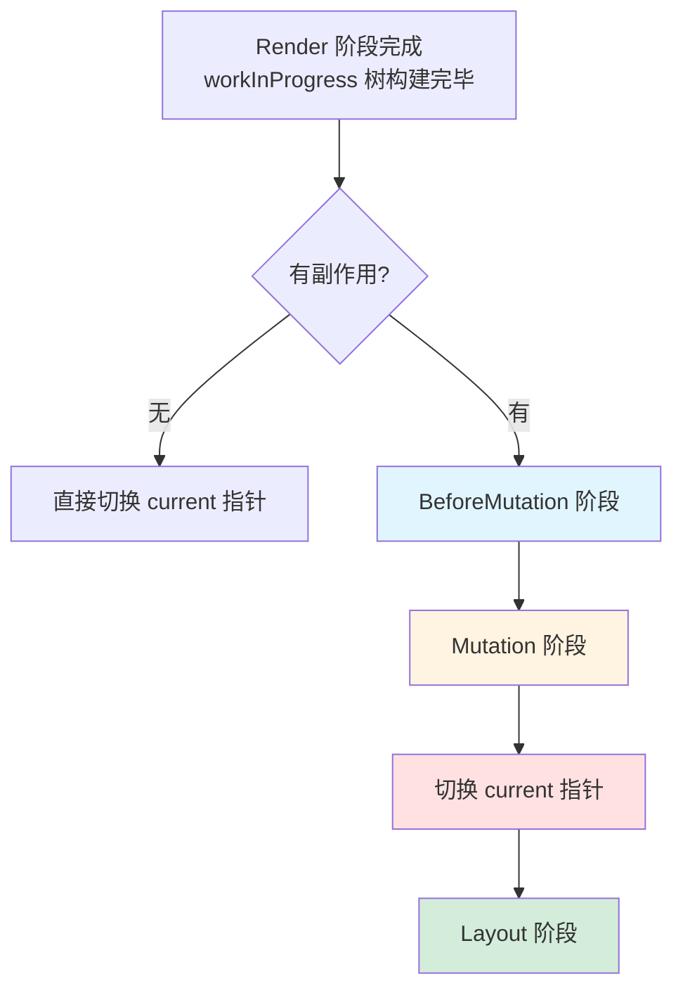

# Commit 阶段

Render 阶段（beginWork + completeWork）可能会被中断和恢复，但 **Commit 阶段一旦开始就会同步执行到底**，不会被中断。这是因为 DOM 操作必须是原子性的——如果只更新了一半就中断，用户会看到不一致的 UI。

> 前置知识：[Reconciler 协调器](./reconciler.md) 中 completeWork 阶段的 flag 冒泡

## 整体流程



Commit 阶段包含三个子阶段，按顺序执行：**BeforeMutation → Mutation → Layout**。

---

## 递归模式：begin 与 complete

三个子阶段都遵循相同的递归模式，每个阶段分为 **begin（递）** 和 **complete（归）** 两步：

```
commitXXXEffects_begin（递）:
  向下遍历，找到最底层的有副作用的节点
  → 调用 commitXXXEffects_complete

commitXXXEffects_complete（归）:
  1. 对当前节点执行具体的副作用操作
  2. 有兄弟节点 → 返回兄弟，回到 begin 处理兄弟
  3. 无兄弟节点 → 回到父节点，对父节点执行副作用操作
```

简单说就是：**先一路向下找到叶子，从叶子开始处理，处理完一个看有没有兄弟，没有兄弟就回到父节点继续。**

---

## BeforeMutation 阶段

这个阶段在 DOM 变更**之前**执行，所以它能拿到变更前的 DOM 状态。

主要做两件事：

1. **调用 `getSnapshotBeforeUpdate`**（Class 组件）
   - 这个生命周期之所以叫 "Before"Snapshot，就是因为它在 DOM 变更前执行
   - 可以读取变更前的 DOM 信息（如滚动位置），返回值会传给 `componentDidUpdate`

2. **调度 Passive Effect（useEffect）**
   - useEffect 是异步的，这里只是把它调度到浏览器绘制之后执行
   - 实际执行发生在 Layout 阶段之后

> **为什么需要这个阶段？** 有些场景需要在 DOM 变更前读取信息（比如记录滚动位置），变更后再做对比。`getSnapshotBeforeUpdate` 就是为此设计的。

---

## Mutation 阶段

这个阶段**操作真实 DOM**，是 Commit 阶段最核心的部分。

Mutation 阶段内部也遵循 begin（递）/ complete（归）的递归遍历模式。但要注意：**递和归描述的是遍历顺序，而不是操作的执行时机。** 实际的操作顺序是：**先处理所有删除，再处理插入和更新。**

### 删除 DOM 元素

删除操作优先执行。`fiber.deletions` 数组存储需要删除的节点。

实际操作比想象中复杂：需要递归执行子树的 unmount 逻辑，包括 Class 组件的 `componentWillUnmount` 和函数组件的 `useEffect` 清理函数（destroy）。**子节点的 unmount 先于父节点**——先清理子树，再处理父节点。

### 移动/插入/更新 DOM 元素

删除完成后，从叶子节点向上处理：

1. **移动/插入**：找到父 DOM 节点和参考节点（before），将新 DOM 插入到 before 之前
2. **更新**：`fiber.updateQueue` 中记录了需要更新的属性（由 render 阶段 completeWork 的 diffProperties 生成），在这里统一应用到 DOM 上
3. **置空 ref**：仅在 mount 阶段或 ref 发生变化时执行

### 为什么先删除再插入？

```
    A (需要更新)
   / \
  B   C (需要删除)
 /
D (需要插入)
```

以上面的树为例：C 需要从 A 的子节点中删除，D 需要作为 B 的新子节点插入。

React 选择先统一处理所有删除，再处理插入和更新。这样做的好处是**避免 DOM 操作之间的引用冲突**——插入操作需要指定参考节点（insertBefore 的 before 参数），如果先插入再删除，参考节点可能已经被移动或删除，导致插入位置错误。

> 遍历顺序上，begin 阶段从根向下走（A → B → D → B → C），complete 阶段从叶子向上回（D → B → C → B → A）。删除和插入操作都挂载在这个遍历过程上，但执行的先后顺序是：先把遍历过程中遇到的删除全部处理完，再处理插入和更新。

---

## Fiber Tree 切换

Mutation 完成后、Layout 开始前，执行 current 指针的切换：

```javascript
root.current = workInProgress;
```

**为什么在这个时机切换？** 这是为了 Class 组件生命周期的正确性：

- `componentWillUnmount`（Mutation 阶段执行）→ 此时 current 还指向**旧的** Fiber 树（UI 中对应的树）
- `componentDidMount` / `componentDidUpdate`（Layout 阶段执行）→ 此时 current 已指向**新的** Fiber 树

如果切换时机不对，生命周期函数中拿到的 current 就是错的。

---

## Layout 阶段

这个阶段在 DOM 变更**之后**执行，所有 DOM 操作已经完成。

1. **处理 OffscreenComponent 逻辑**（递阶段）：
   - 向下遍历时，根据 Offscreen 的隐藏/可见状态逐层传递标记（`offscreenSubtreeIsHidden` / `offscreenSubtreeWasHidden`）
   - 隐藏子树 → 跳过归阶段的 layout effects（组件不可见，执行无意义）
   - 从隐藏变为可见 → 走 reappear 流程，重新挂载 effects（`componentDidMount`、attach ref、全部 `useLayoutEffect`）
   - 一直可见 → 正常遍历
   - 本质是一个**状态分发器**，为归阶段的每个节点决定该走哪条处理路径
2. **根据 fiberNode.tag 执行不同逻辑**（归阶段）：
   - 函数组件：执行 `useLayoutEffect` 的 create 函数
   - Class 组件：执行 `componentDidMount` / `componentDidUpdate`
   - 执行 `this.setState` 的第二个参数（回调函数）
   - 执行 `ReactDOM.render` 的第三个参数（回调函数）
3. **设置 ref**（mount 阶段或 ref 发生变化时）

> **useLayoutEffect vs useEffect 的关键区别：**
>
> | | useLayoutEffect | useEffect |
> |---|---|---|
> | 执行时机 | Layout 阶段，**同步**执行 | 浏览器绘制之后，**异步**调度 |
> | 是否阻塞渲染 | 是，JS 同步代码会阻塞浏览器渲染 | 否 |
> | 适用场景 | 需要在浏览器绘制前同步读取/修改 DOM | 大多数副作用场景 |
>
> 简单记忆：**useLayoutEffect 在 Layout 阶段同步执行，useEffect 在 Layout 阶段之后异步执行。**

---

## Effects List → Subtree Flags 的演进

### v18 之前：Effects List

React 使用一个**单向链表**（Effects List）存储所有带副作用的 Fiber 节点。commit 阶段只需遍历这个链表，跳过没有副作用的节点。

看起来性能更好（只遍历有副作用的节点），但 React 在 v18 改用了 subtreeFlags。

### v18 之后：Subtree Flags

每个 Fiber 节点通过 `subtreeFlags` 记录其子树中是否存在某种类型的副作用。commit 阶段需要**遍历所有节点**来检查 flags。

**为什么要改成更"慢"的方式？**

Suspense 的边界情况：如果子孙组件同时存在同步和异步组件，旧版本会先渲染 fallback 并显示同步组件（只是将异步组件 CSS 设为 `display:none`）。这不符合 Suspense 的设计理念——同步组件也不应该参与渲染。

Effects List 只能遍历到有副作用的节点，**无法精确控制子树中哪些组件不参与渲染**。改用 subtreeFlags 后，需要遍历所有组件，这样才能在 Suspense 边界处做出更精细的控制。

---

> Commit 阶段将 Render 阶段的计算结果落地为真实 DOM 操作。想了解状态更新是如何触发整个流程的，见 [状态更新流程](./state-update.md)。
