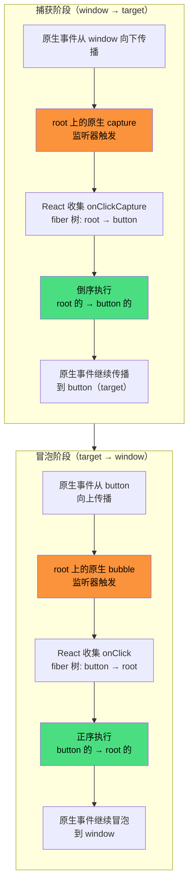

# React 事件系统

React 自定义了一套事件系统，称为**合成事件（SyntheticEvent）**。

---

## 为什么需要自定义事件系统？

1. **兼容性** — 抹平各大浏览器的差异（如 IE 的 `attachEvent` vs 标准的 `addEventListener`）
2. **事件委托** — 事件都挂载在根元素上，利用事件委托减少内存占用。v17 以前挂载在 `document` 元素上，v17+ 改成挂载在 root 元素上，更有利于微前端架构
3. **SSR 和跨端支持** — 统一的事件抽象层，便于服务端渲染和 React Native 等跨端场景

---

## 合成事件

不同的原生事件有着对应的合成事件的映射。在 React 应用中绑定的事件并不是原生的事件，而是经过 React 合成的事件。

例如 `onChange` 事件实际上是由 `blur`、`change`、`focus` 等多个事件合成：

```jsx
// React 中
<input onChange={(e) => console.log(e.target.value)} />

// 等价于原生
input.addEventListener('input', handler);
input.addEventListener('change', handler);
```

React 会在根元素上绑定多个原生事件，统一由合成事件系统分发。

---

## 事件插件

React 不同的事件有自己对应的插件，插件负责：

1. **合成新的事件源** — 将原生事件包装成 `SyntheticEvent`
2. **提供统一 API** — `stopPropagation`、`preventDefault` 等方法
3. **事件池机制**（v17 已移除）— 复用事件对象，减少内存分配

```jsx
function handleClick(e) {
  e.preventDefault();      // 阻止默认行为
  e.stopPropagation();     // 阻止冒泡
  console.log(e.nativeEvent); // 访问原生事件
}
```

---

## 事件触发流程

### 1. 事件绑定

首次渲染过程中，React 检测到组件绑定了事件，会依次将原生事件绑定到根节点上。

```
DOM 和 Fiber 通过属性相互关联
用户写的事件回调函数会被加到 Fiber 的 props 中
```

### 2. 事件触发

```
1. 用户触发原生事件（如点击）
2. 事件通过捕获/冒泡传递到 root
3. root 的事件回调函数通过 event.target 拿到对应 DOM
4. DOM 通过属性取到 Fiber，进而取得回调函数
5. 统一将回调函数放到队列中，由 dispatchEvent 调用
```

### 3. 事件分发

React 的事件回调**分两次独立收集和分发**，不是一次性收集完整队列：

- 原生事件**捕获阶段**流经 root → 触发 capture 监听器 → 收集 `onClickCapture` 回调 → 倒序执行（父→子）
- 原生事件**冒泡阶段**流经 root → 触发 bubble 监听器 → 收集 `onClick` 回调 → 正序执行（子→父）

两次收集通过 `eventSystemFlags` 区分（注册时就已绑定），`IS_CAPTURE_PHASE` 标志决定查找 `onClickCapture` 还是 `onClick`。

```jsx
<div onClick={() => console.log('div')}>
  <button onClick={() => console.log('button')}>点击</button>
</div>

// 点击 button 输出：
// button
// div
```

---

## 如何阻止事件冒泡

在遍历执行事件队列的过程中，检测到 `event.isPropagationStopped()` 为 `true` 则 break 跳出循环：

```jsx
<div onClick={() => console.log('div')}>
  <button onClick={(e) => {
    e.stopPropagation(); // 阻止冒泡
    console.log('button');
  }}>点击</button>
</div>

// 点击 button 输出：
// button
// （div 的回调不会执行）
```

> **注意**：`stopPropagation` 只能阻止同阶段的传播。capture 阶段调用 `stopPropagation` 不会阻止 bubble 阶段的回调执行，反之亦然。如果需要完全阻止，需要同时在 capture 和 bubble 阶段都调用。

---

## 合成事件 vs 原生事件

| | 合成事件 | 原生事件 |
|---|---------|---------|
| **事件对象** | `SyntheticEvent` | 浏览器原生 `Event` |
| **绑定方式** | 声明式（`onClick`） | 命令式（`addEventListener`） |
| **事件委托** | 统一委托到 root | 直接绑定到元素 |
| **兼容性** | React 抹平差异 | 需要手动处理 |
| **性能** | 事件委托，内存占用少 | 每个元素独立绑定 |
| **访问原生事件** | `e.nativeEvent` | 直接就是原生事件 |

---

## v18 事件系统改进

### React 17 的问题

React 17 及之前，所有合成事件监听器绑定在 `document` 上，且只在**冒泡阶段**监听。无论写 `onClick` 还是 `onClickCapture`，都要等原生事件从 target 冒泡到 `document` 后，React 才开始模拟捕获/冒泡顺序。

这导致所有 React 合成事件都在原生事件**之后**执行，与原生事件的捕获→目标→冒泡顺序不一致。

### 为什么绑定到 document 做不到一致？

`document` 是 DOM 树的根，比所有元素都"高"。即使同时注册 capture 和 bubble 监听器，React 的 capture 监听器在 `document` 上触发时，会**早于** `document` 下方所有元素的原生 capture handler，顺序必然错乱。

### React 18 的改动

**1. 事件绑定从 `document` 改为 root 容器**

```js
// ReactDOMRoot.js — createRoot 时
listenToAllSupportedEvents(rootContainerElement); // 绑定在 #root 上
```

**2. 同时注册 capture 和 bubble 两个阶段的监听器**

```js
// DOMPluginEventSystem.js
allNativeEvents.forEach(domEventName => {
  if (!nonDelegatedEvents.has(domEventName)) {
    listenToNativeEvent(domEventName, false, rootContainerElement); // 冒泡阶段
  }
  listenToNativeEvent(domEventName, true, rootContainerElement);    // 捕获阶段
});
```

**3. 分两次独立收集和分发**

- capture 监听器触发时：`eventSystemFlags = IS_CAPTURE_PHASE` → 只收集 `onClickCapture` → 倒序执行（父→子）
- bubble 监听器触发时：`eventSystemFlags = 0` → 只收集 `onClick` → 正序执行（子→父）

整条链路**完全同步**，`batchedUpdates` 在 React 18 中本质是 `return fn(a)`，不引入异步延迟。React 的回调在原生事件的调用栈内同步执行，调用栈未返回浏览器前，原生事件传播尚未完成。

### 本质

React 17 和 React 18 **都在模拟**事件传播顺序（从 fiber 树收集回调再排序执行），区别在于模拟发生的时机：

| | React 17 | React 18 |
|---|---|---|
| 绑定位置 | `document` | root 容器 |
| 监听阶段 | 只注册 bubble | 同时注册 capture + bubble |
| 模拟时机 | 原生事件**全部走完**后才开始模拟 | 嵌入在原生事件流**中间**，capture 和 bubble 分别在对应阶段同步执行 |
| 与原生事件的关系 | 合成事件全部在原生事件之后 | 合成事件与原生事件交错执行，顺序一致 |

### 完整执行顺序

以 `div#root > button` 为例，点击 button 时的完整事件流：



>  橙色 = 原生监听器触发（React 委托到 root 的 `addEventListener`）｜🟢 绿色 = React 回调执行顺序

**执行顺序简写**：

```
捕获: root(原生) → root(react) → target(react)
冒泡: target(react) → root(react) → root(原生)
```

```jsx
<div
  onClickCapture={() => console.log('div capture')}
  onClick={() => console.log('div bubble')}
>
  <button
    onClickCapture={() => console.log('button capture')}
    onClick={() => console.log('button bubble')}
  >
    点击
  </button>
</div>

// v18 输出（与原生事件一致）：
// div capture
// button capture
// button bubble
// div bubble
```

---

## 常见陷阱

### 1. `stopPropagation` 只能阻止同阶段传播

capture 阶段调用 `stopPropagation` 不会阻止 bubble 阶段的回调，反之亦然：

```jsx
<div
  onClickCapture={() => console.log('div capture')}
  onClick={() => console.log('div bubble')}
>
  <button
    onClickCapture={(e) => {
      e.stopPropagation();
      console.log('button capture');
    }}
    onClick={() => console.log('button bubble')}
  >
    点击
  </button>
</div>

// 输出：
// div capture
// button capture
// button bubble
// （div bubble 被阻止）
```

> capture 阶段的 `stopPropagation` 只阻止了后续 capture 回调（这里没有），不影响 bubble 阶段。要完全阻止需要两个阶段都调用，或在 capture 阶段用 `e.nativeEvent.stopImmediatePropagation()`。

### 2. 合成事件与原生事件混用

React 合成事件和原生 `addEventListener` 混用时，执行顺序可能不符合预期：

```jsx
useEffect(() => {
  document.addEventListener('click', () => {
    console.log('原生 click');
  });
}, []);

return (
  <div onClick={() => console.log('React click')}>
    点击
  </div>
);

// v18 输出（root 在 document 内部）：
// 原生 click      ← 先在 document 上触发
// React click     ← 后在 root 上触发
```

> v18 将事件绑定在 root 而非 document，所以原生事件在 document 上会先于 root 上的 React 合成事件触发。如果需要控制顺序，建议统一使用 React 合成事件或统一使用原生事件。

### 3. `setState` 在事件处理中是批处理的

事件回调同步执行，但其中的 `setState` 不会立即生效，而是批量更新：

```jsx
function handleClick() {
  setCount(1);
  console.log(count); // 0，不是 1（批处理，state 尚未更新）
  setCount(2);
  console.log(count); // 0，不是 2
}
```

> React 18 中，`setTimeout`、`Promise` 等异步回调中的 `setState` 也会自动批处理（React 17 中不会）。如需立即读取最新 state，使用函数式更新 `setCount(prev => prev + 1)` 或 `useReducer`。

### 4. 事件池机制（v17 已移除）

v16 及以前，合成事件对象会被回收到事件池中，异步访问会失效：

```jsx
function handleClick(e) {
  setTimeout(() => {
    console.log(e.target.value); // ❌ v16 中为 null，事件对象已被回收
  }, 0);
}
```

> v17 已移除事件池机制，合成事件不再被回收，上述代码在 v17+ 中可正常工作。
