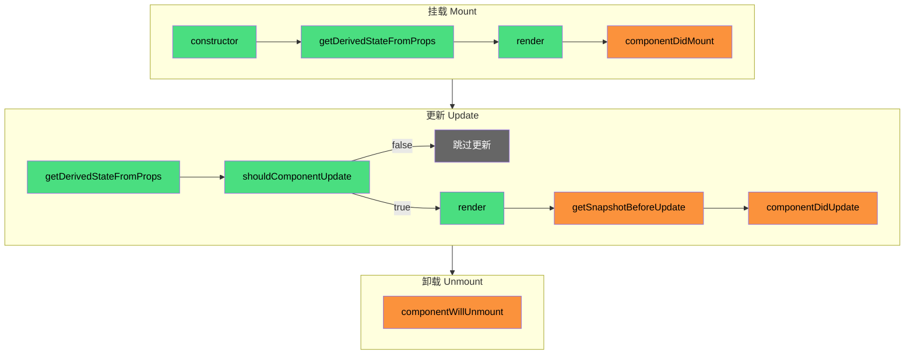

# React 生命周期

React 组件从创建到销毁会经历一系列生命周期阶段。类组件和函数组件的生命周期机制不同。

---

## 类组件生命周期



> 🟢 绿色 = Render 阶段（可中断）｜🟠 橙色 = Commit 阶段（同步执行）

### 挂载阶段

```
constructor → getDerivedStateFromProps → render → componentDidMount
```

**constructor**：实例化类组件，初始化 state 和绑定事件处理函数。

```jsx
class MyComponent extends React.Component {
  constructor(props) {
    super(props);
    this.state = { count: 0 };
    this.handleClick = this.handleClick.bind(this);
  }
}
```

**getDerivedStateFromProps**：静态方法，在 render 之前调用，用于根据 props 更新 state。

```jsx
static getDerivedStateFromProps(nextProps, prevState) {
  if (nextProps.value !== prevState.prevValue) {
    return { prevValue: nextProps.value, derivedData: compute(nextProps.value) };
  }
  return null; // 不更新 state
}
```

**componentDidMount**：组件挂载完成后调用，适合发起网络请求、订阅事件等副作用。

```jsx
componentDidMount() {
  this.fetchData();
  this.subscription = subscribe(this.props.id);
}
```

### 更新阶段

```
getDerivedStateFromProps → shouldComponentUpdate → render → getSnapshotBeforeUpdate → componentDidUpdate
```

**shouldComponentUpdate**：配置更新策略，返回 `true` 代表需要更新，`false` 跳过更新。

```jsx
shouldComponentUpdate(nextProps, nextState) {
  return nextProps.value !== this.props.value; // 只有 value 变化才更新
}
```

**getSnapshotBeforeUpdate**：在 DOM 变更前调用，可以读取变更前的 DOM 信息（如滚动位置），返回值传给 `componentDidUpdate`。

```jsx
getSnapshotBeforeUpdate(prevProps, prevState) {
  if (prevProps.list.length < this.props.list.length) {
    return this.listRef.current.scrollHeight; // 记录滚动位置
  }
  return null;
}

componentDidUpdate(prevProps, prevState, snapshot) {
  if (snapshot !== null) {
    this.listRef.current.scrollTop += this.listRef.current.scrollHeight - snapshot;
  }
}
```

**componentDidUpdate**：组件更新完成后调用。

```jsx
componentDidUpdate(prevProps) {
  if (prevProps.id !== this.props.id) {
    this.fetchData(this.props.id);
  }
}
```

### 卸载阶段

**componentWillUnmount**：组件卸载前调用，用于清理副作用（取消订阅、清除定时器等）。

```jsx
componentWillUnmount() {
  this.subscription.unsubscribe();
  clearTimeout(this.timer);
}
```

### 已废弃的生命周期

以下生命周期在 React 16.3 后被标记为不安全（UNSAFE），在 React 18 中已移除：

- `componentWillMount` → 使用 `constructor` 或 `componentDidMount` 替代
- `componentWillReceiveProps` → 使用 `getDerivedStateFromProps` 替代
- `componentWillUpdate` → 使用 `getSnapshotBeforeUpdate` 替代

---

## 函数组件生命周期

函数组件没有特别的生命周期函数，只有三个副作用 Hook：

### useEffect / useInsertionEffect / useLayoutEffect

| Hook | 执行阶段 | 执行时机 | 用途 |
|------|---------|---------|------|
| **useInsertionEffect** | Mutation | DOM 变更前同步执行 | CSS-in-JS 注入样式 |
| **useLayoutEffect** | Layout | DOM 变更后同步执行 | 测量 DOM、同步修改 |
| **useEffect** | Layout 之后 | 浏览器渲染后异步执行 | 数据请求、订阅等 |

**执行顺序**：`useInsertionEffect` → DOM 变更 → `useLayoutEffect` → 浏览器绘制 → `useEffect`

```jsx
function MyComponent() {
  // 1. useInsertionEffect：DOM 变更前执行，访问不了 DOM
  useInsertionEffect(() => {
    const style = document.createElement('style');
    style.textContent = '.custom { color: red; }';
    document.head.appendChild(style);
    return () => document.head.removeChild(style);
  }, []);

  // 2. useLayoutEffect：DOM 变更后同步执行，可以访问 DOM
  useLayoutEffect(() => {
    const rect = ref.current.getBoundingClientRect();
    if (rect.width < 100) {
      ref.current.style.width = '100px';
    }
  }, []);

  // 3. useEffect：浏览器渲染后异步执行
  useEffect(() => {
    const subscription = api.subscribe();
    return () => subscription.unsubscribe();
  }, []);

  return <div ref={ref}>内容</div>;
}
```

---

## 生命周期在函数组件中的替代方案

| 类组件生命周期 | 函数组件替代方案 | 说明 |
|---------------|----------------|------|
| `constructor` | `useState` 初始化 | `const [state, setState] = useState(initialValue)` |
| `componentDidMount` | `useEffect(() => {}, [])` | deps 传空数组，只在 mount 时执行 |
| `componentDidUpdate` | `useEffect(() => {})` | 不传 deps，每次 render 都执行 |
| `componentWillUnmount` | `useEffect` 返回清理函数 | `return () => cleanup()` |
| `getDerivedStateFromProps` | `useEffect` 监听 props 变化 | `useEffect(() => {}, [props.value])` |
| `shouldComponentUpdate` | `React.memo` | 浅比较 props，相同则跳过渲染 |

> **注意**：以上替代方案只是能达到类似的效果，其本质还是不一样的，执行时机（哪个阶段）和执行方式（同步/异步）都不一样。

---

## 生命周期与 Fiber 架构的关系

在 Fiber 架构下，生命周期函数的执行时机：

| 生命周期 | 执行阶段 | 说明 |
|---------|---------|------|
| `constructor` | render 阶段 | 创建 FiberNode 时调用 |
| `getDerivedStateFromProps` | render 阶段 | beginWork 中调用 |
| `render` | render 阶段 | 生成 JSX |
| `componentDidMount` | commit 阶段（Layout） | 同步执行 |
| `shouldComponentUpdate` | render 阶段 | beginWork 中调用 |
| `getSnapshotBeforeUpdate` | commit 阶段（BeforeMutation） | DOM 变更前调用 |
| `componentDidUpdate` | commit 阶段（Layout） | 同步执行 |
| `componentWillUnmount` | commit 阶段（Mutation） | 同步执行 |
