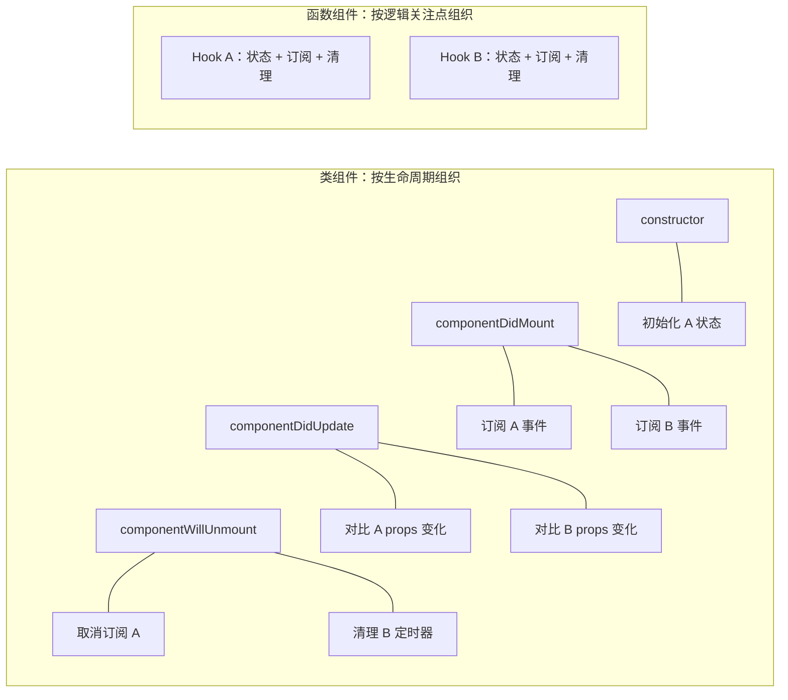
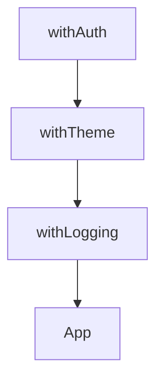
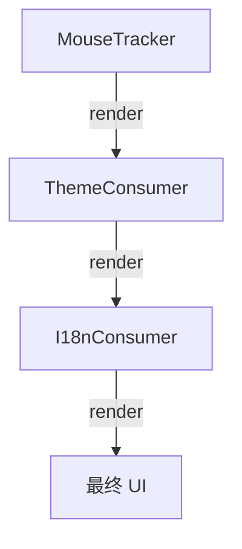
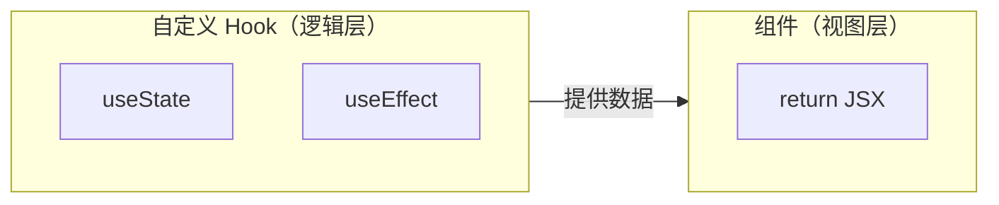

# 逻辑复用

逻辑复用是编程必须掌握的技巧，对于前端而言组件化思想也是一种逻辑复用。纵观 Vue、React 等框架的进化史，基本上都是经历了如下阶段：

1. **Mixins**（Vue、React）
2. **HOC**（React）
3. **Render Props**（React）
4. **React Hooks / Vue Composition API**

组件的表达方式从类组件到函数组件的转变，目的就是将状态、逻辑与组件本身解耦开来，与组件的生命周期解耦开来（React 的函数组件已经没有生命周期钩子了）。

### 为什么类组件走向函数组件？

**类组件的三个痛点**：

1. **this 指向混乱** — 事件处理需要 bind(this)，箭头函数写法不统一，新手容易踩坑
2. **生命周期导致逻辑分散** — 相关逻辑被迫拆分到 componentDidMount、componentDidUpdate、componentWillUnmount 中，不相关的逻辑却挤在同一个生命周期里
3. **逻辑复用困难** — HOC 和 Render Props 导致组件嵌套过深（"嵌套地狱"），且复用逻辑与组件耦合

**函数组件的解决方案**：

- **没有 this** — 直接用变量，不需要 bind
- **Hook 按逻辑组织代码** — 相关状态和副作用写在一起，不相关的逻辑自然分离
- **自定义 Hook 实现逻辑复用** — 直接提取函数，无需嵌套包装

**语言层面的原因**：

JS 的 `class` 只是原型链的语法糖，底层仍然是基于对象委托，和 Java 那种基于类的继承完全不同。在 JS 中用 class 是"削足适履"——强行套用面向对象的模式，却要承受 this 绑定、原型链查找等额外复杂度。

函数才是 JS 最自然的表达方式：
- 函数是一等公民，可以直接作为值传递、返回、存储
- 闭包天然支持状态封装，不需要 class 的实例属性
- 原型链的本质就是函数之间的委托关系

所以用函数组件写 React，是用 JS 最擅长的方式解决问题，而不是模仿其他语言的范式。

```jsx
// 类组件：逻辑分散在三个生命周期中
class FriendStatus extends React.Component {
  state = { isOnline: null };
  componentDidMount() { ChatAPI.subscribe(this.handleStatusChange); }
  componentDidUpdate() { /* 需要手动处理 props 变化 */ }
  componentWillUnmount() { ChatAPI.unsubscribe(this.handleStatusChange); }
  handleStatusChange = (status) => { this.setState({ isOnline: status.isOnline }); }
  render() { return this.state.isOnline ? 'Online' : 'Offline'; }
}

// 函数组件：相关逻辑聚合在一起
function FriendStatus({ friendID }) {
  const [isOnline, setIsOnline] = useState(null);
  useEffect(() => {
    const handleStatusChange = (status) => setIsOnline(status.isOnline);
    ChatAPI.subscribe(friendID, handleStatusChange);
    return () => ChatAPI.unsubscribe(friendID, handleStatusChange);
  }, [friendID]);
  return isOnline ? 'Online' : 'Offline';
}
```

Vue 也走了同样的路：Options API → Composition API，本质上都是**按逻辑组织代码，而非按生命周期组织代码**。



---

## Mixins 混合

在 Vue3 之前以及 React HOC 之前都是用的这种方式实现逻辑复用。

实质上就是将一个大的组件实例对象按照功能拆分，分解成多个对象，最后执行的时候再合并。

**问题**：

1. **命名冲突** — 生命周期命名冲突导致覆盖
2. **逻辑分散** — 状态和逻辑可能分散于各个生命周期，多个 mixin 文件可能用到同一个状态，代码混乱难以维护。比如想了解一个状态被哪些逻辑控制，可能需要依次找遍组件引用的所有 mixin 查看
3. **代码冗余** — 无法良好分割导致产生大量重复代码

---

## HOC（Higher-Order Component，高阶组件）

HOC 是 React 对装饰器模式的一种实现，实质上就是一个函数接收一个组件（函数/类）作为入参，然后经过包装再返回一个新的组件。

### 属性代理

接收一个组件，返回一个新的组件。

```jsx
function withLoading(WrappedComponent) {
  return function WithLoading(props) {
    if (props.loading) {
      return <div>加载中...</div>;
    }
    return <WrappedComponent {...props} />;
  };
}

// 使用
const EnhancedComponent = withLoading(MyComponent);
```

**优点**：可以与业务组件低耦合甚至零耦合，无须知道组件内部逻辑，可以增强其属性或者控制条件渲染。

**缺陷**：
1. 无法得知业务组件内部状态，可能需要 ref 手段控制业务组件
2. 无法直接继承静态属性，需要手动处理或者借助第三方库（hoist-non-react-statics）
3. 本质上是一个新组件，需要 forwardRef 转发 ref

### 反向继承

```jsx
function withLogging(WrappedComponent) {
  return class extends WrappedComponent {
    componentDidMount() {
      console.log('组件已挂载');
      if (super.componentDidMount) {
        super.componentDidMount();
      }
    }
    render() {
      return super.render();
    }
  };
}
```

**优点**：
1. 方便获取组件内部状态（state、props、生命周期、绑定的事件函数等）
2. ES6 继承可以良好继承静态属性，无须对静态属性和方法进行额外处理

**缺点**：
1. 函数组件无法使用
2. 和被包装的组件耦合度高，需要知道被包装的原始组件的内部状态
3. 如果多个反向继承 HOC 嵌套在一起，当前状态会覆盖上一个状态（如多个 componentDidMount 会相互覆盖）

### HOC 应用场景

1. **强化 props** — 注入额外属性
2. **渲染劫持** — 控制组件的渲染输出
3. **配合 import 实现动态加载** — 代码分割
4. **组件赋能** — 添加事件监听、错误监控等

### HOC 注意事项

1. 谨慎修改原型
2. 不要在函数组件内部使用 HOC
3. ref 处理（需要 forwardRef）
4. 静态属性处理（需要 hoist-non-react-statics）
5. 注意多个 HOC 嵌套顺序问题
6. 约定 displayName（便于调试）

### HOC 缺陷

1. 不遵守约定可能造成 props 冲突
2. 嵌套泛滥，多层抽象同样增加了复杂度和理解成本（最关键的缺陷）
3. Ref 传递缺陷



---

## Render Props

Render Props 是一种通过函数 prop 来共享代码的模式。

```jsx
class MouseTracker extends React.Component {
  state = { x: 0, y: 0 };

  handleMouseMove = (event) => {
    this.setState({ x: event.clientX, y: event.clientY });
  };

  render() {
    return (
      <div onMouseMove={this.handleMouseMove}>
        {this.props.render(this.state)}
      </div>
    );
  }
}

// 使用
<MouseTracker render={({ x, y }) => (
  <p>鼠标位置：{x}, {y}</p>
)} />
```

**优点**：
- 比 HOC 更灵活，没有**组件嵌套**问题（不会出现 `withA(withB(withC(Component)))` 的 wrapper hell）
- 可以明确知道数据来源

**缺点**：
- 多个 Render Props 组合时会产生**回调嵌套**（"回调地狱"）
- 无法在 return 语句外使用数据（render 函数内部）



---

## Hooks

将逻辑复用转变成 Hook 的组合。React 16 以后推出了很多内置 Hook，有与状态有关的 `useState`，与生命周期有关的 `useEffect` 等等。

这样就可以将代码逻辑和状态随意组合成一个自定义 Hook，我们可以封装很多通用 Hook 从而达到代码复用的目的。同时函数组件代替类组件，使得开发更为简洁简单，理解成本更低。



```jsx
// 自定义 Hook：鼠标位置追踪
function useMousePosition() {
  const [position, setPosition] = useState({ x: 0, y: 0 });

  useEffect(() => {
    const handleMove = (e) => setPosition({ x: e.clientX, y: e.clientY });
    window.addEventListener('mousemove', handleMove);
    return () => window.removeEventListener('mousemove', handleMove);
  }, []);

  return position;
}

// 使用
function App() {
  const { x, y } = useMousePosition();
  return <p>鼠标位置：{x}, {y}</p>;
}
```

### Hooks 的注意事项

**1. 闭包陷阱**

异步 API 回调函数引用的参数可能是一个过期的值：

```jsx
//  闭包陷阱
function Counter() {
  const [count, setCount] = useState(0);

  useEffect(() => {
    const timer = setInterval(() => {
      console.log(count); // 永远是 0
    }, 1000);
    return () => clearInterval(timer);
  }, []);

  return <button onClick={() => setCount(c => c + 1)}>{count}</button>;
}

// ✅ 解决方案 1：使用函数式更新
setInterval(() => {
  setCount(c => console.log(c)); // 正确
}, 1000);

// ✅ 解决方案 2：使用 ref
const countRef = useRef(count);
useEffect(() => { countRef.current = count; });
setInterval(() => {
  console.log(countRef.current); // 正确
}, 1000);
```

**2. 依赖数组**

- 不是所有的依赖都必须放到依赖数组中（如 setState 函数）
- deps 参数不能缓解闭包问题，需要真正理解闭包问题产生的原因
- 延迟调用（setTimeout、setInterval、Promise.then 等）会存在闭包问题

**3. useCallback 的使用建议**

useCallback 可以记住函数，避免函数重复生成，这样函数在传递给子组件时，可以避免子组件重复渲染。但是使用前提是，子组件必须使用了 `shouldComponentUpdate` 或者 `React.memo` 来忽略同样的参数重复渲染。否则 useCallback 不仅没有提升性能，反而让代码可读性变差。

**建议**：一般项目中不用考虑性能优化的问题，不要使用 useCallback，除非有个别非常复杂的组件，单独使用即可。

**4. useMemo 的使用建议**

适当使用，用于昂贵的计算或创建对象/数组作为 props 传给子组件。

**5. useState 的正确使用**

- **能用其他状态计算出来就不用单独声明状态** — 一个 state 必须不能通过其它 state/props 直接计算出来，否则就不用定义 state
- **保证数据源唯一** — 同一个数据只存储在一个地方，不要既存在 Redux 中又在组件中定义 state
- **适当合并** — 复杂类型的 state 可以使用 `useReducer` 代替多个 `useState`

---

## 总结

React 在逻辑复用上，从 Mixins 到 HOC，从 HOC 到 Render Props 再到现在的 Hooks，几乎都是为了开发者能更好的进行代码复用，写出更清晰、更好维护的代码。

| 方案 | 优点 | 缺点 |
|------|------|------|
| **Mixins** | 简单 | 命名冲突、逻辑分散 |
| **HOC** | 低耦合 | 嵌套泛滥、ref 传递缺陷 |
| **Render Props** | 灵活 | 代码嵌套深 |
| **Hooks** | 解耦视图与逻辑、逻辑聚合 | 闭包陷阱、学习成本 |
