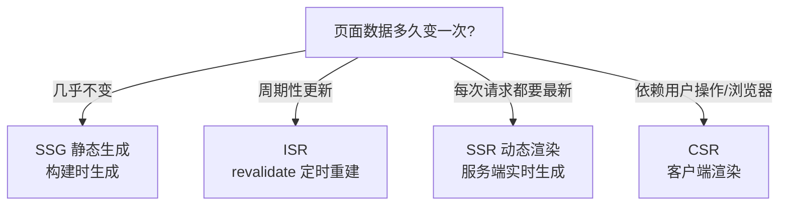

# Next.js 入门

Next.js 是 React 生态中最流行的**全栈框架**，在 React 之上补齐了路由、服务端渲染、构建优化、API 等能力。本文覆盖核心用法（路由、渲染模式、数据获取）和高阶用法（图片优化、流式渲染、缓存、部署），帮你快速建立 Next.js 全景认知。

## 为什么需要 Next.js

纯 React（Vite/Webpack 搭建）只能做 **CSR（客户端渲染）**：浏览器先下载 JS，再渲染内容。痛点：

| 纯 React 的痛点 | Next.js 的解法 |
|----------------|----------------|
| 首屏白屏、SEO 差（内容在 JS 里） | 服务端渲染（SSR）/ 静态生成（SSG） |
| 路由要自己配 react-router | 文件系统路由（app 目录） |
| 打包优化靠自己调 | 内置代码分割、图片优化、字体优化 |
| API 要单独起服务 | 内置 Route Handlers（route.ts） |

> 一句话：**Next.js = React + 服务端能力 + 开箱即用的工程化**。它既是"框架"也是"平台"（Vercel 部署一体化）。

## 快速开始

### 创建项目

```bash
# 官方脚手架（会自动配置 TypeScript、Tailwind、ESLint）
npx create-next-app@latest my-app

cd my-app
npm run dev     # 开发模式，默认 http://localhost:3000
npm run build   # 生产构建
npm start       # 启动生产服务
```

### 项目结构（App Router）

```
my-app/
├── app/                  # 路由目录（文件即路由）
│   ├── layout.tsx        # 根布局（所有页面共享，类似 HTML 骨架）
│   ├── page.tsx          # 首页（/）
│   ├── about/
│   │   └── page.tsx      # /about
│   └── blog/
│       ├── layout.tsx    # /blog 下的局部布局
│       └── [id]/
│           └── page.tsx  # 动态路由 /blog/1
├── public/               # 静态资源
├── next.config.ts        # Next.js 配置
└── package.json
```

> Next.js 14+ 默认使用 **App Router**（app 目录），旧版 Pages Router（pages 目录）仍可用但已不推荐新项目使用。

## 路由：文件系统路由

Next.js 的路由由**目录结构**决定，不用写路由配置。

### 页面与布局

```tsx
// app/layout.tsx：根布局，包住所有页面
export default function RootLayout({ children }: { children: React.ReactNode }) {
  return (
    <html lang="zh">
      <body>
        <header>公共导航</header>
        {children}
        <footer>页脚</footer>
      </body>
    </html>
  )
}

// app/about/page.tsx：渲染 /about
export default function AboutPage() {
  return <h1>关于我们</h1>
}
```

### 动态路由

```tsx
// app/blog/[id]/page.tsx：匹配 /blog/1、/blog/abc...
export default async function BlogPost({ params }: { params: Promise<{ id: string }> }) {
  const { id } = await params
  const post = await getPost(id)
  return <article>{post.title}</article>
}
```

### 页面导航

```tsx
import Link from 'next/link'
import { useRouter } from 'next/navigation'  // 注意：从 next/navigation 导入，不是 react-router

export default function Nav() {
  const router = useRouter()

  return (
    <>
      {/* Link 预取：鼠标悬停时提前下载目标页资源 */}
      <Link href="/about">关于</Link>
      <Link href={`/blog/${postId}`}>动态链接</Link>

      <button onClick={() => router.push('/login')}>去登录</button>
      <button onClick={() => router.back()}>返回</button>
    </>
  )
}
```

### 特殊文件约定

| 文件 | 作用 |
|------|------|
| `layout.tsx` | 布局，切换页面时**不重新渲染**（状态保留） |
| `loading.tsx` | 页面加载中的 UI（自动触发流式渲染） |
| `error.tsx` | 页面出错时的 UI（必须是客户端组件，用 `'use client'`） |
| `not-found.tsx` | 404 页面 |
| `route.ts` | API 路由（不返回页面，返回 JSON） |

### API 路由（Route Handlers）

```ts
// app/api/users/route.ts：GET /api/users
export async function GET() {
  const users = await db.query('SELECT * FROM users')
  return Response.json(users)
}

// app/api/users/[id]/route.ts：GET /api/users/1
export async function GET(_req: Request, { params }: { params: Promise<{ id: string }> }) {
  const { id } = await params
  return Response.json({ id, name: 'Alice' })
}
```

## 组件模型：服务端组件 vs 客户端组件

Next.js App Router 里组件分两种，这是理解 Next.js 的关键：

- **服务端组件（Server Component，默认）**：在服务器上执行，只把 HTML 发给浏览器，JS 体积小、可直接查数据库
- **客户端组件（Client Component）**：文件顶部加 `'use client'`，在浏览器执行，支持 hooks 和事件

```tsx
// app/products/page.tsx：服务端组件（默认），可以直接查数据库
import { getProducts } from '@/lib/db'

export default async function ProductsPage() {
  const products = await getProducts()  // 服务端执行，不会暴露给浏览器
  return (
    <div>
      {products.map(p => (
        <ProductCard key={p.id} product={p} />
      ))}
    </div>
  )
}

// app/products/ProductCard.tsx：客户端组件（'use client'），处理交互
'use client'
import { useState } from 'react'

export default function ProductCard({ product }) {
  const [liked, setLiked] = useState(false)  // 只有客户端组件能用 hooks
  return (
    <button onClick={() => setLiked(!liked)}>
      {product.name} {liked ? '❤️' : '🤍'}
    </button>
  )
}
```

### 能力对比

| 能力 | 服务端组件 | 客户端组件 |
|------|-----------|-----------|
| 查数据库/读文件 | ✅ 直接写 | ❌ 需要 API |
| 使用 useState/useEffect | ❌ | ✅ |
| 事件处理（onClick） | ❌ | ✅ |
| 浏览器 API（window/document） | ❌ | ✅ |
| 发送给浏览器的 JS | 无 | 有 |

**使用原则：** 默认服务端组件（数据获取、纯展示），只有需要交互的地方才用 `'use client'`——这样浏览器下载的 JS 最少。

## 数据获取与渲染模式（核心）

Next.js 支持四种渲染模式，**由组件写法决定**，这也是面试题 SSG/SSR/ISR 的核心。

### 四种模式总览

| 模式 | 何时生成 | 数据新鲜度 | 适用场景 |
|------|---------|-----------|---------|
| **CSR** | 浏览器中（客户端获取） | 实时 | 用户个人页、强交互页面 |
| **SSR** | 每次请求时（服务器渲染） | 实时 | 个性化内容、需要登录的数据 |
| **SSG** | 构建时（静态文件） | 部署后不变 | 文档站、营销页、博客 |
| **ISR** | 构建时 + 定时/按需重建 | 有最大陈旧时间 | 数据定期更新的内容页 |



### SSG：静态生成（默认）

App Router 中，**没有使用动态 API 的页面默认就是静态的**——构建时生成 HTML，直接交给 CDN，访问最快。

```tsx
// app/docs/page.tsx：构建时读取数据，生成静态 HTML
export default async function DocsPage() {
  const docs = await fetchDocs()  // 构建时执行一次
  return <div>{docs.map(d => <p key={d.id}>{d.title}</p>)}</div>
}
```

### SSR：动态渲染

页面使用了动态 API（`cookies()`、`headers()`、`searchParams` 等）时，Next.js 自动切换为**每次请求时渲染**。也可显式声明：

```tsx
// app/dashboard/page.tsx：强制每次请求动态渲染
export const dynamic = 'force-dynamic'

export default async function Dashboard() {
  const user = await getCurrentUser()  // 每次请求都执行
  return <div>你好，{user.name}</div>
}
```

### ISR：增量静态再生

ISR = **SSG + 定时重建**，本质是 **stale-while-revalidate**（过期数据先用，后台刷新）。

```tsx
// app/blog/[id]/page.tsx
export const revalidate = 60  // 页面最多"旧"60 秒

export default async function BlogPost({ params }: { params: Promise<{ id: string }> }) {
  const { id } = await params
  const post = await getPost(id)
  return <article>{post.title}</article>
}
```

**`revalidate: 60` 的工作流程：**
1. 构建时生成静态页
2. 60 秒内访问 → 直接返回缓存（零开销）
3. 超过 60 秒后的**第一次请求** → 仍返回旧页面，但**后台触发重新生成**
4. 重新生成完成后，后续请求拿到新页面

> 面试常问的坑：ISR 不是"过期后第一个请求等新数据"——第一个请求拿到的是**旧数据**（stale），新数据在后台生成，下一个请求才生效。

### 按需更新：revalidatePath / revalidateTag

定时重建是"时间驱动"，有时你希望**事件驱动**：数据更新了，立刻让缓存失效。

```tsx
// app/actions.ts：服务端操作（Server Actions）
'use server'

import { revalidatePath, revalidateTag } from 'next/cache'

// 发布文章后，立刻让 /blog 和文章页的缓存失效并后台重建
export async function publishPost(formData: FormData) {
  const post = await createPost(formData)
  revalidatePath('/blog')              // 按路径失效
  revalidateTag('posts')               // 按标签失效（配合 fetch 的 tags 使用）
  return post
}
```

配合标签使用：

```tsx
// 获取数据时打标签
const posts = await fetch('https://api.example.com/posts', {
  next: { tags: ['posts'] }  // 打上 'posts' 标签
}).then(r => r.json())
```

### fetch 的缓存行为（注意版本差异）

| 版本 | fetch 默认行为 |
|------|--------------|
| Next 14 及之前 | 默认缓存（force-cache） |
| **Next 15+** | **默认不缓存**（no-store），需要缓存时显式声明 |

```tsx
// Next 15+：显式声明要缓存
const data = await fetch(url, {
  cache: 'force-cache',           // 一直缓存（SSG 效果）
  next: { revalidate: 60 },       // 缓存 60 秒（ISR 效果）
  next: { tags: ['posts'] },      // 配合 revalidateTag
})
```

### 选型建议

- **内容几乎不变**（文档、官网、博客）→ SSG，最快最省
- **定期更新**（新闻、商品、排行榜）→ ISR，`revalidate` 设可接受的最大陈旧时间
- **每次请求都要最新 / 个性化**（登录态、购物车）→ SSR 或 CSR
- **CDN 缓存友好**：SSG > ISR > SSR（SSR 也要尽量加 CDN 缓存）

## 高阶用法

### 1. 图片优化 next/image

自动处理：响应式尺寸、WebP 转换、懒加载、防 CLS（布局偏移）。

```tsx
import Image from 'next/image'

export default function Avatar() {
  return (
    <Image
      src="/me.png"
      alt="头像"
      width={200}      // 必须给尺寸（或 fill），防止布局偏移
      height={200}
      priority         // 首屏关键图：禁用懒加载，提前加载
      // 远程图片需在 next.config.ts 配置 remotePatterns 域名白名单
    />
  )
}
```

### 2. 字体优化 next/font

使用 `next/font` 会自动做字体子集化 + 自动预加载，**消除 CLS**（普通 @font-face 会导致文字跳动）：

```tsx
// app/layout.tsx
import { Inter } from 'next/font/google'

const inter = Inter({ subsets: ['latin'] })

export default function RootLayout({ children }: { children: React.ReactNode }) {
  return <html lang="zh" className={inter.className}>{children}</html>
}
```

### 3. 动态导入 next/dynamic

按需加载组件，减少首屏 JS：

```tsx
'use client'
import dynamic from 'next/dynamic'

// 弹窗组件单独分包，首次打开时才下载
const Modal = dynamic(() => import('./Modal'), {
  loading: () => <p>加载中...</p>,
  ssr: false,  // 某些浏览器专用组件可关闭 SSR
})

export default function Page() {
  const [open, setOpen] = useState(false)
  return <button onClick={() => setOpen(true)}>打开弹窗</button>
}
```

### 4. 流式渲染：loading.tsx + Suspense

页面数据慢时，先发骨架屏，数据到了再补——大幅降低**感知 TTFB**：

```tsx
// app/dashboard/loading.tsx：进入 /dashboard 立即显示
export default function Loading() {
  return <div>加载中...</div>
}
```

```tsx
// 更精细的粒度：用 Suspense 包住慢的部分
import { Suspense } from 'react'
import { SalesChart } from './SalesChart'  // 数据很慢的组件

export default function Dashboard() {
  return (
    <div>
      <h1>仪表盘</h1>  {/* 先渲染 */}
      <Suspense fallback={<p>图表加载中...</p>}>
        <SalesChart />  {/* 慢的部分流式补上 */}
      </Suspense>
    </div>
  )
}
```

### 5. 中间件 middleware.ts

在**请求到达页面之前**执行：鉴权、重定向、A/B 测试、国际化。

```ts
// middleware.ts（项目根目录）
import { NextResponse } from 'next/server'
import type { NextRequest } from 'next/server'

export function middleware(request: NextRequest) {
  const token = request.cookies.get('token')
  const isLoginPage = request.nextUrl.pathname.startsWith('/login')

  // 未登录访问受保护页面 → 重定向到登录页
  if (!token && !isLoginPage) {
    return NextResponse.redirect(new URL('/login', request.url))
  }
  return NextResponse.next()
}

// 只对匹配的路径生效
export const config = {
  matcher: ['/dashboard/:path*', '/admin/:path*'],
}
```

### 6. 环境变量

```bash
# .env.local（不提交 git）
DATABASE_URL=mysql://...
NEXT_PUBLIC_API_URL=https://api.example.com   # NEXT_PUBLIC_ 前缀才会打进浏览器端 JS
```

- 服务端组件/API 路由：`process.env.DATABASE_URL`（任何变量都可用）
- 客户端组件：只能访问 `NEXT_PUBLIC_` 开头的变量

### 7. 部署方案

| 方案 | 适用场景 | 说明 |
|------|---------|------|
| **Vercel** | 推荐默认 | 官方平台，SSR/ISR 原生支持，git push 自动部署 |
| **Node.js 服务器**（`next start`） | 自托管 | 需要 SSR/ISR，Docker + PM2 部署 |
| **静态导出**（`output: 'export'`） | 纯静态站 | 构建输出纯静态文件，任何 CDN/nginx 可托管，但**不支持 SSR/ISR/API** |

```js
// next.config.ts：静态导出
const nextConfig = {
  output: 'export',
}
export default nextConfig
```

## 面试速答：SSG / SSR / ISR

> 对应面试题"SSG 和 ISR 的区别？ISR 的 revalidate 怎么工作？SSR 的 TTFB 怎么优化？"

1. **SSG vs ISR**：SSG 构建时一次性生成全部静态页；ISR 在 SSG 基础上加"过期重建"——`revalidate: 60` 表示页面最多旧 60 秒，过期后首次请求触发**后台重建**（返回旧页），完成后替换。本质是 **stale-while-revalidate**
2. **更新频率不固定的缺陷**：ISR 是时间驱动，频率不固定会"要么太旧、要么频繁重建"。解法：**on-demand revalidation**（`revalidatePath`/`revalidateTag` 事件触发，CMS 更新即失效）、DPR（按需构建 + 持久化）、混合方案（高频页 SSR、低频页 SSG）
3. **SSR TTFB 优化**：数据获取并行化（`Promise.all` 避免串行 await）；整页/组件缓存（CDN 边缘缓存，命中接近 SSG）；**流式渲染**（Suspense 先发骨架，感知 TTFB 大幅下降）；预渲染热点页；减少服务端同步 I/O

## 学习路径

| 阶段 | 内容 |
|------|------|
| **上手** | create-next-app、文件路由、layout、Link 导航 |
| **核心** | 服务端/客户端组件、数据获取、SSG/SSR/ISR 选型 |
| **进阶** | next/image、动态导入、流式渲染、缓存机制、中间件 |
| **工程化** | 环境变量、部署、性能监控（配合知识库的监控文章） |
