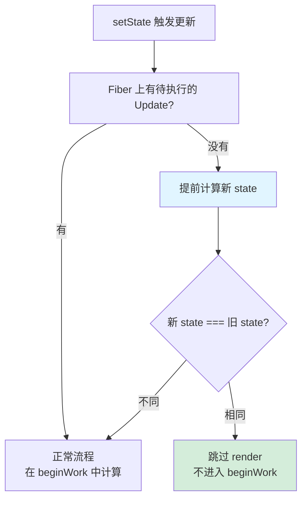
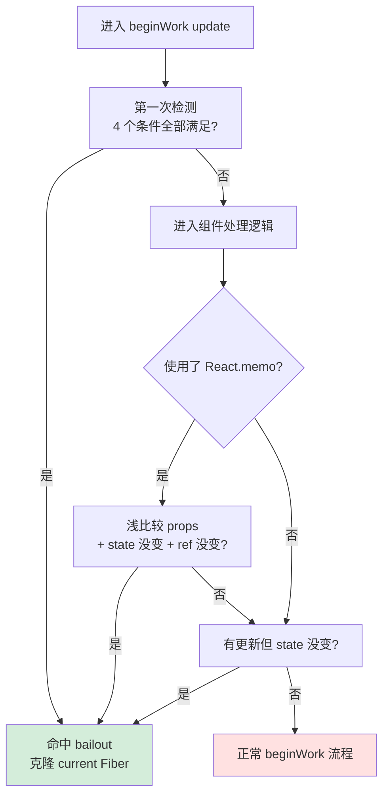

# 性能优化

React 通过两种方式实现性能优化：

1. **内置策略**：React 内部自动判断是否可以跳过某些工作（eagerState、bailout）
2. **开发者 API**：提供 `shouldComponentUpdate`、`PureComponent`、`React.memo`、`useMemo`、`useCallback` 等 API，让开发者主动控制优化

> 前置知识：[Reconciler 协调器](./reconciler.md) 中的 beginWork 流程、[状态更新流程](./state-update.md)

---

## eagerState 策略：提前计算，跳过 render

### 核心思路

如果某个 state 更新前后值没有变化，就可以跳过整个 render 流程。

### 什么时候能提前计算？

当 Fiber 节点上**不存在待执行的 Update** 时，说明当前产生的 Update 是该 Fiber 的**第一个待执行更新**，计算结果不会受到其他 Update 的影响。这时 React 将 state 计算**提前到 schedule 阶段**进行。

### 流程



**一句话总结**：如果这是第一个更新，提前算一遍；算完发现和上次一样，直接跳过，连 beginWork 都不用进。

### 命中 eagerState 的例子

**例 1：setState 传入和当前值相同的值**

```jsx
function Counter() {
  const [count, setCount] = useState(0);

  const handleClick = () => {
    setCount(0); // 当前 count 就是 0，Object.is(0, 0) === true
    // ✅ 命中 eagerState，跳过整个 render 流程
  };

  return <button onClick={handleClick}>{count}</button>;
}
```

点击按钮时，`setCount(0)` 传入的值和当前 state 相同。React 在 schedule 阶段提前计算发现值没变，直接跳过，组件不会重新渲染。

**例 2：函数式更新，计算结果和当前值相同**

```jsx
function Counter() {
  const [count, setCount] = useState(0);

  const handleClick = () => {
    setCount(prev => prev); // prev 是 0，返回 0，Object.is(0, 0) === true
    // ✅ 命中 eagerState
  };

  return <button onClick={handleClick}>{count}</button>;
}
```

函数式更新也会提前执行 updater 函数，如果返回值和当前 state 相同，同样命中。

**例 3：连续两次 setState 同一个值——第二次不会命中**

```jsx
function Counter() {
  const [count, setCount] = useState(0);

  const handleClick = () => {
    setCount(1); // 第一次调用，updateQueue 为空，提前计算，0 !== 1，正常进入 render
    setCount(1); // 第二次调用，updateQueue 中已有第一次的 Update，不走 eagerState 路径
  };

  return <button onClick={handleClick}>{count}</button>;
}
```

**eagerState 的前提是 updateQueue 为空**。第一次 `setCount(1)` 会在 updateQueue 中放入一个 Update，第二次调用时队列不为空，只能走正常的 beginWork 流程。不过 React 在 beginWork 中消费 Update 时，如果发现最终 state 没变，仍然可以通过 bailout 跳过。

**例 4：对象类型的 state，引用相同即命中**

```jsx
function UserProfile() {
  const [user, setUser] = useState({ name: 'Alice', age: 25 });
  const userRef = useRef(user);

  const handleClick = () => {
    setUser(userRef.current); // 传入的是同一个对象引用
    // ✅ Object.is(user, user) === true，命中 eagerState
  };

  return <button onClick={handleClick}>{user.name}</button>;
}
```

eagerState 使用 `Object.is` 做严格相等比较，对象类型只要引用相同就命中。这也是为什么推荐 state 更新时返回新对象——如果每次都返回新对象（即使内容相同），引用不同就不会命中。

> **如何主动命中 eagerState？**
>
> 1. 在 setState 前判断值是否真的变了，没变就别调
> 2. 对于对象/数组类型的 state，更新时注意引用稳定性——如果业务上可以接受引用相同，就复用旧引用
> 3. 避免在事件处理中无条件调用 setState，先做一层 `if (newVal !== oldVal)` 的判断

---

## Bailout 策略（ bailout = 跳过不必要的 work）

Bailout 的核心思想：**子 Fiber 没有变化，就可以复用，跳过它的 beginWork。**

变化的来源只有三种自变量：**state、props、context**。Bailout 的判断就是围绕这三个变量展开的。

### 第一次检测：刚进入 beginWork 的 update 流程

需要**同时满足**以下 4 个条件才能命中 bailout：

| # | 条件 | 说明 |
|---|------|------|
| 1 | `oldProps === newProps` | 严格相等。每次组件 render 返回的都是全新对象，所以只有当**父节点 bailout 复用了子 FiberNode** 时，子节点的 oldProps 和 newProps 才会指向同一个对象。这个条件非常苛刻 |
| 2 | Legacy Context 没有变化 | 使用了旧的 Context API 且 Context 值没变 |
| 3 | `fiberNode.type` 没有变化 | type 是组件构造函数或 HTML 标签字符串。**注意：不要把组件定义在组件内部**，否则每次 render 都会生成新的 type 对象，无法命中 bailout |
| 4 | 当前 FiberNode 没有更新发生 | state 没变化 |

> **关键洞察**：条件 1 意味着 bailout 具有"传染性"——只有父组件 bailout 了，子组件才有机会 bailout。这是理解 React 性能优化的核心。

### 第二次检测：进入具体组件处理逻辑时

如果第一次检测没命中，进入组件的具体处理逻辑后，还有两次命中机会：

**a. 开发者使用了性能优化 API（如 `React.memo`）**

当检测到使用了 `React.memo` 等 API 时，条件 1 的 `oldProps === newProps`（严格相等）会被改写为**浅比较**。同时满足以下三个条件即可命中 bailout：

1. `oldProps` 和 `newProps` 浅比较相等
2. 不存在更新（state 没变）
3. ref 没变

**b. 有更新但 state 没有实际变化**

即使有 Update 被消费，如果计算出的新 state 和旧 state 相同（引用相等），也可以 bailout。

### 命中 bailout 后的优化程度

| 情况 | 优化效果 |
|------|---------|
| **整棵树都命中** | 跳过整棵子树的 beginWork，直接复用 current 子树 |
| **仅子 FiberNode 命中** | 基于 current 子 FiberNode 克隆一份作为 wip，跳过该子树的 reconcile 流程（但仍需要走 completeWork） |

### Bailout 决策流程



---

## Bailout 与 Context 的关系

### 旧 Context API 的问题

旧的 Context 值存在栈里，通过 beginWork 过程**入栈**，completeWork 过程**出栈**来获取对应的值。

当命中 bailout 跳过整棵树时，**不会有入栈、出栈的操作**。因此即使 Context 值变了，被跳过的子树也不会感知到变化，不会被更新。

> **结论：使用旧 Context API 时，如果 Context 值发生变化，子树必然不能命中 bailout 策略。**

### 新 Context API 的改进

新的 Context 设计解决了这个问题：

1. 命中 bailout 后，检查 Context 值是否变化
2. 如果变了，**深度遍历子树**找到所有 Context Consumer
3. 为找到的 Consumer 附加 `renderLanes`
4. Lane 冒泡到 root，确保子树的 beginWork 不会被跳过

> **新 Context API 能精准找到需要更新的节点**，而不是像旧 API 那样粗暴地让所有消费者都重新渲染。

---

## 对日常开发的启发

理解 bailout 机制后，可以指导我们写出性能更好的组件：

### 1. 分离可变部分和不可变部分

```jsx
// ❌ 不好：每次父组件 render，Child 都会重新渲染
function Parent() {
  const [count, setCount] = useState(0);
  return <Child text="Hello" count={count} />;
}

// ✅ 更好：将不变的部分抽离，让 Child 有机会 bailout
function Parent() {
  const [count, setCount] = useState(0);
  return (
    <>
      <StaticChild text="Hello" />  {/* props 不变，可能 bailout */}
      <DynamicChild count={count} /> {/* 只渲染变化的部分 */}
    </>
  );
}
```

### 2. 让上层组件尽可能命中 bailout

由于 bailout 具有"传染性"（父 bailout → 子才有机会 bailout），**优化应该从上到下做**。一个顶层组件 bailout 了，它下面的整棵子树都可能被跳过。

### 3. 避免在组件内部定义子组件

```jsx
// ❌ 每次 render 都生成新的 Child 函数，type 不同，无法 bailout
function Parent() {
  function Child() { return <div>...</div>; }
  return <Child />;
}

// ✅ 把 Child 定义在外部，type 稳定
function Child() { return <div>...</div>; }
function Parent() { return <Child />; }
```

### 4. 合理使用 React.memo

`React.memo` 将 props 比较从严格相等改为浅比较，大大增加了 bailout 的概率。但要注意：

- 如果父组件每次都传新的对象/函数作为 props，`React.memo` 无法生效
- 配合 `useMemo` / `useCallback` 使用，保证传给子组件的 props 引用稳定

### 5. 优先使用新 Context API

旧 Context API 会导致所有消费者无条件重新渲染，无法 bailout。新 Context API 能精准更新，性能更好。

---

> 性能优化的本质是**减少不必要的 work**。理解了 React 内部的 bailout 机制，就能更有针对性地使用优化 API，而不是盲目地给每个组件包一层 `React.memo`。

---

## Q&A

### Q：第一次 bailout 检测的条件那么苛刻（特别是 `oldProps === newProps` 严格相等），为什么不直接用第二次的条件（浅比较）？为什么要设计两次？

**A**：核心原因是**成本和收益的权衡**，以及 **bailout 的传染性**。

**第一次检测是低成本快速路径**，发生在刚进入 beginWork 时，React 还没有开始处理组件，只是在遍历 Fiber 树。检查的内容非常简单：

```js
// 伪代码
if (oldProps === newProps && !hasContextChange && !hasStateUpdate) {
  // 快速跳过，连组件处理逻辑都不进
  return cloneCurrentFiber();
}
```

这个检查的成本极低——就是几个变量的比较。虽然条件苛刻（特别是 `oldProps === newProps` 严格相等），但**一旦命中，收益巨大**：整棵子树直接跳过，连组件的处理函数都不用调用。

**第二次检测是高成本但高命中率**。如果第一次没命中，React 才会进入组件的具体处理逻辑。这时候对于 `React.memo` 可以做浅比较（比严格相等宽松得多），也可以检查 state 是否真的变了。但代价是**已经进入组件处理逻辑了**，做了一些准备工作。

**如果只用第二次的条件**，意味着每个节点都要进入组件处理逻辑才能判断是否 bailout。对于大型组件树，这个开销很大。第一次检测的作用是：**在最早的时刻，用最低的成本，跳过尽可能多的工作**。

**为什么第一次条件那么苛刻？** 关键在于 **bailout 的传染性**。`oldProps === newProps` 这个条件只有在**父组件 bailout 了**才能满足——因为父组件 bailout 时会克隆子 Fiber，子组件的 oldProps 和 newProps 就指向同一个对象。这意味着：

```
顶层组件 bailout
  └─ 子组件 oldProps === newProps（严格相等）✅
      └─ 孙组件 oldProps === newProps（严格相等）✅
          └─ 曾孙组件 oldProps === newProps（严格相等）✅
```

**一旦顶层命中，下面的子树全部走第一次检测的快速路径**，整棵子树都不需要进入组件处理逻辑。

**两次检测的分工**：

| | 第一次检测 | 第二次检测 |
|---|---|---|
| **时机** | 刚进入 beginWork，还没处理组件 | 已进入组件处理逻辑 |
| **成本** | 极低（几个变量比较） | 较高（已做了一些准备工作） |
| **条件** | 苛刻（严格相等） | 宽松（浅比较、state 实际未变） |
| **命中率** | 低（依赖父组件 bailout） | 高（React.memo 等 API 帮助） |
| **收益** | 极大（整棵子树跳过） | 中等（当前节点跳过） |

**一句话总结**：第一次检测是**乐观快速路径**——成本低、条件苛刻，但一旦命中就能级联跳过整棵子树。第二次检测是**退而求其次**——成本稍高，但通过 React.memo 等 API 提高命中率。两次配合，既保证了最佳情况下的极致性能，又给了开发者通过 API 主动优化的空间。
