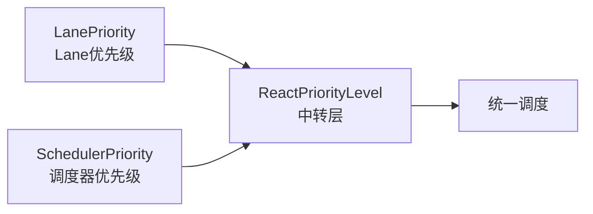
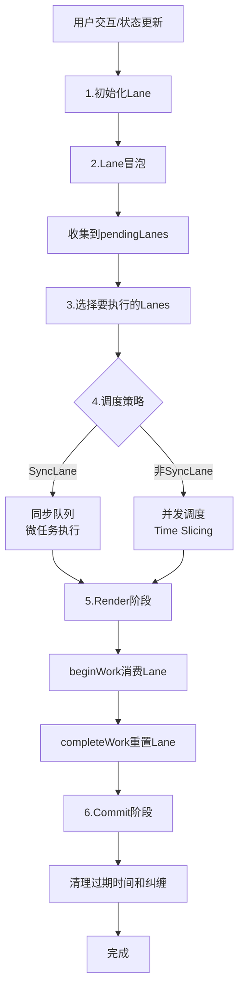
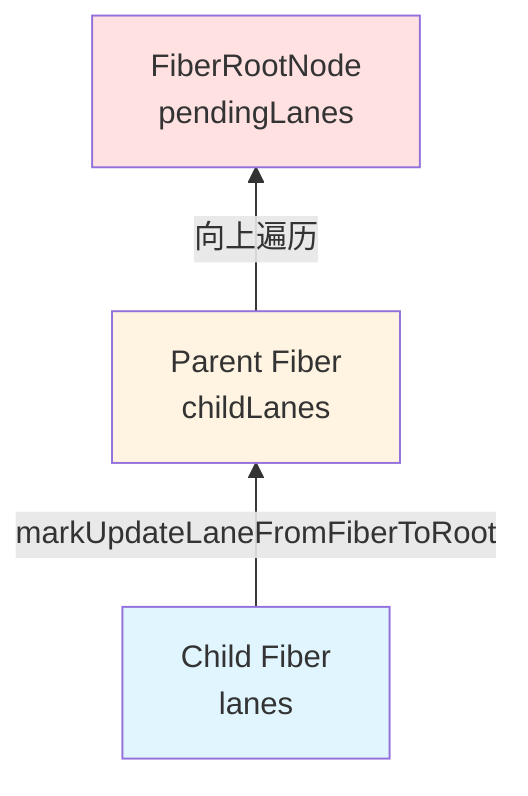
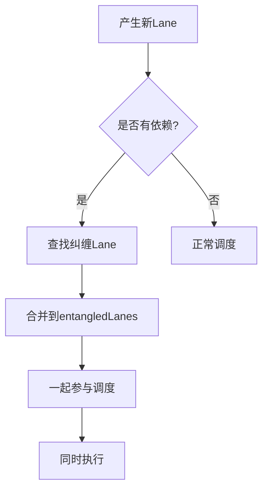
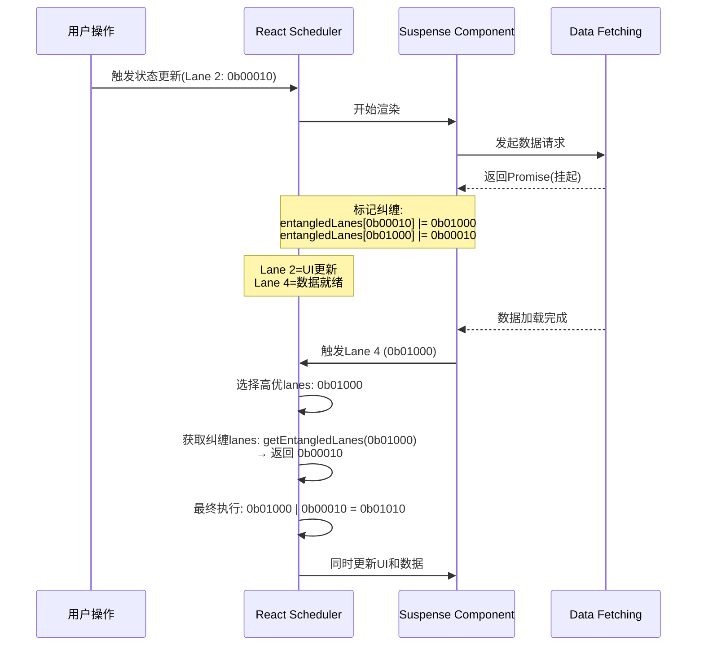
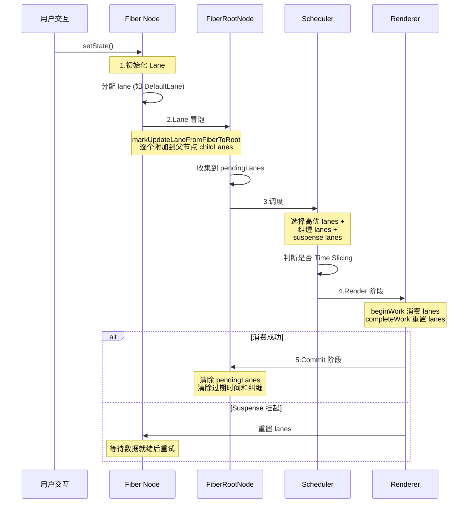

# React 优先级调度体系

## 两套优先级和一套转换体系

React 内部维护着**两套优先级系统**，通过一个中间层进行转换：



- **LanePriority**：基于 Lane 模型的优先级（32位二进制）
- **SchedulerPriority**：调度器的优先级（Immediate、UserBlocking、Normal、Low、Idle）
- **ReactPriorityLevel**：作为中转层，实现两套优先级的相互转换

**为什么需要两套？**
- LanePriority 用于 React 内部的 Fiber 调度和批量更新
- SchedulerPriority 作为抽象层，将 React 的优先级映射到调度器的 5 个等级
  - Immediate、UserBlocking、Normal、Low、Idle
  - 调度器基于这些优先级实现时间切片和任务排序
  - 这种设计使得调度逻辑可以独立于具体的 Renderer（React DOM、React Native 等）

## Lane 模型演进

### 第一代：Expiration Time 算法

**核心思想：** 给任务设置过期时间，时间越近优先级越高。

```javascript
// 伪代码示例
const task = {
  callback: () => { /* ... */ },
  expirationTime: currentTime + priorityLevel // 根据优先级计算过期时间
};
```

**优点：**
- ✅ 直观易懂，符合人类思维
- ✅ 能解决 CPU 密集型任务的优先级问题

**缺点：**
- ❌ **优先级与批次耦合**：只能通过时间范围圈定一批任务，不够灵活
- ❌ **批量更新不理想**：范围外的任务无法纳入同一批次
- ❌ **精度问题**：时间戳比较存在浮点数精度问题

---

### 第二代：Lane 算法（当前方案）

**核心思想：** 用 32 位二进制数的每一位表示一个 lane，通过位运算管理优先级和批次。

```javascript
// Lane 定义（简化版）
const SyncLane =            0b0000000000000000000000000000001; // 第 0 位，最高优先级
const InputContinuousLane = 0b0000000000000000000000000000010; // 第 1 位
const DefaultLane =         0b0000000000000000000000000000100; // 第 2 位
const TransitionLane =      0b0000000000000000000000000001000; // 第 3 位

// 规则：越低的位代表越高优先级
```

**关键概念：**
- **lane**：单个二进制位，表示一个优先级
- **lanes**：多个 lane 的组合（按位或），表示一批任务

**优势对比：**

| 特性 | Expiration Time | Lane 模型 |
|------|----------------|----------|
| 优先级表达 | 时间戳数值 | 二进制位位置 |
| 批次管理 | 时间范围圈定 | 位运算组合 |
| 优先级与批次 | ❌ 耦合 | ✅ 解耦 |
| 运算速度 | 较慢（数值比较） | ⚡ 极快（位运算） |
| 内存占用 | 每个任务一个时间戳 | 32个lane共用一个整数 |
| 适用场景 | CPU 密集型 | I/O 密集型 + CPU 密集型 |

**Lane 模型的核心优势：**
1. ✅ **解耦优先级和批次**：可以灵活组合任意 lanes 作为一个批次
2. ✅ **位运算性能极高**：CPU 级别的纳秒级操作
3. ✅ **天然支持批量更新**：通过位掩码轻松合并多个更新
4. ✅ **内存效率高**：32 个优先级只需一个 32 位整数

## Lane 模型在 React 中的完整工作流程

### 整体流程图



---

### 阶段一：初始化 Lanes

当状态更新发生时，React 会根据更新的来源和类型分配对应的 lane：

```javascript
// 优先级判断链（从高到低）
if (isSyncUpdate) {
  lane = SyncLane;                    // 同步更新，最高优先级
} else if (isRenderPhaseUpdate) {
  lane = getRenderLane();             // render 阶段的更新
} else if (isTransition) {
  lane = TransitionLane;              // startTransition 包裹的更新
} else if (isUserConfigured) {
  lane = getUserLane();               // 用户手动设置的 lane
} else {
  lane = getEventLane(eventType);     // 事件相关的 lane（click, input等）
}
```

**常见 Lane 类型：**
- `SyncLane`：同步更新，如 `flushSync()`
- `InputContinuousLane`：连续输入事件（如 typing）
- `DefaultLane`：普通点击事件
- `TransitionLane`：过渡更新（`startTransition`）
- `IdleLane`：空闲时执行的低优先级任务

---

### 阶段二：Lanes 冒泡（FiberNode → FiberRootNode）

**目的：** 将子节点的更新信息向上传递，让父节点知道哪些子节点有 pending 的更新。



**实现逻辑：**

```javascript
function markUpdateLaneFromFiberToRoot(sourceFiber, lane) {
  // 从发生更新的 fiber 开始
  let node = sourceFiber;
  let parent = node.return;
  
  while (parent !== null) {
    // 将 lane 添加到父节点的 childLanes
    parent.childLanes |= lane;
    
    // 继续向上遍历
    node = parent;
    parent = node.return;
  }
  
  // 最终收集到 root.pendingLanes
  root.pendingLanes |= lane;
}
```

**冒泡的意义：**
- 🎯 **渲染优化**：如果某 fiber 的子孙节点不包含本次 update 的 lane，则跳过该子树的 render
- 🔍 **快速定位**：通过 childLanes 快速判断哪些子树需要重新渲染

---

### 阶段三：调度 FiberRootNode

#### 3.1 选定本批次要执行的 Lanes

从 `pendingLanes` 中选择要执行的 lanes，考虑以下因素：

```javascript
function getNextLanes(root, wipLanes) {
  // 1. 基础 lanes：pendingLanes 中优先级最高的
  const baseLanes = getHighestPriorityLanes(root.pendingLanes);
  
  // 2. Suspense 相关的 lanes
  const suspenseLanes = getSuspenseLanes(root);
  
  // 3. 纠缠的 lanes（必须一起执行）
  const entangledLanes = getEntangledLanes(baseLanes);
  
  // 合并所有需要执行的 lanes
  return baseLanes | suspenseLanes | entangledLanes;
}
```

#### 3.2 调度策略

**SyncLane（同步任务）：**
```javascript
if (includesSyncLane(lanes)) {
  // 放入同步队列，在微任务中集中执行，不可中断
  syncQueue.push(task);
  queueMicrotask(flushSyncQueue);
}
```

**非 SyncLane（并发任务）：**
```javascript
// 判断是否开启 Time Slicing
let shouldTimeSlice = 
  !includesBlockingLane(root, lanes) &&   // 不包含阻塞的 lane
  !includesExpiredLane(root, lanes) &&    // 不包含过期的 lane
  !didTimeout;                             // 未超时

if (shouldTimeSlice) {
  // 可中断的并发渲染
  scheduleCallback(NormalPriority, performConcurrentWork);
} else {
  // 不可中断的同步渲染
  scheduleCallback(ImmediatePriority, performSyncWork);
}
```

---

### 饥饿问题与过期机制

**问题：** 低优先级任务可能一直被高优先级任务打断，导致"饥饿"。

**解决方案：** 为 lane 设置过期时间

```javascript
function markStarvedLanesAsExpired(root, currentTime) {
  // 遍历所有 pending lanes
  for (let i = 0; i < 31; i++) {
    const lane = 1 << i;
    
    if (root.pendingLanes & lane) {
      // 如果还没有设置过期时间
      if (!root.expirationTimes[i]) {
        // 根据交互发生时间计算过期时间
        root.expirationTimes[i] = currentTime + STARVATION_TIMEOUT;
      }
      
      // 检查是否已过期
      if (currentTime >= root.expirationTimes[i]) {
        // 标记为过期 lane，提升优先级
        root.expiredLanes |= lane;
      }
    }
  }
}
```

**过期 lanes 的处理：**
- 过期的 lanes 会被强制同步执行，不再参与 Time Slicing
- 确保低优先级任务最终能得到执行

### Lanes纠缠(Entanglement)工作原理

#### 什么是Lanes纠缠？
当多个lane之间存在依赖关系时，它们会"纠缠"在一起，必须同时执行。

**典型场景：**
- Suspense组件：fallback显示后，数据加载完成需要立即切换
- Transition：过渡状态与最终状态需要保持一致性
- 依赖关系：A更新依赖B的结果，两者需同步执行

#### 纠缠机制解析

**核心原理：利用 32 位二进制的位运算**

Lane 本质上是 32 位整数中的某一位（bit），通过位运算可以高效地管理和合并多个 lane。



##### 1. Lane 的二进制表示

每个 lane 对应 32 位整数中的一个 bit 位：

```javascript
// Lane 定义示例（简化版）
const SyncLane =            0b0000000000000000000000000000001; // 第 0 位
const InputContinuousLane = 0b0000000000000000000000000000010; // 第 1 位
const DefaultLane =         0b0000000000000000000000000000100; // 第 2 位
const TransitionLane =      0b0000000000000000000000000001000; // 第 3 位

// 多个 lane 组合（按位或运算）
const combinedLanes = SyncLane | DefaultLane;
// 结果: 0b0000000000000000000000000000101 (第 0 位和第 2 位都为 1)
```

##### 2. 标记纠缠：双向绑定

当两个 lane 需要纠缠时，互相记录对方的位掩码。

**数据结构说明：**

React 内部有多种方式存储纠缠关系，核心思想是：**每个 lane 都能快速找到与它纠缠的其他 lanes**。

```javascript
// 方式一：使用数组（索引是 lane 的位置，值是位掩码）
const entangledLanesArray = new Array(32).fill(0);

function markLaneAsEntangled(laneA, laneB) {
  // 获取 lane 在 32 位中的位置（索引）
  const indexA = Math.log2(laneA); // 0b001 -> 0, 0b010 -> 1
  const indexB = Math.log2(laneB); // 0b100 -> 2
  
  // 数组下标是索引，值是位掩码
  entangledLanesArray[indexA] |= laneB;
  entangledLanesArray[indexB] |= laneA;
}

// 方式二：使用对象/Map（key 是位掩码本身）
const entangledLanesMap = {};

function markLaneAsEntangled(laneA, laneB) {
  // JavaScript 对象会将数字 key 转为字符串
  entangledLanesMap[laneA] = (entangledLanesMap[laneA] || 0) | laneB;
  entangledLanesMap[laneB] = (entangledLanesMap[laneB] || 0) | laneA;
}

// 示例：Lane 1 和 Lane 3 纠缠
markLaneAsEntangled(0b001, 0b100);
// 结果:
// entangledLanesArray[0] = 0b100  (索引 0 对应的 lane 与 lane 4 纠缠)
// entangledLanesArray[2] = 0b001  (索引 2 对应的 lane 与 lane 1 纠缠)
// 或
// entangledLanesMap[1] = 4        (lane 1 与 lane 4 纠缠)
// entangledLanesMap[4] = 1        (lane 4 与 lane 1 纠缠)
```

**实际案例：**
```javascript
// Suspense 场景中，UI 更新 lane 和数据加载 lane 纠缠
const uiUpdateLane = 0b00010;   // Lane 2 (索引 1)
const dataReadyLane = 0b01000;  // Lane 4 (索引 3)

// 建立纠缠关系后
// entangledLanes[1] = 0b01000  (索引 1 的 lane 与 lane 4 纠缠)
// entangledLanes[3] = 0b00010  (索引 3 的 lane 与 lane 2 纠缠)
```

##### 3. 调度时合并：获取所有纠缠的 lanes

选择要执行的 lanes 后，递归获取所有纠缠的 lanes：

```javascript
function getEntangledLanes(selectedLanes) {
  let entangledLanes = NoLanes; // 0b000...000
  
  // 遍历选中的每一个 lane
  let remainingLanes = selectedLanes;
  while (remainingLanes > 0) {
    // 提取最低位的 lane（优先级最高的）
    const lowestLane = getLowestPriorityLane(remainingLanes);
    
    // 获取该 lane 纠缠的所有 lanes
    const entangled = root.entangledLanes[lowestLane];
    
    // 合并到结果中（按位或）
    entangledLanes |= entangled;
    
    // 移除已处理的 lane
    remainingLanes &= ~lowestLane;
  }
  
  return entangledLanes;
}

// 使用示例
let selectedLanes = 0b00010; // 选中 Lane 2
let entangled = getEntangledLanes(selectedLanes);
// 返回: 0b01000 (Lane 4，因为 Lane 2 与 Lane 4 纠缠)

// 最终执行的 lanes
let finalLanes = selectedLanes | entangled;
// 结果: 0b01010 (Lane 2 + Lane 4)
```

##### 4. 位运算技巧总结

```javascript
// 常用位运算操作
const laneA = 0b00100; // 第 2 位
const laneB = 0b01000; // 第 3 位

// 1. 合并 lanes（按位或 OR）
const combined = laneA | laneB;        // 0b01100

// 2. 检查是否包含某个 lane（按位与 AND）
const hasLaneA = (combined & laneA) !== 0;  // true
const hasLaneC = (combined & 0b10000) !== 0; // false

// 3. 移除某个 lane（按位取反 + 按位与）
const withoutLaneA = combined & ~laneA;  // 0b01000

// 4. 提取最低位的 lane
function getLowestPriorityLane(lanes) {
  return lanes & -lanes;  // 利用补码特性
}
// 示例: 0b01100 & -0b01100 = 0b00100

// 5. 判断是否有纠缠
function hasEntanglement(lane) {
  return root.entangledLanes[lane] !== NoLanes;
}
```

##### 5. 完整流程示例



**为什么用位运算？**
- ⚡ **性能极高**：位运算是 CPU 级别的操作，纳秒级完成
- 💾 **内存节省**：32 个 lane 只需一个 32 位整数
- 🔧 **操作简便**：合并、检查、移除都非常简洁
- 🎯 **天然去重**：同一个 lane 多次按位或结果不变

---

### 阶段四：Render 阶段的 Lane 消费

#### beginWork 阶段（递的过程）

在遍历 Fiber 树时，会消费（处理）对应的 lanes：

```javascript
function beginWork(current, workInProgress, renderLanes) {
  // 检查当前 fiber 是否有需要处理的 lanes
  if (includesSomeLane(workInProgress.lanes, renderLanes)) {
    // 消费 lane，执行更新逻辑
    reconcileChildren(current, workInProgress, renderLanes);
    
    // 消费后将该 fiber 的 lanes 重置为 NoLanes
    workInProgress.lanes = NoLanes;
  }
}
```

#### completeWork 阶段（归的过程）

向上冒泡更新祖先节点的 `childLanes`：

```javascript
function completeWork(current, workInProgress, renderLanes) {
  const parent = workInProgress.return;
  
  if (parent !== null) {
    // 将子节点的 lanes 合并到父节点的 childLanes
    parent.childLanes |= workInProgress.childLanes;
  }
  
  // 特殊情况：Suspense 挂起
  if (workInProgress.flags & DidCapture) {
    // 消费失败，重置 lanes，代表本次未消费
    workInProgress.lanes = renderLanes;
  }
}
```

**关键点：**
- ✅ **成功消费**：lanes 被重置为 `NoLanes`，表示已处理
- ⚠️ **消费失败**：如 Suspense 挂起，lanes 会被重置回原值，等待下次重试

---

### 阶段五：Commit 阶段的 Lanes 收尾

渲染完成后，进行清理工作：

```javascript
function commitRoot(root, finishedLanes) {
  // 1. 从 pendingLanes 中移除已完成的 lanes
  root.pendingLanes &= ~finishedLanes;
  
  // 2. 清除成功消费的 lanes 的过期时间
  clearExpirationTimes(finishedLanes);
  
  // 3. 清除纠缠关系
  clearEntangledLanes(finishedLanes);
  
  // 4. 更新其他状态
  root.finishedLanes = finishedLanes;
}
```

---

## Pending Lanes 完整工作流程总结



**五个关键阶段：**

1. **初始化**：根据更新类型分配 lane
2. **冒泡**：从子节点向上传递到 root.pendingLanes
3. **调度**：选择要执行的 lanes，决定调度策略
4. **Render**：beginWork 消费 lanes，completeWork 重置 lanes
5. **Commit**：清理 pendingLanes、过期时间、纠缠关系

**优化要点：**
- 🎯 **跳过无需渲染的子树**：通过 childLanes 快速判断
- ⚡ **位运算高效合并**：lanes 的合并、检查、移除都是 O(1)
- 🔗 **纠缠保证一致性**：相关更新原子性执行
- ⏰ **饥饿保护**：过期机制确保低优先级任务最终执行