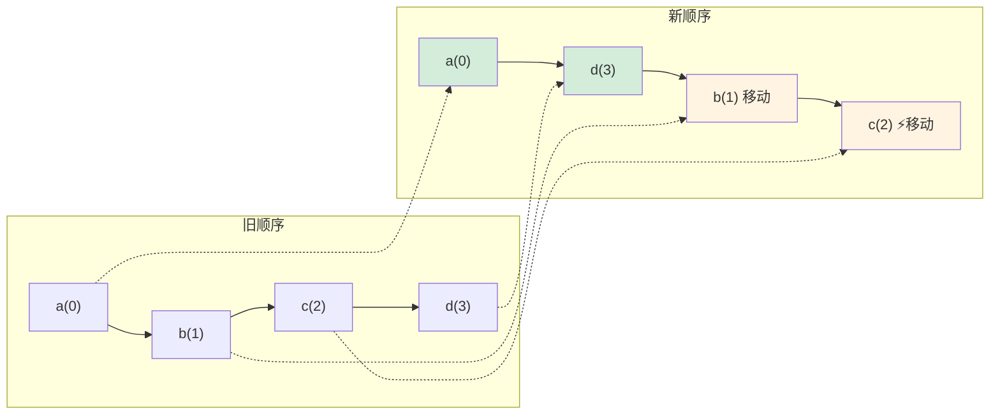

# Reconcile 算法（Diff）

Diff 算法在 beginWork 阶段的 update 流程中执行，核心任务是：**用新的 element children（React.createElement 生成的虚拟 DOM）和旧的 current Fiber 进行对比，决定哪些 Fiber 可以复用、哪些需要创建、哪些需要删除。**

> 前置知识：[Reconciler 协调器](./reconciler.md) 中的 beginWork 流程

根据子节点的数量，diff 分为**单节点 diff** 和**多节点 diff** 两条路径。

---

## 单节点 Diff

当 child 类型为 Object、String、Number 时（即只有一个子节点），走单节点 diff 逻辑。

### 算法步骤

1. **遍历**旧节点的 current Fiber 及其兄弟 Fiber
2. **判断是否可复用**（核心看 key，其次看 type）
3. 找到可复用的 → 复用该 Fiber，并标记删除其后的兄弟节点
4. 遍历完都没找到 → 创建新的 FiberNode

### 复用判断规则

| 情况 | 处理方式 |
|------|---------|
| key 相同 + type 相同 | 复用！用新 element 的 props 更新旧 FiberNode，返回该 FiberNode |
| key 相同 + type 不同 | 跳出循环，不再继续遍历（key 相同都复用了不了，后面的更不可能） |
| key 不同 | 标记当前节点需要删除，继续遍历下一个兄弟节点 |

> **type 是什么？** 对于原生 DOM 节点，type 是 HTML 标签字符串（如 `'div'`、`'span'`）；对于组件，type 是组件的构造函数或引用。

---

## 多节点 Diff

当 child 类型为 Array 时（多个子节点），走多节点 diff 逻辑。这是 diff 算法的核心。

### 设计思路

React 将节点变化归纳为三种情况：位置没变、节点增删、节点移动。对应的算法采用**两次遍历**策略：

1. **第一次遍历**：按顺序逐个对比，把位置没变的节点先复用起来
2. **第二次遍历**：处理剩余的节点（新增、删除、移动）

### 第一次遍历

从新旧节点的头开始，逐个对比：

```
旧: [a, b, c, d]
新: [a, d, b, c]
     ↑
   逐个对比
```

- new[0] vs old[0]：key 和 type 都相同 → 复用，继续
- new[1] vs old[1]：key 不同 → **停止第一次遍历**

第一次遍历结束后，根据剩余情况分为四种：

| 情况 | 处理方式 |
|------|---------|
| 新旧节点都没剩余 | 不处理，diff 完成 |
| 旧节点没了，剩余新节点 | 剩余新节点全部标记 Placement（新增） |
| 新节点没了，剩余旧节点 | 剩余旧节点全部标记 Deletion（删除） |
| **新旧都有剩余** | **进入节点移动逻辑（diff 算法核心）** |

### 第二次遍历：节点移动（核心）

当新旧节点都有剩余时，需要判断哪些节点需要移动位置。

#### 准备工作

将剩余的旧节点以 key 为索引存入 map，构建 `key → Fiber` 的映射表，方便后续快速查找。

#### 核心变量：lastPlacedIndex

`lastPlacedIndex` 记录"上一个可复用节点在旧数组中的位置"，初始值为 `-1`。它的作用是判断当前节点是否需要移动：

- 如果当前节点在旧数组中的位置 `>=` lastPlacedIndex → 说明它在正确的位置（在上一个节点的右边），**不需要移动**，更新 lastPlacedIndex
- 如果当前节点在旧数组中的位置 `<` lastPlacedIndex → 说明它跑到了前面，**需要移动**，标记 Placement

#### 遍历规则

逐个遍历剩余的新节点：

1. 通过 key 在 map 中查找旧节点
2. **找到了（可复用）**：
   - 比较 oldIndex 和 lastPlacedIndex
   - `oldIndex >= lastPlacedIndex` → 不移动，更新 `lastPlacedIndex = oldIndex`
   - `oldIndex < lastPlacedIndex` → 标记 Placement（需要移动）
   - 将该节点从 map 中移除
3. **没找到（新节点）**：标记 Placement（新增）
4. 遍历结束后，map 中剩余的节点 → 全部标记 Deletion（删除）

### 具体示例

假设旧节点为 `[a, b, c, d]`，新节点为 `[a, d, b, c]`：

**第一次遍历**：new[0]=a 与 old[0]=a 匹配，复用。new[1]=d 与 old[1]=b 不匹配，停止。

剩余：新节点 `[d, b, c]`，旧节点 `[b, c, d]`

**第二次遍历准备**：构建 map = `{ b: 0, c: 1, d: 2 }`（旧节点中的索引），`lastPlacedIndex = -1`

**第二次遍历过程**：

| 步骤 | 新节点 | map 查找 | oldIndex | 与 lastPlacedIndex 比较 | 操作 | 更新 lastPlacedIndex |
|------|--------|---------|----------|----------------------|------|---------------------|
| 1 | d | 找到，index=2 | 2 | 2 >= -1 ✓ | 不移动 | 2 |
| 2 | b | 找到，index=0 | 0 | 0 < 2 ✗ | **标记 Placement** | 不变，仍为 2 |
| 3 | c | 找到，index=1 | 1 | 1 < 2 ✗ | **标记 Placement** | 不变，仍为 2 |

map 已清空，无剩余节点需要删除。

**结果**：`a` 复用原位，`d` 复用原位，`b` 和 `c` 需要移动到 `d` 前面。最终 DOM 操作只需移动 2 个节点。



### Commit 阶段如何移动？

diff 阶段标记 Placement 时，**并没有记录新列表中的索引**，而是通过 Fiber 的链表结构隐式确定了新位置。

#### 关键机制

1. **Fiber 链表顺序就是新顺序**：diff 过程中，复用的 Fiber 会被重新排列成新的链表，链表顺序就是新列表的顺序
2. **Commit 阶段遍历链表**：按链表顺序遍历子 Fiber，遇到 Placement 标记就执行 DOM 移动
3. **移动目标**：将节点插入到父容器的正确位置（根据链表中的前一个兄弟节点）

#### 具体流程

```javascript
// Commit 阶段伪代码
function commitPlacement(childFiber) {
  // 找到父 DOM 节点
  const parent = childFiber.return.stateNode
  
  // 找到前一个兄弟 DOM 节点（链表中的前一个）
  const before = getHostSibling(childFiber)
  
  if (before) {
    // 有前一个兄弟，插入到它后面
    parent.insertBefore(childFiber.stateNode, before.nextSibling)
  } else {
    // 没有前一个兄弟，插入到最前面
    parent.appendChild(childFiber.stateNode)
  }
}
```

#### 示例解析

回到上面的例子 `[a, b, c, d]` → `[a, d, b, c]`：

```
diff 后的 Fiber 链表（新顺序）：
a → d → b → c
    ↑     ↑
   不移动  Placement

Commit 阶段：
1. 遍历到 a → 无 Placement，跳过
2. 遍历到 d → 无 Placement，跳过
3. 遍历到 b → 有 Placement，移动到 d 后面
   - 找到前一个兄弟 d
   - parent.insertBefore(b, d.nextSibling)  // 即插入到 d 后面
4. 遍历到 c → 有 Placement，移动到 b 后面
   - 找到前一个兄弟 b
   - parent.insertBefore(c, b.nextSibling)
```

**关键**：不需要记录 newIndex，因为 Fiber 链表的顺序已经隐含了新位置，Commit 阶段只需要"把节点插到前一个兄弟后面"即可。

---

## 常见问题

### 为什么不用双端 Diff？

Vue 的 diff 算法使用了双端比较（同时从头尾向中间对比），能更高效地处理节点反转等场景。React 没有采用，原因有两点：

1. **数据结构限制**：React 的 Fiber 是单链表结构，只能从头往后遍历，无法从尾部往前遍历
2. **场景权衡**：React 团队认为列表完全反转的场景比较少见，想先看看当前方案能走多远。如果未来表现不佳，会考虑替换算法

### 当前 Diff 算法的性能缺陷

当前算法从左往右遍历，**尽量让节点位置往后变，而不是往前变**。

例如 `a,b,c,d` → `d,a,b,c`：

- **双端 diff**：只需将 `d` 标记为 Placement，插入到 `a` 前面，**1 次移动**
- **React diff**：`a,b,c` 都被标记 Placement，依次插入到 `d` 前面，**3 次移动**

**实践启示**：在编写列表时，尽量让变化的节点出现在列表尾部而非头部，可以减少 DOM 移动操作。

---

> 了解了 diff 如何决定 Fiber 的复用与创建后，下一步是看这些带 flag 的 Fiber 如何在 [Commit 阶段](./commit.md) 变成真实的 DOM 操作。
