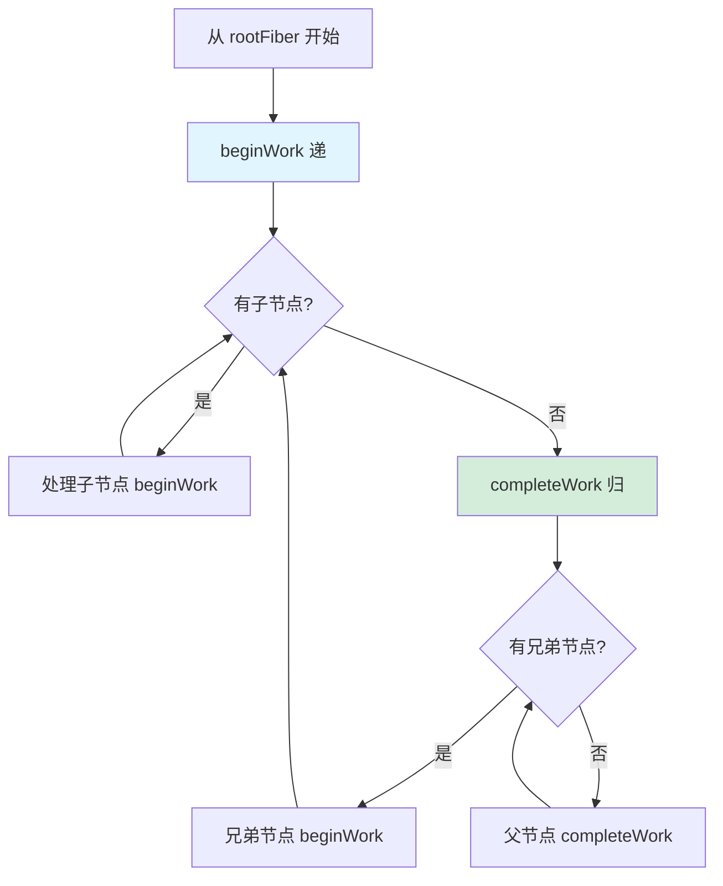
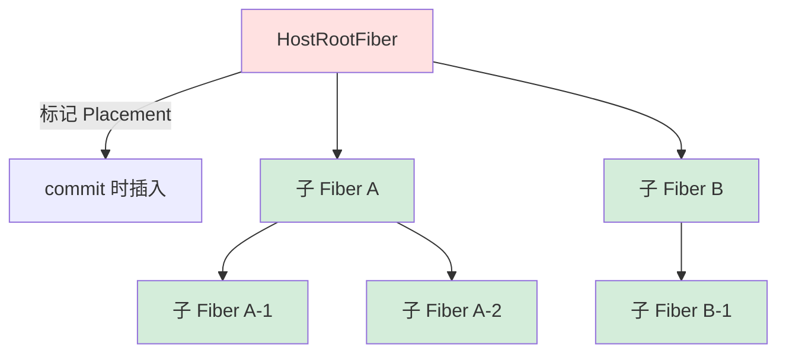
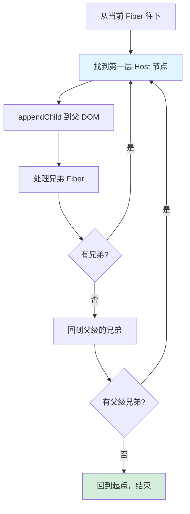

# Reconciler 协调器

Reconciler 是 React 渲染流程的核心引擎，负责将 JSX 描述转化为实际的 DOM 操作。它的工作分为两个阶段：**beginWork（递）** 和 **completeWork（归）**，按照 DFS（深度优先）顺序遍历 Fiber 树。

> 本篇是 Reconciler 的总览，后续 [Reconcile 算法](./reconcile-algorithm.md) 会深入 diff 细节，[Commit 阶段](./commit.md) 会讲解 DOM 操作。

## 整体流程



一句话概括：**beginWork 从根往下走，遇到叶子就折返；completeWork 从叶子往上走，有兄弟就拐过去继续递。如此交替，直到回到根节点。**

---

## Flag：副作用标记

Flag 用 32 位二进制数的不同位来追踪副作用，例如：

| Flag | 含义 |
|------|------|
| Placement | 节点需要插入或移动 |
| Update | 节点属性需要更新 |
| Deletion | 节点需要删除 |
| ChildDeletion | 子节点需要删除 |

使用位运算（`|=`）可以高效地合并多个 flag，这也是 React 选择位标记而非数组的原因——性能好、内存占用小。

---

## beginWork（递）

beginWork 分 **mount** 和 **update** 两条路径，核心区别在于 **update 阶段需要追踪 effect flag**，而 mount 阶段基本不追踪。

### mount 路径

1. 根据 `wip.tag`（Fiber 节点类型）进入对应的处理函数
2. 调用 `mountChildFibers` 执行 reconcile 算法，得到子 FiberNode

> **wip** 是 `workInProgress` 的缩写，指当前正在构建的 Fiber 节点。

### update 路径

1. 判断当前 Fiber 是否可以复用（命中 bailout 优化），复用则走优化路径跳过 diff
2. 根据 `wip.tag` 进入对应的处理函数
3. 调用 `reconcileChildFibers` 执行 reconcile 算法，得到**带 flag** 的子 FiberNode

> **注意区分两个 "diff"：** beginWork 阶段的 reconcile 算法（详见 [Reconcile 算法](./reconcile-algorithm.md)）对比的是**子节点**——决定哪些子 Fiber 复用/新建/删除。而 completeWork 阶段的 `diffProperties` 对比的是**当前节点自身的 DOM 属性**（如 className、style）——决定哪些 HTML 属性需要更新。两者发生在不同阶段，操作对象不同。

### mount 为什么不追踪 flag？

这是一个关键的性能优化设计。mount 阶段的 HostRootFiber 因为有 alternate（双缓存机制），会进入 update 处理逻辑，所以它会被标记 Placement。但它的子树全部走 mount 路径，**不会标记任何 flag**。

为什么这样做？因为 mount 阶段会在内存中组装好一棵完整的离屏 DOM 树，commit 阶段只需要**一次** `appendChild` 就把整棵子树插入页面。如果 mount 阶段也给每个节点标记 Placement，commit 阶段就会对每个节点都执行一次插入操作，性能很差。



**总结：mount 阶段只有 HostRootFiber 有 flag，其他子 Fiber 都没有。离屏组装好 DOM 树后，commit 阶段一次挂载，这是性能优化的考量。**

### mountChildFibers vs reconcileChildFibers

这两个函数实际上调用的是同一个 `ChildReconciler(shouldTrackSideEffects)`，只是传参不同：

- `mountChildFibers` → `shouldTrackSideEffects = false`（不追踪 flag）
- `reconcileChildFibers` → `shouldTrackSideEffects = true`（追踪 flag）

---

## completeWork（归）

completeWork 是"归"的阶段，从叶节点开始自下而上处理。

### mount 路径

1. **createInstance**：创建 DOM 实例
2. **appendAllChildren**：将子节点的 DOM 挂载到刚创建的 DOM 上
3. **设置 DOM 属性**：如 className、style 等
4. **flag 冒泡**：将子树的副作用标记向上传递

#### appendAllChildren 详解

appendAllChildren 的目的是在离屏状态下把子节点的 DOM 都挂到父节点上，这样 commit 阶段只需一次插入操作。

它的遍历逻辑是深度优先的：



举个例子，假设 Fiber 树结构是 `div > (span + p > em)`：

```
div                    ← createInstance("div")
├── span               ← createInstance("span")
│                      ← appendChild(div, span)
└── p                  ← createInstance("p")
    └── em             ← createInstance("em")
                       ← appendChild(p, em)
                       ← appendChild(div, p)
```

最终离屏 DOM 树组装完成，commit 阶段把 `div` 一次性插入页面即可。

### update 路径

1. **diffProperties**：对比新旧属性，标记需要更新/删除的属性
2. **flag 冒泡**

#### diffProperties（属性更新）

分两次遍历：

1. **第一次遍历旧属性**：找出旧节点存在但新节点不存在的属性 → 标记删除
2. **第二次遍历新属性**：找出新旧都存在的属性 → 标记更新

最终将需要更新的属性以 `[key1, val1, key2, val2, ...]` 的数组形式存在 `fiberNode.updateQueue` 中，commit 阶段统一应用。

---

## Flags 冒泡

completeWork 阶段属于"归"的过程，从叶元素开始自下而上将子孙的 flags 汇总到父节点。使用位运算简化代码并提升性能：

```javascript
// 收集子元素的子孙元素的 flags
subtreeFlags |= child.subtreeFlags
// 收集子元素自身的 flags
subtreeFlags |= child.flags
```

冒泡的结果是：根节点的 `subtreeFlags` 包含了整棵树中所有需要处理的副作用类型，根节点的 `flags` 包含根节点自身的副作用。commit 阶段可以根据这些标记快速定位需要操作的节点，而不必遍历整棵树。

---

## 与后续章节的关系

- beginWork 中的 reconcile 算法（diff）→ 详见 [Reconcile 算法](./reconcile-algorithm.md)
- completeWork 构建好的 Fiber 树如何变成真实 DOM → 详见 [Commit 阶段](./commit.md)
- 状态更新如何触发 Reconciler 工作 → 详见 [状态更新流程](./state-update.md)
