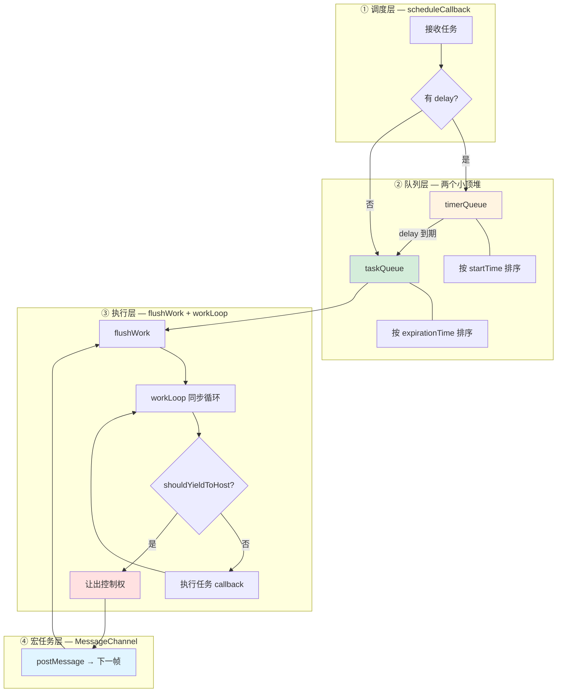
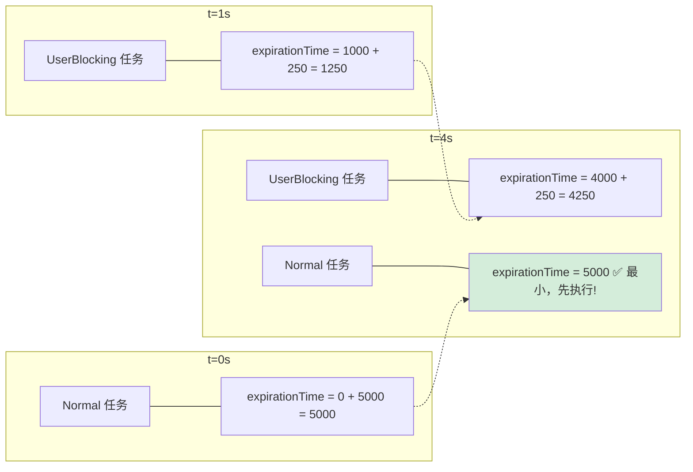
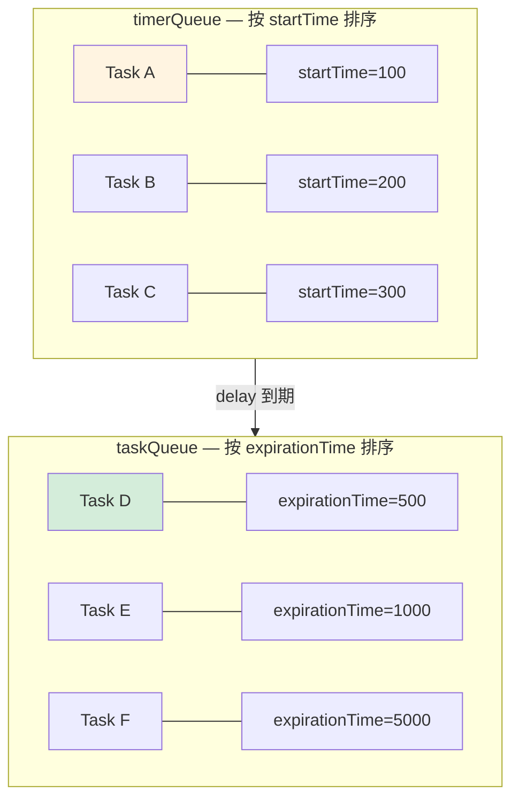
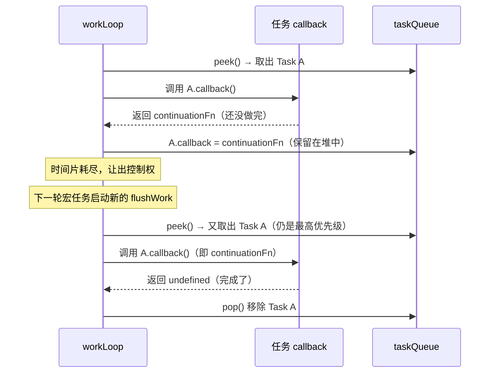
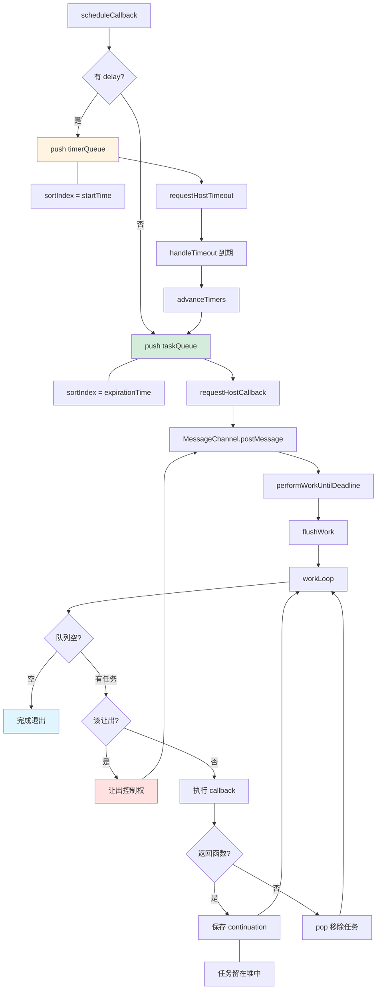

# React Scheduler 调度器详解

## 它到底是什么？

Scheduler 是一个**独立于 React 的通用任务调度库**（不依赖 React，可以单独使用）。它做的事情用一句话概括：

> **根据优先级决定任务何时执行，并在执行过程中适时让出控制权，保证浏览器流畅响应。**

它要解决的核心矛盾是：JS 单线程环境下，大量计算任务会阻塞浏览器渲染和用户交互。Scheduler 通过**优先级排序**和**时间切片（Time Slicing）**两个机制来缓解这个问题。

---

## 整体架构

先看全貌，Scheduler 内部可以分为四层：



两个关键循环贯穿整个架构：

- **异步循环**：timerQueue 中的任务等到 delay 到期后移入 taskQueue，再由宏任务触发消费
- **同步循环**：workLoop 逐个执行 taskQueue 中的任务，直到队列为空或需要让出

---

## 优先级：用「超时时间」表达紧急程度

React Scheduler 定义了一个关键概念：**timeout（超时时间）**。它表示"这个任务从开始执行起，最多等多久就必须被执行"。timeout 越小，任务越紧急。

```
expirationTime = startTime + timeout
```

taskQueue 按 `expirationTime` 排序（小顶堆），所以 **expirationTime 越小 = 越先执行 = 优先级越高**。

### 五个优先级

| 优先级 | timeout | 含义 | 典型场景 |
|--------|---------|------|----------|
| Immediate | `-1` | 立即执行，不能等 | 动画、关键交互 |
| UserBlocking | `250ms` | 用户能感知到延迟 | 点击、输入响应 |
| Normal | `5000ms` | 普通任务 | 网络请求处理、一般更新 |
| Low | `10000ms` | 可以稍后执行 | 非紧急的数据处理 |
| Idle | `1073741823` | 无限等待，有空再说 | 预渲染、日志记录 |

> **为什么 Immediate 的 timeout 是 -1？**
>
> 因为 `expirationTime = startTime + (-1) = startTime - 1`，这使得它的 expirationTime 比当前时间还小，在堆中永远排在最前面。这是一个巧妙的设计——不需要特殊逻辑，小顶堆自然就会先弹出它。

### 饥饿保护（Starvation Prevention）

这是 timeout 机制最核心的价值。想象一个场景：用户疯狂点击按钮，不断产生 UserBlocking 任务，一个 Normal 任务岂不是永远排不上？

不会。因为 Normal 任务的 expirationTime 是固定的（startTime + 5000ms），而新来的 UserBlocking 任务的 expirationTime 是 startTime + 250ms。随着时间推移，Normal 任务的 expirationTime 会越来越接近当前时间，最终**变成堆中最小的那个**，从而被优先执行。



**每个优先级都有 timeout，就意味着每个任务都有一个"死线"。只要等得够久，任何任务都会变成最紧急的那个。** 这就是 Scheduler 防止饥饿的核心机制。

---

## scheduleCallback：调度入口

这是 Scheduler 最核心的公开 API。所有任务都通过它进入调度系统。

```javascript
// packages/scheduler/src/forks/Scheduler.js

function unstable_scheduleCallback(priorityLevel, callback, options) {
  const currentTime = getCurrentTime();

  // ① 计算 startTime 和 expirationTime
  let startTime = currentTime;
  if (options && options.delay != null) {
    startTime = currentTime + options.delay;
  }

  let timeout;
  switch (priorityLevel) {
    case ImmediatePriority:  timeout = -1; break;           // 立即
    case UserBlockingPriority: timeout = 250; break;         // 250ms
    case NormalPriority:     timeout = 5000; break;          // 5s
    case LowPriority:        timeout = 10000; break;         // 10s
    case IdlePriority:       timeout = 1073741823; break;    // 几乎无限
  }
  const expirationTime = startTime + timeout;

  // ② 创建任务对象
  const newTask = {
    id: taskIdCounter++,
    callback,
    priorityLevel,
    startTime,
    expirationTime,
    sortIndex: -1,  // 堆排序用的索引，下面会赋值
  };

  // ③ 根据 startTime 决定放入哪个队列
  if (startTime > currentTime) {
    // ⏰ 延时任务：还没到开始时间，先进 timerQueue 等待
    newTask.sortIndex = startTime;
    push(timerQueue, newTask);

    // 如果它是 timerQueue 中最近要到期的，设置定时器
    if (peek(taskQueue) === null && newTask === peek(timerQueue)) {
      if (isHostTimeoutScheduled) {
        // 已经有 pending 的 setTimeout，先取消再设新的
        cancelHostTimeout();
      } else {
        isHostTimeoutScheduled = true;
      }
      requestHostTimeout(handleTimeout, startTime - currentTime);
    }
  } else {
    // ⚡ 立即任务：直接进 taskQueue 等待执行
    newTask.sortIndex = expirationTime;
    push(taskQueue, newTask);

    // 如果没有正在进行的调度，启动一轮
    if (!isHostCallbackScheduled && !isPerformingWork) {
      isHostCallbackScheduled = true;
      requestHostCallback(flushWork);
    }
  }

  return newTask;
}
```

### 任务对象结构

每个任务是一个普通对象，包含以下字段：

| 字段 | 类型 | 说明 |
|------|------|------|
| `id` | number | 自增唯一标识 |
| `callback` | Function \| null | 要执行的回调函数；为 `null` 表示已取消 |
| `priorityLevel` | number | 优先级等级（1-5） |
| `startTime` | number | 计划开始执行的时间点 |
| `expirationTime` | number | 过期时间 = startTime + timeout |
| `sortIndex` | number | 堆排序依据：在 timerQueue 中按 startTime，在 taskQueue 中按 expirationTime |

> **sortIndex 的切换**是理解双队列的关键：同一个任务在 timerQueue 中按 `startTime` 排序（谁先到时间谁先激活），进入 taskQueue 后改按 `expirationTime` 排序（谁先过期谁先执行）。

---

## 两个队列：小顶堆

Scheduler 使用两个**小顶堆（Min-Heap）**管理任务。小顶堆的特性是堆顶元素始终最小，非常适合"总是需要取最小值"的调度场景。



| 操作 | 时间复杂度 | 说明 |
|------|-----------|------|
| `push` | O(log n) | 插入新任务，需要上浮调整 |
| `pop` | O(log n) | 移除堆顶，需要下沉调整 |
| `peek` | O(1) | 直接取堆顶——最紧急的任务 |

### 堆操作实现

```javascript
// 插入：放到数组末尾，然后上浮到正确位置
function push(heap, node) {
  const index = heap.length;
  heap.push(node);
  siftUp(heap, node, index);
}

// 查看堆顶：直接取第一个元素
function peek(heap) {
  return heap.length === 0 ? null : heap[0];
}

// 移除堆顶：用最后一个元素替代堆顶，然后下沉调整
function pop(heap) {
  const first = heap[0];
  if (first !== undefined) {
    const last = heap.pop();
    if (last !== first) {
      heap[0] = last;
      siftDown(heap, last, 0);
    }
    return first;
  }
  return null;
}
```

> 完整的 `siftUp` 和 `siftDown` 实现就是标准的二叉堆算法，这里不展开。核心思路：比较节点与父节点/子节点的大小关系，不满足堆性质就交换。

---

## requestHostCallback：触发宏任务

任务准备好了，怎么启动执行？Scheduler 需要一个**宏任务（macrotask）**来触发工作循环。

```javascript
// 模块初始化时创建 MessageChannel（只创建一次）
const channel = new MessageChannel();
const port = channel.port2;

// port1 收到消息时执行工作
channel.port1.onmessage = performWorkUntilDeadline;

function requestHostCallback(callback) {
  scheduledHostCallback = callback;
  // 如果工作循环已经在跑了，不用重复启动
  if (isMessageLoopRunning) {
    return;
  }
  isMessageLoopRunning = true;
  // 通过 MessageChannel 发送消息，下一轮宏任务时执行
  port.postMessage(null);
}

function performWorkUntilDeadline() {
  const callback = scheduledHostCallback;
  scheduledHostCallback = null;
  try {
    callback();  // 即 flushWork()
  } finally {
    isMessageLoopRunning = false;
    // 如果还有后续任务，继续调度
    if (scheduledHostCallback !== null) {
      requestHostCallback(scheduledHostCallback);
    }
  }
}
```

### 为什么选 MessageChannel？

| API | 延迟 | 兼容性 | 问题 |
|-----|------|--------|------|
| `requestIdleCallback` | 不确定 | 差（Safari 不支持） | 执行时机依赖浏览器空闲，不可控；已废弃 |
| `requestAnimationFrame` | ~16.6ms | 好 | 频率太低，且与渲染绑定，不适合高频调度 |
| `setImmediate` | ~0ms | 仅 Node.js | 浏览器不支持 |
| **MessageChannel** | **~0ms** | **好** | **无已知缺陷，延迟极低且可控** |
| `setTimeout(fn, 0)` | ≥4ms | 好 | HTML 规范规定最小延迟 4ms，浪费 Time Slice |

> MessageChannel 的 `postMessage` 会创建一个**宏任务**，在当前调用栈结束后、下一帧渲染前执行。延迟接近 0，且不会像 `requestAnimationFrame` 那样与渲染管线耦合。

---

## flushWork + workLoop：执行工作

### flushWork — 准备阶段

从宏任务回调到实际执行任务之间的桥梁：

```javascript
function flushWork(hasTimeRemaining, initialTime) {
  // ① 清除宏任务调度标记（flushWork 已经在跑了，不需要再调度一次）
  isHostCallbackScheduled = false;

  //  如果有一个 pending 的 setTimeout，取消它
  if (isHostTimeoutScheduled) {
    isHostTimeoutScheduled = false;
    cancelHostTimeout();
  }

  // ③ 把到期的延时任务从 timerQueue 移到 taskQueue
  advanceTimers(initialTime);

  isPerformingWork = true;
  try {
    return workLoop(hasTimeRemaining, initialTime);
  } finally {
    isPerformingWork = false;
  }
}
```

> **`cancelHostTimeout` 做了什么？**
>
> 它内部就是 `clearTimeout(taskTimeoutID)`——一个普通的原生定时器清除。`requestHostTimeout` 和 `cancelHostTimeout` 是一对，通过模块级变量 `taskTimeoutID` 保存定时器 ID。
>
> **两个独立的标志位：**
>
> | 标志位 | 跟踪什么 | 设为 true 的时机 |
> |--------|---------|-----------------|
> | `isHostCallbackScheduled` | 有没有 pending 的 MessageChannel 回调 | `requestHostCallback` 时 |
> | `isHostTimeoutScheduled` | 有没有 pending 的 setTimeout | `requestHostTimeout` 时 |
>
> 这两个标志位互不干扰。`flushWork` 开头先把 `isHostCallbackScheduled` 置 false（因为宏任务回调已经在执行了），然后**独立地**检查 `isHostTimeoutScheduled`——如果有一个 pending 的 setTimeout 就 cancel 掉。
>
> **完整场景推演：**
>
> 1. taskQueue 为空，来了一个延时任务 → 进 timerQueue，`requestHostTimeout` 设了一个 setTimeout
> 2. setTimeout 还没触发，又来了一个**非延时**任务 → 进 taskQueue，`requestHostCallback(flushWork)` 被调用
> 3. 下一帧宏任务执行 `flushWork` → 开头就 `cancelHostTimeout()` 把那个 pending 的 setTimeout 清掉了
>
> 所以 pending 的 timeout 不是"放任它触发"，而是被**主动 cancel** 了。

### workLoop — 核心循环

这是整个 Scheduler 的心脏。一个**同步的 while 循环**，逐个执行 taskQueue 中的任务：

```javascript
function workLoop(hasTimeRemaining, initialTime) {
  let currentTime = initialTime;

  while (true) {
    let currentTask = peek(taskQueue);  // 取堆顶 = expirationTime 最小 = 最紧急

    if (currentTask === null) {
      break;  // 没有任务了，退出
    }

    // 检查是否应该让出：任务还没过期 + 时间片耗尽或需要让出
    if (
      currentTask.expirationTime > currentTime &&
      (!hasTimeRemaining || shouldYieldToHost())
    ) {
      break;  // 任务还没到期，且该让出了
    }

    // 执行任务回调
    const callback = currentTask.callback;
    if (typeof callback === 'function') {
      currentTask.callback = null;

      // 执行回调——可能返回一个新的函数（表示任务未完成）
      const continuationCallback = callback();

      if (typeof continuationCallback === 'function') {
        // 任务还没做完，保存 continuation，下次继续
        currentTask.callback = continuationCallback;
      } else {
        // 任务完成，从堆中移除
        if (currentTask === peek(taskQueue)) {
          pop(taskQueue);
        }
      }
    } else {
      // callback 为 null（已取消）或不是函数，直接移除
      pop(taskQueue);
    }

    // 更新时间，检查是否有新的延时任务到期
    currentTime = getCurrentTime();
    advanceTimers(currentTime);
  }

  // 还有任务没做完？调度下一轮
  if (peek(taskQueue) !== null) {
    requestHostCallback(flushWork);
  }

  return null;
}
```

### 任务中断与恢复

workLoop 中有一个精妙的设计：**回调函数可以返回一个新的函数**，表示"我还没做完，下次继续"。



这意味着一个需要 15ms 的任务，可以在 3 个 5ms 的时间片中分段执行，中间浏览器有机会处理用户交互和渲染。

> **fiber 是调度的原子单位。** Scheduler 的中断粒度是 fiber，而不是 fiber 内部的操作。`performUnitOfWork` 处理一个 fiber 时，要么做完、要么没做——React 不记录 fiber 内部的中间进度。中断时 `workInProgress` 停在某个 fiber 上，恢复时直接从头重新处理这个 fiber。这个设计成立的前提是 fiber 的处理是纯函数式的：相同输入产生相同结果，重复执行不会有副作用。

> **优先级抢占**也是自然发生的：当 workLoop 让出后重新调度时，会重新执行 `peek(taskQueue)`。如果期间有更高优先级的任务被加入（expirationTime 更小），它自然会排在堆顶被先执行。不需要在 `shouldYieldToHost` 里做额外的优先级比较——**小顶堆本身就保证了这一点**。

---

## shouldYieldToHost：时间切片的关键

```javascript
// 模块级别变量
let startTime = 0;
const frameInterval = 5;  // 默认 5ms

function shouldYieldToHost() {
  // 核心判断：从本轮工作开始到现在，过了多久？
  const timeElapsed = getCurrentTime() - startTime;
  return timeElapsed >= frameInterval;
}
```

就这么简单。核心逻辑只有一行：**如果本轮工作已经执行了 5ms 以上，就让出控制权。**

> **为什么是 5ms？**
>
> 浏览器通常以 60fps（每帧 ~16.6ms）刷新。一帧的时间要分配给：JS 执行、样式计算、布局、绘制。Scheduler 选择 5ms 作为工作时段，给浏览器留出约 11ms 处理渲染和用户交互。5ms 是一个在**响应性**和**吞吐量**之间的经验平衡点——够长以完成有意义的工作，够短以保持流畅。

### isInputPending（实验性）

实际源码中还有一个可选的判断路径：

```javascript
// 简化版实际逻辑
function shouldYieldToHost() {
  if (enableIsInputPending) {
    // 如果浏览器有待处理的用户输入（点击、键盘等），提前让出
    if (navigator.scheduling.isInputPending()) {
      return true;
    }
  }
  return getCurrentTime() - startTime >= frameInterval;
}
```

`navigator.scheduling.isInputPending()` 可以检测是否有待处理的用户输入事件。理论上可以在用户有交互时提前让出，但这个 API 目前只有 Chromium 系浏览器支持，且频繁调用本身也有开销，所以 React 默认关闭了它。

---

## advanceTimers 与 handleTimeout

### advanceTimers — 延时任务转运

将 timerQueue 中已经到期的任务搬到 taskQueue。在两个时机被调用：`flushWork` 开始时和 `workLoop` 每轮循环结束后。

```javascript
function advanceTimers(currentTime) {
  let timer = peek(timerQueue);

  while (timer !== null) {
    if (timer.callback === null) {
      // 任务已被取消（callback 被置为 null），直接丢弃
      pop(timerQueue);
    } else if (timer.startTime <= currentTime) {
      // 到期了！从 timerQueue 移到 taskQueue
      pop(timerQueue);
      // 关键：sortIndex 从 startTime 切换为 expirationTime
      timer.sortIndex = timer.expirationTime;
      push(taskQueue, timer);
    } else {
      // timerQueue 按 startTime 排序，当前这个没到期，后面的更不可能到期
      break;
    }
    timer = peek(timerQueue);
  }
}
```

### handleTimeout — 定时器回调

当 `requestHostTimeout` 设置的定时器到期时触发：

```javascript
function handleTimeout(currentTime) {
  isHostTimeoutScheduled = false;
  advanceTimers(currentTime);  // 把到期的任务移到 taskQueue

  // 如果没有正在进行的调度，启动新一轮
  if (!isHostCallbackScheduled) {
    if (peek(taskQueue) !== null) {
      isHostCallbackScheduled = true;
      requestHostCallback(flushWork);
    }
  }
}
```

---

## cancelCallback：取消任务

Scheduler 提供了取消已调度任务的能力：

```javascript
function unstable_cancelCallback(task) {
  // 惰性删除：不立即从堆中移除，而是将 callback 置为 null
  task.callback = null;
}
```

这里采用了**惰性删除**策略——不立即从堆中物理移除任务（那样需要 O(n) 时间查找 + O(log n) 调整），而是将 `callback` 置为 `null` 作为"已取消"标记。被取消的任务会在后续流程中被自然跳过：

- `advanceTimers` 遇到 `callback === null` 的任务 → `pop` 丢弃
- `workLoop` 遇到 `callback === null` → 走 `else` 分支 `pop` 移除

---

## 与 Lane 模型的关系

Scheduler 本身是一个通用的任务调度库，不关心任务来自哪里。在 React 内部，优先级由 **Lane 模型**管理（用 32 位二进制的每一位表示不同优先级），最终需要转换为 Scheduler 能理解的 5 个优先级等级：

```
React 内部更新
    ↓ Lane 模型（32 位二进制优先级）
    ↓ 转换为 Scheduler 优先级
Scheduler 的 5 个等级
    ↓ 调度执行
workLoop + Time Slicing
```

例如：`SyncLane`（同步更新）→ `ImmediatePriority`，`DefaultLane`（默认更新）→ `NormalPriority`。

---

## 总结

### 核心设计要点

| 设计 | 说明 |
|------|------|
| **双队列** | timerQueue（延时等待）→ taskQueue（准备执行），职责清晰 |
| **小顶堆** | push/pop O(log n)，peek O(1)，始终能快速找到最紧急的任务 |
| **Time Slicing** | 每轮最多工作 5ms，然后让出，保证浏览器流畅 |
| **饥饿保护** | 每个任务有 timeout（expirationTime），等得够久就会变成最紧急 |
| **可中断/恢复** | callback 返回函数 = 任务切片，支持长任务分段执行 |
| **惰性删除** | cancel 不立即移除，标记 callback=null，后续自然跳过 |
| **MessageChannel** | 延迟 ~0ms 的宏任务，在延迟和兼容性间的最优选择 |

### 完整生命周期

一个任务从创建到完成的完整路径：


