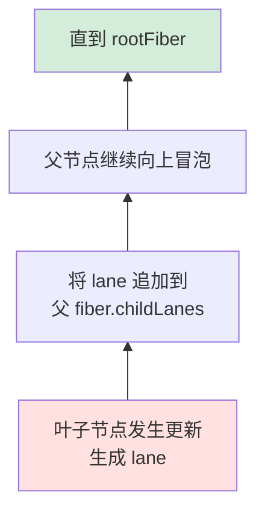
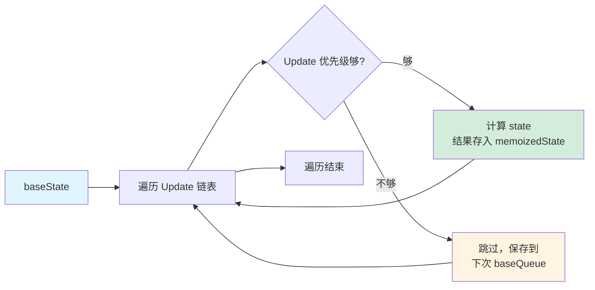
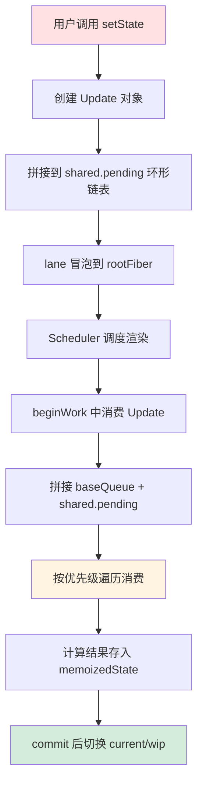

# 状态更新流程

从用户点击按钮到 UI 更新，中间经历了什么？本篇梳理从发起更新到 state 计算的完整链路。

> 前置知识：[Reconciler 协调器](./reconciler.md) 中的 beginWork 流程

---

## 发起更新

只有组件才能发起状态更新，普通 DOM 节点无法发起。通过交互事件或代码调用 `setState` / `useState` 的 setter 来触发。

---

## Lane 冒泡：如何快速定位更新的组件？

在调和阶段，Fiber 是参与调和的最小单元。当某个组件发生了更新，React 不可能遍历所有组件才能找到它——这无疑是性能浪费。

React 的解法是 **lane 冒泡**：



1. 发生更新的组件调用 `scheduleUpdateOnFiber`
2. 生成一个 lane（代表本次更新的优先级）
3. **将自身的 lane 追加到父 Fiber 的 `childLanes` 中**
4. 父节点继续向上冒泡，直到 rootFiber

这样在调和阶段从 rootFiber 开始遍历时，只需检查每个节点的 `childLanes`：如果某棵子树的 `childLanes` 中不存在当前优先级的 lane，就可以**整棵跳过**。

---

## 更新的来源

组件重新渲染的触发来源有三种：

| 来源 | 判断方式 |
|------|---------|
| **props** | 对比 `newProps` 与 `oldProps` 是否相等 |
| **state** | 对比 lane 是否等于 `renderLane` |
| **context** | Context 值是否变化 |

---

## Update：计算 state 的最小单位

每次调用 `setState` 或 `useState` 的 setter，都会产生一个 **Update** 对象。这些 Update 组成单向链表，最终被消费并计算出新的 state。

```
交互 → 产生 Update → 消费 Update → 产生新 state
```

### Update 的数据结构

```javascript
const update = {
  lane,           // 优先级
  action,         // 更新内容（setState 的参数）
  next,           // 指向下一个 Update（单向链表）
  // ...其他字段
};
```

---

## UpdateQueue：存储参与 state 计算的数据

每个 Hook 都有一个 `updateQueue`，用于存储与该 Hook 相关的所有 Update。

### 关键属性

| 属性 | 含义 |
|------|------|
| `baseState` | 参加计算的初始 state |
| `baseQueue` | 本次更新前已保存的 Update 链表（`firstBaseUpdate` 和 `lastBaseUpdate` 分别指向链表头和尾） |
| `shared.pending` | 触发更新后新产生的 Update，形成**单向环形链表** |

### shared.pending 的环形结构

触发更新后，新的 Update 会被拼接到 `shared.pending` 中：

```
shared.pending → 最后一个 Update
shared.pending.next → 第一个 Update
```

这是一个环形链表，`pending` 指向最后一个节点，最后一个节点的 `next` 指向第一个节点，形成闭环。

---

## 消费 Update 的完整流程

### 第一步：拼接链表

将 `baseQueue`（历史未消费的 Update）和 `shared.pending`（新产生的 Update）拼接成一个完整的链表。

> 注意：实际是从 **current Hook** 的 `shared.pending` 与 **wip Hook** 的 `baseUpdate` 拼接。

### 第二步：按优先级遍历消费

遍历拼接好的链表，根据 wip root 选定的优先级，只消费优先级足够的 Update：



### 消费过程中的两个关键问题

#### 1. 如何保证 Update 依赖关系正确？

假设有一串有序的 Update，其中某个 Update（记为 u）优先级不足被跳过了。那么 **u 及之后的所有 Update 都不能被消费**——因为后面的 Update 可能依赖 u 的计算结果。

处理方式：
- 从 u 开始往后的 Update 都会被保存到 `baseQueue` 中，作为下次更新的起点
- 它们的 lane 会被置为 `NoLane`（表示已处理过优先级判断）
- `memoizedState` 和 `baseState` 不一致，代表这是**计算不完整的中间态**

#### 2. 如何保证 Update 不丢失？

这依赖 **Hook 的双缓存机制**（与 Fiber 树的双缓存同理）：

```
current Hook（上一次的 Hook）  ←→  wip Hook（本次正在构建的 Hook）
      ↓                                ↓
  保存完整的 update 链表           消费过程中逐步构建
```

关键保障：**在 commit 完成之前，current Hook 和 wip Hook 不会切换。**

这意味着即使 render 过程中被打断、经历了多次重新 render，current Hook 上始终保留着完整的 update 链表。下次 render 可以从 current Hook 恢复，不会丢失任何 Update。

---

## 总结：从 setState 到 state 更新的完整链路



> 了解了状态如何驱动更新后，可以进一步看 [性能优化](./performance.md) 中 React 如何跳过不必要的更新。
