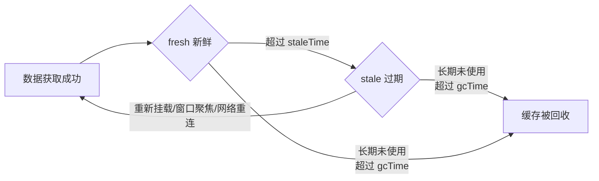
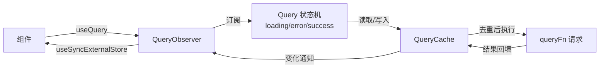

# TanStack Query

TanStack Query（前身 React Query）是 React 生态中管理**服务端状态**的主流库。它将 API 请求的缓存、去重、重试、失效、后台刷新等逻辑从组件中抽离，让服务端数据像"本地变量"一样被消费。

> 服务端状态与客户端状态本质不同：来自 API 的数据需要缓存、需要与服务器同步、可能过期。TanStack Query 负责这部分，Zustand/Redux 负责纯客户端状态，两者职责互补。

---

## 快速上手

```bash
npm install @tanstack/react-query
```

```jsx
import { QueryClient, QueryClientProvider, useQuery } from '@tanstack/react-query';

// 1. 创建 QueryClient 并注入（通常在应用入口）
const queryClient = new QueryClient({
  defaultOptions: { queries: { staleTime: 60_000 } },
});

function App() {
  return (
    <QueryClientProvider client={queryClient}>
      <UserProfile userId={1} />
    </QueryClientProvider>
  );
}

// 2. 声明式使用查询
function UserProfile({ userId }) {
  const { data, isLoading, error } = useQuery({
    queryKey: ['user', userId],
    queryFn: () => fetch(`/api/user/${userId}`).then((r) => r.json()),
  });

  if (isLoading) return <Spinner />;
  if (error) return <ErrorMessage error={error} />;
  return <div>{data.name}</div>;
}
```

核心 API 一览：

| API | 作用 |
|-----|------|
| `QueryClient` | 缓存容器，管理所有查询的创建、更新、失效 |
| `useQuery` | 声明式读取数据，自动处理加载/错误/缓存 |
| `useMutation` | 执行写操作（POST/PUT/DELETE），并联动缓存 |
| `queryKey` | 查询的唯一标识，决定缓存命中与共享 |
| `invalidateQueries` | 使缓存失效，触发重新获取 |

---

## 核心概念

### queryKey：缓存的身份证

`queryKey` 是查询在缓存中的唯一标识，**相同 queryKey 的查询共享一份缓存**。结构上要包含所有影响查询结果的参数：

```js
useQuery({ queryKey: ['user', userId], queryFn: ... });      // ✅ 参数进 key
useQuery({ queryKey: ['user'], queryFn: () => fetchUser(userId) }); // ❌ 切换用户会拿到旧缓存
```

queryKey 是层次化数组，支持部分匹配：`invalidateQueries({ queryKey: ['user'] })` 可以使 `['user', 1]`、`['user', 2]` 全部失效。

### 缓存生命周期

每个查询的数据在缓存中有四个阶段：



| 阶段 | 含义 | 触发重新获取 |
|------|------|------------|
| `fresh` | 数据新鲜，不重新请求 | 不触发 |
| `stale` | 数据过期，允许重新获取 | 组件重新挂载、窗口聚焦、网络重连、手动失效 |
| `active` | 有组件正在使用 | - |
| `inactive` | 没有组件使用，超过 `gcTime`（默认 5 分钟）后被回收 | - |

关键配置：

- **staleTime**：数据"新鲜"的时长，默认 0（数据一拿到就过期）。调大可以减少请求次数
- **gcTime**：缓存保留时长（v5 前叫 cacheTime），默认 5 分钟。调大可以提升"返回旧页面"的体验
- **refetchOnWindowFocus**：窗口聚焦时重新获取，默认开启，是数据与服务器同步的重要机制

### 依赖查询与去重

多个组件使用相同 `queryKey` 时，TanStack Query 自动**去重**：同一时间只有一个请求发出，所有组件共享结果和加载状态。

```jsx
// 三个组件同时渲染，只会发出一次请求
function Page() {
  const first = useQuery({ queryKey: ['user', id], queryFn: fetchUser });
  const second = useQuery({ queryKey: ['user', id], queryFn: fetchUser });
  const third = useQuery({ queryKey: ['user', id], queryFn: fetchUser });
}
```

一个查询依赖另一个查询结果时，用 `enabled` 控制：

```jsx
const userQuery = useQuery({ queryKey: ['user', id], queryFn: fetchUser });

const postsQuery = useQuery({
  queryKey: ['posts', userQuery.data?.id],
  queryFn: () => fetchPosts(userQuery.data.id),
  enabled: !!userQuery.data, // 拿到用户后再请求
});
```

---

## Mutation 与缓存联动

### 基础用法

```jsx
const { mutate, isPending } = useMutation({
  mutationFn: (newName) => fetch('/api/user', { method: 'PATCH', body: JSON.stringify({ name: newName }) }),
  onSuccess: () => {
    // 写成功后使相关查询失效，自动重新获取
    queryClient.invalidateQueries({ queryKey: ['user'] });
  },
});
```

### 乐观更新

先本地更新 UI，请求失败再回滚，提升交互体验：

```jsx
const { mutate } = useMutation({
  mutationFn: renameUser,
  onMutate: async (newName) => {
    // 1. 取消进行中的查询，避免覆盖乐观值
    await queryClient.cancelQueries({ queryKey: ['user'] });
    // 2. 备份旧数据
    const prev = queryClient.getQueryData(['user']);
    // 3. 本地立即更新
    queryClient.setQueryData(['user'], (old) => ({ ...old, name: newName }));
    return { prev }; // 传给 onError 用于回滚
  },
  onError: (_err, _newName, context) => {
    queryClient.setQueryData(['user'], context.prev); // 回滚
  },
  onSettled: () => {
    queryClient.invalidateQueries({ queryKey: ['user'] }); // 与服务器对齐
  },
});
```

---

## 进阶能力

### 分页与预取

```jsx
// 分页：切换页码时优先展示缓存，再后台刷新
// v5 中 keepPreviousData 需从 @tanstack/react-query 导入，以占位函数形式传入
import { keepPreviousData } from '@tanstack/react-query';

const { data, isPlaceholderData } = useQuery({
  queryKey: ['projects', page],
  queryFn: () => fetchProjects(page),
  placeholderData: keepPreviousData,
});

// 预取：hover 时提前拉取下一页，点击时秒开
queryClient.prefetchQuery({
  queryKey: ['projects', page + 1],
  queryFn: () => fetchProjects(page + 1),
});
```

### 无限滚动

```jsx
const { data, fetchNextPage, hasNextPage } = useInfiniteQuery({
  queryKey: ['projects'],
  queryFn: ({ pageParam }) => fetchProjects(pageParam),
  initialPageParam: 0,
  getNextPageParam: (lastPage) => lastPage.nextCursor ?? undefined,
});
```

---

## 核心原理

### 数据流架构



各层职责：

| 层 | 职责 |
|----|------|
| `QueryClient` | 门面，持有 QueryCache，提供失效/预取/清除等操作 |
| `QueryCache` | 以 queryKey 为索引的 Map，存储所有 Query 对象 |
| `Query` | 单个查询的状态机（data/error/status）与重试、去重逻辑 |
| `QueryObserver` | 组件与 Query 之间的订阅者，selector 逻辑、组件卸载时取消订阅 |
| `useSyncExternalStore` | 将 Query 变化桥接到 React 渲染（与 Zustand 同机制） |

### 请求去重与重试

- **去重**：同一 `queryKey` 的 Query 对象只有一份。并发组件挂载时，只有第一个触发 `queryFn` 执行，其余等待同一个 Promise
- **重试**：请求失败时 Query 内部按退避策略自动重试（默认 3 次，指数退避），也可配置 `retry` 关闭
- **取消**：组件卸载或 key 变化时，Query 会调用 `queryFn` 返回的 `AbortSignal` 取消请求，避免无效网络开销

### 为什么能"卸载不丢数据"

组件卸载时，QueryObserver 取消订阅，但 **Query 对象和缓存数据仍然存活**（进入 inactive 状态，等待 `gcTime` 回收）。重新挂载时直接命中缓存并显示数据，同时判断 staleTime 决定是否后台刷新——这就是"返回上一页秒开"体验的来源。

---

## 最佳实践

- **职责划分**：TanStack Query 管服务端状态（缓存/同步/失效），Zustand 管客户端 UI 状态，不要把 API 数据复制进 Zustand
- **queryKey 扁平化、参数化**：按 `['资源', 参数]` 组织，便于精确失效
- **staleTime 按业务设置**：变更频繁的数据设为 0，相对静态的数据（如配置）设 5 分钟以上
- **写操作收敛到 mutation**：在 `onSuccess`/`onSettled` 中统一失效，避免散落的 `refetch` 调用
- **服务端返回的字段尽量不进全局状态**，组件层 `select` 派生即可
