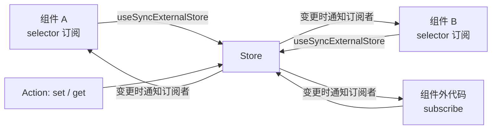

# Zustand

Zustand 是一个轻量的客户端状态管理库（约 1KB），用于管理 React 应用中的**共享状态**。它基于发布订阅模式实现，无需 Provider 包裹，通过 selector 实现细粒度订阅，是现代 React 应用管理客户端状态的常用选择。

---

## 快速上手

```bash
npm install zustand
```

```jsx
import { create } from 'zustand';

// 1. 创建 store（模块级单例，不需要 Provider）
const useUserStore = create((set, get) => ({
  user: null,
  login: (user) => set({ user }),
  logout: () => set({ user: null }),
}));

// 2. 组件中通过 selector 读取状态
function UserProfile() {
  // 只订阅 user 字段，user 不变则组件不重渲染
  const user = useUserStore((s) => s.user);
  return <div>{user?.name}</div>;
}

// 3. 通过 action 更新状态
function LoginButton() {
  const login = useUserStore((s) => s.login);
  return <button onClick={() => login({ name: 'Jun' })}>登录</button>;
}
```

核心 API 只有三个：

| API | 作用 |
|-----|------|
| `create` | 创建 store，返回一个可在组件中直接调用的 Hook |
| `set` | 合并更新状态，可接收部分状态或函数 |
| `get` | 在组件外或 action 中读取当前状态 |

---

## 核心原理

### 架构总览

Zustand 的架构可以拆成两层：**存储层**（纯 JS 发布订阅，与框架无关）和 **连接层**（与 React 桥接）。



### 存储层：发布订阅

`create` 内部创建一个闭包持有的 state 对象，并维护一个**订阅者列表**：

```js
function createStore(initialState) {
  let state = initialState;
  const listeners = new Set();

  return {
    getState: () => state,
    setState: (partial) => {
      state = typeof partial === 'function'
        ? partial(state)
        : { ...state, ...partial };
      // 通知所有订阅者
      listeners.forEach((listener) => listener(state));
    },
    subscribe: (listener) => {
      listeners.add(listener);
      return () => listeners.delete(listener);
    },
  };
}
```

> 以上是简化的伪代码，帮助理解核心机制。Zustand 实际实现在此基础上还处理了状态相等性检查、中间件等细节。

### 连接层：useSyncExternalStore

Zustand 依赖 React 18 的 `useSyncExternalStore` 将 store 连接到组件：

```js
function useStore(selector = (s) => s) {
  return useSyncExternalStore(
    store.subscribe,          // 订阅：store 变化时通知 React 重新检查
    () => selector(store.getState()), // 获取快照：selector 选出组件关心的值
  );
}
```

`useSyncExternalStore` 的机制是：订阅期间 React 会在内部保存 `getSnapshot` 的返回值，当 store 通知变化时，React 重新调用 `getSnapshot` 并与上一次快照做 `Object.is` 比较，**只有快照变化才触发组件重渲染**。

这就是 Zustand 细粒度更新的来源：**selector 返回的永远是原始值或新引用，store 整体变化时只有"选中部分变了"的组件才会重新渲染**。

```jsx
const user = useUserStore((s) => s.user);        // 引用类型，user 对象变了才渲染
const count = useUserStore((s) => s.count);      // 原始值，count 变了才渲染
const everything = useUserStore();               // 不带 selector，任何变化都渲染
```

### 为什么不需要 Provider

Redux 需要 Provider 是因为它把 store 放在 React 的 Context 中传递。Zustand 的 store 是**模块级单例**（`create` 调用时即创建），组件直接引用模块引入的 Hook 即可访问，因此天然没有 Provider 嵌套问题。

这也意味着 store 可以在组件外使用（如工具函数、axios 拦截器中）：

```js
// 组件外读取/更新
const state = useUserStore.getState();
useUserStore.getState().logout();
// 组件外订阅
const unsub = useUserStore.subscribe((state) => {
  console.log('user 变化', state.user);
});
```

### 什么时候需要 useShallow

当 selector 返回的是**新组装的对象**时，每次 `getSnapshot` 都会产生新引用，导致 `Object.is` 恒为 false，组件每次都会重渲染：

```jsx
// ❌ 每次快照都返回新对象，永远"变化"
const { user, count } = useUserStore((s) => ({ user: s.user, count: s.count }));

// ✅ 使用 useShallow 做浅比较，只有字段值变化才渲染
import { useShallow } from 'zustand/react/shallow';
const { user, count } = useUserStore(
  useShallow((s) => ({ user: s.user, count: s.count }))
);
```

`useShallow` 内部用浅比较（逐字段 `Object.is`）替代默认的引用比较，只有字段值真的变化时才触发渲染。

---

## 中间件

Zustand 中间件是包装 `create` 的高阶函数，在 `set`/`get` 前后插入逻辑。

### 持久化 persist

```jsx
import { persist } from 'zustand/middleware';

const useUserStore = create(
  persist(
    (set) => ({ user: null, login: (user) => set({ user }) }),
    { name: 'user-storage' } // localStorage 的 key
  )
);
```

### 不可变更新 immer

```jsx
import { immer } from 'zustand/middleware/immer';

const useCartStore = create(
  immer((set) => ({
    items: [],
    addItem: (item) =>
      set((state) => {
        state.items.push(item); // 可以直接"修改"，immer 自动生成新状态
      }),
  }))
);
```

### 自定义中间件

```js
const logger = (config) => (set, get, api) =>
  config(
    (...args) => {
      console.log('prev:', get());
      set(...args);
      console.log('next:', get());
    },
    get,
    api
  );

const useStore = create(logger((set) => ({ count: 0, inc: () => set((s) => ({ count: s.count + 1 })) })));
```

---

## 与其他方案对比

| 方案 | 渲染粒度 | Provider | 样板代码 | 适用场景 |
|------|---------|---------|---------|---------|
| Context + useReducer | 粗（Context 变化整棵树渲染） | 需要 | 少 | 低频共享数据（主题、登录态） |
| Redux Toolkit | 中（useSelector 可细粒度） | 需要 | 多（action/reducer/selector） | 大型复杂应用、强规范团队 |
| Zustand | 细（selector 精确订阅） | 不需要 | 少 | 中小型应用、需要灵活和简洁 |
| Jotai | 细（原子级） | 需要（Provider 可选） | 少 | 细粒度派生状态 |

Zustand 的核心取舍：**用发布订阅替代 Context 分发**，牺牲了 Redux 的强约束规范，换来更少的样板代码和更灵活的组件外访问。

---

## 最佳实践

- **按模块拆分 store**，不要把所有状态塞进一个全局 store，避免无关组件互相干扰
- **selector 尽量选最小的字段**，返回原始值优先于整个对象
- **服务端数据不要放 Zustand**，交给 [TanStack Query](./tanstack-query) 管理（缓存、重试、失效），Zustand 只放客户端 UI 状态
- 低频全局数据（主题、语言）用 Context 即可，不必引入库
- 需要跨组件树共享又需要频繁更新时，才考虑外部状态管理库
