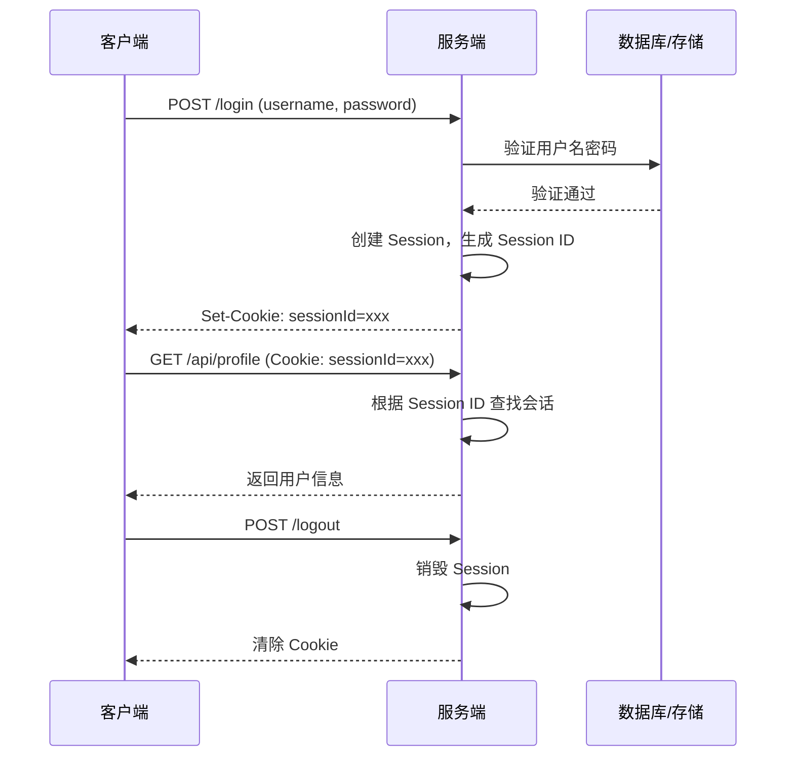
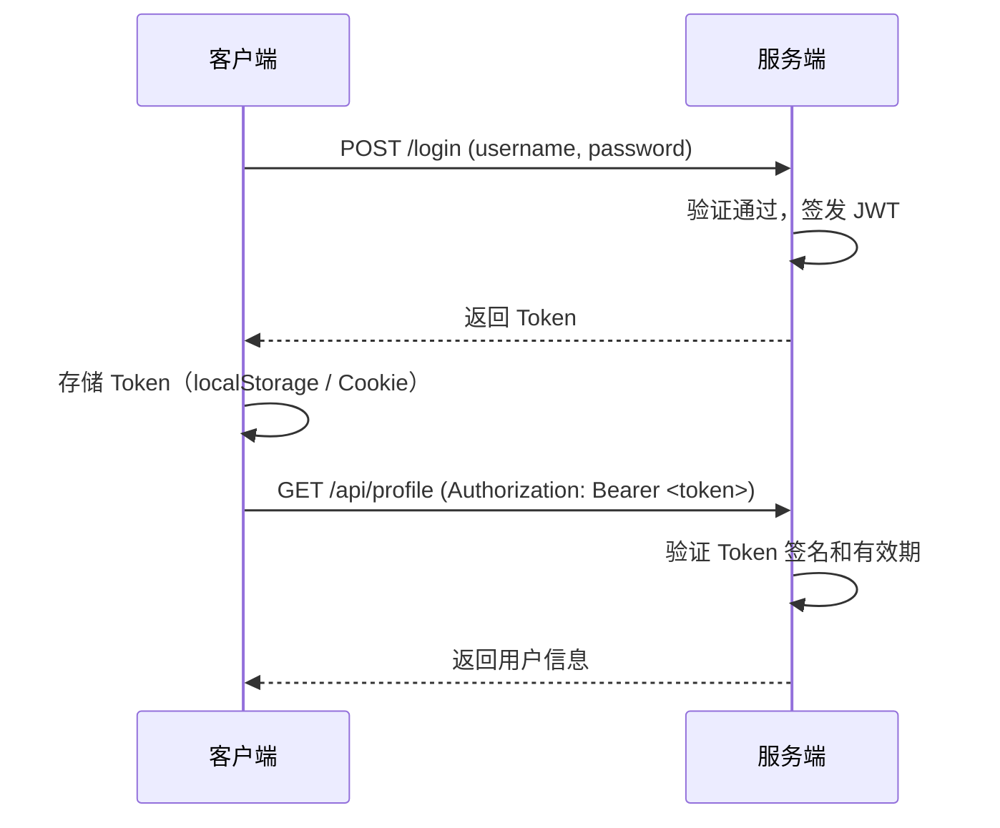
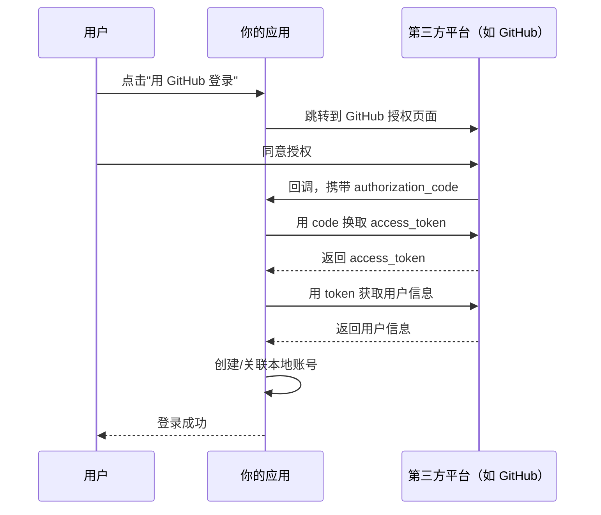
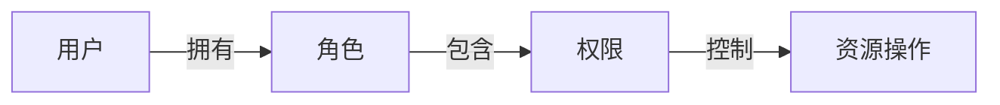

# 认证与授权

**认证（Authentication）** 解决"你是谁"——验证用户身份。
**授权（Authorization）** 解决"你能做什么"——验证用户权限。

这是后端安全的第一道防线。

## 认证方式对比

| 方式 | 原理 | 优点 | 缺点 | 适用场景 |
|------|------|------|------|----------|
| **Session** | 服务端存会话，客户端存 Cookie | 简单、可主动失效 | 有状态，扩展难 | 单体应用 |
| **JWT** | 服务端签发 Token，客户端存储 | 无状态，易扩展 | 无法主动失效 | 分布式/微服务 |
| **OAuth 2.0** | 第三方授权 | 用户无需重复注册 | 流程复杂 | 第三方登录 |

## Session 认证

最传统的认证方式，服务端维护会话状态。

### 工作流程



### "根据 Session ID 查找会话"是什么动作

就是**用 sessionId 当 key，去会话存储里取对应的会话数据**——一次查表操作（开发时是内存 Map，生产是 Redis/数据库）。sessionId 只是"钥匙"，用户数据才是"包"——像寄存柜：存包时拿到号码牌，取包时凭号码牌找管理员取包：

```javascript
// 会话存储:登录时 key=sessionId,value=用户数据
const sessionStore = new Map()
sessionStore.set(sessionId, { userId: 1, username: 'alice' })

// 请求进来:"根据 Session ID 查找会话"就是这一行
const session = sessionStore.get(sessionId)  // 查不到 → undefined → 未登录
```

- **查得到** → 说明登录过，把数据挂到请求上，继续处理业务
- **查不到** → 会话不存在（未登录/已登出销毁/已过期），返回 401

koa-session 里 `ctx.session.userId` 能直接读到值，就是它内部替你做了这次查找。**有状态认证的一切都建立在"服务端存了这张表"之上**——这也是 JWT 无状态后无法主动失效的根本原因。

### Koa 实现

```javascript
const session = require('koa-session')
const Koa = require('koa')
const app = new Koa()

app.keys = ['your-secret-key']  // 签名密钥

app.use(session({
  key: 'koa:sess',
  maxAge: 86400000,  // 1 天
  httpOnly: true,    // 禁止 JS 访问 Cookie
  signed: true,      // 签名防篡改
}, app))

// 登录
router.post('/login', async (ctx) => {
  const { username, password } = ctx.request.body
  const user = await verifyUser(username, password)

  if (user) {
    ctx.session.userId = user.id
    ctx.session.username = user.username
    ctx.body = { message: '登录成功' }
  } else {
    ctx.status = 401
    ctx.body = { message: '用户名或密码错误' }
  }
})

// 需要登录的接口
router.get('/profile', async (ctx) => {
  if (!ctx.session.userId) {
    ctx.status = 401
    ctx.body = { message: '请先登录' }
    return
  }
  ctx.body = { userId: ctx.session.userId }
})

// 登出
router.post('/logout', async (ctx) => {
  ctx.session = null
  ctx.body = { message: '已登出' }
})
```

**分工：中间件管"柜子"，业务管"内容"。** 中间件（koa-session）负责请求进时**建/查**会话空间、响应出时**写回/销毁** + 同步 Cookie；业务代码只读写 `ctx.session` 里的内容。业务往柜子里放东西，柜子自动保存；业务把东西清空，柜子自动回收——业务代码永远不碰存储和 Cookie，只碰 `ctx.session`。

```javascript
// 中间件简化版:上面的"柜子逻辑"全在这里
app.use(async (ctx, next) => {
  const sessionId = ctx.cookies.get('koa:sess')
  ctx.session = sessionStore.get(sessionId) || {}   // 请求进:建/查空间
  await next()                                      // 业务代码:只碰 ctx.session
  if (ctx.session === null) {
    sessionStore.delete(sessionId)                  // 登出:销毁 + 清 Cookie
  } else {
    sessionStore.set(sessionId, ctx.session)        // 有内容:写回
  }
})
```

**登录为什么还要手动 `ctx.session.userId = user.id`？** 中间件不知道你是谁、登录验证过没有——"存哪个用户"是业务决定。删掉这两行，会话是空壳，`GET /profile` 永远 401。对照没有 koa-session 的登录：

```javascript
// 没有 koa-session:手动"存数据 + 下发 Cookie"
sessionStore.set(sessionId, { userId: user.id, username: user.username })
ctx.cookies.set('koa:sess', sessionId)

// 有 koa-session:只写内容,落库和 Cookie 由中间件自动完成
ctx.session.userId = user.id
ctx.session.username = user.username
```

## JWT 认证

JWT（JSON Web Token）是无状态的认证方案，Token 本身包含用户信息，服务端不需要存储会话。

### JWT 结构

```
eyJhbGciOiJIUzI1NiIsInR5cCI6IkpXVCJ9.    ← Header（算法+类型）
eyJ1c2VySWQiOjEsInVzZXJuYW1lIjoiYWxpY2UifQ.  ← Payload（数据）
SflKxwRJSMeKKF2QT4fwpMeJf36POk6yJV_adQssw5c  ← Signature（签名）
```

三部分用 `.` 连接，Header 和 Payload 是 Base64 编码的 JSON。

### 工作流程



### Token 存哪：localStorage 还是 Cookie？

| 存放位置 | 优点 | 风险 |
|----------|------|------|
| **localStorage** + `Authorization: Bearer` header | 简单直接，JS 随意读写 | **XSS 一锅端**——脚本能读到 token，被注入就泄露 |
| **httpOnly Cookie** | JS 读不到，防 XSS 窃取 | **CSRF**——浏览器自动携带，跨站请求也会带上，需 `SameSite` + CSRF token 防护 |

核心权衡：localStorage 怕 **XSS**，Cookie 怕 **CSRF**——防了 XSS 就引入 CSRF。当前业界共识（OWASP 推荐）是 **httpOnly Cookie + SameSite=Lax**：XSS 比 CSRF 更难防（用户可能点了坏链接），而 CSRF 有相对成熟的缓解手段。国内项目也常用 localStorage + header 方案，靠 CSP 防 XSS + 短过期 token 配合，且前后端分离时没有跨域 Cookie 的麻烦。

**SameSite 是什么**：Cookie 的属性，控制**跨站请求**时浏览器带不带 Cookie：

| 值 | 行为 | 适用 |
|----|------|------|
| **Strict** | 任何跨站请求都不带（包括点链接跳转进入） | 最严，但从外站点链接进站会像"没登录" |
| **Lax**（默认） | 只有**顶级导航**（地址栏输入、点链接跳转）带；跨站子资源、fetch、表单 POST 不带 | 浏览器默认值，防 CSRF 主力 |
| **None** | 跨站都带，必须配 `Secure`（仅 HTTPS） | 第三方嵌入（iframe）、SSO 跨域 |

**为什么 Lax 能防 CSRF**：CSRF 是攻击者网站偷偷向你的网站发请求（表单提交、fetch），这些都不是顶级导航，Lax 下不带 Cookie → 攻击请求没有凭证；而用户正常点链接进入是顶级导航，带 Cookie，体验无损。注意同站按"站"判断（域名+后缀，`a.example.com` 与 `b.example.com` 同站），不看端口。Chrome 80 起默认就是 Lax。

其他 Cookie 属性：`HttpOnly`（JS 读不到）、`Secure`（仅 HTTPS）、`Domain`（哪些域名携带）、`Path`（哪些路径携带）、`Max-Age`（过期秒数）。

HTTP 响应头原始格式（浏览器真正收到的）：

```
Set-Cookie: token=eyJhbGciOi...; HttpOnly; Secure; SameSite=Lax; Path=/; Max-Age=604800; Domain=.example.com
```

Koa 代码写法：

```javascript
ctx.cookies.set('token', jwtToken, {
  httpOnly: true,                  // JS 读不到
  secure: true,                    // 仅 HTTPS 传输
  sameSite: 'lax',                 // 防 CSRF
  domain: '.example.com',          // 子域(api.example.com / www.example.com)共享
  path: '/',                       // 全路径携带
  maxAge: 7 * 24 * 60 * 60 * 1000  // 7 天,注意 Koa 用毫秒,HTTP 头里才是秒
})
```

### Koa 实现

```javascript
const jwt = require('jsonwebtoken')
const Koa = require('koa')
const app = new Koa()

const SECRET = process.env.JWT_SECRET || 'your-256-bit-secret'

// 签发 Token
function generateToken(user) {
  return jwt.sign(
    {
      userId: user.id,
      username: user.username,
      role: user.role,
    },
    SECRET,
    { expiresIn: '7d' }  // 7 天过期
  )
}

// 登录
router.post('/login', async (ctx) => {
  const { username, password } = ctx.request.body
  const user = await verifyUser(username, password)

  if (user) {
    const token = generateToken(user)
    ctx.body = { token, user: { id: user.id, username: user.username } }
  } else {
    ctx.status = 401
    ctx.body = { message: '用户名或密码错误' }
  }
})

// 认证中间件
const authMiddleware = async (ctx, next) => {
  const authHeader = ctx.headers.authorization
  if (!authHeader || !authHeader.startsWith('Bearer ')) {
    ctx.status = 401
    ctx.body = { message: '未提供 Token' }
    return
  }

  const token = authHeader.slice(7)
  try {
    const decoded = jwt.verify(token, SECRET)
    ctx.state.user = decoded  // 挂载到 ctx.state，后续中间件可用
    await next()
  } catch (err) {
    if (err.name === 'TokenExpiredError') {
      ctx.status = 401
      ctx.body = { message: 'Token 已过期' }
    } else {
      ctx.status = 401
      ctx.body = { message: 'Token 无效' }
    }
  }
}

// 使用认证中间件
router.get('/profile', authMiddleware, async (ctx) => {
  ctx.body = { user: ctx.state.user }
})
```

### JWT vs Session

| 维度 | Session | JWT |
|------|---------|-----|
| **存储位置** | 服务端 | 客户端 |
| **状态** | 有状态 | 无状态 |
| **扩展性** | 需要共享 Session 存储 | 天然支持分布式 |
| **主动失效** | 服务端删除即可 | 需要黑名单机制 |
| **跨域** | Cookie 有跨域限制 | Header 传递，无跨域问题 |
| **体积** | Cookie 只存 ID | Token 较大（几百字节） |

**选择建议：**
- 单体应用 → Session（简单可靠）
- 微服务/前后端分离 → JWT（无状态，易扩展）
- 移动端 App → JWT（Cookie 不方便）

### 为什么 JWT 无法主动失效

根源在 JWT 的**设计**：设计目标就是**无状态、自包含**——用户信息全塞在 Token 里，服务端签发后不保存任何记录，也不依赖服务端存储来验证。于是验证 Token 时只能做两件事：**验签名**（确认没被篡改）+ **查过期时间**（确认没到期）。两关都过就放行——服务端手里没有任何"已签发 Token 清单"，想删都无从删起，唯一失效途径是等 `exp` 到期。

对比 Session：服务端存了会话记录，登出 = 删记录，客户端再来就查无此人。**有记录才能删除，无状态就没有"删除"这个操作**——这正是 JWT 无状态优势的代价。

实战补救方案（注意它们都会引入状态，按需取舍）：

| 方案 | 做法 | 代价 |
|------|------|------|
| **短过期 + 刷新** | access token 15 分钟过期，refresh token 负责换新 | 需要刷新接口，前端要处理换 token 逻辑 |
| **黑名单** | 登出时把 token 的 jti 写进 Redis，验证时查 | 每次验证多一次 Redis 查询，违背无状态初衷 |
| **版本号** | 改密码/封号时递增用户 token 版本号，放进 payload 比对 | 每次验证多查一次库 |

> 注意："客户端删除 Token"不算主动失效——只是你不再用它，已泄露出去的 Token 依然有效。

## OAuth 2.0

OAuth 2.0 是第三方授权标准，让用户用已有账号（微信、GitHub、Google）登录你的应用，无需重新注册。

### 授权码模式（最常用）



### GitHub OAuth 示例

```javascript
const axios = require('axios')

// 1. 引导用户跳转到 GitHub 授权页
router.get('/auth/github', (ctx) => {
  const params = new URLSearchParams({
    client_id: process.env.GITHUB_CLIENT_ID,
    redirect_uri: 'http://localhost:3000/auth/github/callback',
    scope: 'user:email',
  })
  ctx.redirect(`https://github.com/login/oauth/authorize?${params}`)
})

// 2. 处理回调
router.get('/auth/github/callback', async (ctx) => {
  const { code } = ctx.query

  // 用 code 换取 access_token
  const tokenRes = await axios.post(
    'https://github.com/login/oauth/access_token',
    {
      client_id: process.env.GITHUB_CLIENT_ID,
      client_secret: process.env.GITHUB_CLIENT_SECRET,
      code,
    },
    { headers: { Accept: 'application/json' } }
  )
  const { access_token } = tokenRes.data

  // 用 token 获取用户信息
  const userRes = await axios.get('https://api.github.com/user', {
    headers: { Authorization: `Bearer ${access_token}` },
  })
  const githubUser = userRes.data

  // 查找或创建本地用户
  let user = await findUserByGithubId(githubUser.id)
  if (!user) {
    user = await createUser({
      githubId: githubUser.id,
      username: githubUser.login,
      avatar: githubUser.avatar_url,
    })
  }

  // 签发本地 Token
  const token = generateToken(user)
  ctx.body = { token, user }
})
```

## 授权：RBAC 权限模型

RBAC（Role-Based Access Control）基于角色的权限控制，最常用的授权模型。

### 模型设计



```sql
-- 角色表
CREATE TABLE roles (
  id INT PRIMARY KEY AUTO_INCREMENT,
  name VARCHAR(50) NOT NULL UNIQUE  -- 'admin', 'editor', 'viewer'
);

-- 权限表
CREATE TABLE permissions (
  id INT PRIMARY KEY AUTO_INCREMENT,
  resource VARCHAR(50) NOT NULL,    -- 'users', 'posts'
  action VARCHAR(50) NOT NULL       -- 'create', 'read', 'update', 'delete'
);

-- 角色-权限关联表
CREATE TABLE role_permissions (
  role_id INT,
  permission_id INT,
  PRIMARY KEY (role_id, permission_id)
);

-- 用户-角色关联表
CREATE TABLE user_roles (
  user_id INT,
  role_id INT,
  PRIMARY KEY (user_id, role_id)
);
```

### 中间件实现

```javascript
// 权限检查中间件
function requirePermission(resource, action) {
  return async (ctx, next) => {
    const user = ctx.state.user
    if (!user) {
      ctx.status = 401
      ctx.body = { message: '未登录' }
      return
    }

    // 查询用户角色和权限
    const hasPermission = await checkPermission(user.userId, resource, action)
    if (!hasPermission) {
      ctx.status = 403
      ctx.body = { message: '没有权限执行此操作' }
      return
    }

    await next()
  }
}

// 使用
router.delete('/users/:id',
  authMiddleware,
  requirePermission('users', 'delete'),
  async (ctx) => {
    await deleteUser(ctx.params.id)
    ctx.status = 204
  }
)

router.get('/posts',
  authMiddleware,
  requirePermission('posts', 'read'),
  async (ctx) => {
    ctx.body = await getPosts()
  }
)
```

### 常见角色设计

| 角色 | 权限 |
|------|------|
| **超级管理员** | 所有权限 |
| **管理员** | 用户管理 + 内容管理 |
| **编辑** | 内容创建/修改/删除 |
| **普通用户** | 查看内容 + 管理自己的数据 |
| **访客** | 仅查看公开内容 |

## 密码安全

永远不要明文存储密码。

```javascript
const bcrypt = require('bcrypt')

// 注册：哈希密码
const saltRounds = 10
const hashedPassword = await bcrypt.hash(plainPassword, saltRounds)
await createUser({ username, password_hash: hashedPassword })

// 登录：验证密码
const isValid = await bcrypt.compare(plainPassword, user.password_hash)
if (isValid) {
  // 密码正确
}
```

**要点：**
- 使用 bcrypt/argon2 等慢哈希算法（防暴力破解）
- 不要用 MD5/SHA（太快，容易被彩虹表攻击）
- salt 由 bcrypt 自动生成并存储在哈希值中

## 安全清单

- [ ] 密码用 bcrypt 哈希存储
- [ ] JWT Secret 使用强随机字符串，不要硬编码
- [ ] Token 设置合理的过期时间
- [ ] 敏感操作（改密码、删账号）需要二次验证
- [ ] 使用 HTTPS 传输
- [ ] 设置 CORS 白名单，不要 `origin: '*'`
- [ ] 请求频率限制，防暴力破解
- [ ] 输入校验，防 SQL 注入和 XSS
- [ ] 日志中不记录密码和 Token
