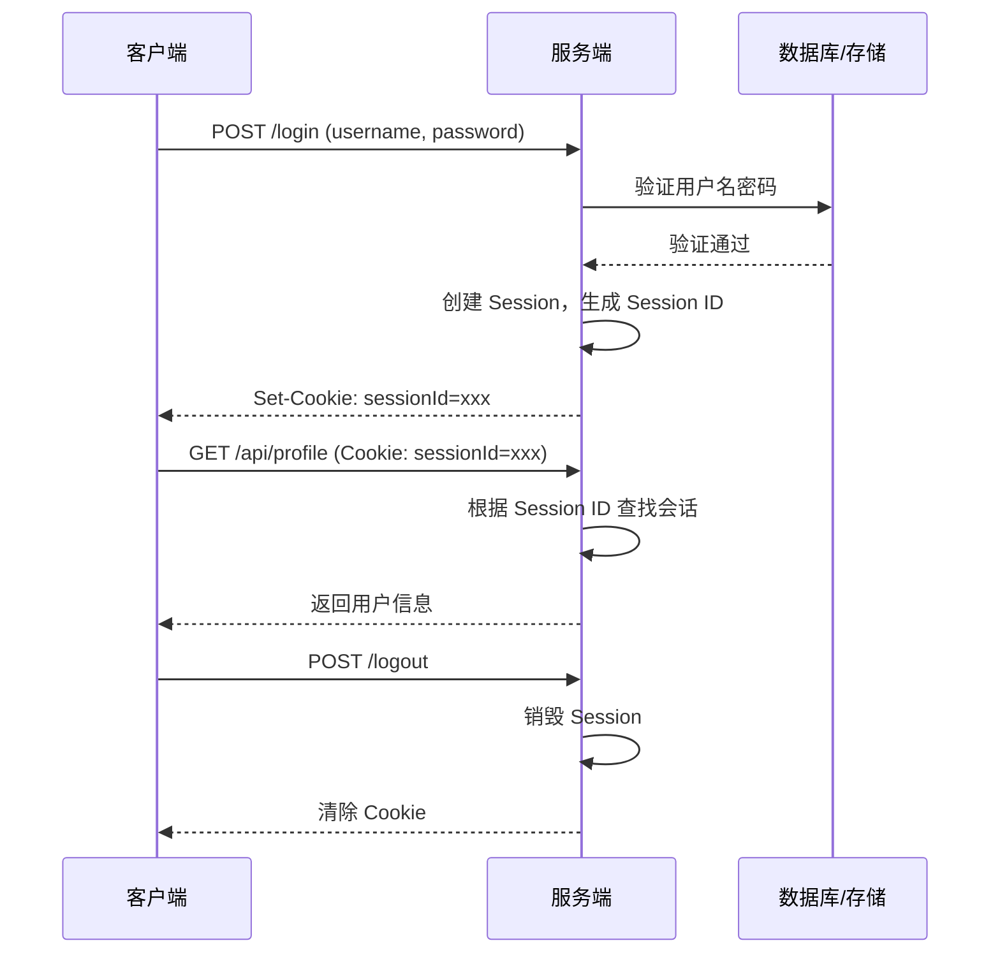
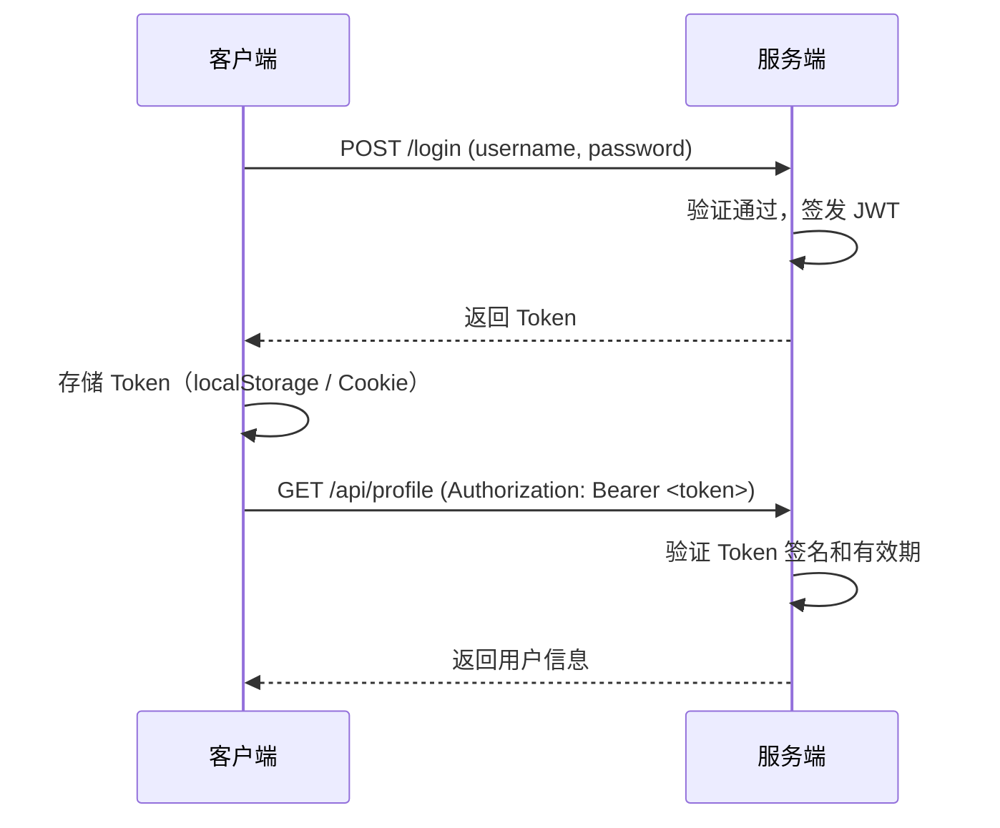
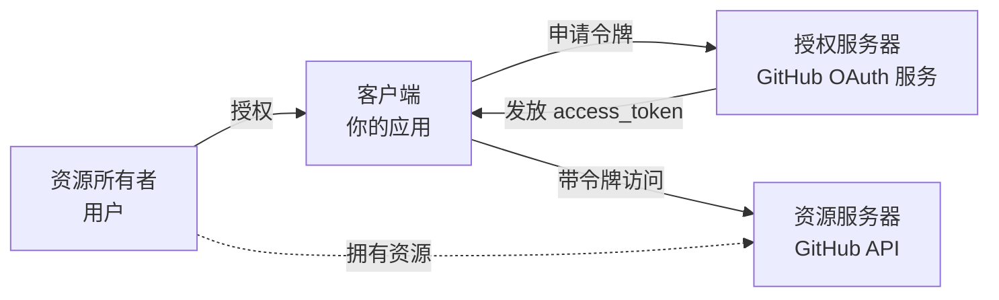
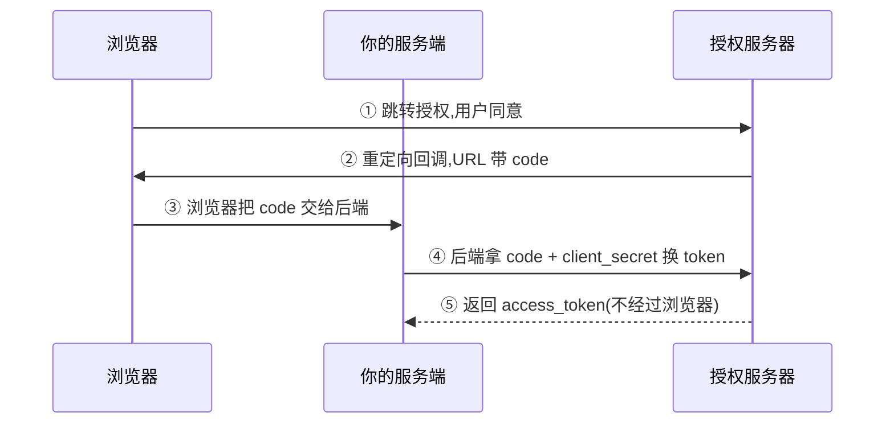
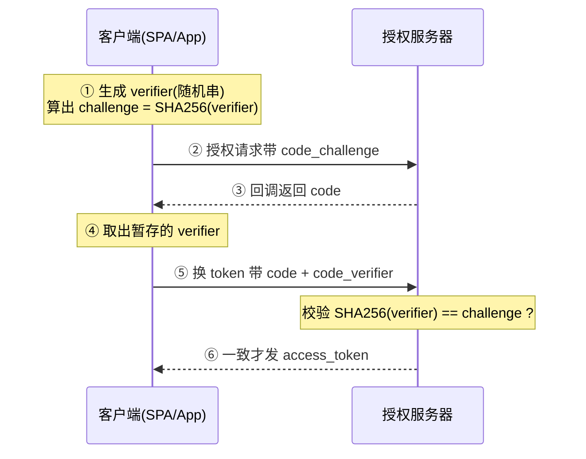
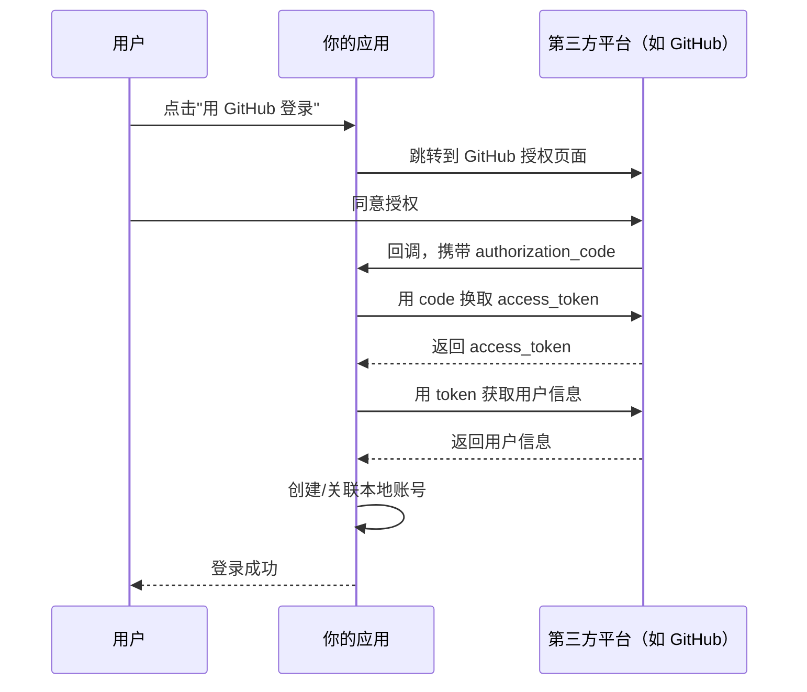
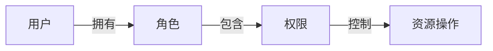

# 认证与授权

**认证（Authentication）** 解决"你是谁"——验证用户身份。
**授权（Authorization）** 解决"你能做什么"——验证用户权限。

这是后端安全的第一道防线。

## 认证方式对比

| 方式 | 原理 | 优点 | 缺点 | 适用场景 |
|------|------|------|------|----------|
| **Session** | 服务端存会话，客户端存 Cookie | 简单、可主动失效 | 有状态，扩展难 | 单体应用 |
| **JWT** | 服务端签发 Token，客户端存储 | 无状态，易扩展 | 无法主动失效 | 分布式/微服务 |
| **OAuth 2.0** | 第三方授权 | 用户无需重复注册 | 流程复杂 | 第三方登录 |

## Session 认证

最传统的认证方式，服务端维护会话状态。

### 工作流程



### "根据 Session ID 查找会话"是什么动作

就是**用 sessionId 当 key，去会话存储里取对应的会话数据**——一次查表操作（开发时是内存 Map，生产是 Redis/数据库）。sessionId 只是"钥匙"，用户数据才是"包"——像寄存柜：存包时拿到号码牌，取包时凭号码牌找管理员取包：

```javascript
// 会话存储:登录时 key=sessionId,value=用户数据
const sessionStore = new Map()
sessionStore.set(sessionId, { userId: 1, username: 'alice' })

// 请求进来:"根据 Session ID 查找会话"就是这一行
const session = sessionStore.get(sessionId)  // 查不到 → undefined → 未登录
```

- **查得到** → 说明登录过，把数据挂到请求上，继续处理业务
- **查不到** → 会话不存在（未登录/已登出销毁/已过期），返回 401

koa-session 里 `ctx.session.userId` 能直接读到值，就是它内部替你做了这次查找。**有状态认证的一切都建立在"服务端存了这张表"之上**——这也是 JWT 无状态后无法主动失效的根本原因。

### Koa 实现

```javascript
const session = require('koa-session')
const Koa = require('koa')
const app = new Koa()

app.keys = ['your-secret-key']  // 签名密钥

app.use(session({
  key: 'koa:sess',
  maxAge: 86400000,  // 1 天
  httpOnly: true,    // 禁止 JS 访问 Cookie
  signed: true,      // 签名防篡改
}, app))

// 登录
router.post('/login', async (ctx) => {
  const { username, password } = ctx.request.body
  const user = await verifyUser(username, password)

  if (user) {
    ctx.session.userId = user.id
    ctx.session.username = user.username
    ctx.body = { message: '登录成功' }
  } else {
    ctx.status = 401
    ctx.body = { message: '用户名或密码错误' }
  }
})

// 需要登录的接口
router.get('/profile', async (ctx) => {
  if (!ctx.session.userId) {
    ctx.status = 401
    ctx.body = { message: '请先登录' }
    return
  }
  ctx.body = { userId: ctx.session.userId }
})

// 登出
router.post('/logout', async (ctx) => {
  ctx.session = null
  ctx.body = { message: '已登出' }
})
```

**分工：中间件管"柜子"，业务管"内容"。** 中间件（koa-session）负责请求进时**建/查**会话空间、响应出时**写回/销毁** + 同步 Cookie；业务代码只读写 `ctx.session` 里的内容。业务往柜子里放东西，柜子自动保存；业务把东西清空，柜子自动回收——业务代码永远不碰存储和 Cookie，只碰 `ctx.session`。

```javascript
// 中间件简化版:上面的"柜子逻辑"全在这里
app.use(async (ctx, next) => {
  const sessionId = ctx.cookies.get('koa:sess')
  ctx.session = sessionStore.get(sessionId) || {}   // 请求进:建/查空间
  await next()                                      // 业务代码:只碰 ctx.session
  if (ctx.session === null) {
    sessionStore.delete(sessionId)                  // 登出:销毁 + 清 Cookie
  } else {
    sessionStore.set(sessionId, ctx.session)        // 有内容:写回
  }
})
```

**登录为什么还要手动 `ctx.session.userId = user.id`？** 中间件不知道你是谁、登录验证过没有——"存哪个用户"是业务决定。删掉这两行，会话是空壳，`GET /profile` 永远 401。对照没有 koa-session 的登录：

```javascript
// 没有 koa-session:手动"存数据 + 下发 Cookie"
sessionStore.set(sessionId, { userId: user.id, username: user.username })
ctx.cookies.set('koa:sess', sessionId)

// 有 koa-session:只写内容,落库和 Cookie 由中间件自动完成
ctx.session.userId = user.id
ctx.session.username = user.username
```

## JWT 认证

JWT（JSON Web Token）是无状态的认证方案，Token 本身包含用户信息，服务端不需要存储会话。

### JWT 结构

```
eyJhbGciOiJIUzI1NiIsInR5cCI6IkpXVCJ9.    ← Header（算法+类型）
eyJ1c2VySWQiOjEsInVzZXJuYW1lIjoiYWxpY2UifQ.  ← Payload（数据）
SflKxwRJSMeKKF2QT4fwpMeJf36POk6yJV_adQssw5c  ← Signature（签名）
```

三部分用 `.` 连接，Header 和 Payload 是 Base64 编码的 JSON。

### JWT 是怎么生成和验证的（签名原理）

JWT 看着神秘，本质是 **"一段可解码的数据 + 一段防篡改的签名"**。以最常见的 HS256（对称密钥）为例，签名公式：

```
签名 = HMAC-SHA256(
  base64Url(Header) + "." + base64Url(Payload),
  secret
)
```

**生成三步**：
1. Header、Payload 各自 JSON → base64Url 编码；
2. 两段用 `.` 拼起来；
3. 用密钥对拼接串做 HMAC-SHA256，得到第三段签名。

**验证两步**：
1. 拿收到的 Header + Payload，**用同一个密钥重算一次签名**；
2. 和收到的 Signature 比对：一致 → 内容没被篡改（篡改任何一段都会让签名对不上，而攻击者没有密钥）；不一致 → 拒绝。再检查 `exp` 是否过期。

> **关键认知：JWT 默认不加密，只是编码。** Header/Payload 就是 base64，任何人 `atob` 一下就看到了——签名的价值是"防篡改、验真伪"，**不是"防偷看"**。所以 payload 里绝不能放密码、手机号、身份证等敏感信息。真要加密得用 JWE（JSON Web Encryption），日常几乎不用。

用 Node 手写一遍原理（不依赖 jsonwebtoken 库，看懂这个就懂了 JWT）：

```javascript
const crypto = require('crypto')

function base64Url(obj) {
  return Buffer.from(JSON.stringify(obj)).toString('base64url')  // base64url 不带 + / =
}

// 签发:三段拼起来
function sign(payload, secret) {
  const header = { alg: 'HS256', typ: 'JWT' }
  const h = base64Url(header)
  const p = base64Url(payload)
  const sig = crypto.createHmac('sha256', secret).update(`${h}.${p}`).digest('base64url')
  return `${h}.${p}.${sig}`
}

// 验证:重算签名比对
function verify(token, secret) {
  const [h, p, sig] = token.split('.')
  const expect = crypto.createHmac('sha256', secret).update(`${h}.${p}`).digest('base64url')
  const ok = crypto.timingSafeEqual(Buffer.from(sig), Buffer.from(expect))  // 恒定时间比较,防时序攻击
  return ok ? JSON.parse(Buffer.from(p, 'base64url').toString()) : null
}
```

### 工作流程



### Token 存哪：localStorage 还是 Cookie？

| 存放位置 | 优点 | 风险 |
|----------|------|------|
| **localStorage** + `Authorization: Bearer` header | 简单直接，JS 随意读写 | **XSS 一锅端**——脚本能读到 token，被注入就泄露 |
| **httpOnly Cookie** | JS 读不到，防 XSS 窃取 | **CSRF**——浏览器自动携带，跨站请求也会带上，需 `SameSite` + CSRF token 防护 |

核心权衡：localStorage 怕 **XSS**，Cookie 怕 **CSRF**——防了 XSS 就引入 CSRF。当前业界共识（OWASP 推荐）是 **httpOnly Cookie + SameSite=Lax**：XSS 比 CSRF 更难防（用户可能点了坏链接），而 CSRF 有相对成熟的缓解手段。国内项目也常用 localStorage + header 方案，靠 CSP 防 XSS + 短过期 token 配合，且前后端分离时没有跨域 Cookie 的麻烦。

**SameSite 是什么**：Cookie 的属性，控制**跨站请求**时浏览器带不带 Cookie：

| 值 | 行为 | 适用 |
|----|------|------|
| **Strict** | 任何跨站请求都不带（包括点链接跳转进入） | 最严，但从外站点链接进站会像"没登录" |
| **Lax**（默认） | 只有**顶级导航**（地址栏输入、点链接跳转）带；跨站子资源、fetch、表单 POST 不带 | 浏览器默认值，防 CSRF 主力 |
| **None** | 跨站都带，必须配 `Secure`（仅 HTTPS） | 第三方嵌入（iframe）、SSO 跨域 |

**为什么 Lax 能防 CSRF**：CSRF 是攻击者网站偷偷向你的网站发请求（表单提交、fetch），这些都不是顶级导航，Lax 下不带 Cookie → 攻击请求没有凭证；而用户正常点链接进入是顶级导航，带 Cookie，体验无损。注意同站按"站"判断（域名+后缀，`a.example.com` 与 `b.example.com` 同站），不看端口。Chrome 80 起默认就是 Lax。

其他 Cookie 属性：`HttpOnly`（JS 读不到）、`Secure`（仅 HTTPS）、`Domain`（哪些域名携带）、`Path`（哪些路径携带）、`Max-Age`（过期秒数）。

HTTP 响应头原始格式（浏览器真正收到的）：

```
Set-Cookie: token=eyJhbGciOi...; HttpOnly; Secure; SameSite=Lax; Path=/; Max-Age=604800; Domain=.example.com
```

Koa 代码写法：

```javascript
ctx.cookies.set('token', jwtToken, {
  httpOnly: true,                  // JS 读不到
  secure: true,                    // 仅 HTTPS 传输
  sameSite: 'lax',                 // 防 CSRF
  domain: '.example.com',          // 子域(api.example.com / www.example.com)共享
  path: '/',                       // 全路径携带
  maxAge: 7 * 24 * 60 * 60 * 1000  // 7 天,注意 Koa 用毫秒,HTTP 头里才是秒
})
```

### Koa 实现

```javascript
const jwt = require('jsonwebtoken')
const Koa = require('koa')
const app = new Koa()

const SECRET = process.env.JWT_SECRET || 'your-256-bit-secret'

// 签发 Token
function generateToken(user) {
  return jwt.sign(
    {
      userId: user.id,
      username: user.username,
      role: user.role,
    },
    SECRET,
    { expiresIn: '7d' }  // 7 天过期
  )
}

// 登录
router.post('/login', async (ctx) => {
  const { username, password } = ctx.request.body
  const user = await verifyUser(username, password)

  if (user) {
    const token = generateToken(user)
    ctx.body = { token, user: { id: user.id, username: user.username } }
  } else {
    ctx.status = 401
    ctx.body = { message: '用户名或密码错误' }
  }
})

// 认证中间件
const authMiddleware = async (ctx, next) => {
  const authHeader = ctx.headers.authorization
  if (!authHeader || !authHeader.startsWith('Bearer ')) {
    ctx.status = 401
    ctx.body = { message: '未提供 Token' }
    return
  }

  const token = authHeader.slice(7)
  try {
    const decoded = jwt.verify(token, SECRET)
    ctx.state.user = decoded  // 挂载到 ctx.state，后续中间件可用
    await next()
  } catch (err) {
    if (err.name === 'TokenExpiredError') {
      ctx.status = 401
      ctx.body = { message: 'Token 已过期' }
    } else {
      ctx.status = 401
      ctx.body = { message: 'Token 无效' }
    }
  }
}

// 使用认证中间件
router.get('/profile', authMiddleware, async (ctx) => {
  ctx.body = { user: ctx.state.user }
})
```

### JWT vs Session

| 维度 | Session | JWT |
|------|---------|-----|
| **存储位置** | 服务端 | 客户端 |
| **状态** | 有状态 | 无状态 |
| **扩展性** | 需要共享 Session 存储 | 天然支持分布式 |
| **主动失效** | 服务端删除即可 | 需要黑名单机制 |
| **跨域** | Cookie 有跨域限制 | Header 传递，无跨域问题 |
| **体积** | Cookie 只存 ID | Token 较大（几百字节） |

**选择建议：**
- 单体应用 → Session（简单可靠）
- 微服务/前后端分离 → JWT（无状态，易扩展）
- 移动端 App → JWT（Cookie 不方便）

### JWT 的优缺点与缓解

**优点：**

- **无状态**：服务端不存会话，天然支持横向扩展、分布式/微服务
- **跨语言、跨服务**：标准格式，任何语言都能验签（微服务间传递身份很方便）
- **适合前后端分离 / 移动端**：不依赖 Cookie，放 Header 里传即可
- **自包含**：用户信息在 Token 里，省一次查库

**缺点与缓解：**

| 缺点 | 为什么是问题 | 缓解手段 |
|------|------------|---------|
| **无法主动失效** | 无状态导致签发后收不回来 | 短过期 + refresh token、黑名单、版本号（见下节） |
| **Payload 不保密** | 是 base64 编码，任何人可解码 | 绝不放敏感信息；必要时用 JWE 加密 |
| **体积较大** | 每次请求都带几百字节 | 控制 payload，只放 userId 等最小信息 |
| **密钥泄露 = 全盘失守** | 拿到 secret 就能伪造任意用户 | secret 强随机 + 定期轮换 + 不进代码库（环境变量/KMS） |
| **存储安全** | localStorage 怕 XSS、Cookie 怕 CSRF | httpOnly + SameSite（见"Token 存哪"一节） |
| **过期策略复杂** | 短了体验差、长了风险高 | access token(短) + refresh token(长) 双 token 组合 |

一句话：**JWT 用"无状态"换来了扩展性，代价是"失效难 + 不保密 + 依赖密钥安全"**——选它是因为分布式场景下这些代价比维护 Session 存储更划算，而不是因为它"更安全"。

### 为什么 JWT 无法主动失效

根源在 JWT 的**设计**：设计目标就是**无状态、自包含**——用户信息全塞在 Token 里，服务端签发后不保存任何记录，也不依赖服务端存储来验证。于是验证 Token 时只能做两件事：**验签名**（确认没被篡改）+ **查过期时间**（确认没到期）。两关都过就放行——服务端手里没有任何"已签发 Token 清单"，想删都无从删起，唯一失效途径是等 `exp` 到期。

对比 Session：服务端存了会话记录，登出 = 删记录，客户端再来就查无此人。**有记录才能删除，无状态就没有"删除"这个操作**——这正是 JWT 无状态优势的代价。

实战补救方案（注意它们都会引入状态，按需取舍）：

| 方案 | 做法 | 代价 |
|------|------|------|
| **短过期 + 刷新** | access token 15 分钟过期，refresh token 负责换新 | 需要刷新接口，前端要处理换 token 逻辑 |
| **黑名单** | 登出时把 token 的 jti 写进 Redis，验证时查 | 每次验证多一次 Redis 查询，违背无状态初衷 |
| **版本号** | 改密码/封号时递增用户 token 版本号，放进 payload 比对 | 每次验证多查一次库 |

> 注意："客户端删除 Token"不算主动失效——只是你不再用它，已泄露出去的 Token 依然有效。

### 常见误区：用密码哈希当"失效开关"

一个很容易想到的方案：payload 里存用户的密码哈希，改密码后哈希变了、旧 token 自然对不上——不就实现主动失效了？

**这个方案有三重问题：**

1. **验签 ≠ 判有效性**：JWT 验签只是"重算签名并比对"，证明 token 是服务端签发、中途未被篡改；它**不查任何存储**。所以"改密码后删缓存让旧 token 失效"这件事，验签这一步根本不会触发——想让它生效，鉴权时必须额外查一次存储，那就已经不是无状态了。
2. **payload 会泄露哈希**：payload 是 base64 可解码的（见上文"签名原理"），把密码哈希放进去 = 把离线爆破的目标送给攻击者。
3. **只覆盖"改密码"一个场景**：登出、封号、踢人都没法让旧 token 失效。

**正解：用版本号代替密码哈希。** 两者作用完全相同（都是"当前凭据是否还有效"的标记），但版本号不敏感、泄露无妨：

```javascript
// 签发:payload = { userId, tokenVersion: 0 }
// 鉴权:比对当前版本号
const current = await redis.get(`user:${payload.userId}`)
if (!current || current.version !== payload.tokenVersion) return 401

// 改密码 / 封号 / 踢人:version += 1(或直接删缓存)
```

> 一句话：**验签只验"真伪"，验"有效性"必须查状态。** 既然已经要查状态，就用最干净的状态——版本号（或者干脆回到 Redis Session），别把密码哈希拖下水。

## OAuth 2.0

OAuth 2.0 是**授权**标准（RFC 6749），让第三方应用在**不拿到用户密码**的前提下，访问用户在另一平台上的资源。日常说的"用微信/GitHub 登录"是它最常见的用法。

### 为什么需要 OAuth（解决什么问题）

假设你要做一个"导入 GitHub 仓库"的功能，需要读用户的仓库列表：

| 做法 | 问题 |
|------|------|
| ❌ 让用户把 GitHub 账号密码填进你的网站 | 你能做**任何事**（不只是读仓库）；用户无法撤销；用户改密码你的功能就废；密码泄露责任全在你 |
| ✅ OAuth：用户去 GitHub 点"同意授权" | GitHub 发一张**有范围、有期限、可撤销**的令牌给你，你只能做被授权的事 |

OAuth 的三个核心设计：

1. **用令牌代替密码**——密码只交给授权服务器（GitHub 自己），第三方应用永远拿不到
2. **权限范围可控**——令牌带 `scope`（如只读仓库），越权操作会被拒
3. **可撤销**——用户或平台随时能让令牌失效，不用改密码

### 四个角色



### 为什么叫 2.0（1.0 的坑）

| | OAuth 1.0（2007） | OAuth 2.0（2012） |
|---|---|---|
| 安全前提 | 假设**没有 HTTPS**，所以每个请求都要做复杂签名（HMAC-SHA1、参数排序、nonce 防重放） | 要求**必须有 HTTPS**，安全性交给 TLS |
| 令牌形式 | 签名算法即令牌 | **Bearer Token**（简单放 `Authorization` 头） |
| 实现难度 | 难、易写错、性能差 | 简单，几个字段搞定 |
| 兼容性 | — | **不兼容 1.0**（是重新设计，不是升级） |

一句话：**2.0 把"密码学防护"换成了"HTTPS 防护"**——更简单，但也因此被批评"把安全责任推给了传输层"。后来出现 2.1 草案（移除不安全的 implicit / password 模式，强制 PKCE）。

### 四种授权模式

| 模式 | 适用场景 | 安全性 |
|------|---------|--------|
| **授权码**（authorization code） | 有后端的 Web 应用 | ✅ 最安全，推荐 |
| **简化**（implicit） | 纯前端 SPA | ❌ token 直接暴露在 URL → 2.1 已移除 |
| **密码**（password） | 自家 App | ❌ 用户把密码给客户端 → 2.1 已移除 |
| **客户端凭证**（client credentials） | 服务间调用（无用户参与） | ✅ 用 client_id/secret 换令牌 |

现代实践：**能走授权码就走授权码 + PKCE**，其余三种只在特定场景用。

### 为什么授权码模式要"两步"（code 换 token）

这是 OAuth 最巧妙的设计，也是面试常问的点：



关键点：**`code` 会出现在 URL 里**（浏览器历史、代理日志、Referer 都可能泄露），所以它被设计成**一次性 + 极短命**；而真正的 `access_token` 由**后端**带着 `client_secret` 去换，**全程不经过浏览器**。攻击者就算截获了 code，没有 `client_secret` 也换不到 token。

对比 implicit 模式：token 直接出现在 URL 片段里 → 泄露面大得多 → 这就是它被废弃的原因。

### PKCE：移动端 / SPA 的必备补充

移动 App 和 SPA **无法安全保存 `client_secret`**（代码可被反编译、包可被解压）。没有 `client_secret` 兜底，攻击者一旦截获 `code` 就能换 token——PKCE（Proof Key for Code Exchange）就是补这个洞。

**核心思路：用"一次性随机数"替代"长期密钥"。**



**完整代码（Node 18+ / 现代浏览器，用 Web Crypto）：**

```js
// ===== ① 生成 code_verifier 与 code_challenge =====
function base64UrlEncode(bytes) {
  return btoa(String.fromCharCode(...bytes))
    .replace(/\+/g, '-').replace(/\//g, '_').replace(/=+$/, '')
}

function generateVerifier() {
  const bytes = new Uint8Array(32)
  crypto.getRandomValues(bytes)        // 密码学安全随机数
  return base64UrlEncode(bytes)        // 43 个字符的 URL-safe 串
}

async function generateChallenge(verifier) {
  const data = new TextEncoder().encode(verifier)
  const digest = await crypto.subtle.digest('SHA-256', data)
  return base64UrlEncode(new Uint8Array(digest))   // S256
}

// ===== ② 发起授权：只带 challenge，不带 verifier =====
const verifier = generateVerifier()
const challenge = await generateChallenge(verifier)
sessionStorage.setItem('pkce_verifier', verifier)   // 暂存，回调后要用

const params = new URLSearchParams({
  response_type: 'code',
  client_id: CLIENT_ID,
  redirect_uri: 'https://myapp.com/callback',
  scope: 'openid profile',
  code_challenge: challenge,
  code_challenge_method: 'S256',       // 用 SHA-256；plain 不推荐
})
location.href = `https://auth.example.com/authorize?${params}`

// ===== ③ 回调后用 code + verifier 换 token =====
const code = new URLSearchParams(location.search).get('code')
const res = await fetch('https://auth.example.com/token', {
  method: 'POST',
  headers: { 'Content-Type': 'application/x-www-form-urlencoded' },
  body: new URLSearchParams({
    grant_type: 'authorization_code',
    code,
    client_id: CLIENT_ID,                            // 公共客户端没有 client_secret
    redirect_uri: 'https://myapp.com/callback',
    code_verifier: sessionStorage.getItem('pkce_verifier'),   // ← 关键
  }),
})
const { access_token } = await res.json()
```

**为什么这样就安全了？**

| | 攻击者能拿到吗 |
|---|---|
| `code` | ✅ 能（走浏览器重定向，可能被截获） |
| `code_challenge` | ✅ 能（但它是哈希，反推不出 verifier） |
| **`code_verifier`** | ❌ **拿不到**——它从没上过网，只存在于发起授权的那个客户端本地 |

所以攻击者手里有 `code` 也没用：换 token 时必须给出 `verifier`，而他拿不出来。

**什么时候必须用？**

| 客户端类型 | 能存 `client_secret` 吗 | 方案 |
|---|---|---|
| 有后端的 Web 应用（机密客户端） | ✅ 能 | `client_secret`（**建议再加 PKCE**，纵深防御） |
| SPA / 移动 App / 桌面应用（公共客户端） | ❌ 不能 | **必须用 PKCE** |

**两个小提醒：**

1. `code_challenge_method` 用 **`S256`**（SHA-256 哈希）；`plain` 是明文、形同虚设，只在极端不支持 SHA-256 时才用
2. `code_verifier` 存**内存或 `sessionStorage`**，别用 `localStorage`（避免长期驻留被 XSS 捞走）

### OAuth 不是认证（→ OIDC）

这是最容易混淆的一点：

| | 解决的问题 | 回答 |
|---|---|---|
| **OAuth 2.0** | **授权**（Authorization） | "这个应用能访问我的哪些数据？" |
| **OIDC**（OpenID Connect） | **认证**（Authentication） | "这个用户是谁？" |

所以严格说"用 GitHub 登录"是**认证**需求，光用 OAuth 不够——OIDC 在 OAuth 2.0 之上加了：

- **ID Token**（一个 JWT，直接包含用户身份信息）
- 标准的 `/userinfo` 接口
- 发现文档（`/.well-known/openid-configuration`）

> 下面 GitHub 示例里"拿 access_token 再调 `/user` 接口取用户信息"，其实就是**手写的简化版 OIDC**——因为 GitHub 没有完整实现 OIDC，只能这么拿身份。

### 授权码模式（最常用）



### GitHub OAuth 示例

```javascript
const axios = require('axios')

// 1. 引导用户跳转到 GitHub 授权页
router.get('/auth/github', (ctx) => {
  const params = new URLSearchParams({
    client_id: process.env.GITHUB_CLIENT_ID,
    redirect_uri: 'http://localhost:3000/auth/github/callback',
    scope: 'user:email',
  })
  ctx.redirect(`https://github.com/login/oauth/authorize?${params}`)
})

// 2. 处理回调
router.get('/auth/github/callback', async (ctx) => {
  const { code } = ctx.query

  // 用 code 换取 access_token
  const tokenRes = await axios.post(
    'https://github.com/login/oauth/access_token',
    {
      client_id: process.env.GITHUB_CLIENT_ID,
      client_secret: process.env.GITHUB_CLIENT_SECRET,
      code,
    },
    { headers: { Accept: 'application/json' } }
  )
  const { access_token } = tokenRes.data

  // 用 token 获取用户信息
  const userRes = await axios.get('https://api.github.com/user', {
    headers: { Authorization: `Bearer ${access_token}` },
  })
  const githubUser = userRes.data

  // 查找或创建本地用户
  let user = await findUserByGithubId(githubUser.id)
  if (!user) {
    user = await createUser({
      githubId: githubUser.id,
      username: githubUser.login,
      avatar: githubUser.avatar_url,
    })
  }

  // 签发本地 Token
  const token = generateToken(user)
  ctx.body = { token, user }
})
```

### 实战判断：什么时候该用 OAuth，什么时候只需要"身份"

现实里绝大多数"第三方登录"**并不是为了拿第三方权限**，只是为了快捷登录 / 注册——这正是 OAuth（授权）和 OIDC（认证）被混用的地方。

判断口诀：**拿到授权之后，我还要不要调第三方的 API？**

| | 要 → 真·OAuth（拿权限） | 不要 → 只需要"身份" |
|---|---|---|
| 目的 | 持续访问第三方资源 | 识别"你是谁" |
| 典型场景 | 导入 GitHub 仓库、CI 集成、发微博/公众号、支付授权、读日历/邮箱、Slack/Notion 集成、智能家居 | 用微信 / GitHub / Google 登录你的 App |
| 第三方 token | 长期保存 + 定期 refresh | 用完即弃（只调一次 `/user`） |
| scope | 具体权限（`repo`、`user:email`…） | 最小权限 |
| 标准做法 | OAuth 2.0 | OIDC |

**为什么"快捷登录"也用 OAuth？**

1. OAuth 2.0（2012）早于 OIDC（2014），早期社交登录只能拿它凑
2. 微信 / 微博 / QQ 开放平台**只提供 OAuth 式 userinfo**（返回 `openid`/`unionid`），没有标准 OIDC
3. 实现 OIDC（ID Token、discovery 文档、JWKS）成本更高，很多平台懒得做

于是"**OAuth 的壳 + 认证的芯**"成了事实标准，俗称**社交登录**——就是上面 GitHub 示例干的事（拿 `access_token` → 调 `/user` → 关联本地账号）。

**只做快捷登录时的三个提醒：**

1. **scope 最小化**：申请最小范围（如 GitHub 的 `read:user`）。权限要多了用户会被吓跑，平台审核也更麻烦
2. **别长期存第三方 token**：拿完身份就丢，没必要留着增加泄露面（存了就得加密、就得管续期）
3. **用 `openid` / `unionid` 关联账号**：昵称会改、会重复，只有 `openid` 是稳定标识（微信生态里 `unionid` 用于跨应用打通）

**第三类：服务间认证**——没有用户参与时（服务 A 调服务 B），用**客户端凭证模式**（client credentials）：用 `client_id`/`client_secret` 换令牌，代表的是"服务身份"而非"用户身份"，既不是登录也不是用户授权。

## 授权：RBAC 权限模型

RBAC（Role-Based Access Control）基于角色的权限控制，最常用的授权模型。

### 模型设计



```sql
-- 角色表
CREATE TABLE roles (
  id INT PRIMARY KEY AUTO_INCREMENT,
  name VARCHAR(50) NOT NULL UNIQUE  -- 'admin', 'editor', 'viewer'
);

-- 权限表
CREATE TABLE permissions (
  id INT PRIMARY KEY AUTO_INCREMENT,
  resource VARCHAR(50) NOT NULL,    -- 'users', 'posts'
  action VARCHAR(50) NOT NULL       -- 'create', 'read', 'update', 'delete'
);

-- 角色-权限关联表
CREATE TABLE role_permissions (
  role_id INT,
  permission_id INT,
  PRIMARY KEY (role_id, permission_id)
);

-- 用户-角色关联表
CREATE TABLE user_roles (
  user_id INT,
  role_id INT,
  PRIMARY KEY (user_id, role_id)
);
```

### 中间件实现

```javascript
// 权限检查中间件
function requirePermission(resource, action) {
  return async (ctx, next) => {
    const user = ctx.state.user
    if (!user) {
      ctx.status = 401
      ctx.body = { message: '未登录' }
      return
    }

    // 查询用户角色和权限
    const hasPermission = await checkPermission(user.userId, resource, action)
    if (!hasPermission) {
      ctx.status = 403
      ctx.body = { message: '没有权限执行此操作' }
      return
    }

    await next()
  }
}

// 使用
router.delete('/users/:id',
  authMiddleware,
  requirePermission('users', 'delete'),
  async (ctx) => {
    await deleteUser(ctx.params.id)
    ctx.status = 204
  }
)

router.get('/posts',
  authMiddleware,
  requirePermission('posts', 'read'),
  async (ctx) => {
    ctx.body = await getPosts()
  }
)
```

### 常见角色设计

| 角色 | 权限 |
|------|------|
| **超级管理员** | 所有权限 |
| **管理员** | 用户管理 + 内容管理 |
| **编辑** | 内容创建/修改/删除 |
| **普通用户** | 查看内容 + 管理自己的数据 |
| **访客** | 仅查看公开内容 |

## 密码安全

永远不要明文存储密码。

```javascript
const bcrypt = require('bcrypt')

// 注册：哈希密码
const saltRounds = 10
const hashedPassword = await bcrypt.hash(plainPassword, saltRounds)
await createUser({ username, password_hash: hashedPassword })

// 登录：验证密码
const isValid = await bcrypt.compare(plainPassword, user.password_hash)
if (isValid) {
  // 密码正确
}
```

**要点：**
- 使用 bcrypt/argon2 等慢哈希算法（防暴力破解）
- 不要用 MD5/SHA（太快，容易被彩虹表攻击）
- salt 由 bcrypt 自动生成并存储在哈希值中

## 安全清单

- [ ] 密码用 bcrypt 哈希存储
- [ ] JWT Secret 使用强随机字符串，不要硬编码
- [ ] Token 设置合理的过期时间
- [ ] 敏感操作（改密码、删账号）需要二次验证
- [ ] 使用 HTTPS 传输
- [ ] 设置 CORS 白名单，不要 `origin: '*'`
- [ ] 请求频率限制，防暴力破解
- [ ] 输入校验，防 SQL 注入和 XSS
- [ ] 日志中不记录密码和 Token
