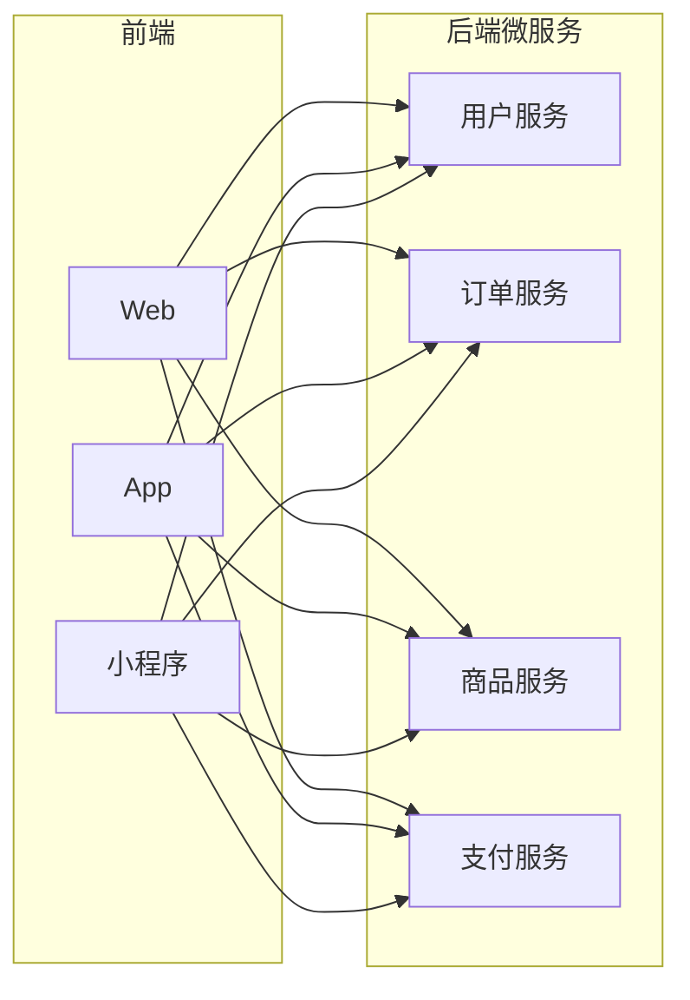
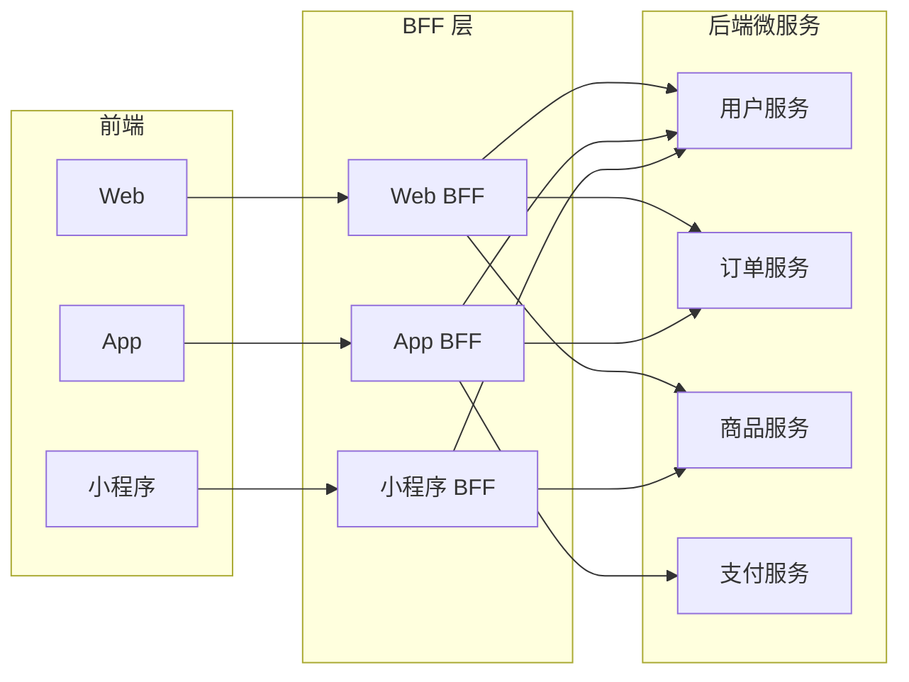
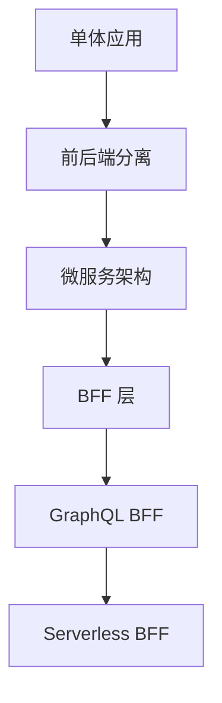

# BFF 架构设计

BFF（Backend For Frontend）是一种为前端应用量身定制的后端服务层，解决前后端分离中的痛点。

## 为什么需要 BFF

### 传统架构的问题



**痛点：**
- 前端需要调用多个微服务，聚合数据
- 不同端（Web/App/小程序）需要不同的数据格式
- 前端需要处理复杂的业务逻辑
- 接口变更影响多个端

### BFF 架构



**优势：**
- 前端只调用一个 BFF 接口
- BFF 负责数据聚合和转换
- 不同端可以有独立的 BFF
- 后端微服务变更不影响前端

## BFF 的职责

| 职责 | 说明 |
|------|------|
| **数据聚合** | 调用多个微服务，合并返回 |
| **数据裁剪** | 只返回前端需要的字段 |
| **格式转换** | 适配不同端的数据格式 |
| **协议转换** | gRPC → HTTP、Thrift → JSON |
| **缓存** | 减少微服务调用 |
| **鉴权** | 统一处理登录态 |
| **限流** | 保护后端服务 |

## 技术选型

| 方案 | 适用场景 | 特点 |
|------|---------|------|
| **Node.js** | 前端团队主导 | 开发快，与前端同语言 |
| **Go** | 高性能要求 | 并发能力强 |
| **Java** | 企业级项目 | 生态成熟 |
| **GraphQL** | 灵活查询 | 前端按需获取数据 |

### Node.js BFF 示例

```javascript
// Koa BFF 示例
const Koa = require('koa');
const Router = require('koa-router');
const axios = require('axios');

const app = new Koa();
const router = new Router();

// 聚合用户信息和订单列表
router.get('/api/user/dashboard', async (ctx) => {
  const { userId } = ctx.query;

  // 并行调用多个微服务
  const [userRes, ordersRes, statsRes] = await Promise.all([
    axios.get(`http://user-service/users/${userId}`),
    axios.get(`http://order-service/orders?userId=${userId}`),
    axios.get(`http://stats-service/user/${userId}`)
  ]);

  // 聚合数据，只返回前端需要的字段
  ctx.body = {
    user: {
      id: userRes.data.id,
      name: userRes.data.name,
      avatar: userRes.data.avatar
    },
    orders: ordersRes.data.list.slice(0, 10),  // 只返回最近 10 条
    stats: {
      totalOrders: statsRes.data.total,
      totalSpent: statsRes.data.spent
    }
  };
});

app.use(router.routes());
app.listen(3000);
```

## 设计模式

### 1. 聚合模式

将多个微服务的数据合并为一个接口。

```javascript
// 商品详情页 BFF
router.get('/api/product/:id', async (ctx) => {
  const { id } = ctx.params;

  // 使用 Promise.allSettled 处理部分失败
  const results = await Promise.allSettled([
    productService.getById(id),
    reviewService.getByProduct(id),
    recommendService.getRelated(id)
  ]);

  const [productRes, reviewsRes, recommendRes] = results;

  // 核心数据失败则返回错误
  if (productRes.status === 'rejected') {
    ctx.throw(500, 'Failed to load product');
  }

  // 非核心数据失败则降级
  ctx.body = {
    ...productRes.value,
    reviews: reviewsRes.status === 'fulfilled' 
      ? reviewsRes.value.slice(0, 5) 
      : [],  // 评论加载失败返回空数组
    recommendations: recommendRes.status === 'fulfilled'
      ? recommendRes.value.slice(0, 3)
      : []   // 推荐加载失败返回空数组
  };
});
```

> **为什么用 `Promise.allSettled` 而不是 `Promise.all`？**
> - `Promise.all`：任一失败则全部失败（适合所有请求都必须成功的场景）
> - `Promise.allSettled`：等待所有完成，分别处理成功/失败（适合部分失败可降级的场景）
>
> 商品详情页中，商品基本信息是核心数据，必须成功；评论和推荐是非核心数据，失败时可以降级为空数组。

### 2. 适配模式

为不同端提供不同的数据格式。

```javascript
// Web BFF：返回完整数据
router.get('/web/products', async (ctx) => {
  const products = await productService.list();
  ctx.body = products.map(p => ({
    id: p.id,
    name: p.name,
    description: p.description,
    images: p.images,
    specs: p.specs,
    reviews: p.reviews
  }));
});

// App BFF：返回精简数据
router.get('/app/products', async (ctx) => {
  const products = await productService.list();
  ctx.body = products.map(p => ({
    id: p.id,
    name: p.name,
    thumbnail: p.images[0],  // 只返回缩略图
    price: p.price
  }));
});
```

### 3. 缓存模式

减少微服务调用，提升性能。

> **node-cache 简介：**
> `node-cache` 是一个 Node.js 内存缓存库，数据存储在**进程内存**中（不是磁盘或数据库）。
> - **优点**：读写极快（纳秒级）、无需外部依赖
> - **缺点**：进程重启后缓存丢失、多进程间不共享
> - **适用场景**：单机部署、缓存热点数据、短期缓存
>
> 如果需要持久化或多进程共享，应使用 Redis。

```javascript
const NodeCache = require('node-cache');
const cache = new NodeCache({ stdTTL: 300 });  // 5 分钟缓存

router.get('/api/products', async (ctx) => {
  const cacheKey = 'products:list';
  
  // 先查缓存
  const cached = cache.get(cacheKey);
  if (cached) {
    ctx.body = cached;
    return;
  }

  // 缓存未命中，调用微服务
  const products = await productService.list();
  cache.set(cacheKey, products);
  
  ctx.body = products;
});
```

## 最佳实践

### 1. 接口设计

```javascript
// ✅ 好的设计：面向前端场景
GET /api/homepage          // 首页聚合数据
GET /api/product/:id/detail  // 商品详情页聚合数据
POST /api/checkout/preview   // 结算预览

// ❌ 不好的设计：直接透传微服务
GET /api/user-service/users/1
GET /api/order-service/orders
GET /api/product-service/products/1
```

### 2. 错误处理

```javascript
// 统一错误处理
app.use(async (ctx, next) => {
  try {
    await next();
  } catch (err) {
    // 区分 BFF 错误和微服务错误
    if (err.response) {
      // 微服务返回的错误
      ctx.status = err.response.status;
      ctx.body = {
        code: 'UPSTREAM_ERROR',
        message: err.response.data.message
      };
    } else {
      // BFF 自身错误
      ctx.status = 500;
      ctx.body = {
        code: 'BFF_ERROR',
        message: 'Internal Server Error'
      };
    }
  }
});
```

### 3. 超时控制

```javascript
// 设置微服务调用超时
const axios = require('axios');

const client = axios.create({
  timeout: 3000,  // 3 秒超时
  baseURL: 'http://user-service'
});

// 降级处理
async function getUserWithFallback(userId) {
  try {
    return await client.get(`/users/${userId}`);
  } catch (err) {
    // 超时或失败时返回默认值
    return { data: { id: userId, name: 'Unknown' } };
  }
}
```

### 4. 监控与日志

```javascript
// 记录微服务调用耗时
app.use(async (ctx, next) => {
  const start = Date.now();
  await next();
  const duration = Date.now() - start;
  
  console.log(`${ctx.method} ${ctx.url} - ${duration}ms`);
  
  // 上报监控平台
  metrics.histogram('bff.request.duration', duration, {
    path: ctx.path,
    method: ctx.method
  });
});
```

## 架构演进



| 阶段 | 特点 |
|------|------|
| **单体** | 前后端耦合 |
| **前后端分离** | 前端直接调用后端 API |
| **微服务** | 后端拆分为多个服务 |
| **BFF** | 为前端定制聚合层 |
| **GraphQL** | 前端按需查询 |
| **Serverless** | 函数即服务，按需扩缩 |

## 总结

| 维度 | 建议 |
|------|------|
| **何时用 BFF** | 前端需要聚合多个微服务、不同端需要不同数据格式 |
| **技术选型** | 前端团队 → Node.js；高性能 → Go |
| **设计原则** | 面向前端场景设计接口，不要透传微服务 |
| **注意事项** | 做好缓存、超时、降级、监控 |

**核心思想：** BFF 是前端的"私人助理"，帮前端处理脏活累活，让前端专注于 UI 和交互。
