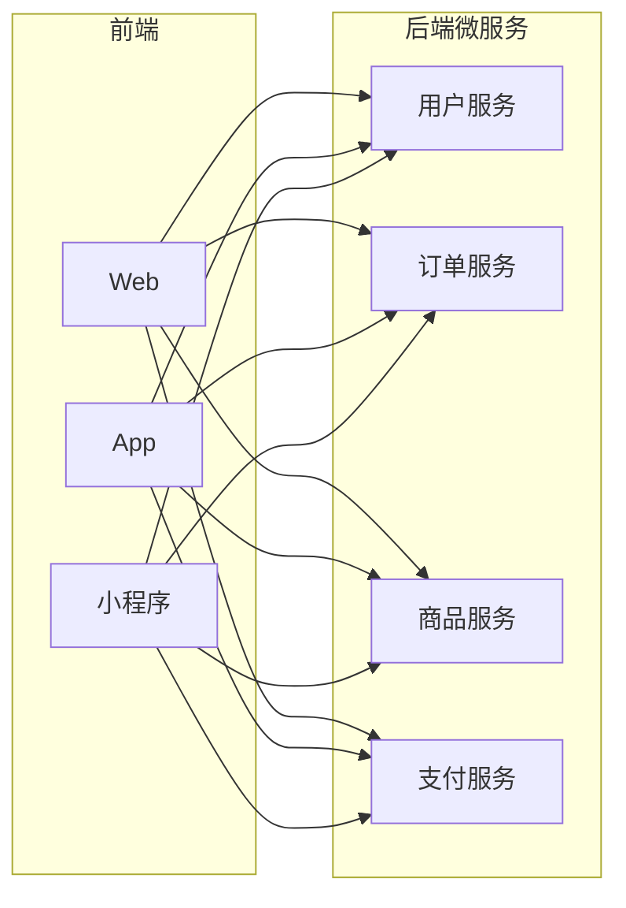
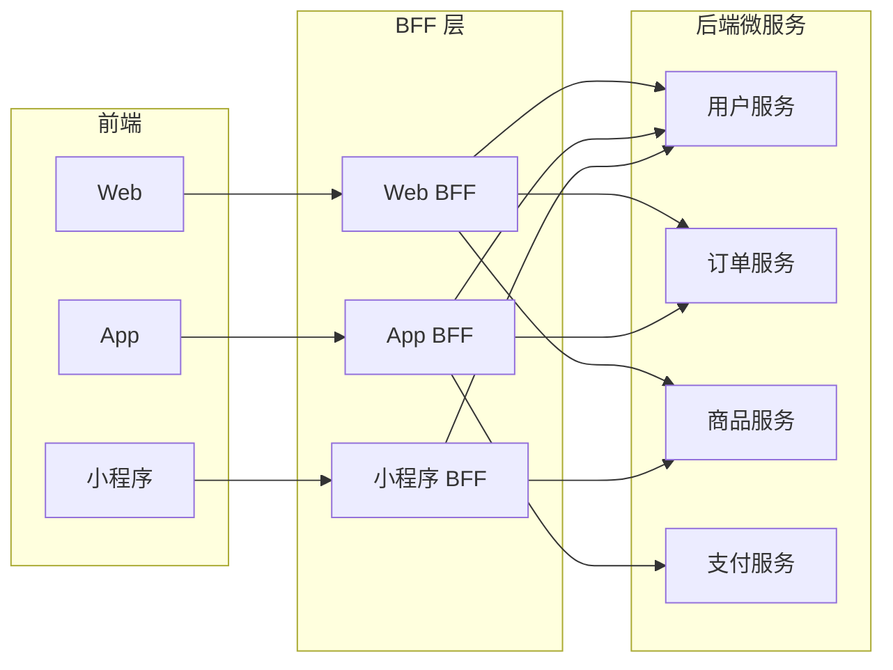
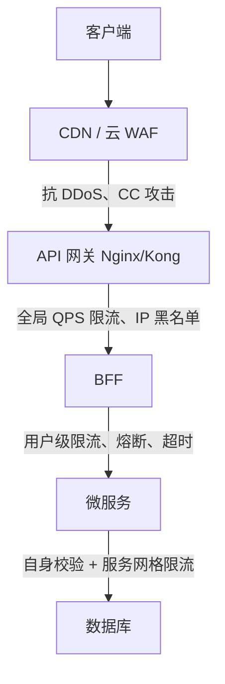
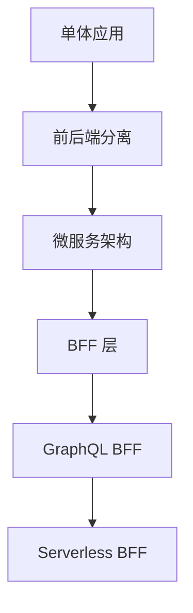

# BFF 架构设计

BFF（Backend For Frontend）是一种为前端应用量身定制的后端服务层，解决前后端分离中的痛点。

## 为什么需要 BFF

### 传统架构的问题



**痛点：**
- 前端需要调用多个微服务，聚合数据
- 不同端（Web/App/小程序）需要不同的数据格式
- 前端需要处理复杂的业务逻辑
- 接口变更影响多个端

### BFF 架构



**优势：**
- 前端只调用一个 BFF 接口
- BFF 负责数据聚合和转换
- 不同端可以有独立的 BFF
- 后端微服务变更不影响前端

## BFF 的职责

| 职责 | 说明 |
|------|------|
| **数据聚合** | 调用多个微服务，合并返回 |
| **数据裁剪** | 只返回前端需要的字段 |
| **格式转换** | 适配不同端的数据格式 |
| **协议转换** | gRPC → HTTP、Thrift → JSON |
| **缓存** | 减少微服务调用 |
| **鉴权** | 统一处理登录态 |
| **限流** | 保护后端服务 |

**协议转换用在什么场景**：微服务内部通信为了性能，常用二进制协议（**gRPC**、**Thrift**），但浏览器里的 JS 只能直接消费 **HTTP + JSON**——fetch 发不了 gRPC 请求（基于 HTTP/2 二进制帧 + protobuf 编码），Thrift 的二进制流更是没法解析。所以 BFF 是"翻译官"：

```
浏览器(HTTP + JSON) ←→ BFF(翻译) ←→ 微服务(gRPC/Thrift)
```

典型场景：① 大厂微服务体系，订单/商品服务都是 gRPC，BFF 用 gRPC 客户端调内部服务（二进制快），聚合成 HTTP+JSON 返回浏览器；② 异构老系统（Java Thrift 服务），BFF 做翻译，老系统不用改；③ 内部协议不对外暴露——内部随便换协议，前端无感知。

为什么不让微服务自己改协议：内部协议是性能诉求（二进制快），为外部兼容改成 JSON 会拖慢内部调用；放在 BFF 转换，两边都不动。

## 技术选型

| 方案 | 适用场景 | 特点 |
|------|---------|------|
| **Node.js** | 前端团队主导 | 开发快，与前端同语言 |
| **Go** | 高性能要求 | 并发能力强 |
| **Java** | 企业级项目 | 生态成熟 |
| **GraphQL** | 灵活查询 | 前端按需获取数据 |

### Node.js BFF 示例

```javascript
// Koa BFF 示例
const Koa = require('koa');
const Router = require('koa-router');
const axios = require('axios');

const app = new Koa();
const router = new Router();

// 聚合用户信息和订单列表
router.get('/api/user/dashboard', async (ctx) => {
  const { userId } = ctx.query;

  // 并行调用多个微服务
  const [userRes, ordersRes, statsRes] = await Promise.all([
    axios.get(`http://user-service/users/${userId}`),
    axios.get(`http://order-service/orders?userId=${userId}`),
    axios.get(`http://stats-service/user/${userId}`)
  ]);

  // 聚合数据，只返回前端需要的字段
  ctx.body = {
    user: {
      id: userRes.data.id,
      name: userRes.data.name,
      avatar: userRes.data.avatar
    },
    orders: ordersRes.data.list.slice(0, 10),  // 只返回最近 10 条
    stats: {
      totalOrders: statsRes.data.total,
      totalSpent: statsRes.data.spent
    }
  };
});

app.use(router.routes());
app.listen(3000);
```

## 设计模式

### 1. 聚合模式

将多个微服务的数据合并为一个接口。

```javascript
// 商品详情页 BFF
router.get('/api/product/:id', async (ctx) => {
  const { id } = ctx.params;

  // 使用 Promise.allSettled 处理部分失败
  const results = await Promise.allSettled([
    productService.getById(id),
    reviewService.getByProduct(id),
    recommendService.getRelated(id)
  ]);

  const [productRes, reviewsRes, recommendRes] = results;

  // 核心数据失败则返回错误
  if (productRes.status === 'rejected') {
    ctx.throw(500, 'Failed to load product');
  }

  // 非核心数据失败则降级
  ctx.body = {
    ...productRes.value,
    reviews: reviewsRes.status === 'fulfilled' 
      ? reviewsRes.value.slice(0, 5) 
      : [],  // 评论加载失败返回空数组
    recommendations: recommendRes.status === 'fulfilled'
      ? recommendRes.value.slice(0, 3)
      : []   // 推荐加载失败返回空数组
  };
});
```

> **为什么用 `Promise.allSettled` 而不是 `Promise.all`？**
> - `Promise.all`：任一失败则全部失败（适合所有请求都必须成功的场景）
> - `Promise.allSettled`：等待所有完成，分别处理成功/失败（适合部分失败可降级的场景）
>
> 商品详情页中，商品基本信息是核心数据，必须成功；评论和推荐是非核心数据，失败时可以降级为空数组。

### 2. 适配模式

为不同端提供不同的数据格式。

```javascript
// Web BFF：返回完整数据
router.get('/web/products', async (ctx) => {
  const products = await productService.list();
  ctx.body = products.map(p => ({
    id: p.id,
    name: p.name,
    description: p.description,
    images: p.images,
    specs: p.specs,
    reviews: p.reviews
  }));
});

// App BFF：返回精简数据
router.get('/app/products', async (ctx) => {
  const products = await productService.list();
  ctx.body = products.map(p => ({
    id: p.id,
    name: p.name,
    thumbnail: p.images[0],  // 只返回缩略图
    price: p.price
  }));
});
```

### 3. 缓存模式

减少微服务调用，提升性能。

> **node-cache 简介：**
> `node-cache` 是一个 Node.js 内存缓存库，数据存储在**进程内存**中（不是磁盘或数据库）。
> - **优点**：读写极快（纳秒级）、无需外部依赖
> - **缺点**：进程重启后缓存丢失、多进程间不共享
> - **适用场景**：单机部署、缓存热点数据、短期缓存
>
> 如果需要持久化或多进程共享，应使用 Redis。

```javascript
const NodeCache = require('node-cache');
const cache = new NodeCache({ stdTTL: 300 });  // 5 分钟缓存

router.get('/api/products', async (ctx) => {
  const cacheKey = 'products:list';
  
  // 先查缓存
  const cached = cache.get(cacheKey);
  if (cached) {
    ctx.body = cached;
    return;
  }

  // 缓存未命中，调用微服务
  const products = await productService.list();
  cache.set(cacheKey, products);
  
  ctx.body = products;
});
```

## 可靠性设计：BFF 怎么保护自己

BFF 的可靠性问题是它自己"招来"的——**聚合放大**：BFF 收到 1 个前端请求，可能向后端发出 3~5 个请求。恶意用户刷 BFF，等于用 1 份流量放大成 N 份打到后端。所以 BFF 的限流不只是保护自己，更是**后端的第二道保险**（第一道是网关）。

### 分层防护：谁保护 BFF

BFF 不是没人保护的孤儿，它站在分层防护的中间——而且越靠外越"粗"，越靠内越"细"：



| 层 | 防护手段 | 粒度 |
|----|---------|------|
| **CDN / 云 WAF** | 抗 DDoS、CC 攻击 | 流量级 |
| **API 网关** | 全局 QPS 限流、IP 黑名单 | IP 级 |
| **BFF 自身** | 用户级限流、熔断、超时、降级 | **用户级** |
| **微服务** | 参数校验、自身限流 | 接口级 |

**为什么 BFF 的限流比网关更关键**：网关按 IP 限，攻击者换 IP 就绕过；BFF 按用户（token）限，换 IP 也没用——所以"保护后端"这个职责最终落在 BFF 的用户级限流上。

**按用户限流示例**（Koa 中间件 + Redis 固定窗口）：

```javascript
// 按用户限流:固定窗口计数,Redis 保证多实例共享计数
const redis = require('redis')
const client = redis.createClient()

function rateLimitByUser({ limit = 100, windowSec = 60 } = {}) {
  return async (ctx, next) => {
    // 用户标识:登录用户用 userId,匿名用 IP
    // 注意:不能用 token 字符串做 key——token 过期重签后 key 就变了,等于绕过限流
    const userId = ctx.state.user?.id || ctx.ip
    const windowKey = Math.floor(Date.now() / 1000 / windowSec)
    const key = `rate:${userId}:${windowKey}`

    // INCR 计数,首次设置过期时间:原子操作,窗口到期 key 自动消失
    const count = await client.incr(key)
    if (count === 1) await client.expire(key, windowSec)

    if (count > limit) {
      ctx.status = 429
      ctx.body = { message: '请求太频繁,稍后再试' }
      return
    }
    await next()
  }
}

// 全局限流 + 敏感接口单独收紧(比如结算接口)
app.use(rateLimitByUser({ limit: 100, windowSec: 60 }))
router.post('/api/checkout', rateLimitByUser({ limit: 5, windowSec: 10 }), handler)
```

**关键设计点**：
- **key 格式** `rate:{userId}:{窗口号}`——窗口号 = `now / 窗口秒数` 取整：`Date.now()` 毫秒 → `/1000` 转秒 → `/windowSec` 算出"第几个窗口" → `floor` 取整。例：windowSec=60 时，14:00:00~14:00:59 都算第 840 个窗口（同一个 key，共享计数），14:01:00 起变 841（新 key，计数清零）。窗口到期 key 自动过期，不用手动清
- **为什么用 Redis**：BFF 多实例部署，进程内计数器各算各的，限 100 的接口 5 个实例等于能打 500；Redis 集中计数，多实例共享一个计数
- **INCR 为什么数不错**：Redis 单线程执行命令，一条命令从读值、加 1、写回全程不被插队——并发 100 个请求 INCR 也是排队逐个执行，各自拿到正确的递增值。自己写 `get → count++ → set` 在高并发下会丢计数（两个请求同时读到 99，各写回 100，只 +1），限流形同虚设。数据在内存里，单条命令微秒级，扛得住高频
- **key 必须用 userId，不能用 token 字符串**：token 过期重签后字符串就变了，key 变新 → 计数清零 → 攻击者刷新 token 就绕过限流
- **为什么放在 BFF**：网关只能按 IP（换 IP 绕过），BFF 能解析 token 拿到 userId——身份是 BFF 的独特视角

**限流算法怎么选**：

| 算法 | 思路 | 特点 |
|------|------|------|
| **固定窗口** | 每 N 秒一个窗口计数 | 最简单，窗口交界处可双倍突发 |
| **滑动窗口** | 精确记录最近 N 秒的请求 | 精确，成本高 |
| **令牌桶** | 按速率放令牌，桶容量 = 允许的突发 | 允许突发，最常用 |

生产环境直接上 `rate-limiter-flexible` 这类现成库，别手写——窗口算法、时钟、原子性都有坑。

### BFF 的可靠性三纪律

| 纪律 | 解决什么问题 | 实现 |
|------|-------------|------|
| **超时必须有** | 下游慢 → 占住事件循环 → 拖死所有请求（比被打死更常见） | 每次微服务调用设超时（见最佳实践） |
| **熔断必须有** | 下游挂了 → 快速失败而不是无限重试 → 把故障隔离在 BFF 层 | 连续失败 N 次后直接短路，过段时间再试探 |
| **限流必须有** | 聚合放大 → 一个人刷爆后端 | 按用户/接口限流，超限直接 429 |

**熔断示例**（简单实现）：

```javascript
// 熔断器:连续失败 5 次进入 OPEN,直接拒绝 30 秒,再放一个请求试探
const circuit = {
  failures: 0,
  state: 'CLOSED',   // CLOSED 正常 / OPEN 熔断 / HALF_OPEN 试探
  openUntil: 0,
  threshold: 5,
  timeout: 30000,

  async call(fn) {
    if (this.state === 'OPEN' && Date.now() < this.openUntil) {
      throw new Error('circuit open')
    }
    try {
      const result = await fn()
      this.failures = 0
      return result
    } catch (err) {
      this.failures++
      if (this.failures >= this.threshold) {
        this.state = 'OPEN'
        this.openUntil = Date.now() + this.timeout
      }
      throw err
    }
  }
}
```

### 最大的底气：无状态

BFF 只做聚合、裁剪、转换，不碰数据库、没有本地状态——所以它是所有服务里**最好扩容**的：扛不住就加 Pod，水平扩展没有状态负担。有状态的后端（数据库连接池、本地缓存）扩容反而麻烦。这也是"薄 BFF"设计原则的可靠性红利：代码少 = 攻击面小 = 被攻破也没数据可偷。

## 最佳实践

### 1. 接口设计

```javascript
// ✅ 好的设计：面向前端场景
GET /api/homepage          // 首页聚合数据
GET /api/product/:id/detail  // 商品详情页聚合数据
POST /api/checkout/preview   // 结算预览

// ❌ 不好的设计：直接透传微服务
GET /api/user-service/users/1
GET /api/order-service/orders
GET /api/product-service/products/1
```

### 2. 错误处理

```javascript
// 统一错误处理
app.use(async (ctx, next) => {
  try {
    await next();
  } catch (err) {
    // 区分 BFF 错误和微服务错误
    if (err.response) {
      // 微服务返回的错误
      ctx.status = err.response.status;
      ctx.body = {
        code: 'UPSTREAM_ERROR',
        message: err.response.data.message
      };
    } else {
      // BFF 自身错误
      ctx.status = 500;
      ctx.body = {
        code: 'BFF_ERROR',
        message: 'Internal Server Error'
      };
    }
  }
});
```

### 3. 超时控制

```javascript
// 设置微服务调用超时
const axios = require('axios');

const client = axios.create({
  timeout: 3000,  // 3 秒超时
  baseURL: 'http://user-service'
});

// 降级处理
async function getUserWithFallback(userId) {
  try {
    return await client.get(`/users/${userId}`);
  } catch (err) {
    // 超时或失败时返回默认值
    return { data: { id: userId, name: 'Unknown' } };
  }
}
```

### 4. 监控与日志

```javascript
// 记录微服务调用耗时
app.use(async (ctx, next) => {
  const start = Date.now();
  await next();
  const duration = Date.now() - start;
  
  console.log(`${ctx.method} ${ctx.url} - ${duration}ms`);
  
  // 上报监控平台
  metrics.histogram('bff.request.duration', duration, {
    path: ctx.path,
    method: ctx.method
  });
});
```

### 5. 性能瓶颈与优化

| 瓶颈 | 优化方向 |
|------|---------|
| **串行调用** | `Promise.all` 并行化，重叠等待时间 |
| **重复聚合** | 加聚合缓存（内存/Redis，TTL 秒级） |
| **上游慢** | 超时 + 熔断 + 降级 + 缓存兜底 |
| **响应体大** | 裁剪字段、分页、压缩（gzip/br） |
| **CPU 密集** | 重计算挪出 BFF（worker/独立服务） |
| **N+1 调用** | 上游提供批量接口，一次拿全 |

其中"串行改并行"和"避免 CPU 密集"背后，是对两类瓶颈的理解：

#### I/O 密集 vs CPU 密集

> **形象类比：**
> - **I/O 密集** = 外卖骑手等商家出餐。CPU 大部分时间在**等**（网络、磁盘、数据库），等待期间是闲着的，可以同时接很多单
> - **CPU 密集** = 厨师炒菜。CPU 从头到尾被**占着**（压缩、加解密、序列化），同一时间只能做一个，其他都得排队

| 维度 | I/O 密集 | CPU 密集 |
|------|---------|---------|
| **瓶颈** | 等待外部资源（网络/磁盘/DB） | 计算本身 |
| **CPU 状态** | 大量空闲（等 I/O） | 全程满载 |
| **代表操作** | HTTP 调用、读文件、查库 | 图片压缩、加解密、大 JSON 序列化 |
| **耗时特征** | "等来的"，CPU 利用率低 | "算出来的"，CPU 利用率高 |

**解决思路：**
- **I/O 密集 → 提高并发**：等待不占 CPU，使劲并发即可——`Promise.all` 并行请求、连接池复用。Node 单线程事件循环天生适合 I/O 密集，一个进程能扛大量并发连接
- **CPU 密集 → 增加核心 / 减少计算**：单线程上并行 CPU 任务只会排队，方向是：`worker_threads`/`cluster` 用满多核；算法优化、缓存减少计算量；**重计算挪出 BFF**

> **BFF 的黄金法则**：BFF 本质是 I/O 密集场景（聚合、裁剪、转换），要做的是把 I/O 并行化；CPU 密集的重计算永远不该出现在 BFF 里。

## 架构演进



| 阶段 | 特点 |
|------|------|
| **单体** | 前后端耦合 |
| **前后端分离** | 前端直接调用后端 API |
| **微服务** | 后端拆分为多个服务 |
| **BFF** | 为前端定制聚合层 |
| **GraphQL** | 前端按需查询 |
| **Serverless** | 函数即服务，按需扩缩 |

## 总结

| 维度 | 建议 |
|------|------|
| **何时用 BFF** | 前端需要聚合多个微服务、不同端需要不同数据格式 |
| **技术选型** | 前端团队 → Node.js；高性能 → Go |
| **设计原则** | 面向前端场景设计接口，不要透传微服务 |
| **注意事项** | 做好缓存、超时、降级、监控 |

**核心思想：** BFF 是前端的"私人助理"，帮前端处理脏活累活，让前端专注于 UI 和交互。
