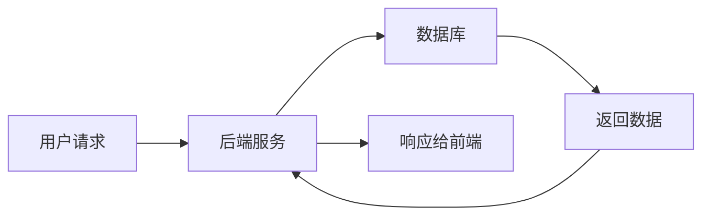
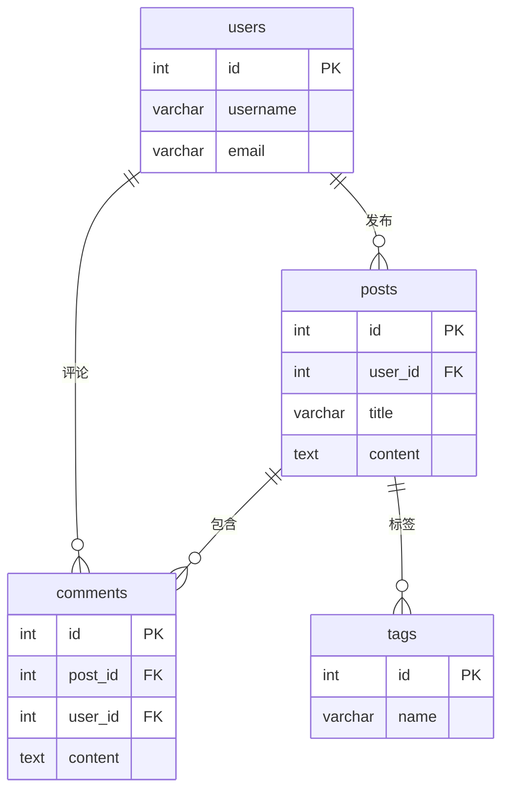
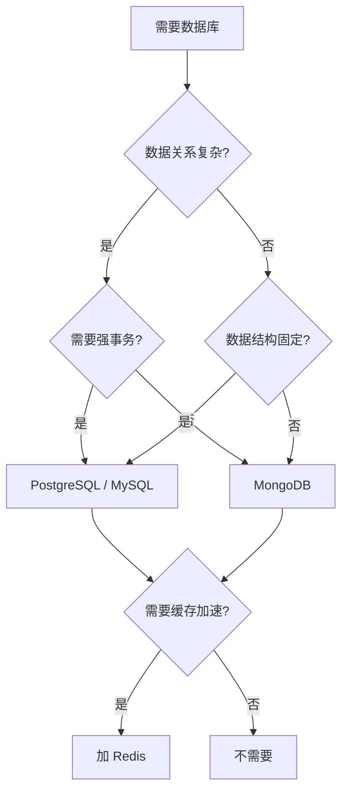

# 数据库基础

数据库是后端开发的核心。前端转全栈，数据库是最需要补齐的知识。本文覆盖关系型数据库、NoSQL、缓存和 ORM。

## 为什么前端需要学数据库



前端处理的是"展示逻辑"，后端处理的是"数据逻辑"。不理解数据库，就无法理解后端在做什么。

## 关系型数据库（SQL）

以 MySQL / PostgreSQL 为代表，数据以**表**的形式组织，行和列的结构严格。

### 核心概念

| 概念 | 说明 |
|------|------|
| **表（Table）** | 数据的容器，类似 JS 中的数组 |
| **行（Row）** | 一条记录，类似数组中的一个对象 |
| **列（Column）** | 一个字段，类似对象的属性 |
| **主键（Primary Key）** | 唯一标识一行，通常用自增 ID 或 UUID |
| **外键（Foreign Key）** | 关联另一张表的主键，建立表间关系 |
| **索引（Index）** | 加速查询的数据结构，类似书的目录 |

### 基本 SQL 语法

以下语法在 MySQL、PostgreSQL、SQLite 中通用，学会这些能覆盖大部分业务场景。

#### 增删改查（CRUD）

```sql
-- 创建表
CREATE TABLE users (
  id INT PRIMARY KEY AUTO_INCREMENT,  -- PostgreSQL 用 SERIAL 或 GENERATED ALWAYS AS IDENTITY
  username VARCHAR(50) NOT NULL UNIQUE,
  email VARCHAR(100) NOT NULL,
  password_hash VARCHAR(255) NOT NULL,
  created_at TIMESTAMP DEFAULT CURRENT_TIMESTAMP
);

-- 增
INSERT INTO users (username, email, password_hash)
VALUES ('alice', 'alice@example.com', 'hashed_pwd');

-- 批量插入
INSERT INTO users (username, email, password_hash)
VALUES ('bob', 'bob@example.com', 'hash1'),
       ('charlie', 'charlie@example.com', 'hash2');

-- 查
SELECT * FROM users WHERE id = 1;
SELECT username, email FROM users WHERE created_at > '2026-01-01';

-- 改
UPDATE users SET email = 'new@example.com' WHERE id = 1;

-- 删
DELETE FROM users WHERE id = 1;
```

#### 条件与排序

```sql
-- 多条件
SELECT * FROM users WHERE status = 'active' AND role = 'admin';
SELECT * FROM users WHERE role IN ('admin', 'editor');
SELECT * FROM users WHERE username LIKE '%alice%';  -- 模糊匹配

-- 排序 + 分页
SELECT * FROM users ORDER BY created_at DESC LIMIT 10 OFFSET 20;
-- 第 3 页，每页 10 条（OFFSET = (页码-1) * 每页数量）

-- 去重
SELECT DISTINCT role FROM users;
```

#### 聚合与分组

```sql
-- 聚合函数
SELECT COUNT(*) AS total FROM users;              -- 总数
SELECT AVG(age) AS avg_age FROM users;            -- 平均值
SELECT MAX(created_at) AS latest FROM users;      -- 最大值
SELECT SUM(balance) AS total_balance FROM accounts; -- 求和

-- 分组 + 过滤
SELECT role, COUNT(*) AS count
FROM users
WHERE status = 'active'        -- 先过滤行
GROUP BY role                  -- 再分组
HAVING COUNT(*) > 5            -- 分组后再过滤（WHERE 不能用于聚合结果）
ORDER BY count DESC;
```

#### 子查询

```sql
-- WHERE 中的子查询
SELECT * FROM users
WHERE id IN (SELECT user_id FROM orders WHERE amount > 1000);

-- FROM 中的子查询（当临时表用）
SELECT role, avg_age FROM (
  SELECT role, AVG(age) AS avg_age FROM users GROUP BY role
) AS subquery
WHERE avg_age > 25;
```

#### MySQL vs PostgreSQL 常见差异

大部分基础语法完全一样，差异主要在以下场景：

| 功能 | MySQL | PostgreSQL |
|------|-------|------------|
| 自增主键 | `AUTO_INCREMENT` | `SERIAL` 或 `GENERATED ALWAYS AS IDENTITY` |
| 字符串拼接 | `CONCAT(a, b)` | `a \|\| b` |
| 日期格式化 | `DATE_FORMAT(now(), '%Y-%m-%d')` | `TO_CHAR(now(), 'YYYY-MM-DD')` |
| 当前时间 | `NOW()` | `NOW()`（一样） |
| 分页 | `LIMIT 10 OFFSET 20` | `LIMIT 10 OFFSET 20`（一样） |
| 类型转换 | `CAST(val AS UNSIGNED)` | `val::integer` |
| JSON 查询 | `JSON_EXTRACT(data, '$.name')` | `data->>'name'` |

**实际建议：** 先学通用语法，遇到差异查一下目标数据库的写法就行，10 分钟能上手。大部分项目用 ORM 后这些差异也被屏蔽了。

### 表关系设计



### JOIN 查询

```sql
-- INNER JOIN：只返回两张表都能匹配上的行
-- 如果用户没有文章，这行不会出现
SELECT u.username, p.title, p.created_at
FROM users u
INNER JOIN posts p ON u.id = p.user_id
WHERE u.id = 1;

-- LEFT JOIN：返回左表所有行，右表匹配不上的字段为 NULL
-- 即使没有文章也会返回用户（title 为 NULL）
SELECT u.username, p.title
FROM users u
LEFT JOIN posts p ON u.id = p.user_id;
```

| JOIN 类型 | 效果 | 使用频率 |
|-----------|------|----------|
| **INNER JOIN** | 只保留两边都能匹配的行 | 最高 |
| **LEFT JOIN** | 保留左表所有行，右表没匹配的填 NULL | 高 |
| **RIGHT JOIN** | 保留右表所有行，左表没匹配的填 NULL | 少用（用 LEFT JOIN 翻转表顺序可替代） |
| **FULL OUTER JOIN** | 保留两边所有行，没匹配的填 NULL | 少见 |
| **CROSS JOIN** | 笛卡尔积，左表每行 × 右表每行 | 特殊场景 |
| **SELF JOIN** | 表自己和自己 JOIN（如查员工-上级关系） | 特定场景 |

### 索引

索引是查询性能的关键。没有索引，数据库需要逐行扫描（全表扫描）；有了索引，可以快速定位。

```sql
-- 创建索引
CREATE INDEX idx_users_email ON users(email);
CREATE INDEX idx_posts_user_id ON posts(user_id);

-- 联合索引（注意列的顺序）
CREATE INDEX idx_posts_user_created ON posts(user_id, created_at);
```

**索引原则：**
- 在 `WHERE`、`JOIN`、`ORDER BY` 中频繁使用的列上加索引
- 不要给所有列都加索引——索引会占用空间，降低写入速度
- 联合索引遵循**最左前缀原则**：`(user_id, created_at)` 可以加速 `WHERE user_id = 1` 和 `WHERE user_id = 1 AND created_at > '2026-01-01'`，但不能加速 `WHERE created_at > '2026-01-01'`

### 事务

事务保证一组操作要么全部成功，要么全部失败（ACID 特性）。

| 特性 | 含义 | 例子 |
|------|------|------|
| **A**tomicity 原子性 | 一组操作要么全成功，要么全失败 | 转账：扣款和加款必须同时完成，不能只扣不加 |
| **C**onsistency 一致性 | 事务前后数据状态合法 | 转账前后，两个账户的总金额不变 |
| **I**solation 隔离性 | 并发事务互不干扰 | 两个事务同时转账，结果和串行执行一样 |
| **D**urability 持久性 | 事务提交后数据永久保存 | 提交后即使立刻断电，数据也不会丢 |

```sql
-- 转账示例：A 给 B 转 100 元
BEGIN TRANSACTION;

UPDATE accounts SET balance = balance - 100 WHERE user_id = 1;
UPDATE accounts SET balance = balance + 100 WHERE user_id = 2;

-- 如果上面任何一步失败，回滚
ROLLBACK;

-- 如果都成功，提交
COMMIT;
```

**典型场景：** 订单创建（扣库存 + 生成订单 + 扣余额）必须在一个事务中完成。

### 锁

事务保证原子性，锁解决的是**并发修改**问题——防止两个事务同时改同一行数据导致结果错误。

**自动加锁：** 事务中的写操作（`UPDATE`/`INSERT`/`DELETE`）数据库会自动加排他锁，不需要手动处理。

**需要手动加锁的场景：** 读了数据之后要基于这个值做修改，必须在读的时候就加锁，否则其他事务可能在你"读"和"写"之间改了数据。

```
典型坑（读时不加锁）：
1. SELECT balance          → 读到 100
2. （此时另一个事务把余额改成了 50）
3. UPDATE balance = 100 - 30 → 写入 70（基于过期数据，错了）

正确做法（读时加锁）：
1. SELECT balance FOR UPDATE → 读到 100，加锁
2. （另一个事务想改这行 → 被阻塞，等你释放锁）
3. UPDATE balance = 100 - 30 → 写入 70（正确）
```

| 锁类型 | 效果 | 用法 |
|--------|------|------|
| **共享锁（读锁）** | 多个事务可以同时读，但不能写 | `SELECT ... LOCK IN SHARE MODE` |
| **排他锁（写锁）** | 只有一个事务能读或写，其他全部阻塞 | `SELECT ... FOR UPDATE` |

**实际应用：**

```sql
-- 转账场景：用排他锁防止并发修改
BEGIN TRANSACTION;

-- 加锁读取（其他事务此时无法修改这两行）
SELECT balance FROM accounts WHERE user_id = 1 FOR UPDATE;
SELECT balance FROM accounts WHERE user_id = 2 FOR UPDATE;

UPDATE accounts SET balance = balance - 100 WHERE user_id = 1;
UPDATE accounts SET balance = balance + 100 WHERE user_id = 2;

COMMIT;  -- 释放锁
```

不用 `FOR UPDATE` 的风险：两个事务同时读到余额 100，各自扣款后都写入，最终余额只扣了一次。

## NoSQL：MongoDB

MongoDB 是文档型数据库，数据以 JSON 格式的文档存储，无需预定义表结构。

### 核心概念对比

| SQL | MongoDB |
|-----|---------|
| 数据库（Database） | 数据库（Database） |
| 表（Table） | 集合（Collection） |
| 行（Row） | 文档（Document） |
| 列（Column） | 字段（Field） |
| JOIN | `$lookup` / 应用层关联 |

### 基本操作

```javascript
// 插入文档
db.users.insertOne({
  username: 'alice',
  email: 'alice@example.com',
  age: 25,
  tags: ['developer', 'nodejs'],
  createdAt: new Date()
})

// 查询
db.users.find({ age: { $gte: 18 } })
db.users.findOne({ username: 'alice' })

// 更新
db.users.updateOne(
  { username: 'alice' },
  { $set: { age: 26 }, $push: { tags: 'typescript' } }
)

// 删除
db.users.deleteOne({ username: 'alice' })
```

### 适用场景

- **适合 MongoDB：** 数据结构不固定、快速迭代、内容管理系统、日志存储
- **适合 SQL：** 数据关系复杂、需要事务、金融/订单系统、数据一致性要求高

## 缓存：Redis

Redis 是内存中的键值存储，读写速度极快（微秒级），常用于缓存和会话存储。

### 数据类型

```bash
# 字符串（最常用）
SET user:1:name "alice"
GET user:1:name

# 哈希（存储对象）
HSET user:1 username "alice" email "alice@example.com" age 25
HGETALL user:1

# 列表（队列）
LPUSH tasks "task-1" "task-2"
RPOP tasks

# 集合（去重）
SADD tags:post:1 "javascript" "nodejs"
SMEMBERS tags:post:1

# 有序集合（排行榜）
ZADD leaderboard 100 "alice" 90 "bob"
ZREVRANGE leaderboard 0 9 WITHSCORES
```

### Key 的组织方式

Redis 没有命名空间、没有表、没有模块的概念，所有数据扁平地存在一个巨大的 key-value 字典里。`user:1:name` 中的 `:` 只是**命名约定**，Redis 本身不识别层级，它就是一个普通字符串。

```
Redis 的视角：
{
  "user:1:name": "alice",
  "user:1:email": "alice@example.com",
  "post:1:title": "Hello",
  "session:abc123": "{...}",
  "cache:homepage": "{...}",
}
```

**靠 key 前缀区分业务**是最常用的组织方式：`user:`、`post:`、`cache:`、`session:`。很多 Redis 可视化工具会识别 `:` 并展示成树形结构，但这只是 UI 效果。

如果需要更彻底的隔离，可以用 `SELECT` 切换数据库（默认 16 个库），但**集群模式不支持**，生产环境不推荐。

### 缓存策略

```javascript
const Redis = require('ioredis')
const redis = new Redis()

async function getUser(id) {
  // 1. 先查缓存
  const cached = await redis.get(`user:${id}`)
  if (cached) {
    return JSON.parse(cached)
  }

  // 2. 缓存未命中，查数据库
  const user = await db.query('SELECT * FROM users WHERE id = ?', [id])

  // 3. 写入缓存，设置过期时间（避免缓存无限增长）
  await redis.setex(`user:${id}`, 3600, JSON.stringify(user))

  return user
}
```

**缓存三大问题：**

### 缓存穿透

查询的数据**缓存和数据库都没有**，每次请求都穿透到数据库。

```
场景：恶意用户疯狂请求不存在的 ID（user:1 到 user:100000）
结果：100000 次请求全部打到数据库

正常情况：10000 个请求查同一个 key → 1 次查库 + 9999 次走缓存
穿透情况：10000 个请求查不存在的 key → 10000 次全部查库
```

**解决方案：**

```javascript
// 方案 1：缓存空值（简单）
if (!user) {
  await redis.setex(`user:${id}`, 300, 'NULL')  // 缓存 5 分钟
  return null
}
// 同一个不存在的 ID，5 分钟内只查一次数据库

// 方案 2：布隆过滤器（高效）
// 启动时把所有有效 ID 加载到布隆过滤器
// 请求来了先问布隆过滤器，说"不存在"就直接返回，不到缓存和数据库
```

### 缓存击穿

某个**热点 key 刚好过期**的瞬间，大量并发请求同时发现缓存没了，全部去查数据库。

```
场景：首页文章列表缓存过期（这个 key 每秒有 1000 次访问）
时刻 T：缓存过期
时刻 T+1ms：1000 个请求同时发现缓存为空 → 1000 个全部查数据库

和穿透的区别：穿透是"数据不存在"，击穿是"数据存在但缓存刚好过期"
```

**解决方案：**

```javascript
// 方案 1：互斥锁（只让一个请求查库，其他等待）
async function getHotData(key) {
  const cached = await redis.get(key)
  if (cached) return JSON.parse(cached)

  // 尝试获取分布式锁（SET NX = 只在 key 不存在时设置，设置成功 = 拿到锁）
  const lock = await redis.set(`lock:${key}`, '1', 'NX', 'EX', 10)
  if (!lock) {
    // 没抢到锁，等一会儿重试
    await sleep(100)
    return getHotData(key)
  }

  try {
    const data = await db.query('SELECT * FROM hot_data')
    await redis.setex(key, 3600, JSON.stringify(data))
    return data
  } finally {
    await redis.del(`lock:${key}`)  // 释放锁
  }
}

// 方案 2：永不过期 + 异步更新
// 缓存不设过期时间，用户请求永远能命中
// 后台定时任务（如每 5 分钟）主动查数据库更新缓存，保证数据新鲜度
// 这样就不会出现"缓存过期瞬间大量请求打到数据库"的问题
```

### 缓存雪崩

**大量 key 在同一时间过期**，缓存命中率骤降，数据库压力骤增。

```
场景：凌晨 0 点设置了 10 万个 key，过期时间都是 24 小时
第二天凌晨 0 点：10 万个 key 同时过期 → 数据库瞬间被打垮

和击穿的区别：击穿是"一个热点 key 过期"，雪崩是"大量 key 同时过期"
```

**解决方案：**

```javascript
// 给过期时间加随机值，避免同时过期
const baseTTL = 3600  // 基础 1 小时
const randomTTL = baseTTL + Math.floor(Math.random() * 600)  // 1h ~ 1h10m
await redis.setex(key, randomTTL, JSON.stringify(data))

// 或者：多级缓存（本地缓存 + Redis），Redis 挂了还有本地缓存兜底
```

### 三者对比

| 问题 | 原因 | 关键特征 | 解决方案 |
|------|------|----------|----------|
| **穿透** | 数据不存在 | 请求不存在的 key | 缓存空值、布隆过滤器 |
| **击穿** | 热点 key 过期 | 单个 key 过期瞬间并发 | 互斥锁、永不过期+异步更新 |
| **雪崩** | 大量 key 同时过期 | 大面积缓存失效 | 过期时间加随机值、多级缓存 |

## ORM：用 TypeScript 操作数据库

ORM（Object-Relational Mapping）让你用对象和类型安全的方式操作数据库，不用手写 SQL。

### Prisma 示例

```prisma
// schema.prisma — 定义数据模型
model User {
  id        Int      @id @default(autoincrement())
  username  String   @unique
  email     String   @unique
  posts     Post[]
  createdAt DateTime @default(now())
}

model Post {
  id        Int      @id @default(autoincrement())
  title     String
  content   String?
  author    User     @relation(fields: [authorId], references: [id])
  authorId  Int
  createdAt DateTime @default(now())
}
```

```typescript
// 使用 Prisma Client
import { PrismaClient } from '@prisma/client'
const prisma = new PrismaClient()

// 创建用户
const user = await prisma.user.create({
  data: {
    username: 'alice',
    email: 'alice@example.com',
  },
})

// 查询（带关联）
const usersWithPosts = await prisma.user.findMany({
  include: { posts: true },
  where: { createdAt: { gt: new Date('2026-01-01') } },
  take: 10,
  skip: 0,
  orderBy: { createdAt: 'desc' },
})

// 更新
await prisma.user.update({
  where: { id: 1 },
  data: { email: 'new@example.com' },
})

// 事务
await prisma.$transaction([
  prisma.user.update({ where: { id: 1 }, data: { balance: { decrement: 100 } } }),
  prisma.user.update({ where: { id: 2 }, data: { balance: { increment: 100 } } }),
])
```

### ORM vs 手写 SQL

| 维度 | ORM（Prisma） | 手写 SQL |
|------|---------------|----------|
| **类型安全** | 自动生成 TS 类型 | 需要手动维护 |
| **开发效率** | 高，链式 API | 低，需要写 SQL |
| **复杂查询** | 可能不够灵活 | 完全灵活 |
| **性能** | 可能有额外开销 | 可精确优化 |
| **学习成本** | 需学习 ORM API | 需学习 SQL |

**建议：** 大部分 CRUD 用 ORM，复杂报表或性能敏感场景用原生 SQL。

## 数据库选型指南



| 场景 | 推荐方案 |
|------|----------|
| 电商/金融/订单系统 | PostgreSQL + Redis |
| 内容管理/博客 | MongoDB 或 MySQL |
| 实时聊天/推送 | Redis + PostgreSQL |
| 快速原型/MVP | MongoDB（灵活，改结构方便） |
| 数据分析/报表 | PostgreSQL（强大的聚合能力） |

## 前端开发者常见误区

1. **"数据库就是存数据的地方"** — 数据库还负责数据一致性、并发控制、事务隔离
2. **"NoSQL 比 SQL 好"** — 没有绝对的好坏，只有适合的场景
3. **"ORM 可以完全替代 SQL"** — 复杂查询和性能优化仍然需要理解 SQL
4. **"索引越多越好"** — 索引加速读、拖慢写，需要权衡
5. **"不需要学数据库设计"** — 糟糕的表设计会导致后期无法维护
