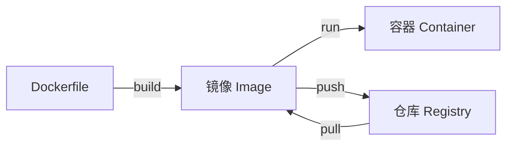

# Docker 入门

Docker 解决的核心问题：**"在我机器上能跑，在你机器上报错"**。通过容器化，保证开发、测试、生产环境完全一致。

## 核心概念

| 概念 | 类比 | 说明 |
|------|------|------|
| **镜像（Image）** | 类（Class） | 打包好的应用模板，只读 |
| **容器（Container）** | 对象（Object） | 镜像的运行实例，可读写 |
| **仓库（Registry）** | npm registry | 存储和分发镜像的地方（Docker Hub） |
| **Dockerfile** | 配方 | 定义如何构建镜像的文本文件 |
| **docker-compose** | 项目编排 | 用 YAML 定义多容器应用 |



## 安装

```bash
# macOS
brew install --cask docker

# 启动 Docker Desktop 后验证
docker --version
docker run hello-world
```

## 常用命令

```bash
# 镜像操作
docker images                    # 列出本地镜像
docker pull node:20-alpine       # 拉取镜像
docker rmi <image_id>            # 删除镜像

# 容器操作
docker ps                        # 运行中的容器
docker ps -a                     # 所有容器（含已停止）
docker run -d -p 3000:3000 app   # 后台运行，端口映射
docker stop <container_id>       # 停止容器
docker rm <container_id>         # 删除容器
docker logs <container_id>       # 查看日志
docker exec -it <id> sh          # 进入容器 shell

# 清理
docker system prune -a           # 清理未使用的镜像、容器、网络
```

## Dockerfile 编写

以最简单的 Node.js 应用为例。

### 基础版

```dockerfile
# 基于 Node.js 20 Alpine 镜像（Alpine 体积小，约 50MB）
FROM node:20-alpine

# 设置工作目录
WORKDIR /app

# 复制依赖文件（利用 Docker 缓存层）
COPY package.json package-lock.json ./

# 安装依赖
RUN npm ci --only=production

# 复制应用代码
COPY . .

# 暴露端口
EXPOSE 3000

# 启动命令
CMD ["node", "server.js"]
```

构建和运行：

```bash
docker build -t my-app .
docker run -d -p 3000:3000 --name my-app my-app
```

### 优化版（多阶段构建）

多阶段构建可以显著减小最终镜像体积。

```dockerfile
# 第一阶段：构建
FROM node:20-alpine AS builder
WORKDIR /app
COPY package.json package-lock.json ./
RUN npm ci
COPY . .
RUN npm run build

# 第二阶段：运行（只包含产物和 production 依赖）
FROM node:20-alpine
WORKDIR /app
ENV NODE_ENV=production
COPY package.json package-lock.json ./
RUN npm ci --only=production
COPY --from=builder /app/dist ./dist

EXPOSE 3000
CMD ["node", "dist/server.js"]
```

### .dockerignore

类似 `.gitignore`，避免把不需要的文件打包进镜像。

```
node_modules
npm-debug.log
.git
.gitignore
.env
.env.local
Dockerfile
docker-compose.yml
README.md
```

## 数据持久化

容器删除后数据会丢失，需要挂载卷来持久化数据。

```bash
# 绑定挂载（开发环境常用）
docker run -v $(pwd):/app -p 3000:3000 my-app

# 命名卷（生产环境推荐）
docker volume create db-data
docker run -v db-data:/var/lib/postgresql/data postgres
```

## docker-compose

实际项目通常有多个服务（应用 + 数据库 + Redis），用 docker-compose 一键编排。

```yaml
# docker-compose.yml
version: '3.8'

services:
  app:
    build: .
    ports:
      - '3000:3000'
    environment:
      - NODE_ENV=production
      - DB_HOST=postgres
      - DB_PORT=5432
      - DB_USER=postgres
      - DB_PASSWORD=secret
      - REDIS_HOST=redis
    depends_on:
      - postgres
      - redis
    restart: unless-stopped

  postgres:
    image: postgres:16-alpine
    environment:
      POSTGRES_DB: myapp
      POSTGRES_USER: postgres
      POSTGRES_PASSWORD: secret
    ports:
      - '5432:5432'
    volumes:
      - pg-data:/var/lib/postgresql/data
    restart: unless-stopped

  redis:
    image: redis:7-alpine
    ports:
      - '6379:6379'
    restart: unless-stopped

volumes:
  pg-data:
```

启动和停止：

```bash
docker compose up -d        # 后台启动所有服务
docker compose logs -f app  # 查看应用日志
docker compose down         # 停止并删除容器
docker compose down -v      # 同时删除数据卷
```

## 开发环境热更新

开发时希望代码修改后容器内自动更新，通过挂载 + nodemon 实现。

```yaml
# docker-compose.dev.yml
services:
  app:
    build: .
    ports:
      - '3000:3000'
    volumes:
      - .:/app              # 挂载源码
      - /app/node_modules    # 排除 node_modules（用容器内的）
    environment:
      - NODE_ENV=development
    command: npm run dev     # 使用 nodemon 等热更新工具
```

```bash
docker compose -f docker-compose.dev.yml up
```

## 实际部署流程


```bash
# 1. 构建并打标签
docker build -t registry.example.com/my-app:v1.2.0 .

# 2. 推送到仓库
docker push registry.example.com/my-app:v1.2.0

# 3. 服务器上拉取并运行
docker pull registry.example.com/my-app:v1.2.0
docker compose up -d
```

## 镜像大小优化技巧

| 技巧 | 效果 |
|------|------|
| 使用 Alpine 基础镜像 | 从 ~900MB 降到 ~50MB |
| 多阶段构建 | 只保留产物，丢弃构建工具 |
| `.dockerignore` 排除无关文件 | 减小构建上下文 |
| 合并 RUN 指令 | 减少镜像层数 |
| `npm ci --only=production` | 不装 devDependencies |

## 前端开发者常见疑问

**Q: Docker 和虚拟机有什么区别？**
Docker 容器共享宿主机内核，启动秒级，体积 MB 级；虚拟机有完整 OS，启动分钟级，体积 GB 级。

**Q: 我本地开发需要 Docker 吗？**
非必须，但推荐。好处是数据库、Redis 等依赖一键启动，不用本地安装。

**Q: 容器挂了数据怎么办？**
用 volume 挂载数据目录，容器删除数据不丢。数据库一定要用 volume。
